# P12：【2025版】12.常见的激活函数.zh_en - 小土堆Pytorch教程 - BV1YeknYbENz

你已经看到了激活函数对于深度学习模型是非常重要的，在这个视频中使用了多种函数作为激活函数，你将看到一些今天最常用的函数。

这个视频将专注于四个常用的激活函数，你也将在你的GAN中使用这些函数，第一个是ReLU，第二个是称为带泄漏的ReLU的变体，最后两个是Sigmoid和tanh，实际上有无限可能的激活函数。

但不是所有成为理想的。

而最受欢迎有效的激活函数之一是称为修正线性单元。

或简称为ReLU，ReLU所做的是取z和零之间的最大值，这意味着如果输入是来自当前行的z，L这个激活g，其中ReLU是g，这里将取零和z之间的最大值，这实际上意味着它消除了所有不是正的值。

图形上我可以说明这个函数的形状像一个直线，斜率为1的正值，所以任何输入z的值，例如值2，如果输入g，仍然保持值为2，如果输入z是负的，图形上，当z是负的时候，输出将变为零，实际上不允许负值。

看起来像一个曲棍球棍，这使得它非线性，线性意味着一个直线，你可能注意到ReLU严格来说在z等于零处不可导，但按照惯例和实现，ReLU在z等于零处的导数通常被设置为零，ReLU激活函数的平坦部分。

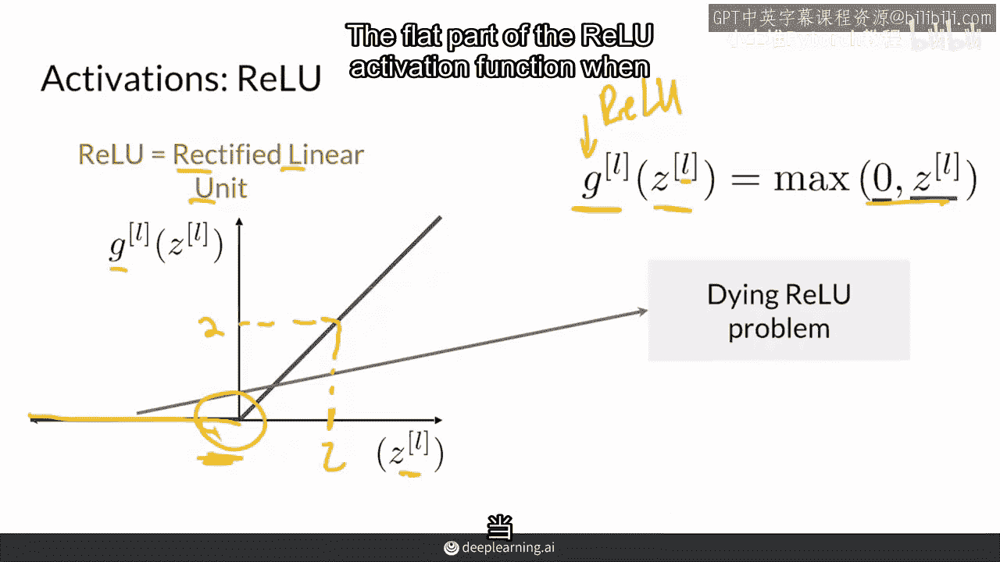

当z是负的时候导数总是为零。

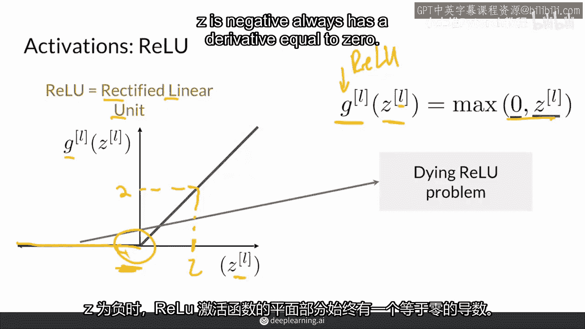

这可能是个问题因为学习过程依赖于导数，提供如何更新权重的重要信息，当导数为零时一些节点会卡在相同的值，他们的权重停止学习，这部分网络将停止学习，实际上，网络的前一部分也会受到影响。

这就是所谓的死亡ReLU问题因为它结束了学习，这就是为什么存在ReLU的变体。

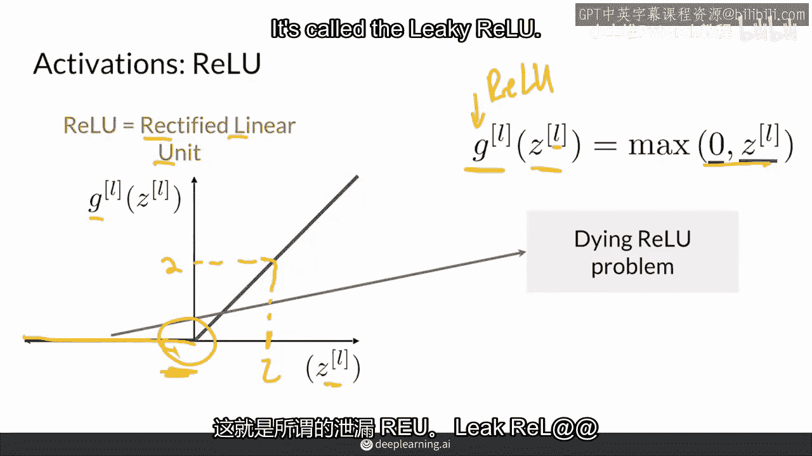

称为带泄漏的ReLU，带泄漏的ReLU保持了ReLU的形状，当z是正的时候保持了相同的正值，但在z小于零时添加了一个小的泄漏或斜率，当z为负值时，z是负的，并且仍然是非线性的，当z等于零时，斜率有弯曲。

但现在当z为负时，导数不为零，所以斜率小于一，所以它不需要与正侧形成直线，这将是不幸的，使其成为线性的，请注意，当z等于零时，导数仍设置为零，并且广泛地，斜率被视为超参数，这就是这里，但通常设置为0。

1，这意味着泄漏相对较小，相对于正斜率，这基本上解决了死亡射线循环问题，在实际中，大多数人仍然使用relu，但是，不过，leaky relu正在变得越来越流行。

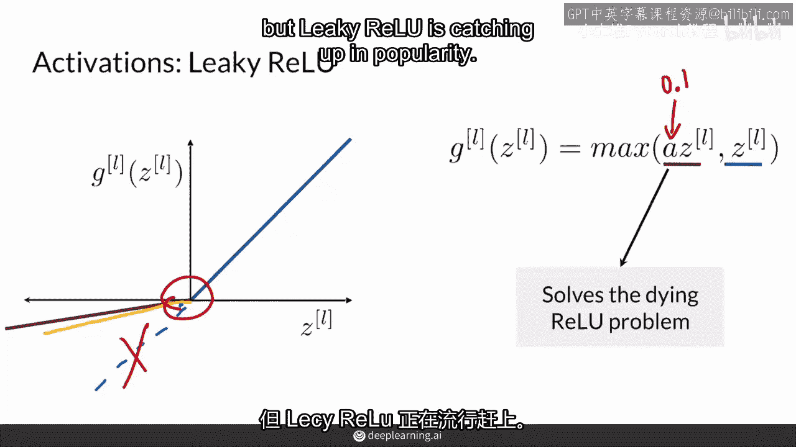

所以现在我将向你展示两种其他常见的激活函数，它们看起来相当相似，首先，它是sigmoid激活，它有一个平滑的S形状，输出值在0和1之间，当z大于或等于零时，sigmoid激活输出值在0。5和1之间。

当z小于零时，sigmoid输出值在0和0。5之间，因为它输出值在0和1之间，sigmoid激活函数经常在最后一层用于二分类模型，来表示0和1之间的概率，例如，预测图片中有一只猫的概率为0。95。

现在sigmoid激活函数不太常用于隐藏层，因为函数的导数在函数的尾部接近零。

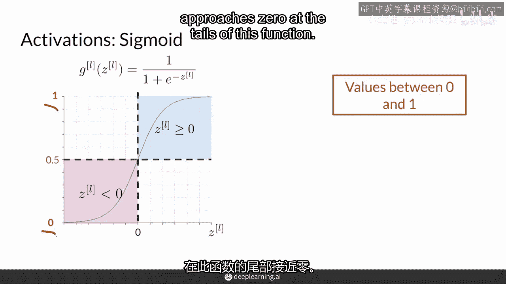

这会产生所谓的梯度消失问题或饱和输出，这里是函数的尾部，你可以想象这个函数在两边继续下去，因为它可以接受任何实数作为输入，在这里它趋近于一，在这里它趋近于零，这会产生所谓的梯度消失问题。

因为你在这些尾部有饱和输出，当你远离输入z为零时，值总是接近1或0，另一种与sigmoid形状相似的函数是双曲正切，或简称为tanh。

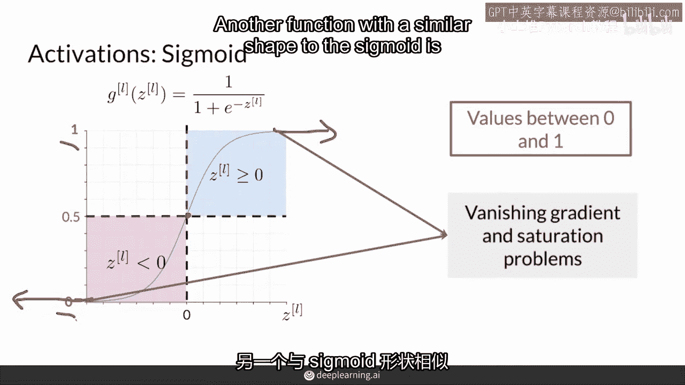

与sigmoid不同，然而，它输出值在-1和1之间，所以当z为正时，它输出值在0和1之间，当z为负时，它输出一个负值在-1和0之间。

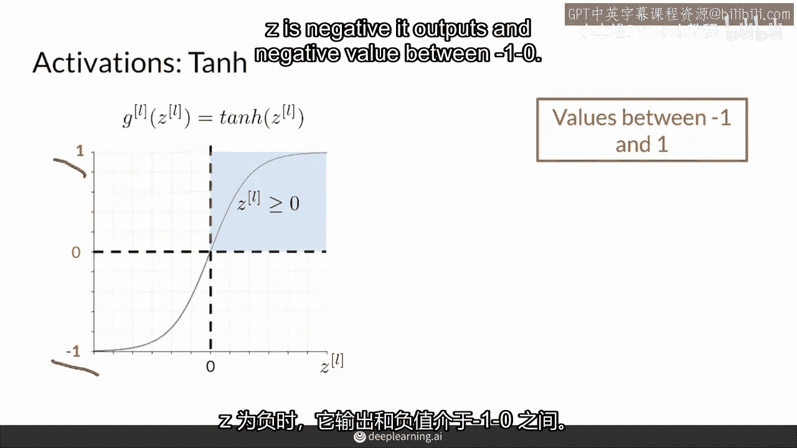

与sigmoid的关键区别是，tanh保留了输入z的符号，所以负数仍然是负的，这就是tanh。

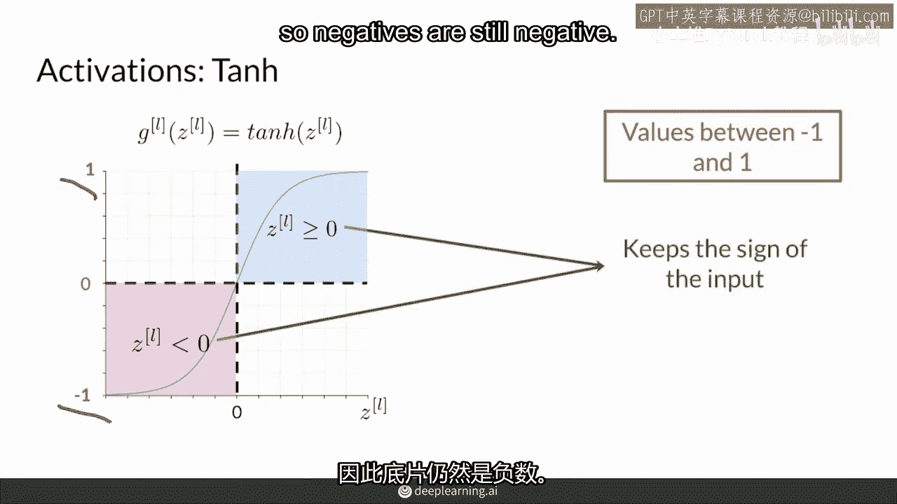

这在某些应用中是有用的，因为它的形状类似于sigmoid。

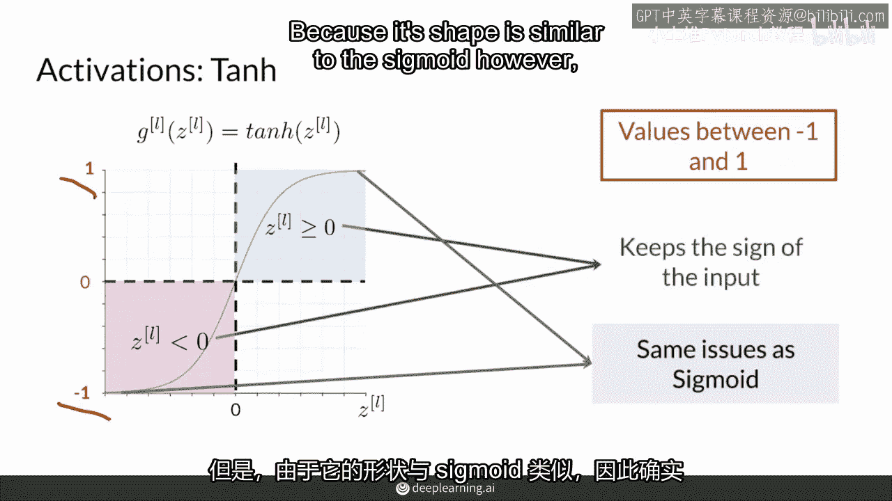

但是相同的饱和和消失梯度问题也会发生，再次，尾巴在两侧都会延伸，在顶部接近1，在底部接近-1，两者都在神经网络中被使用，实际上，所有这些激活函数都在神经网络中被使用，尤其是在gans中。

你将很快实现它们，还有其他更多的激活函数，研究者们一直在开发新的激活函数，如果你感兴趣，你可以自己设计一个激活函数，确保它是非线性的可微的。

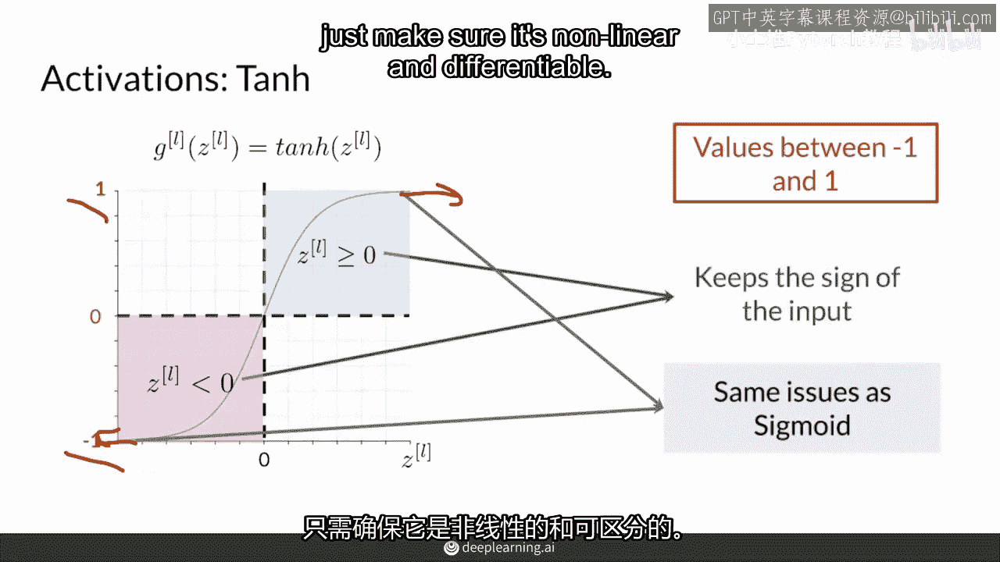

总结一下，目前有许多不同的函数被用作激活函数。

我给你展示前导，泄漏的relude，sigmoid和ten h，它们中的大多数都有自己的问题。

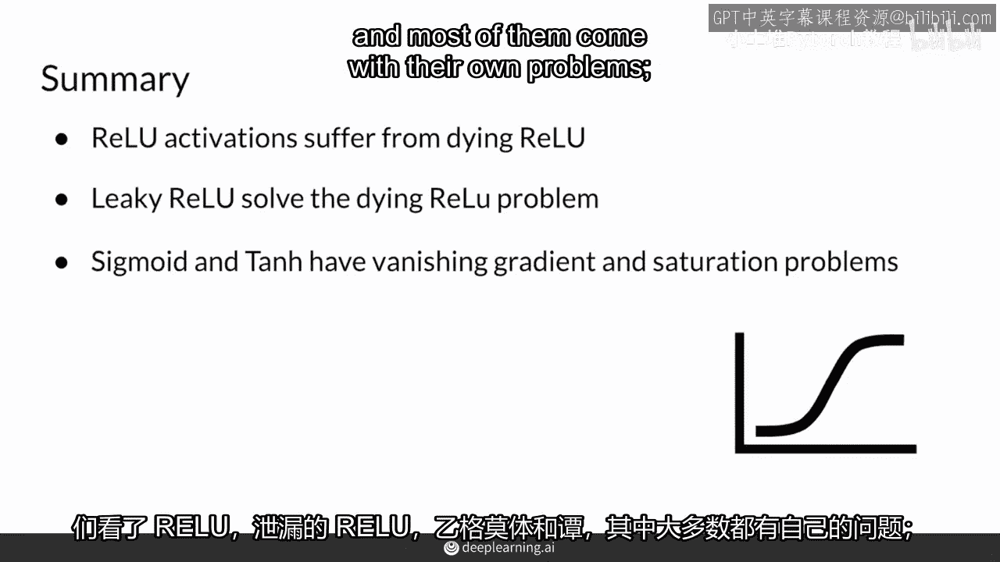

特别是relu的死亡问题，以及sigmoid和teenage的消失梯度和饱和问题，你将在这里展示和使用到的所有激活函数。

