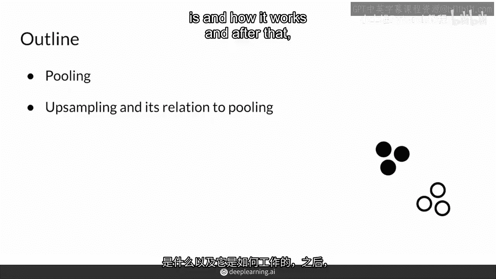
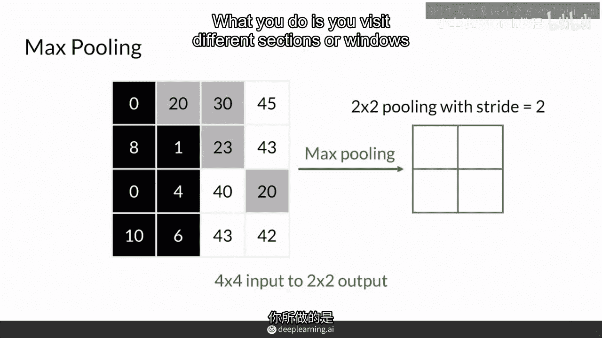

# P17：【2025版】17. 池化和上采样.zh_en - 小土堆Pytorch教程 - BV1YeknYbENz

池化和上采样在卷积神经网络中是非常常见的层，它们只是使用卷积的神经网络，池化用于减小输入的大小，而上采样则用于增加输入的大小。

所以让我们回顾一下什么是池化以及它是如何工作的，在那之后，我将向你展示什么是上采样。

以及它如何与池化相关，池化用于通过取平均值或找到最大值来降低输入图像的维度。

不同区域的值。

例如，这张猫的照片在一个池层之后，会导致这个模糊的图像，大小或分辨率较低。

在这个例子中，你可以看到，颜色调色板和两个图像上的颜色分布仍然非常相似。

因此，模糊图像上的形状仍然类似于原始形状。

在池化层上进行计算的成本会低得多。

在这张原始图像中它看起来是这样的，因此，池化实际上只是想提炼那信息。

那么，让我们看一下池化中最受欢迎的类型之一，称为最大池化，这就是它的工作原理，用一个非常简单的例子来说明，假设我们有这张4x4的灰度图像，如果你使用最大池化来缩小它，那么它会变成这里2x2的输出图像。

你所做的就是以非常相似的方式访问图像的不同部分或窗口。

就像卷积一样。

为了达到预期的结果，你需要使用一个2x2的池化滤波器。

我在这里说的是滤波器，所以这只是一个被传递的窗口，它的步长等于2，所以我不会访问任何像素超过一次，所以从图片的左上角开始，你在那个窗口中找到最大值。

这是20，你把它放在这里的输出中。

然后接下来你做同样的事情，在右上角相同的地方。

不重叠任何像素，你在这里看，最大的值是四五，你把它放在这里，然后你一直这样做，直到你覆盖了整个图像。

所以最后你得到了这个2x2的输出。

包含你从输入中访问的每个2x2部分的最大值，所以这里最大池化在做的是，它从图像中提取了最显著的信息，这些地方值非常高，这对于提取信息非常重要，当你只关心最显著的信息时，有时候这不是一张图像。

这只是一个中间层，所以这实际上是提取在这个中间部分具有最高值的权重。

所以除了最大池化之外还有其他种类的池化，例如平均池化也被广泛使用，你只需要在那个窗口内取平均值而不是最大值，还有最小池化，你在那个窗口内取最小值，这里真的很重要要知道，池化没有可学习的参数。

这与卷积不同，这些不是可学习的，图像上应用一个简单的规则。

好的，现在上采样与池化的作用相反，给定这个低分辨率的图像，上采样的目标是输出一个高分辨率的图像。

你看到它并不完美，要做到这一点。

实际上需要为额外的像素推断值，这有几种不同的方法。

一种简单的上采样方式被称为Nearest Neighbors上采样，使用这种方法，你可以复制输入图像的像素值多次来填充输出，为了说明，假设这个2x2的灰度图像，你想要将其上采样到4x4的输出，首先。

将输入图像的左上角值分配给输出图像的左上角像素，输入图像的其他值分配给添加的像素，距离左上角两个像素，在其他情况下，根据你想要放大的大小，这个距离可能会有所不同，在这四个角落中。

每个2x2区域中的像素值将相同，你也可以这样想。

首先将这些值放入角落，然后每个其他像素，找到它最近的邻居。

并将值分配给它，所以对于输出中的每个2x2角落。

像素值将相同，就像池化一样，上采样也有很多不同的方法。

如线性和双线性插值。

你可以探索这些方法以及如何实现它们，但你真的不需要担心实现它们。

因为像TensorFlow和PyTorch这样的编程框架，实际上会为你处理整个过程。

你只需要知道它们通过查看输入中的已知值，为输出中的缺失像素推断值。

就像池化一样，上采样层，而且你不需要担心实现它们，因为像TensorFlow和PyTorch这样的编程框架。

实际上会为你处理整个过程，没有可学习的参数，它只是一些固定的规则，这些都是不同的固定规则。

总之，池化层减小了输入的大小，而上采样则相反，与卷积不同，无论是池化还是对上采样层都没有那些可学习的参数，它只是一些固定的规则，所以接下来，我将向你介绍一种上采样方法，它不是一个真正的上采样层。

