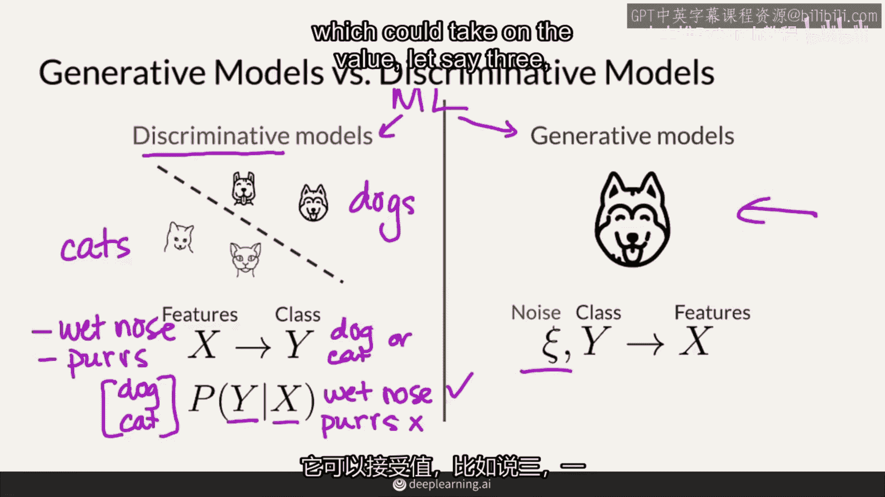

# P2：【2025版】2.生成式模型 - 小土堆Pytorch教程 - BV1YeknYbENz

欢迎来到生成对抗网络（GANs）的专业化课程，简称为GANs。简称，你将学习如何构建能够生成真实图像的模型。

本视频中，你将看到如何生成图像、音乐和其他东西。你将对GAN及其家族模型的工作原理获得些直观的理解。本周末结束时，本视频中，你将构建自己的GAN，该GAN生成手写数字。

我将向你介绍生成模型是什么，其中GAN是这类模型的一种，以及这些模型如何与其他你可能已经知道的模型进行比较。我也会谈谈两种最受欢迎的生成模型架构。

你可能熟悉判别式模型，判别式模型是机器学习中常用的分类模型，它们学习如何区分类别，如狗和猫，它们通常被称为分类器，判别式模型使用一组特征x，如湿润的鼻子，或者它是否发出咕噜声。

然后根据这些特征确定类别y，即图像是否是狗或猫，换句话说，他们试图建模给定一组特征x的概率y类为湿鼻子，但它不咕噜，所以它很可能是一只狗，另一方面。

生成模型试图学习如何制作某个类的逼真表示，例如，一只狗的逼真图片。

你们看这里，它们从一些随机输入开始，这里表示为噪声，这可能取得一个值。

让我们假设是三一个随机数字或负数，五或二点六。

我们实际上是所有可能值的向量，重点是噪音，代表了随机一组值输入到生成模型中，生成模型有时也会接收一个类别y，例如狗，并且从这些输入中，它将生成一组特征，看起来像一只真实的狗。

所以，一只狗的形象，具有湿鼻子或舌头伸出等特征，所以你可能会好奇，为什么我们需要这种噪音，为什么不能直接告诉我们，嘿，生成一只狗给我看看，然后它就会生成一只狗，这里的噪音主要是确保生成的东西。

实际上每次不是相同的狗，你很快就会看到这种主题被重复，这是因为只生成一个狗并不有趣，而且也有点没意义，所以目前可以把这看作是一些随机噪音，这也作为输入进入，所以更普遍地说。

生成模型试图捕捉x的概率分布，湿鼻子的不同特征。

伸出舌头，有时尖耳朵，但总是，鉴于狗的类y，再加上噪音，这些模型将生成这个类y的真实和多样化的表示，y，实际上，如果你只生成狗的一个类，一个狗的y，那么你可能不需要对这个y进行条件约束。

相反，这只是对所有特征x的概率，你可以从侧面比较看出，判别式模型和生成式模型在这里实际上有点相互映照，好的，所以，举个例子，在一个良好的生成模型运行中。

你可以得到这些鹅啄食的图片，而在另一个运行中，你可以得到一只西藏獒犬的图片。

如果你继续多次运行它，没有任何限制，你将会得到更多代表你生成模型训练数据集的图片。

这可能看起来像很多可爱的拉布拉多寻回犬，有许多类型的生成模型，我将简要向你介绍最受欢迎的那些，变分自编码器，简称VAE。

和生成对抗网络GANs，VAE使用两个模型工作，一个编码器和一个解码器，这些通常是神经网络，它们首先通过将真实图像喂入编码器来学习，例如，我画的这只非常逼真的狗。

然后编码器的任务是找到一种很好的方式来表示这张图像，在这个扭曲的潜在空间中，假设它找到了这里，假设这个点在潜在空间中可以用这组数字表示，6。2，负的，321，现在VAE会做以下操作，它将这个潜在表示。

或者接近它的点，通过解码器，解码器的目标是重建编码器之前看到的真实图像，所以假设解码器已经训练得很好，但是在一开始，解码器可能无法重建图像，但是一开始，解码器可能无法重建图像。

也许这只狗的后代会有邪恶的眼睛，现在训练后，我们实际上去掉了编码器。

我们可以在潜在空间中随机选择点，比如这里，解码器将学会生成一张真实狗的图片，我刚才描述的是大部分自编码器，变分自编码器的一部分，变分的部分实际上在训练过程中向整个模型注入一些噪声，而不是有编码器。

将图像编码到那个潜在空间的单一点中，编码器实际上将图像编码到一个整个分布中，然后从那个分布中采样一个点，喂给解码器，以便。

生成一个真实的图像，这添加一些噪声，因为这个分布上的不同点可以被采样。

GANs以一种相当不同的方式工作，它们由两个模型组成，但现在有一个生成器生成图像，就像解码器一样，还有一个判别器，实际上这是一个隐藏在这之中的歧视性模型，所以这有点'纳博科夫'在里面。

生成器输入一些随机噪音，就像你之前看到的那样，例如，一和二，三，五作为一个向量，并将这些输入到这个生成器中，当然，还可以选择狗的种类，但如果我们只是想生成狗，我们不需要输入那个，作为输出。

它可以随时间生成同一只狗，当然，当然，一开始它也可以是邪恶的，所以生成器的角色，在某种程度上它与vae中的解码器非常相似，所以不同之处在于没有指导编码器。

这次决定输入到生成器中的噪声向量应该看起来像什么，相反，有一个鉴别器在看假的和真实的图像，同时试图理清哪些是真实的，哪些是虚假的，随着时间的推移，每个模型都在试图超越彼此，因此，这些模型彼此竞争。

这就是为什么它们在名字中被称为对抗性的，生成对抗网络，所以你可以想象那些肌肉随着时间的推移在彼此竞争中增长。

直到他们达到一个点，我们再次，不再需要第二个模型了，鉴别器和生成器可以输入任何随机噪声并生成一张逼真的图像。

例如，一组随机数向量，负五，六，二和八，可以生成这只可爱的拉布拉多寻回犬，好的。

在这门专业化期间，你将专注于生成对抗网络（GANs），但请随意阅读更多关于VAE的内容，如果你发现它们有趣，不要担心，如果你还不完全理解GAN的工作原理，不要担心。

我将更深入地研究它们的架构，在接下来的视频中他们将学到的方式。

总之，生成模型学习产生逼真的例子，就像一位艺术家可以画出看起来像照片的画作，与此同时，判别模型区分不同的类别，总之，生成模型学习产生逼真的例子，例如，产生那些可爱的狗的照片，你刚刚看到了，一个生成模型。

有点像一个艺术家，他正在尝试学习如何创作超写实艺术。同时，判别模型能够区分不同的类别，比如一只狗或一只猫，但是当然，你也看到了，一个判别模型可以是一个生成模型的子组件，例如判别器，其类别为真实和伪造。

有许多种生成模型，但在专业化中，你将学习GAN，本周末结束的时候，你可以构建自己的生成对抗网络（GAN），它能够生成手写数字。

