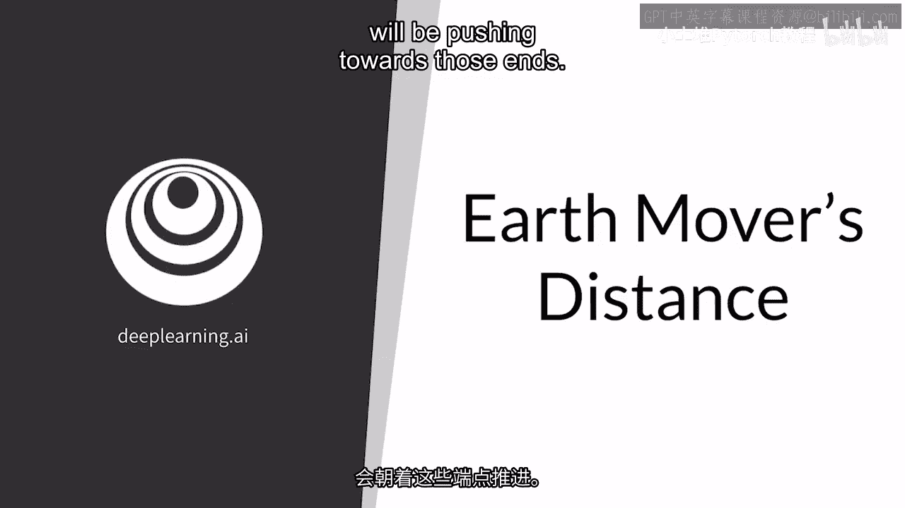
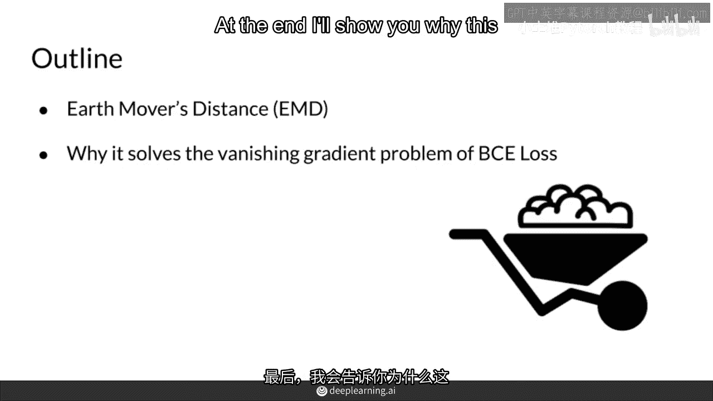
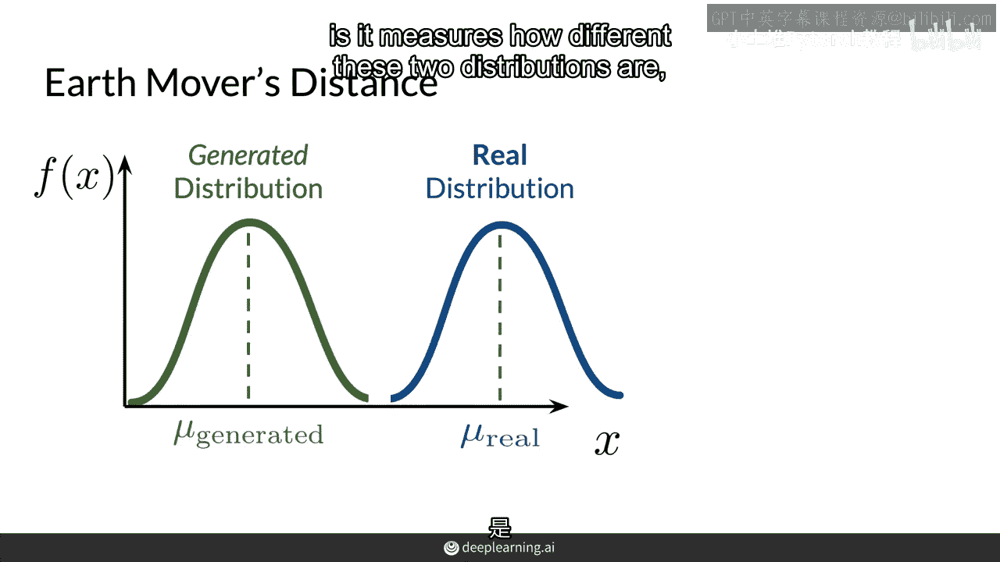
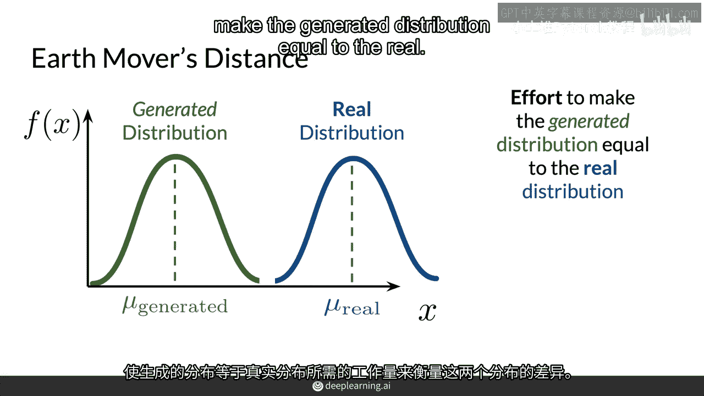
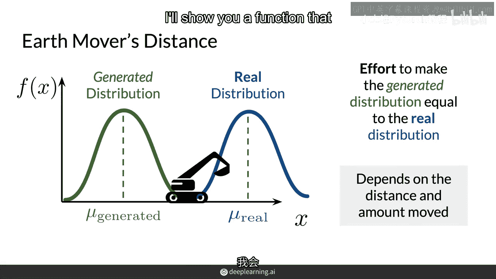
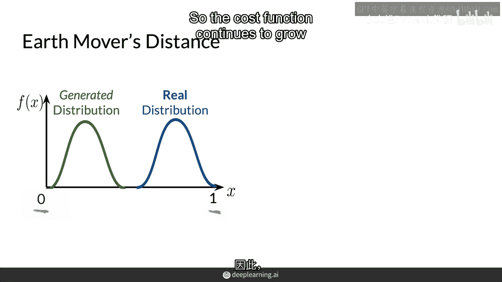
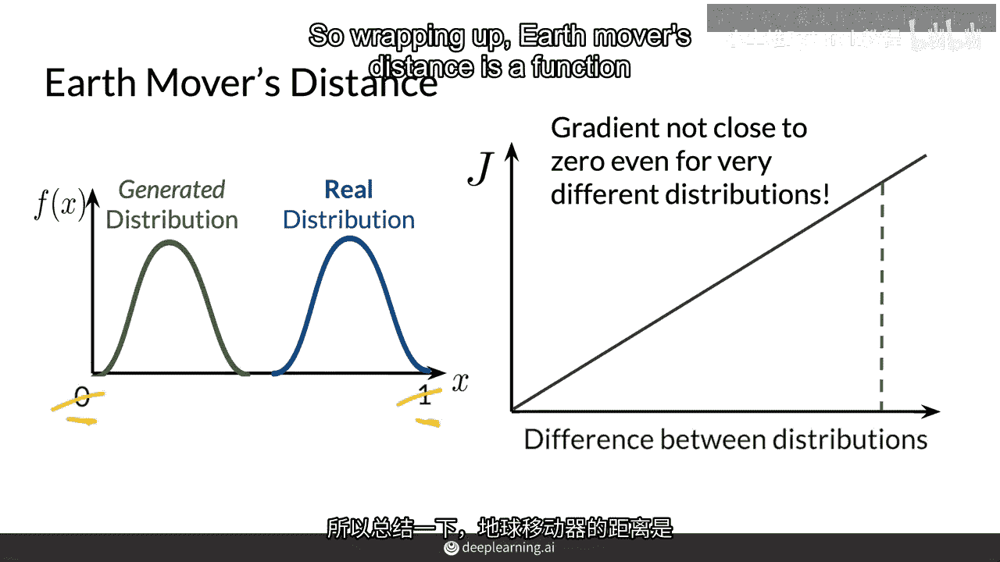
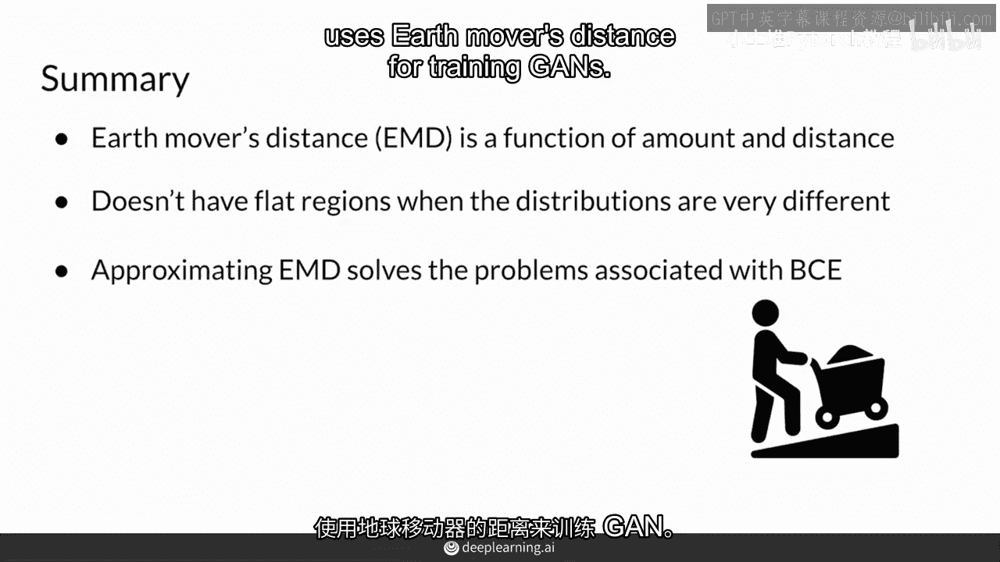

# P22：【2025版】22. 地球移动者距离.zh_en - 小土堆Pytorch教程 - BV1YeknYbENz

在使用 BCE 损失训练 GAN 时，您经常遇到模式崩溃和梯度消失问题，这是由于整个架构下的基础成本函数，尽管在 0 到 1 之间有无限多个十进制值，判别器在改进时会倾向于那些极端。

在这个视频中，您将看到一种不同的底层成本函数称为地球移动距离，它测量两个分布的距离，通常在训练 GAN 时优于与 BCE 损失相关的成本函数，最后，我会告诉你这是如何帮助解决梯度消失问题的。

所以，将这个生成的和真实的分布设定为方差相同，但是，它们的均值不同，并且假设它们可能是正态分布，地球移动距离所做的是，它是，它测量这两个分布之间的差异。

通过估计将生成的分布调整为真实的分布的努力程度。

直观地，如果生成的分布是一摊泥土，移动并塑造这摊泥土以匹配真实的分布有多困难，这就是地球移动距离的含义。这就是地球移动距离的含义，这个函数取决于距离和生成分布需要移动的量。

我会在下一个视频中向你展示如何计算这个函数。

BCE损失的问题在于，随着判别器的改进，它会开始给出更极端的值，介于零和一之间，更接近一和零的值，结果，这对生成器的反馈变得不那么有用，因此，由于地球移动距离的消失梯度问题，生成器将停止学习，然而。

零和一之间没有这样的上限，因此成本函数继续增长。

无论这些分布有多远，这个度量的梯度不会接近零，因此，GANs不易受到梯度消失问题的影响，也不易受到模式崩塌的问题，总结地球移动距离。

是使一个分布等于另一个分布的努力的函数，它取决于距离和数量，与BCE不同，当分布开始变得非常不同时，它没有平坦的区域，并且判别器开始显著改善，所以近似，这种度量消除了梯度消失的问题。

并减少了生成对抗网络（GANs）模式崩塌的可能性，在接下来的几个视频中。

