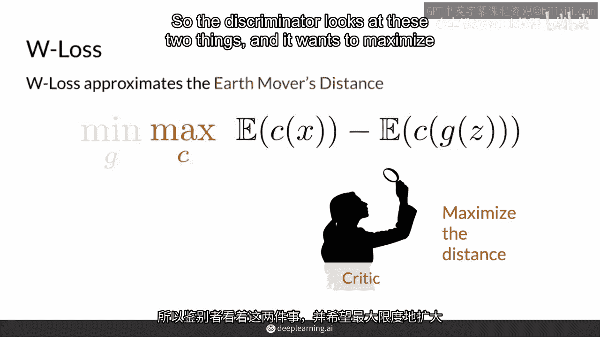

# P23：【2025版】23. Wasserstein损失.zh_en - 小土堆Pytorch教程 - BV1YeknYbENz

正如你所见，传统上使用此损失来训练GANs，但由于其近似的函数的形式，它有许多问题。

在本视频中，我将向你介绍一种替代的损失函数。

称为Wasson损失或W损失，它近似于你在前一个视频中看到的地球移动距离。

为此，首先，你将看到一种看待BCE损失函数的替代方法。

这更简单、更紧凑，我将向你展示如何计算W损失。

我将把这项损失与VC损失进行比较，因此，BC损失是通过一个冗长的方程计算出来的，本质上它衡量了平均而言，观察值被判别器分类为假和真的程度，所以，判别器将一些观察值分类为假和真。

因此，生成器和GAN的目标是最大化这种成本。

因为这意味着判别器认为生成的假值看起来非常真实。

而判别器希望最小化这种成本，因此，这可以被称为最小最大化游戏。

并且用于计算BC损失的这条很长的方程可以简化如下，对示例m的和与除法无非就是平均值或期望值。

而和里面的第一部分衡量了判别器对真实观察值的分类好坏。

当y等于1时，1表示真实。

第二项衡量生成器生成的假样本被分类为假的程度。当y等于1时，表示真实。

但是1-y（y等于0时）表示假样本。w损失。

另一方面，近似于真实分布和生成分布之间的地球移动距离。

但它比BCE有更好的特性。但是它看起来与BCE损失的简化形式非常相似。在这种情况下，该函数计算判别器预测的期望值之间的差异。这里，这叫做批评家，稍后会详细介绍，所以我在这里用c来表示它。

而这是c的真实例子x与假例子的对比，G的z生成器，接收噪声向量生成假图像，G的z，或者你可以称之为x hat。

所以鉴别器观察这两者，它想要最大化它对真品和仿制品思考的距离。

所以它试图将这两个分布推得越远越好，同时，生成器想要最小化这个差异。

因为它想让判别器认为它的假图像尽可能接近真品。

在合约中，没有对函数中的log进行计算，因为判别器的输出不再局限于0到1之间。

所以为了bc损失有意义，判别器的输出需要是0到1之间的预测。

它想要最大化它对真品和仿制品思考的距离，所以它试图将这两个分布推得越远越好，因此，GAN使用BC损失训练的判别器的神经网络在输出层具有Sigmoid激活函数。

以便将这些值压缩在0和1之间。

W损失，然而，它根本不需要这种要求。

所以你可以在判别器神经网络的末尾有一个线性层，并且可以产生任何实数输出。

你可以将这个输出解释为批评者认为图像有多真实，顺便说一下，我们现在称其为判别器。

因为它不再局限于0和1之间。

因为0表示假，1表示真，它不再将这些值分类为这两个或这两个类别，因此，不再进行分类，作为结果，不再有意义称其为判别器，因为它不区分这些类别，所以对于W损失。

与判别器等效的称为批评者，它试图最大化它在假样本上的评估与它在真实样本上的评估之间的距离。

所以，W损失和BCE损失之间的一些主要区别是，在BCE损失下，判别器输出一个0到1之间的值。

而批评者和W损失将输出任何数字，此外。

它们的成本函数的形式非常相似，但W损失中不包含任何对数，这是因为它是一个衡量批评者对真实样本的预测。

与它对假样本的预测之间的距离，同时。

BCE损失确实测量了真实和假之间的这种距离，但以1或0作为基准，因此，这里重要的是主要，判别器被限制在0到1之间。

而批评者不再受限，并且试图尽可能多地分开两个分布，作为结果。

因为它不受限制，批评者被允许改进而不会降低对生成器的反馈，这是因为它没有消失梯度问题，这将防止模式崩溃，因为生成器总是得到有用的反馈，因此，总结来说，W损失看起来与BCE损失非常相似。

但它在底层的数学表达式不那么复杂，它近似于地球移动距离，因此防止模式崩溃和管理生成器问题，然而，这个成本函数有一个额外的条件，为了使其良好工作并且是有效的，你将在下一个视频中看到。

