# P27：【2025版】27. 条件生成的直觉.zh_en - 小土堆Pytorch教程 - BV1YeknYbENz

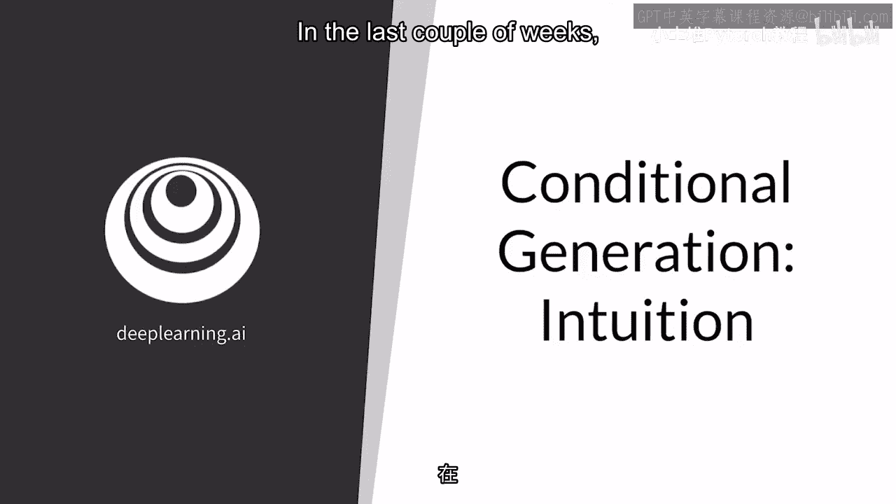

在过去的几周里，您已经看到了生成式对抗网络（GANs）的工作原理，以及如何在本周构建它们，使它们在训练数据集中产生示例以模仿您的培训数据集。

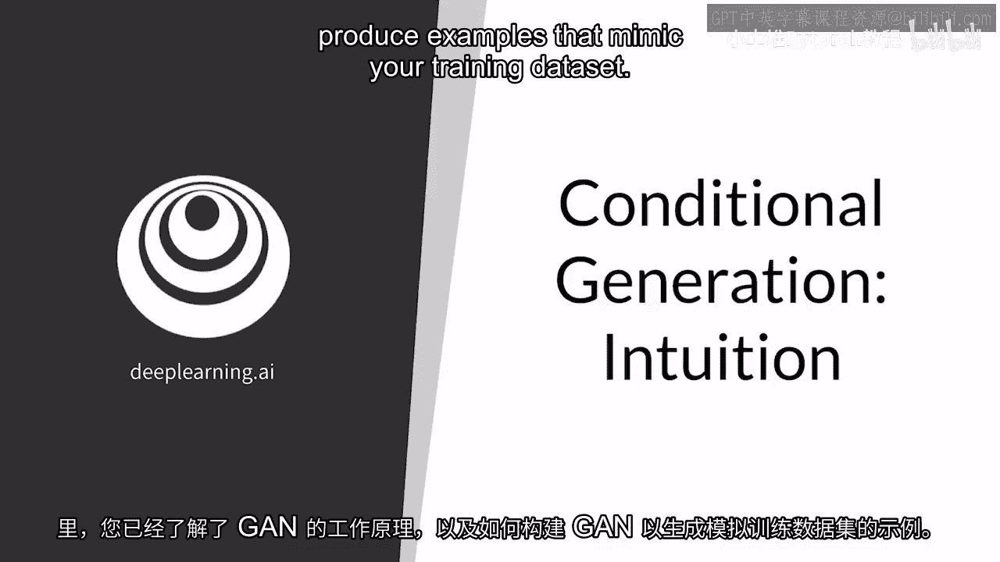

在接下来的时间里，我将向您展示如何控制输出并获取特定类别的示例，或者使示例具有某些特征，这个视频非常有趣。

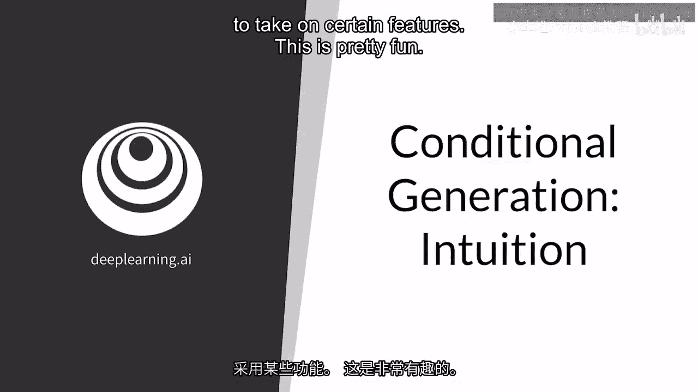

我将回顾无条件生成是什么，实际上，这正是您一直使用的，您还将通过比较两者被介绍到有条件生成。

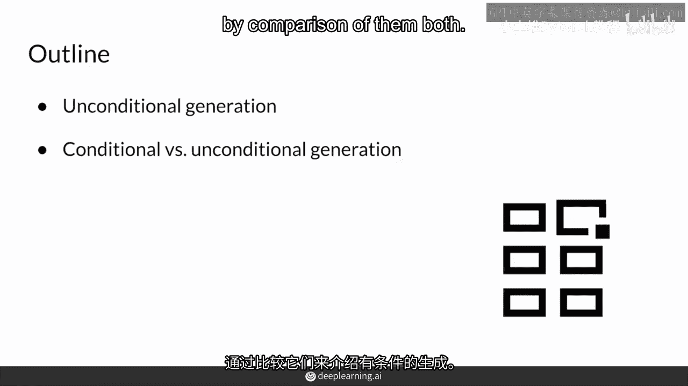

所以，作为无条件生成的快速回顾，你得到的是随机类别的输出。

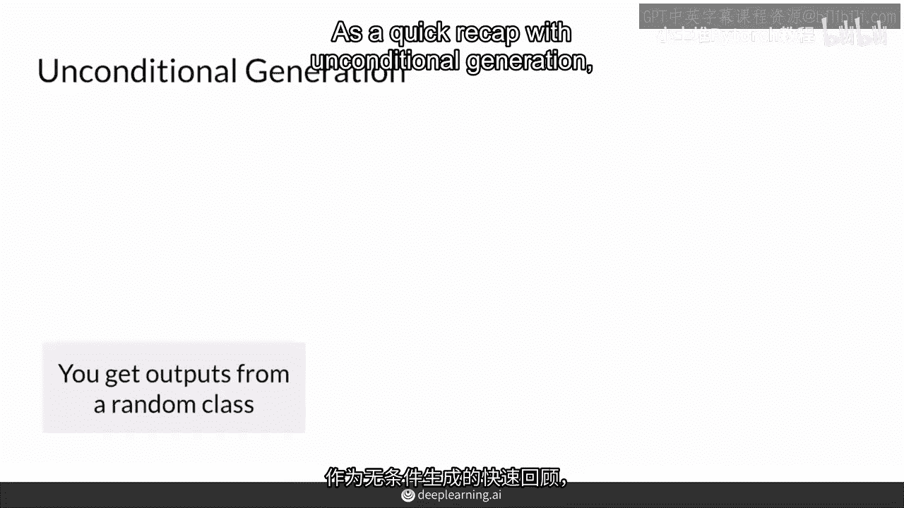

所以你可以把这想象成一个自动售货机，你投入硬币，然后你得到一个随机颜色，的软糖，如果你想要特定颜色的软糖。

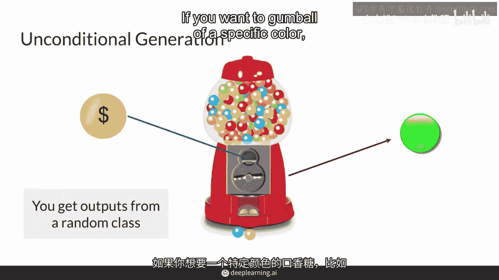

比如红色，你必须一直投币直到你得到它，在这个例子中，硬币就像随机噪声向量，你GAN用于生成的，而自动售货机就像生成器，然后软糖是随机输出，那些图像你可以得到，这样你就可以看到彩色橡皮糖的颜色。

就像你知道你的gan是如何训练的一样，你不能控制你将会得到哪种颜色的输出。

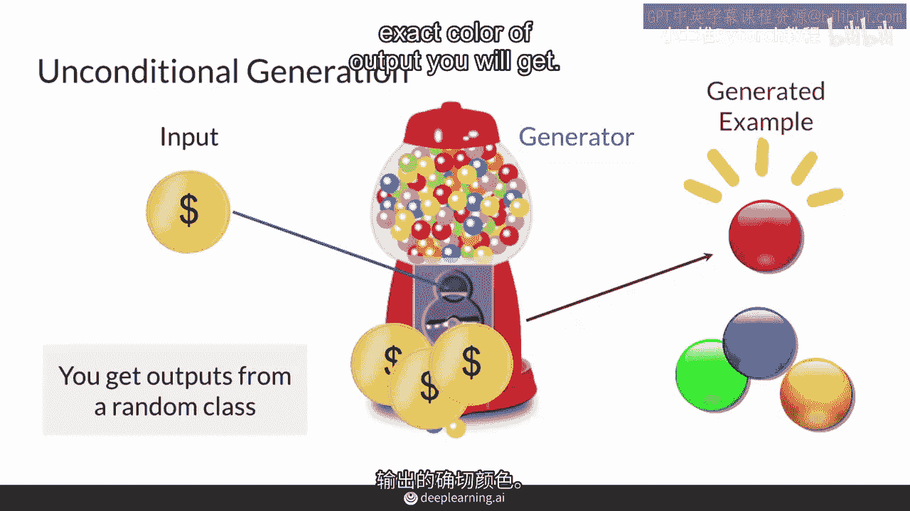

另一方面，条件生成允许你请求来自特定类别的例子。

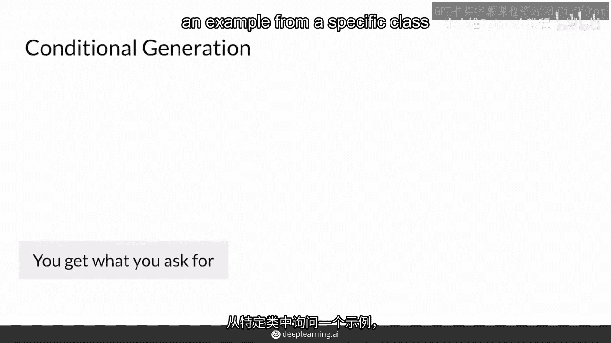

你将会得到你所请求的，这就像一个自动售货机，所以你输入一个硬币，就像自动售货机一样，但你输入的是一个硬币，附带你想要的物品的代码，例如，两个红色的苏打水，但请注意，你仍然无法控制苏打瓶的一些特定特性。

比如你不能得到保质期最新的那一瓶，或者最完好无损的那一瓶，或者已经装得最满的那一瓶，你只会随机得到一瓶红色苏打水，但它确实是一瓶红色苏打水，而不是一瓶蓝色的糖果，所以这里，硬币和代码就像生成器的输入。

而自动售货机就是生成器，而苏打水就像生成的输出，所以加上一个条件，你可以从你指定的类中得到一个随机的例子，而这个类就是这里的两瓶苏打水。

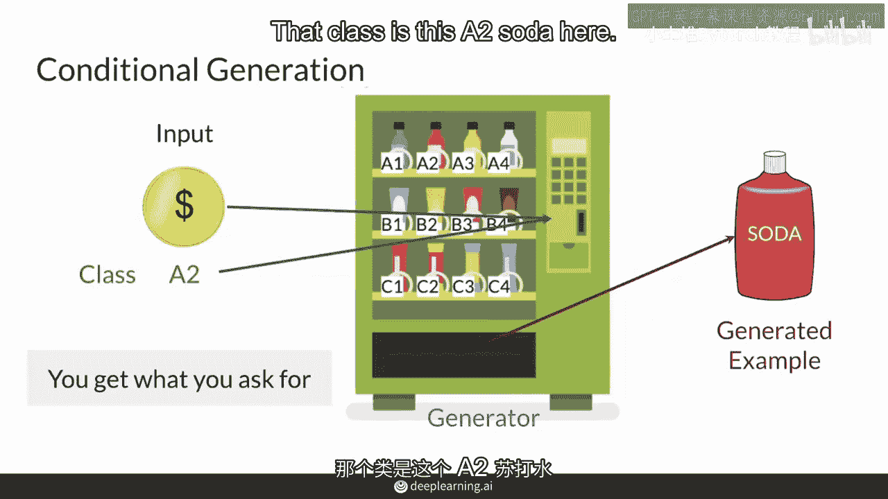

所以现在你对条件生成和无条件生成之间的关系有了一个概念，所以让我们比较一下它们，所以条件生成可以让你从你决定的类中获得生成的示例，而无条件生成则从随机类中获得示例，因此，作为条件生成的结果，实际上。

你必须使用标记数据集来训练你的生成对抗网络（GAN），并且这些标签是你想要的不同类别上的，虽然无条件生成不需要任何标签，你在之前的周已经看到过这一点，从课程中你不需要任何标签，您只需要一堆真实的例子。

你将在随后的讲座中看到如何修改你的模式以适应这种条件生成。

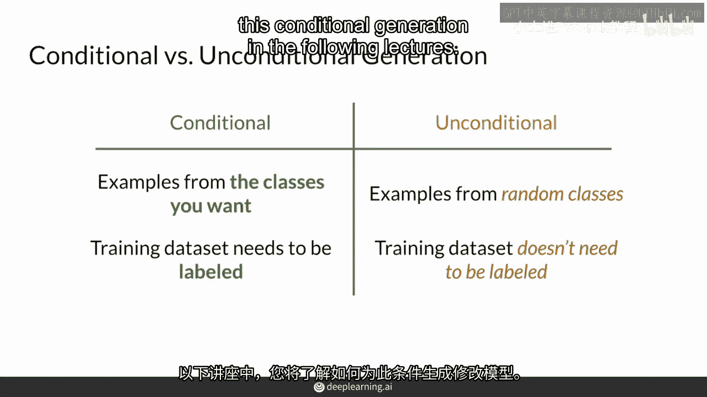

所以，你应该从这个视频中带走什么，那是条件生成需要标记数据集进行训练吗，为了学习如何从所需类别中生成示例并产生示例，我将向你展示如何做，您数据集中的标签被馈送到生成器和鉴别器中。

为了训练您的生成对抗网络并产生所需类别的示例。

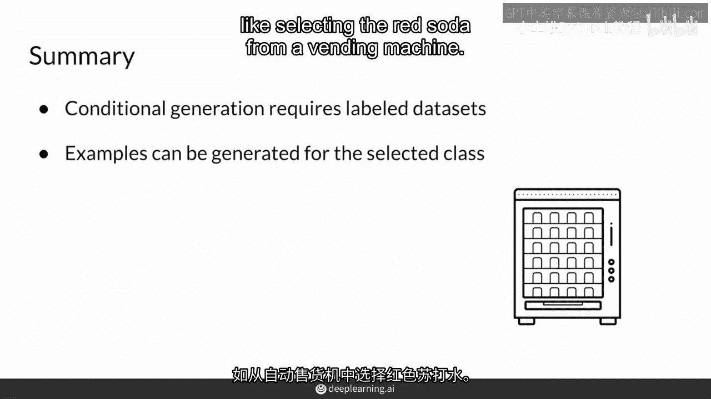