# P28：【2025版】28.条件生成的输入.zh_en - 小土堆Pytorch教程 - BV1YeknYbENz

条件生成让你能够产生你想要的类别的示例，为了做到这一点，你需要有一个标记的数据集，并且通过某种方式在训练期间将该类信息传递给生成器和判别器。

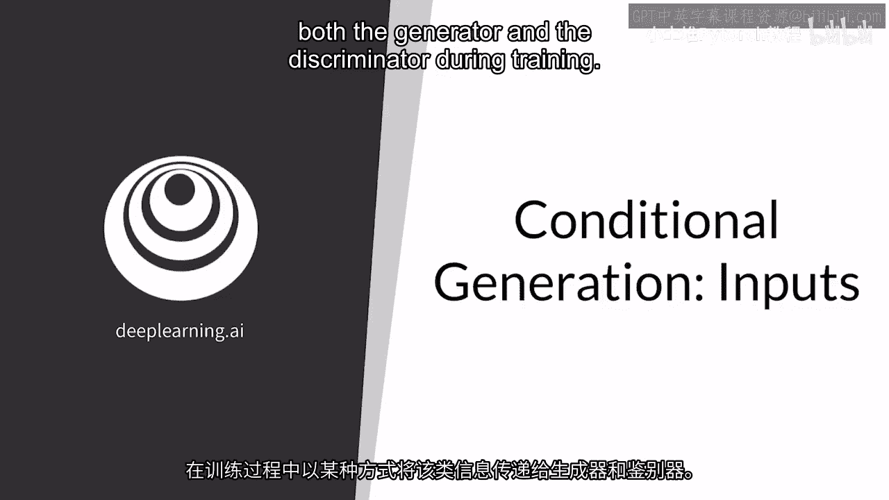

所以，在这里你将学会如何告诉生成器生成哪种类型的对象，并且示例的类别是如何传递给判别器的，与待分类的图像一起。

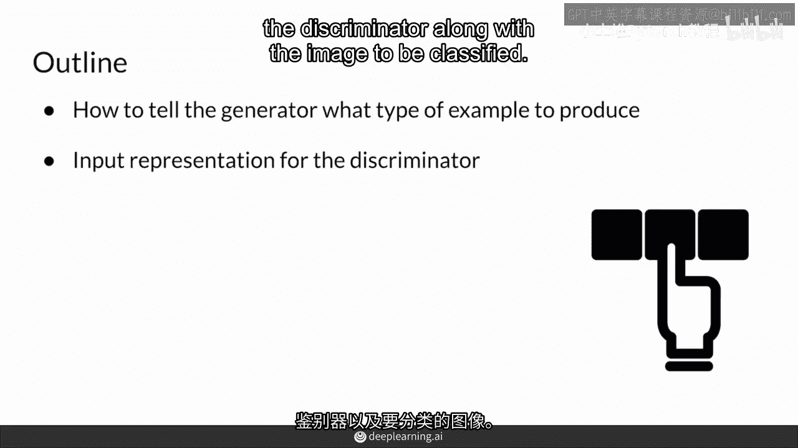

所以，你已经在无条件生成中看到了，生成器需要噪声向量来产生条件生成的随机示例，你也需要一个向量来告诉生成器，生成的示例应该来自哪个类别，通常这是一个one hot向量，这意味着每个位置都是零。

除了你想要的类别对应的位置。记住，噪声向量也是随机值，不一定是零或一。例如，假设这些不同的值都是不同的狗品种。那么，这里的第二个单元格就对应哈士奇。因此，如果你在这里指定一个位置为一。

这意味着你想要生成器生成一个哈士奇。

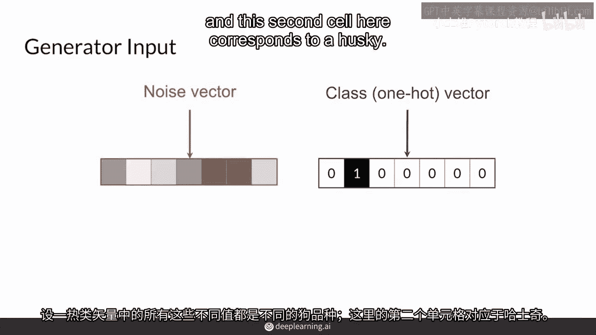

如果你在其他地方有一个一，而哈士奇单元格是零，那么，如果你在其他地方有一个一，而哈士奇单元格是零，那么，如果你在其他地方有一个一，而哈士奇单元格是零，那么你希望它产生一个不同的类别，例如，金毛寻回犬。

在这里，噪声向量是添加随机性来生成，类似于之前的，让你产生一个多样化的示例集，但现在它是在特定类别内的多样化集，根据特定类别进行条件限制，所以这个one hot向量现在是。

让你控制生成输入给生成器的类别。

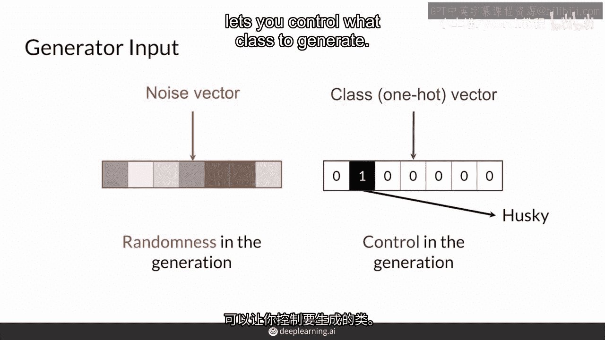

在条件之下，甘实际上是噪声和一热类信息的拼接向量，所以它是一个巨大的向量，例如，这里有一个代表哈士奇品种的类向量。

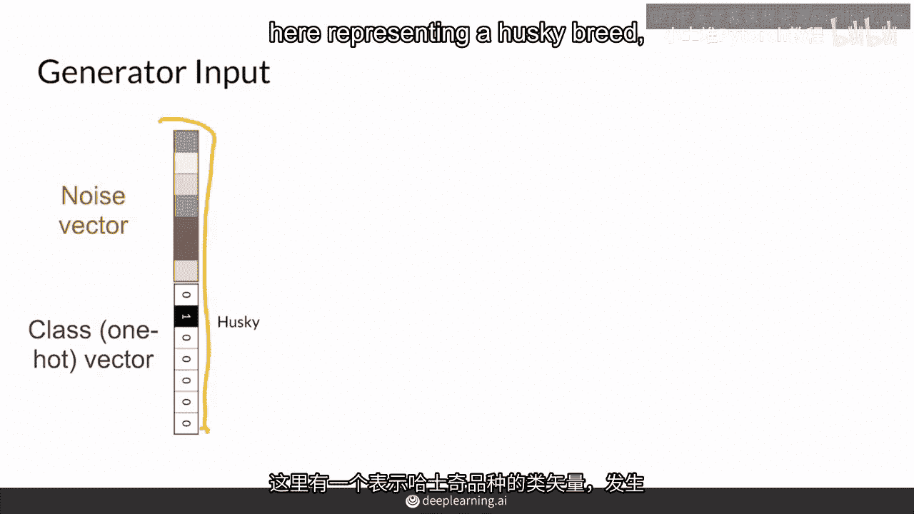

生成器将理想地生成一个哈士奇狗，从一个噪声向量。

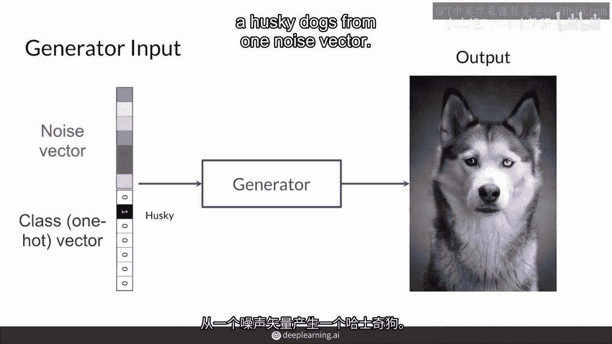

如果你改变那个噪声向量，它应该生成一个不同的哈士奇狗，而类信息保持不变，两者仍然是哈士奇，两者仍然是同一类，但是如何确保生成器实际上生成了一只哈士奇，这似乎像魔法，为什么它不生成一只随机的狗呢。

实际上这是因为判别器也会接收到这些类别信息，所以生成器需要让判别器上当，所以你会看到这是如何发生的。

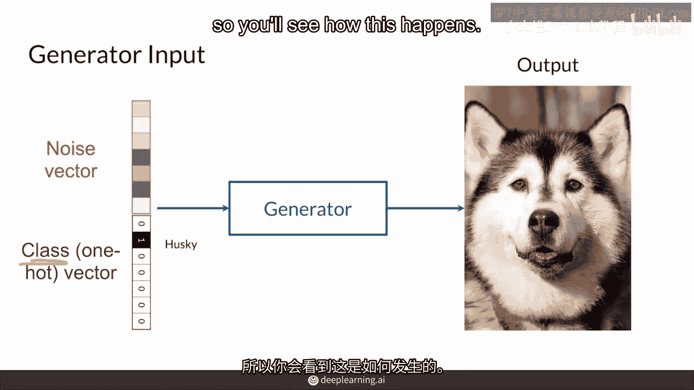

判别器以类似的方式会接收到示例，但现在它们作为输入与类别信息配对，以确定示例是否是真实的还是伪造的该特定类别的代表，而这里的关键就是，所以例如，这只金毛寻回犬的类别，但是一张比格犬的图片。

所以这不是一只正在进食的金毛寻回犬，这个鉴别器应该实际上说这是假的，因为它看起来不像真实的金毛寻回犬，即使它是一只非常真实的比格犬图片，它会说这只有5%的真实，因此。

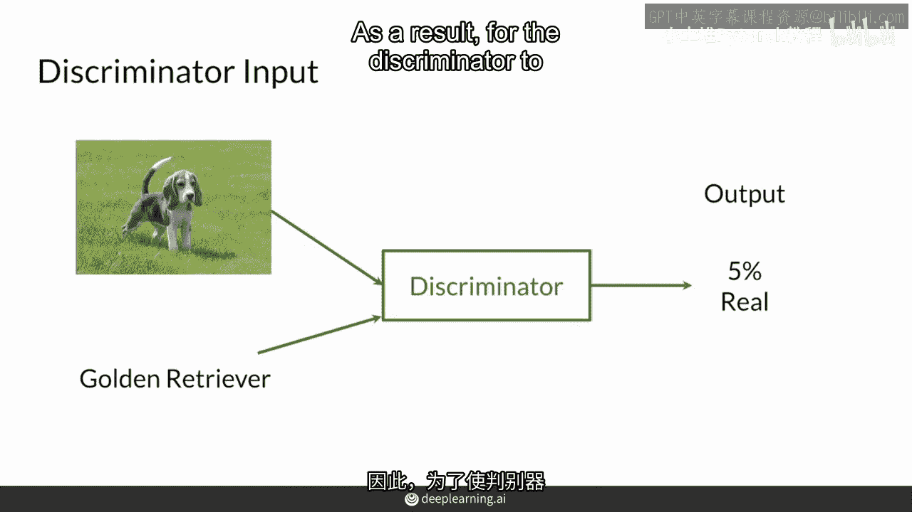

为了鉴别器能预测一个例子是真实的，它需要看起来像训练数据集中的那个类别的示例，而训练数据集是关键，因为它会得到真实的标签，为了欺骗它生成一个金毛寻回犬，生成器需要生成一个真实的金毛寻回犬。

所以跟随着上一个关于金毛寻回犬的例子，鉴别器会学习到预测这个图片更真实，只有当示例看起来像金毛寻回犬时，这是因为真实的图片会有正确的类别标签，这会鼓励生成的图片也采用正确的类别，非常酷。

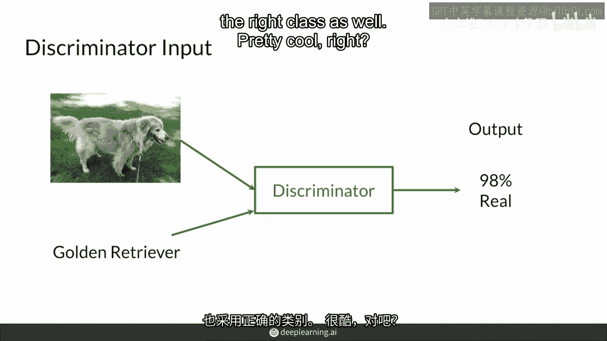

是的，所以深入挖掘一下，鉴别器的输入是一个图片，那么如何添加类别信息呢，图片以三种不同的方式输入，RGB红，绿，蓝，或者只有一个通道，如果是灰度图片，这就是图片的部分。

然后类别信息也可以作为额外的通道输入，所有的通道都取值为0，所以这些白色的方块，高度宽度相同。

都取值为0，而那个黑色的方块则取值为1，与这个one hot向量相反，这些通道通常是更大的矩阵，在每个位置都不是那个类别时都取值为0，有很多其他更节省空间的方法可以做到这一点。

比如用另一种格式压缩这些信息，你可以甚至创建一个单独的神经网络头来做这件事，如果你有很多类别的话，这样做是明智的，但对于这里你拥有的7个左右类别，这种方案肯定可行，并且模型会学习到这些信息。

总结来说就是条件生成，你将类别信息传递给两个模型，通常这是一个one hot向量与你的噪声向量连接，传递给生成器。

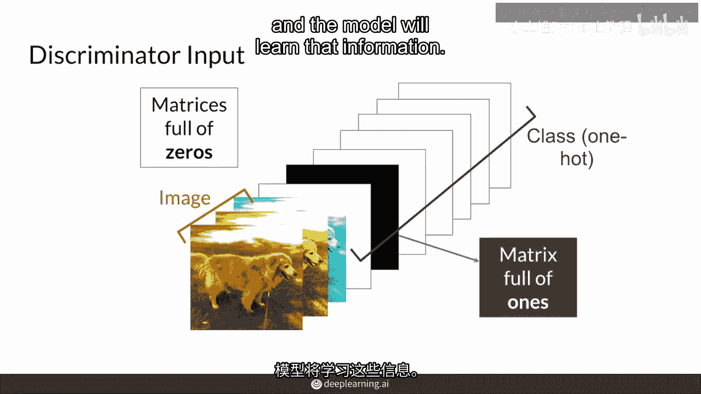

对于鉴别器，它通常是一个one hot向量与你的噪声向量连接，生成器，当GANs的期望输出是图像时，它是表示通道的one hot矩阵，类别向量的大小，以及类别的额外通道数量。

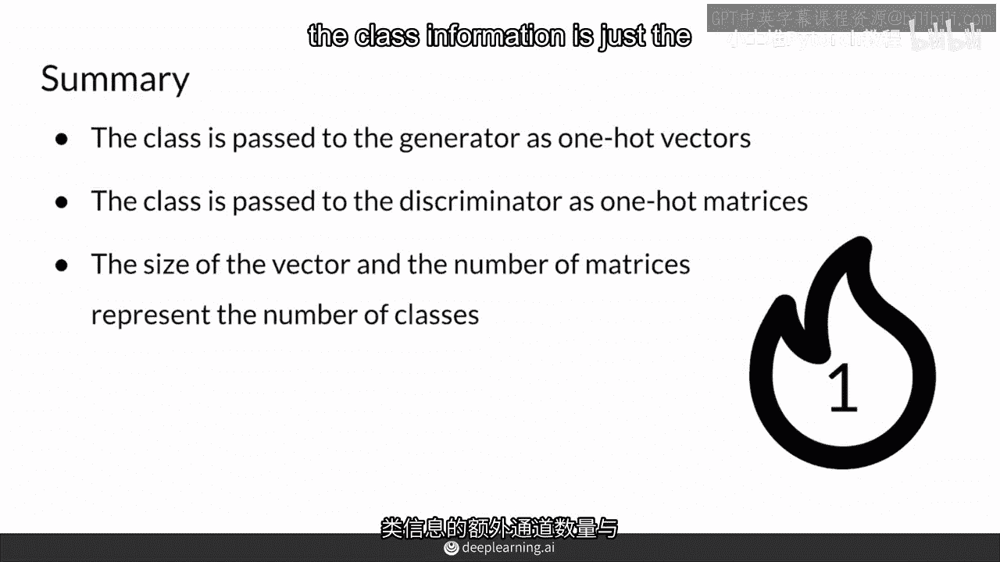