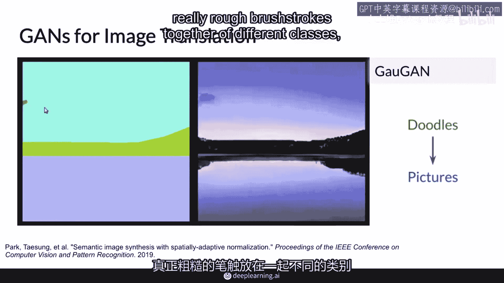

# P3：【2025版】3.真实生活中的GAN - 小土堆Pytorch教程 - BV1YeknYbENz

即使它们只存在于2014年，但GAN已经在多项任务中取得了惊人的表现。

如果你还没有看到过一些他们的结果。

那么你将有一个惊喜，那么在这个视频中，我将向你展示一些GAN的酷应用，比如生成逼真人类面孔和动画著名艺术作品。

然后你将看到一些大公司正在使用他们的一些令人惊叹的项目。

这条推文来自Ian Goodfellow，他被广泛认为是GAN的创造者。

并展示了GAN多年来改进的惊人可视化。

你可以看到GAN的进展，从2014年的黑白和不太像人类的面孔。

而且他们直到今天实际上更好，所以案例点进步自从那时只增加了，在2020年初。

Nvidia发布了GanDa，可以生成这些图像，这些图像分辨率极高，看起来像专业照片，并且它们有一个柔和的背景效果，所以很容易认为这些人是真实的，但他们实际上并不存在，令人惊讶。

GAN可以从它们接收到的训练数据中学习，所以它们不限于复制人类面孔，这里是同一个模型，但这次产生猫，如果你仔细看，你可以看到一些非常奇怪的图像，因为不是每个生成的示例都是完美的，在这种情况下。

这里确实有一些猫的样子，但我当然不知道那是什么。

并且这也是一个很酷的事情，你可以实际上观察带有文字的图像，因为如前所述，生成模型试图模仿你训练它们的数据分布，在这种情况下，训练数据是从网络上抓取的所有这些猫。

并且这包括许多带有 meme 文字的猫 meme，当然，有趣的是，这些生成的猫 meme 上的 meme 文字实际上并不构成单词，因为生成模型并不打算建模单词，而是建模视觉真实效果，话说回来。

一些这些实际上非常可爱和真实，就现在而言，GAN也可以进行图像转换，这意味着它们可以将一个域的图像转换为另一个域。

例如，它们可以将一匹马的图像转换为斑马的图像，反之亦然。

真正有趣的是，你不需要具体的斑马和马的例子，它们在做同样的事情，只需要将风格转移过来，GAN可以帮助你绘画，这个模型，可以将一幅风景画的草图变成照片级的真实。

所以你可以在左边看到笔触，这是一个人在将不同物体的粗糙笔触组合在一起。

比如云、山、湖。

然后GAN从这个非常粗糙的草图能够生成一个非常逼真的东西。

所以，如果一个人能够用很少的几笔和颜色做出粗糙的草图。

然后，GAN可以将它们再次转化为逼真的图片。

也可以拍摄静物肖像，例如，蒙娜丽莎，并用任何真实人脸的动作来动画化它。

所以他们甚至不必看起来像所说的蒙娜丽莎。

如果你想起了霍格沃茨说话的肖像，在某种程度上，你不是一个人。

GAN是魔法，GAN不会止步于2D图像，它们还可以生成3D物体，如椅子和桌子，这些可以应用于生成设计等领域，你可以为你的家创造酷家具，在医学中也有多种应用，你可以使用你的GAN来生成人工医疗数据。

甚至在X光中检测异常，你将会在这方面看到更多，在第三节课程中，但是展示出所有的酷炫应用可能需要几个小时。

多家知名公司也开始使用生成对抗网络用于各种应用，例如，Adobe正在考虑Photoshop的下一代，让新手艺术家达到专家水平，例如，用这些涂鸦，谷歌正在使用它们进行文本生成，但也用于图像。

IBM使用GANs进行数据增强，使用GAN生成合成示例，以增强分类器下游的数据集，例如，如果你没有足够的特定类别或特定类型的图像数据。

Snapchat和TikTok，将它们用于新的创意滤镜，你可能已经见过并使用过。

甚至迪士尼正在使用它们进行超分辨率，在专业化的末期，你将能够使用GANs进行你喜欢的任何应用。

好的，总之，你看到了GANs在过去几年中取得的快速进展。

在我向你展示了几个非常酷的应用之后，我提到了一些大公司如何使用生成对抗网络（GANs）。

实际上，GANs还有很多其他的用途。

