# P30：【2025版】30. Z空间中的向量代数.zh_en - 小土堆Pytorch教程 - BV1YeknYbENz

正如你在之前的视频中所看到的，可控生成是通过操纵噪声向量z来实现的，在这个视频中，这个噪声向量被输入到生成器中，我将向你展示这个过程背后的直觉。

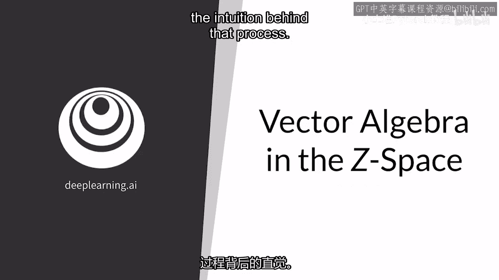

我将先回顾如何对两个GAN输出进行插值，你将学习如何操纵噪声向量，以便在输出中控制所需的特征。

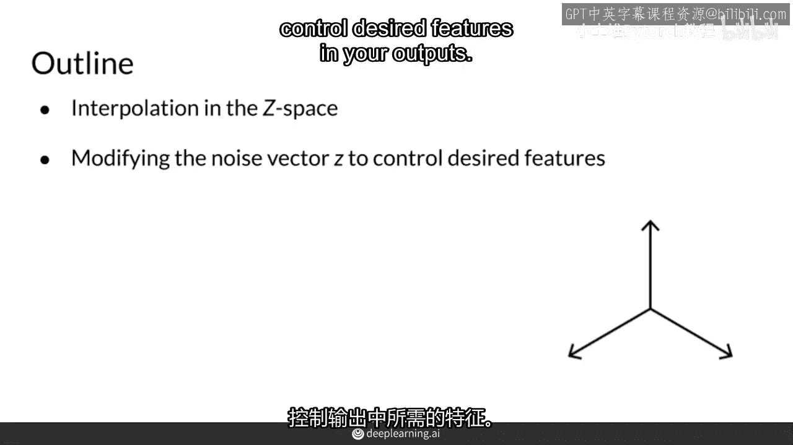

因此，可控生成和插值在某种程度上是相似的，插值。

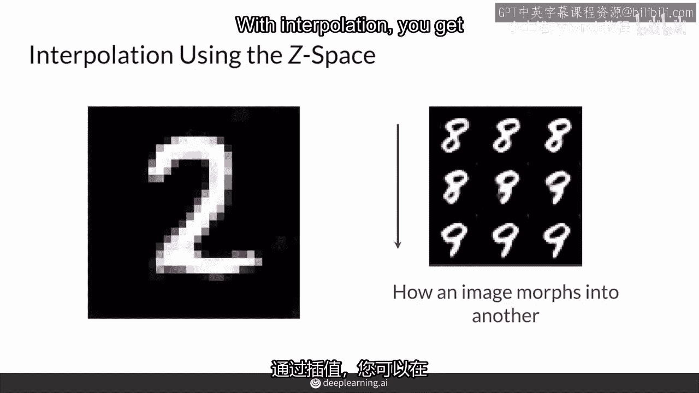

你将得到两个生成观察值之间的这些中间示例，因此，在实践中进行插值。

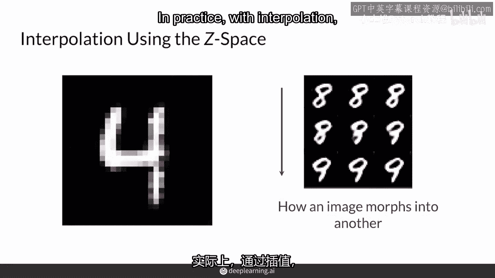

你可以看到一张图片如何变成另一张，就像这个GIF一样。

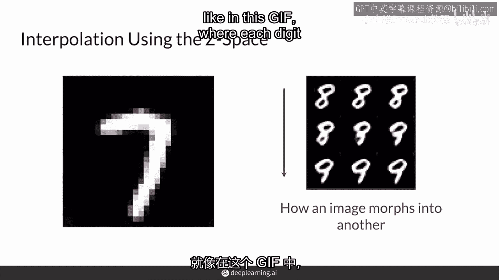

其中从0到9的数字依次变化，这真的很酷。

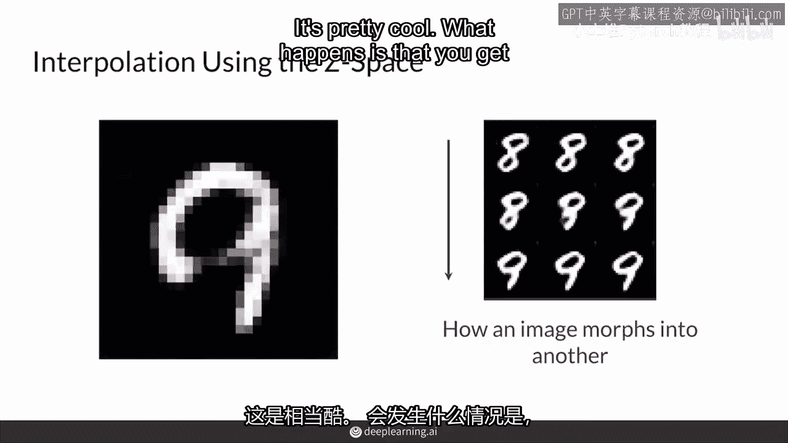

而且会发生的是，你会得到目标之间的中间例子，通过操纵来自Z空间的输入，这只是噪音向量的向量空间的名字，稍后会看到，这与可控生成背后的想法是一样的，所以这里很清楚，Z1和Z2是这个Z空间中的两个维度。

你现在看到的，所以作为示例，有一个噪声向量v1和一个噪声向量v2。

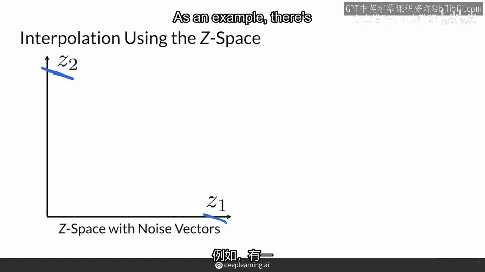

v1可以有一个z1的值为，假设是5，和一个z2的值为，假设是10，所以这是向量51，然后v2是一个较小的值，所以是4和2，所以它是一个二维向量，这就是z1和z2，它们只是在z空间中的维度，实际的向量。

v1和v2将代表在这个z空间中的具向量值，当将v1喂入生成器时，它将产生这里的图像，当将v2喂入生成器时，它将产生那里的图像，如果你想得到这两个图像之间的中间值。

你可以在两个输入向量v1和v2之间进行插值。

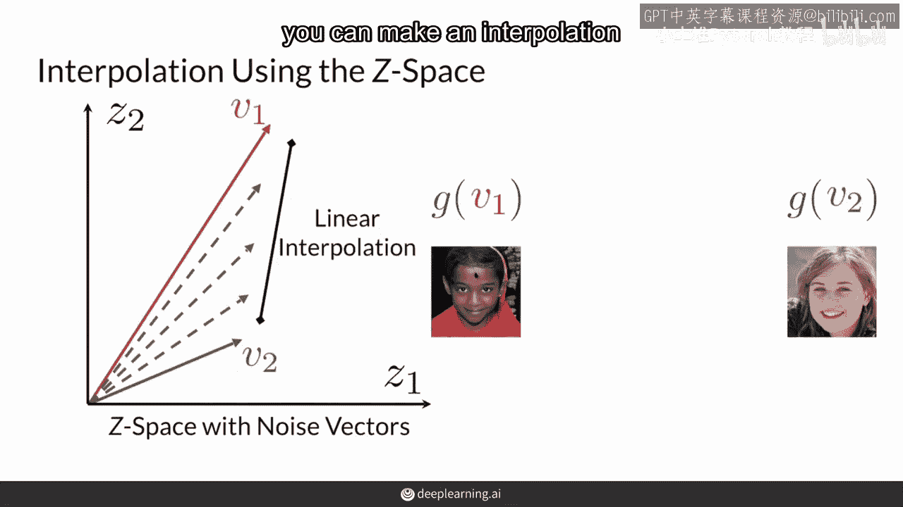

在z空间中，实际上。

这种插值通常是线性插值，当然，还有其他方法来插值这些两个向量，然后你可以取所有这些中间向量，看看他们从生成器中生成什么。

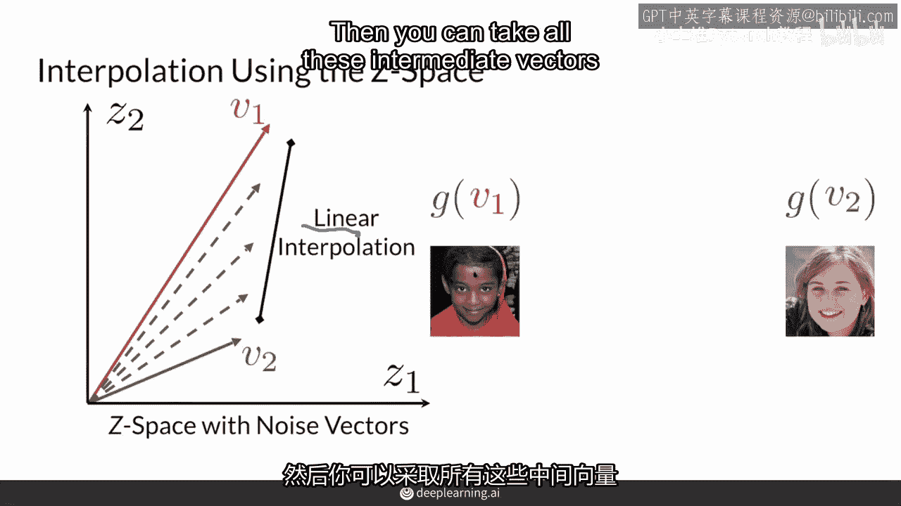

所以生成器取这个向量并产生那张图片，这个向量产生那张图片，这个向量产生那张图片，从而得到这两个图片之间的梯度。

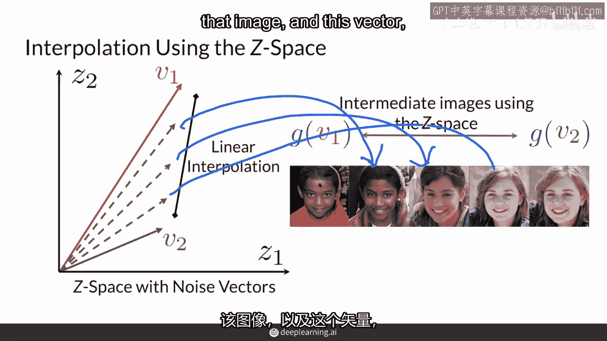

所以可控生成也使用z空间的变化，并利用修改噪声向量如何反映在生成器的输出上，例如。

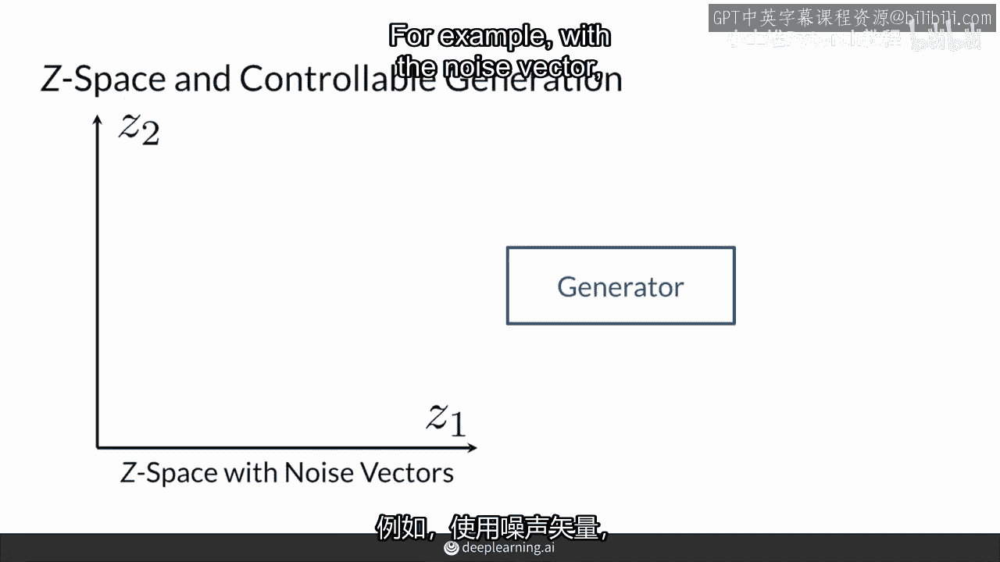

用一个噪声向量可以得到一个红头发的女人的图片，再用另一个噪声向量。

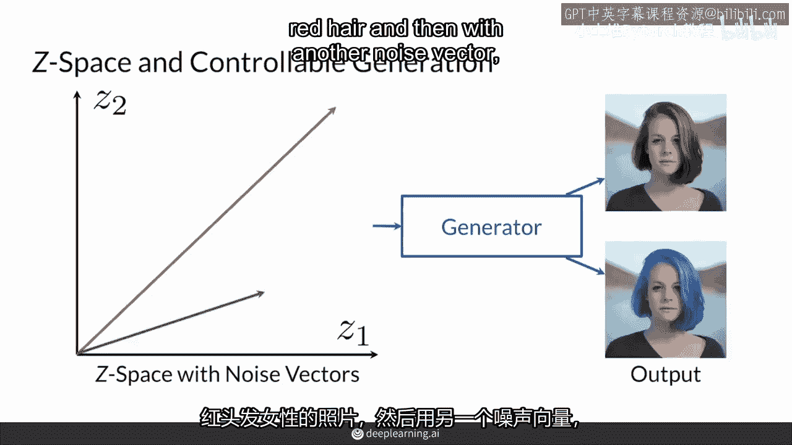

你得到了一张同一位女士的照片，但头发是蓝色的，这两组噪声向量之间的差异只是方向，在这个方向上，你需要在z空间中移动来修改生成的图像中的头发颜色，在可控生成中，你的目标是为你关心的不同特征找到这些方向。

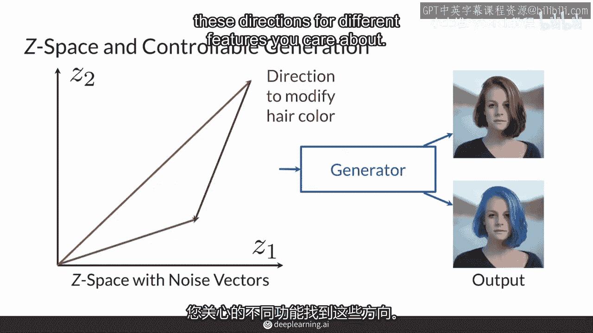

例如，修改头发颜色，但不必担心找到那个确切的方向，我将在接下来的讲座中向你展示，有了这个已知的方向，我们称这个方向为d在你的z空间中，你现在可以控制特征在你的GAN输出上。

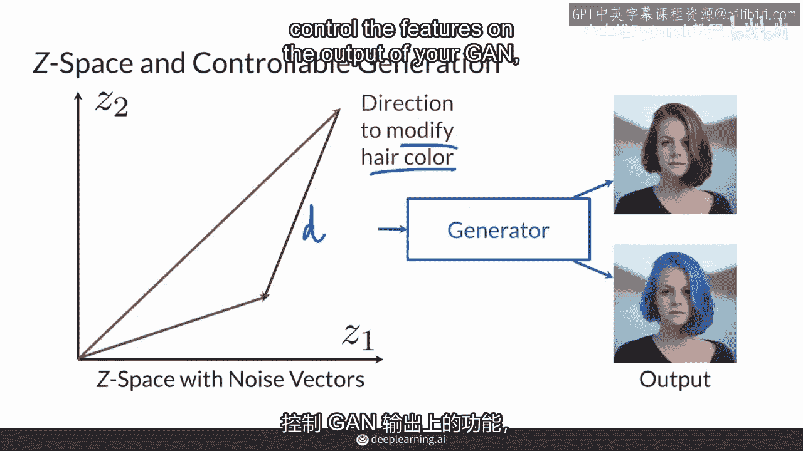

这真的很令人兴奋，这意味着，如果你生成一张红发男士的图像，使用相同的生成器。

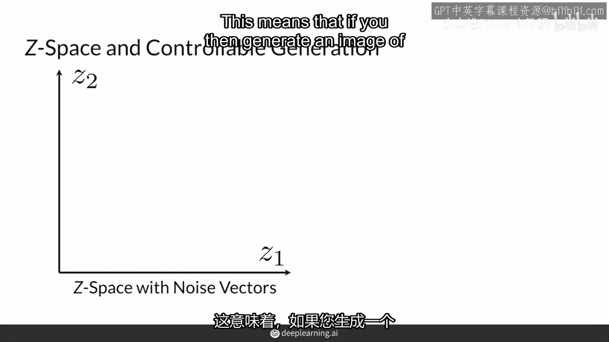

G，使用这里的输入噪声向量，V1，你可以通过向噪声向量添加你之前找到的方向导向d，来修改这张图像中男士的头发颜色，创建这个新的噪声向量这里v1。

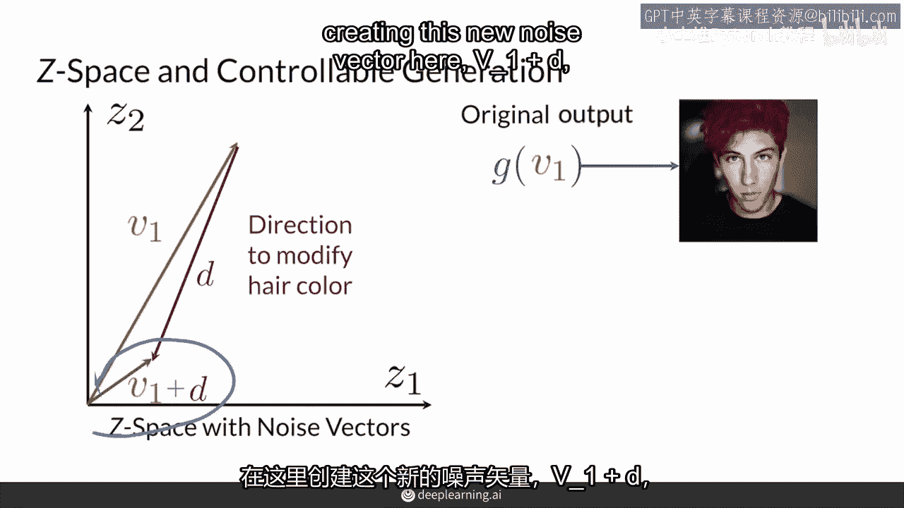

加d，将这个输入到你的生成器中，得到一张他头发是蓝色的图像。

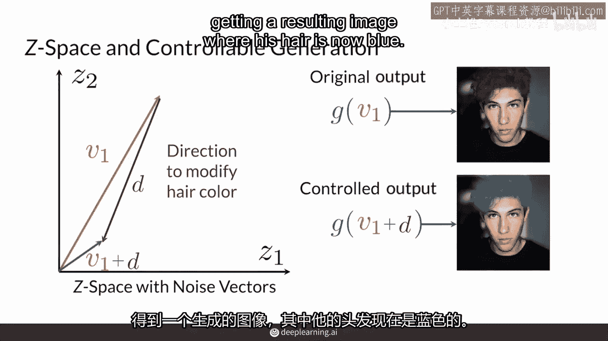

总之，在可控生成中，你需要在z空间中找到与GAN输出上所需特征变化相关的方向，使用已知方向，可控生成通过在z空间中移动噪声向量来实现，接下来，你将了解可控生成相关的一些挑战。

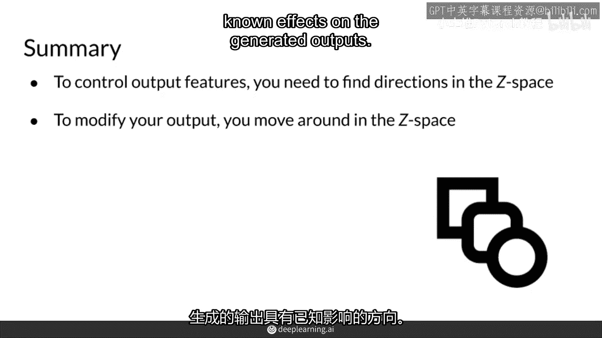