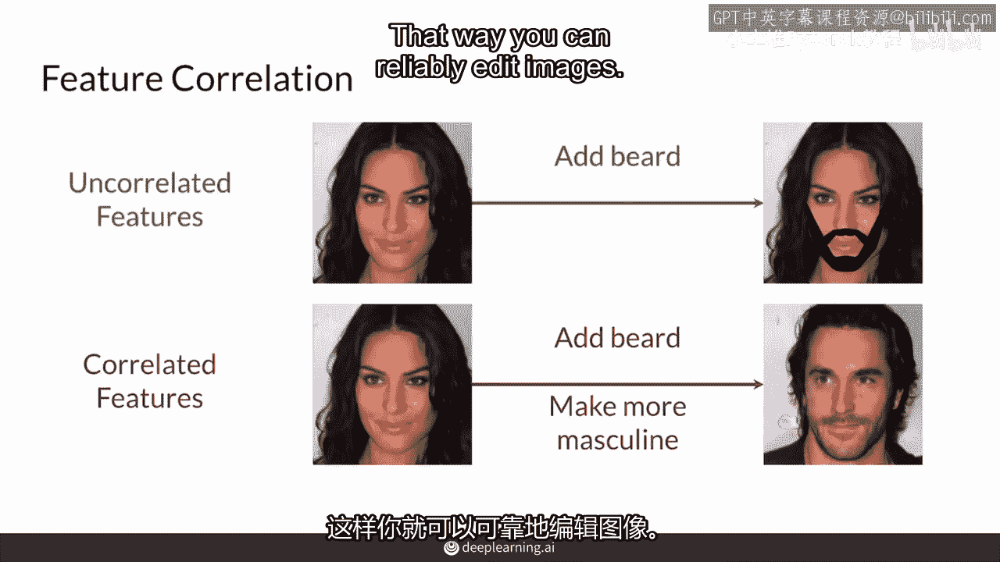

# P31：【2025版】31. 可控生成的挑战.zh_en - 小土堆Pytorch教程 - BV1YeknYbENz

可控生成使得你可以决定特征和输出的特性，例如发色或发长。

生成的图像是人物，然而可控生成有一些挑战，这个视频会讲到，你将了解输出空间和Z空间的特征相关性以及纠缠。

当数据集中的不同特征相关性高时。

训练你的生成对抗网络时，控制特定特征变得困难，因为它们与相关特征一起变化。

例如，你希望控制单一特征，例如你生成的GAN中一个人的胡须量，如果数据集中的特征没有高相关性，你可以从这个女人的图片中添加一些胡须，然而训练数据集中的特征，如胡须的存在和面部的男性化程度可能高度相关。

如果你想给这个女人的图片添加一些胡须。

你可能需要改变输出中的多个特征。

但这可能不是你想要的，因为你希望控制某人的特征。

这样你可以可靠地编辑图片，另一个可控生成面临的挑战是Z空间的纠缠。

当Z空间纠缠时。

不同方向上的移动会同时影响输出中的多个特征。

即使这些特征在训练数据集中可能没有相关性，这仅仅是噪声空间的学习方式非常纠缠，所以在纠缠的Z空间中，如果你控制，如果一个输出中有眼镜的人，例如，你也会改变她的头发或胡须，或者当你试图改变她的年龄时。

你也会改变她的眼睛和头发颜色，这不太理想，其他无关特征也会这样，这意味着噪声向量的一些组件的变化。

会同时改变输出中的多个特征，这使得控制输出变得困难，甚至不可能，这是很常见的问题，当Z空间的维度不够时，相对于你想要控制的输出特征的数量，因为那样实际上不能一一对应，这也是训练生成模型时的一般问题。

总结一下。

可控生成面临几个挑战，如果你的数据集中的特征相关性高，如果你没有以某种方式考虑这一点。

当你尝试控制你的GAN的输出时，你会同时改变多个特征，即使你想要控制的特征之间没有高相关性。

在训练数据集中，也会出现这种情况，可控生成也很困难，如果你的z空间纠缠在一起，如果z空间的维度不够大，这种情况会经常发生。

