# P41：【2025版】41. Frchet inception距离(FID).zh_en - 小土堆Pytorch教程 - BV1YeknYbENz

在这个视频中，你将了解弗雷切特引入距离，或fid，衡量真实图像和生成图像特征距离的最流行指标。

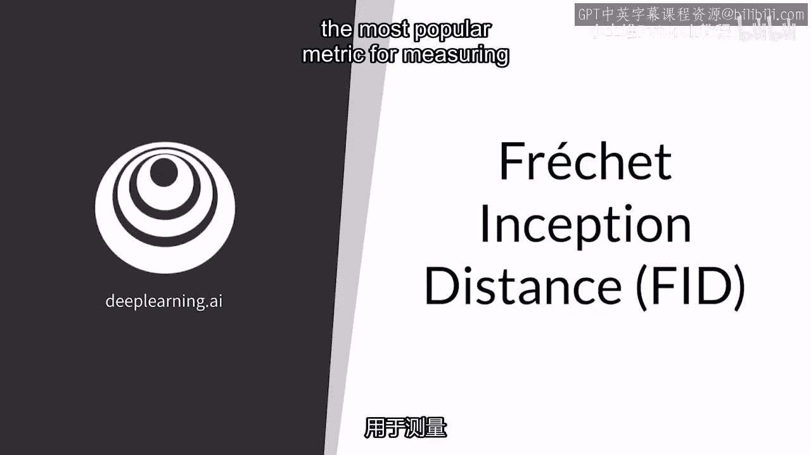

首先，你将了解弗雷切特距离，然后，你将看到如何将其应用于真实和伪造嵌入，作为弗雷切特引入距离或fito，看他们有多远，最后，你将了解fi的几种局限性，评估在生成模型研究中是一个开放的领域。

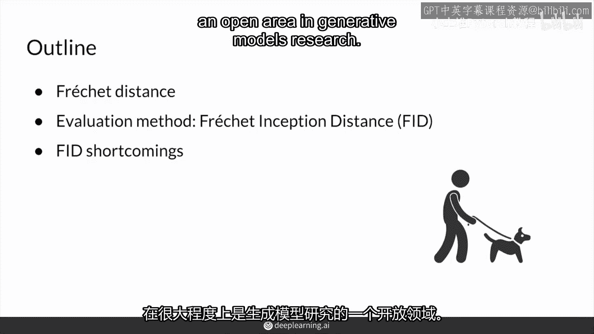

首先了解距离，以数学家莫里斯·弗雷切特命名，是一种用于测量曲线之间距离的距离度量，也可以扩展到比较分布，狗行者是常用于说明弗雷切特距离的经典例子，狗在一条曲线上，行者在另一条曲线上，所以这里狗在蓝色上。

这里行者在橙色上，它们可以以自己的速度前进，但它们都不能后退，请记住这一点，为了计算弗雷切特距离，你需要找出从开始到结束牵引狗所需的最小牵引绳长度，这就是你可以给你的狗的最短牵引绳长度。

而不会在行走过程中需要更多的牵引绳，这就是弗雷切特距离在两条曲线之间的直觉。

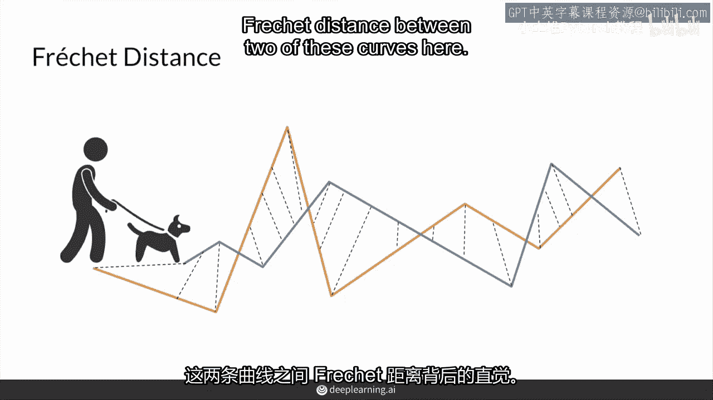

你也可以计算弗雷切特距离在分布之间，对于许多分布，弗雷切特距离在两个分布之间的分析解已经得到解决，例如，有一个简单的公式可以计算两个一维正态分布之间的傅里叶距离，你需要看到这两个分布的均值，这里是μ。

以及它们的标准差，这里是σ，所以有一个分布是x，另一个是y，你可以想象x和y，x是狗行者，y是狗，均值给你一个中心感，而标准差给你一个分布的感觉，在表示法中，你可以计算均值和标准差的差。

并以某种方式表示L2距离，考虑到这一点。

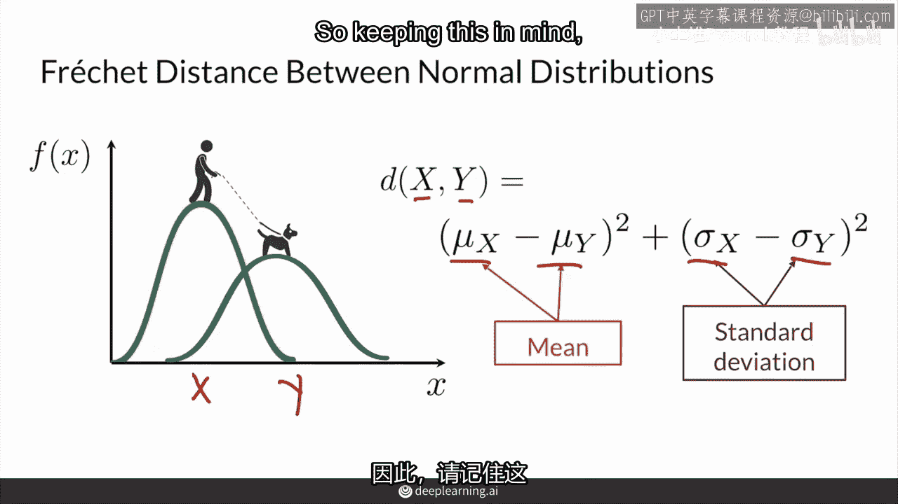

让我们快速转向多维正态分布，多维正态分布将正态分布的概念推广到更高维，这些额外的维度允许你建模更复杂的分布，而不仅仅是一个单参数化的单均值和单标准差，这是因为你的真实数据的特征可能不会那么好。

简单地用一个单一的正态分布来描述，可能会有不同区域的峰值，模式的特征，比如狗的黑鼻子或伸出的舌头，多维分布是表示这一点的，而多维正态分布具有特别良好的特性，因此经常被使用，到目前为止。

你所看到的分布是单变量的，这意味着它是单维的，所以，可视化多元正态分布的最简单方法是，在每个维度这里和这里都有一个单变量正态分布，并且这些一起，构建这个看起来像深色圆圈的东西，这在三维中实际上指向你。

颜色越深，值越高，表示的高度越高，因此，这个结果分布说明了每个维度如何基于其他维度的变化，他们彼此有多大影响，在这里，双方都同等程度地贡献于这个中心，而且他们在这样做的过程中实际上不会相互影响。

所以你会有一个非常漂亮的圆形中心正态分布峰向你显现。

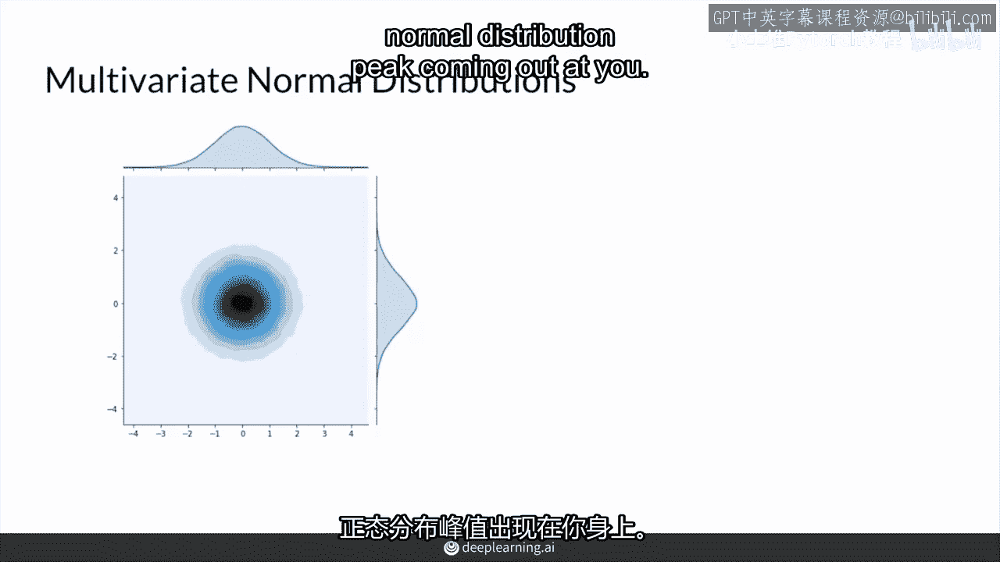

但我们可以让维度相互影响，意味着影响彼此，这意味着一个维度中的特定值，会导致另一个维度中的值变得更有可能或不太可能，因此，结果分布可能看起来更加偏斜，请注意，这里正态分布看起来仍然相同。

尽管它们以不同的方式相互影响，所以为了表达你想要使用协方差矩阵。

这概括了方差的概念，你之前见过的方差是sigma平方，其中sigma单独表示标准差，sigma平方表示方差，请记住，方差量化了正态分布的散布，因此，协方差这个名字起得恰到好处。

因为它测量了两个维度之间的方差，所以在这个协方差矩阵的对角线上，你看到的是维度内的方差，所以，例如，维度一与维度一在这里，维度二与维度二，维度一在这里，维度二在那里，但在对角线外，你看到这些零值。

这个零值测量维度一到维度二，这个测量维度二到维度一，所以这说的是，这里告诉我们什么，方差在一个维度内，它就是一，如果这些值是2，例如，那么你将看到一个更宽的圆圈，分布更广，峰值更低。

因为它现在将分布得更广，任何单元格中的零表示这些维度之间的方差为零，这个协方差矩阵在所有对角线元素中都有零，这意味着两个维度是独立的，再次，如果这些值不同，比如2，甚至如果是0。5，那么这座山峰将更高。

分布将更窄，但是这两个维度仍然独立，所以从技术上讲，你不需要这些协方差值，假设它们是独立的，以便全面描述这种分布的分布。

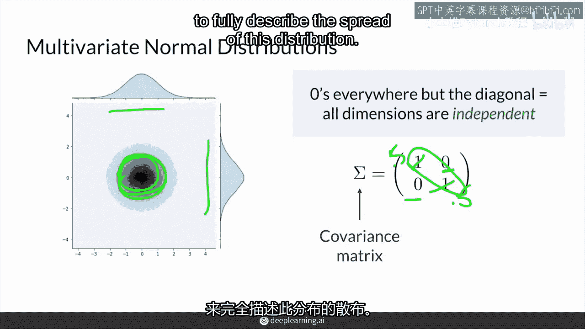

然而，协方差矩阵的非对角线元素不为零表明两个维度之间存在协方差，负值表示负相关，你可以认为这是相关性的方向，所以这是沿对角线y = -x的方向，因此，协方差矩阵中的正值实际上意味着相反的情况。

像这样沿着y等于x向外对你趋势，一个值为0。5的参数会使分布更加集中在中心，在协方差的幅度上减小，然而，负五点五会在相反的方向上产生相同的效果，好的，所以，现在你对多元正态分布有一些直觉了。

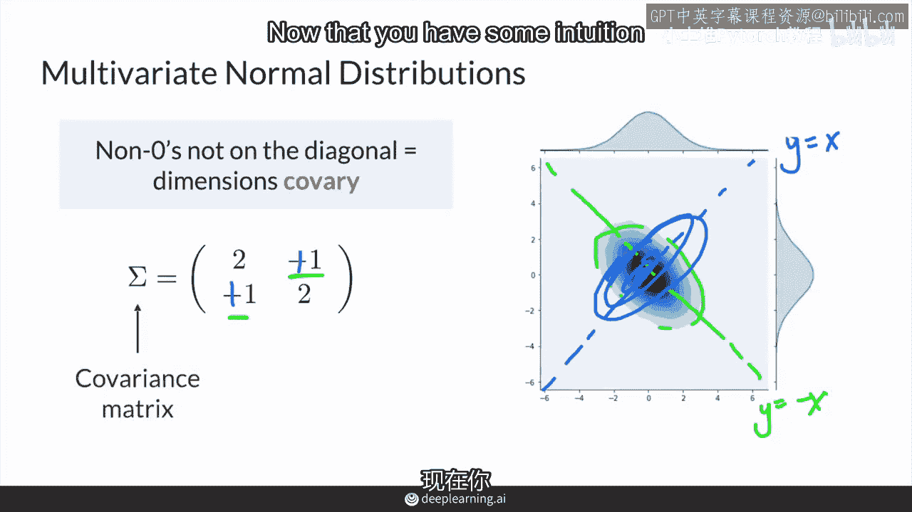

让我们回忆一下在单变量正态分布中计算自由距离的公式，那是在单维空间中，所以它是他们均值之间的差异和标准差平方的差异之间的区别，实际上你可以将这个推广到多元变量的情况，这意味着比较两个多元正态分布。

就是你刚刚看到的那些，这是通过使用其协方差矩阵大写的sigma来实现的，所以这两个公式有很多相似之处，可以泛化，乍一看这可能看起来很吓人，让我们分解一下，首先，两个公式都包括均值之间的距离的平方。

多元的只取向量的模，因为它不再是单个值，这就是这里的范数，因此，在单一维度下，你可以仍然这样写它，但它会精确地评估为这里显示的。

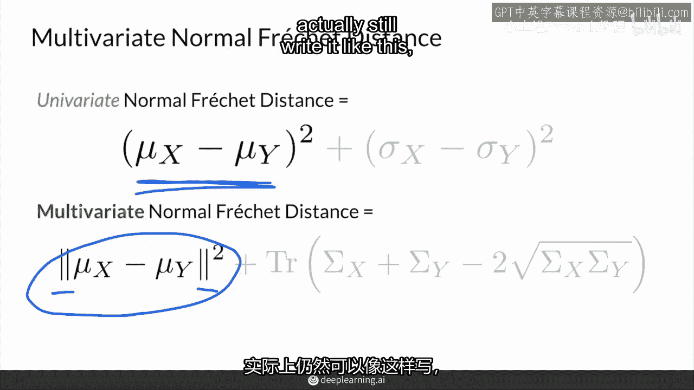

你也可以展开标准差之间的差值的公式，在单变量情况下，所以如果你展开这里的平方。

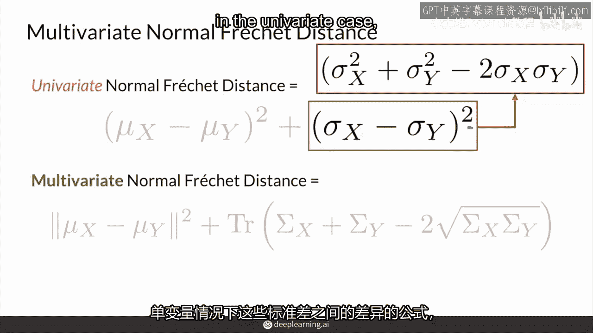

你会得到这个项，你可以看到，最终你会得到与多元公式非常相似的东西，其中tr指的是矩阵的迹，这仅仅是其对角线元素的和，所以例如，负二一负二二就是你之前看到的迹，将只关注这些元素并求和，所以这个迹是四。

请注意对角元素的和，比如说sigma x实际上只是方差的和，我，E，每个维度与自己的协方差，而不是与其他维度的协方差，另一个维度的协方差在这里并没有真正被考虑。

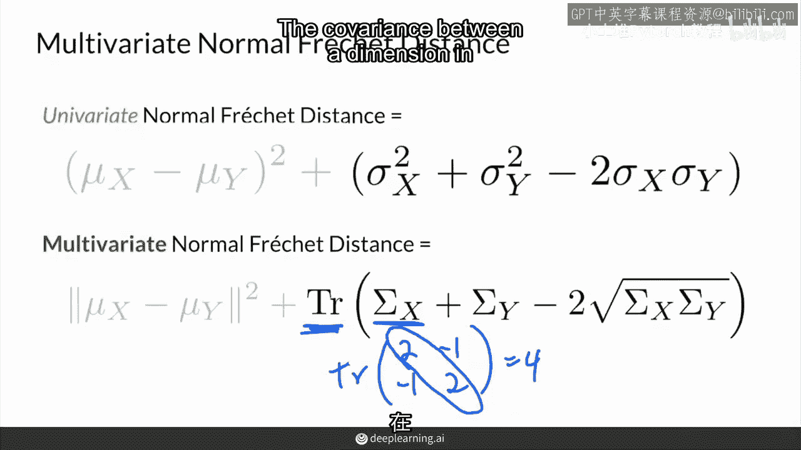

当这些家伙被用于迹的时候，在单变量情况下一切都看起来是平方的。

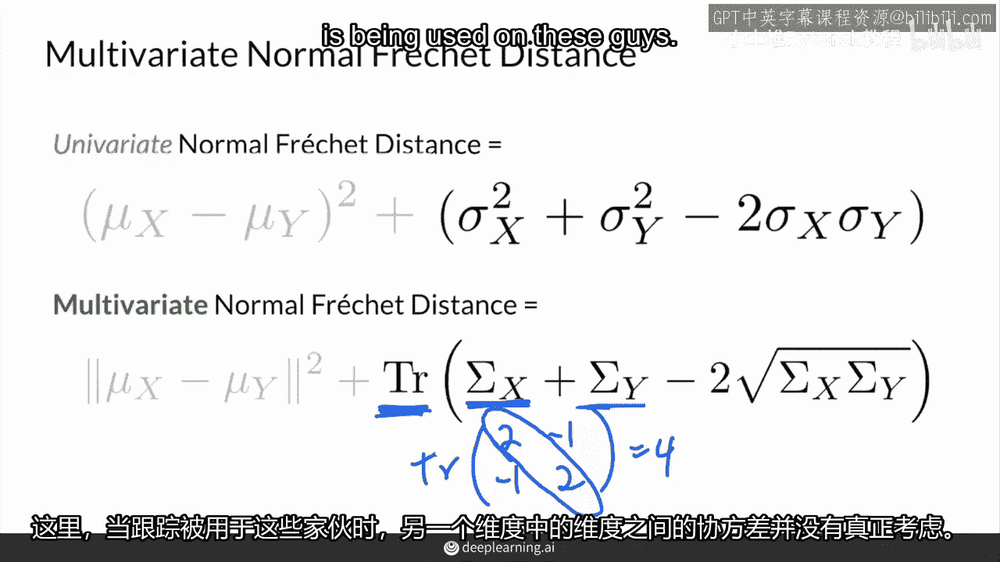

正确，这里有一个平方。

这与这个平方根相比是平方的，这是因为sigma实际上是标准差，而sigma平方是方差，而下面的大sigma是协方差，这与sigma平方，即方差的一般化是一致的，所以它们匹配，最后为了更加清晰。

下面的矩阵平方根对这个矩阵取平方根，而不是每个单独的元素，这个多变量正态ouchet inception distance，你需要从这里带走的东西，它非常相似，并且它很大程度上就是单变量情况的一般化。

通过看那些分布的中心差异和均值，以及它们的分布的散布，方差或协方差在这个情况下。

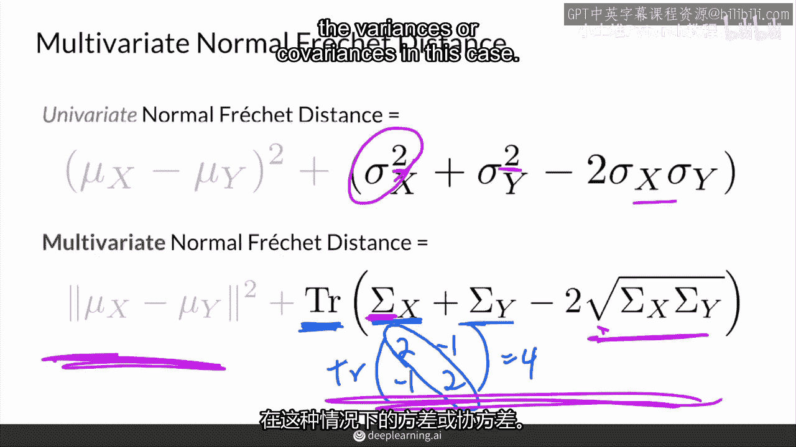

那么这有什么用处，多变量正态分布可以近似建模你的图像特征的多种模式，从你的真实图像特征嵌入，你可以构建一个多变量正态分布，这是基于许多，例如五万个真实嵌入向量。

看它们是如何分布的并且适合一个多变量正态分布，这意味着在所有这些例子中找到一个均值和协方差矩阵。

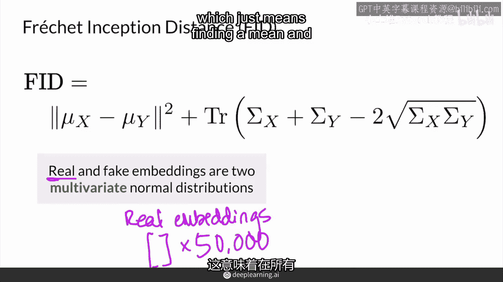

所以现在你做同样的事情对你的假，你得到他们的特征嵌入。

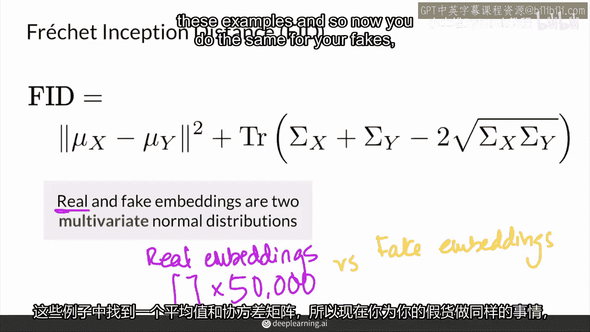

你适合一个多变量正态分布，然后你可以比较这两个多变量正态分布，真实的我将其称为x，假的我将其称为y，这与这里相对应，mu x是真实嵌入的均值，mu y是假嵌入的均值。

sigma x是真实嵌入的协方差矩阵，而sigma y是假嵌入的协方差矩阵。

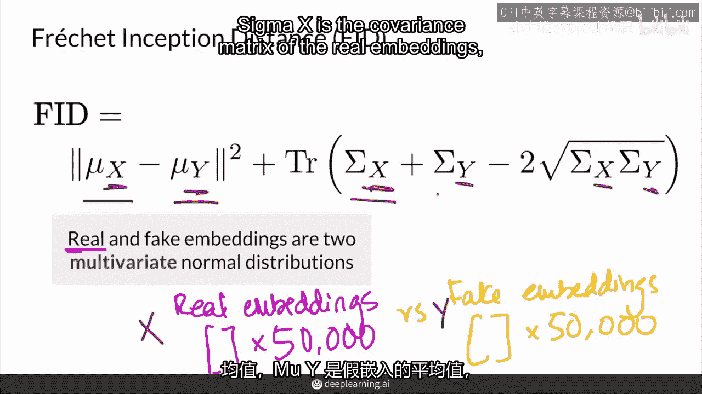

然后这些在这里被使用，现在真实的和假的之间。

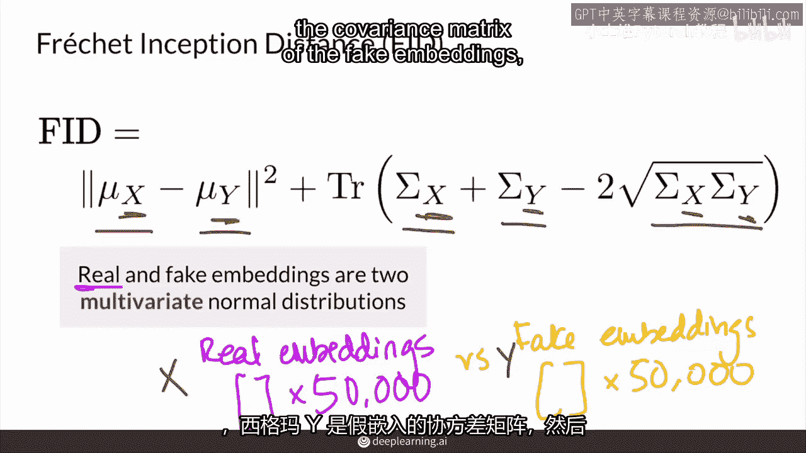

你可以首先对这些图像应用嵌入，适合每个一个多变量正态分布，并且然后在它们上计算fid分数，这就是称为phrase，Inception，距离或fid，并且它目前是最广泛使用的gan评估指标你理解了。

Phrase ate，距离和生成指的是使用Inception v3网络来提取真实和伪造的嵌入特征，那些真实和伪造的嵌入，所以，退一步来看，它正在查看真实的多元正态分布的统计信息。

以及伪造多元正态分布的统计信息，统计信息只是均值和协方差矩阵，并计算，这些统计信息之间的距离，这些统计信息越接近。

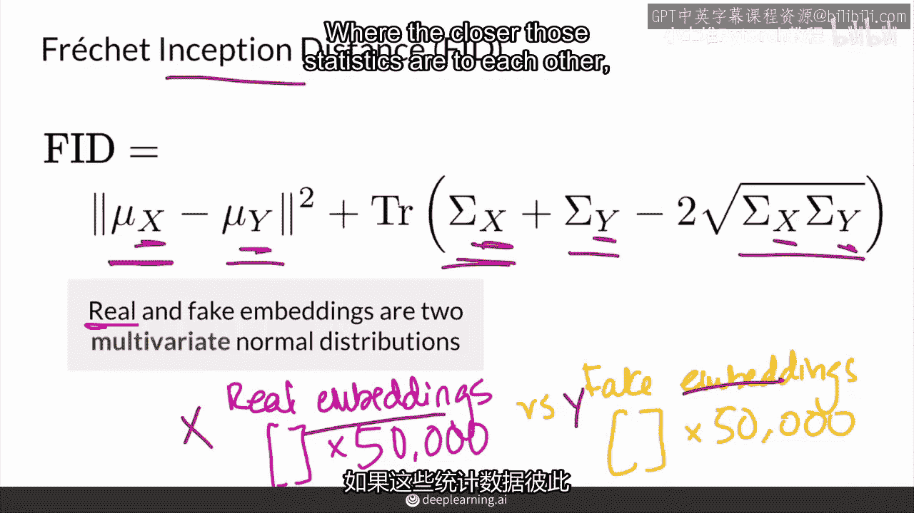

伪造的嵌入模型就越接近真实的嵌入，现在，Fido假设嵌入遵循多元正态分布。

假设嵌入遵循多元正态分布，不是因为它总是完美准确。

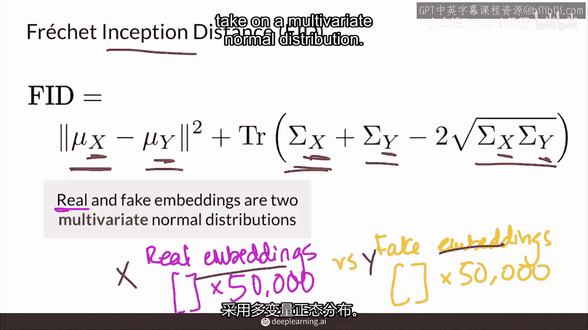

主要是因为它是近似的且容易计算。

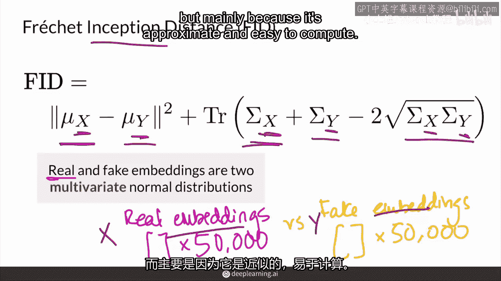

所以当所有数据被计算后，你会得到一个数字，代表真实和虚假分布的差异，如果虚假的接近真实的，意味着，你的模式生成的虚假输出接近真实，这个差异越小，这个数字越小。

实际上意味着 reels 和 fix 的特征越相似，这意味着fid越低越好，这可能会让人感到困惑，因为别的评估指标倾向于认为更高的值更好，但现在fid越低越好，因为它表示假视频与真实视频之间的距离。

不幸的是，fid的值没有直观的范围，如果值在0到1之间该有多好，0。5表示一半是假视频，但这并不适用于fid，但通常你越接近0越好，因为当你的假货为零时，它们与真品无法区分，所以更好。

基于他们从许多嵌入中计算出的那些统计数据，为了理解这个计算的规模，记住通常有二十四个，在特征向量或嵌入中，有八个维度来自 inception 网络，通常在大量样本中进行计算。

至少说五万条真实视频和五万条假视频，因此，使用大量的样本可以减少噪声和选择偏差，在比较之间，说，只有几个样本，此外。

ImageNet预训练的Inception V3模型并不总是得到您想要的特征。

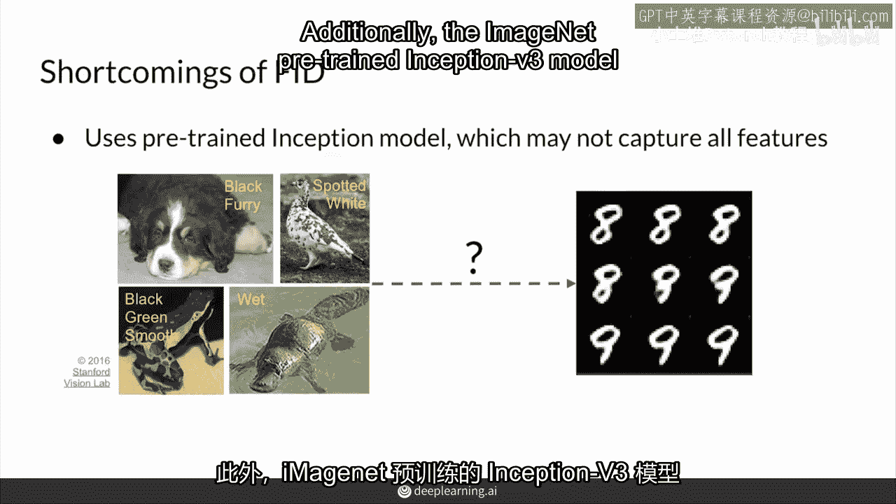

或者它们并不总是对您的生成器的任务有意义，例如，如果您的GAN在MNIST上训练以生成手写数字。

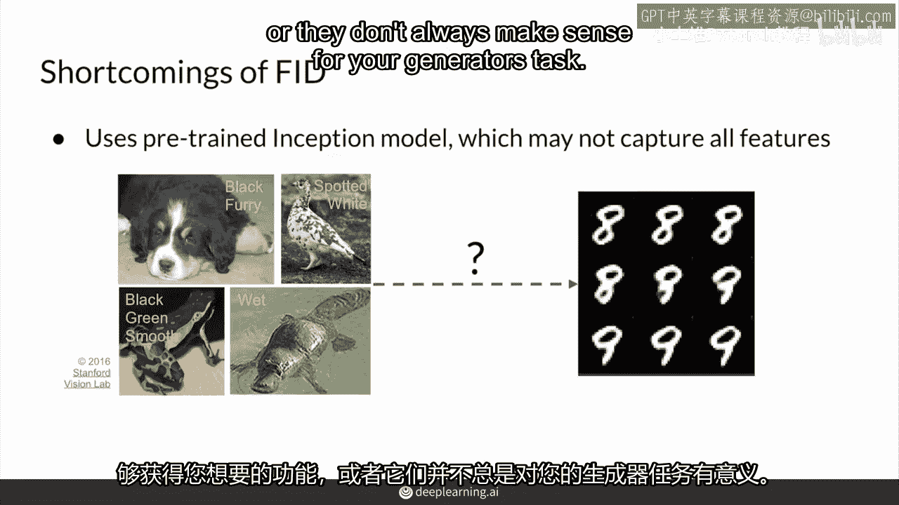

Inception V3模型可能无法检测出有意义的特征。

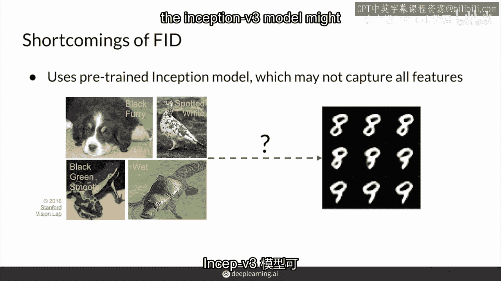

因为ImageNet由自然照片组成，如狗和人，而且说实话，也有很多狗，如前所述。

样本量需要大到足以覆盖足够的样本，否则你的分数会偏倚，这意味着你的分数会根据你使用的样本数量而变化，这不是很好，因为你的样本数量并没有改变。

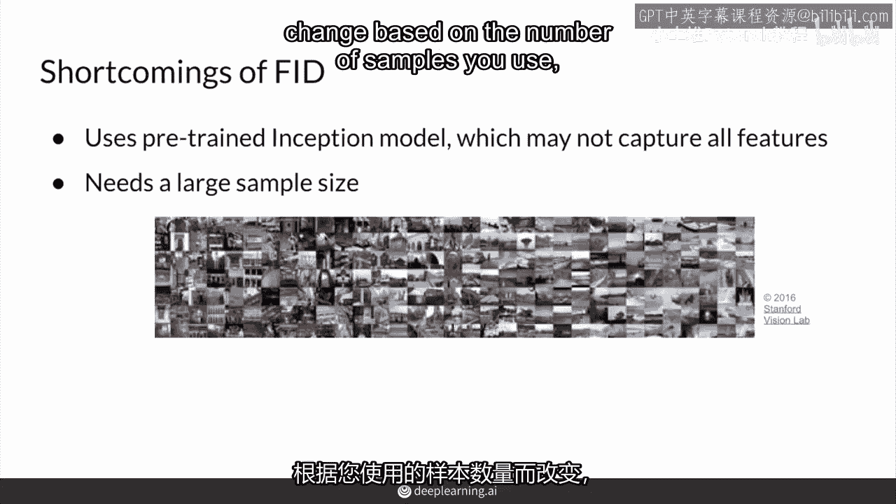

真实的样本也没有改变，所以样本数量不应该影响分数，但是，看。

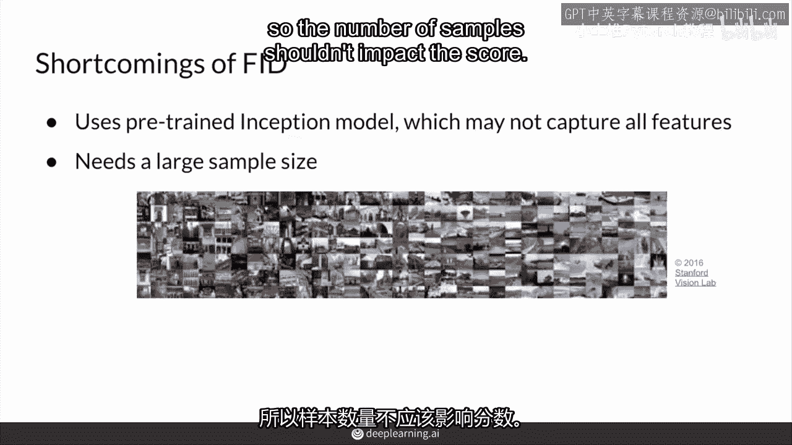

fid通常在大样本量下较低，你使用的样本越多，你的gan看起来越好，即使它实际上并没有更好，因为你使用的是相同的模型进行比较，但这不是一个好的属性，作为一个指标。

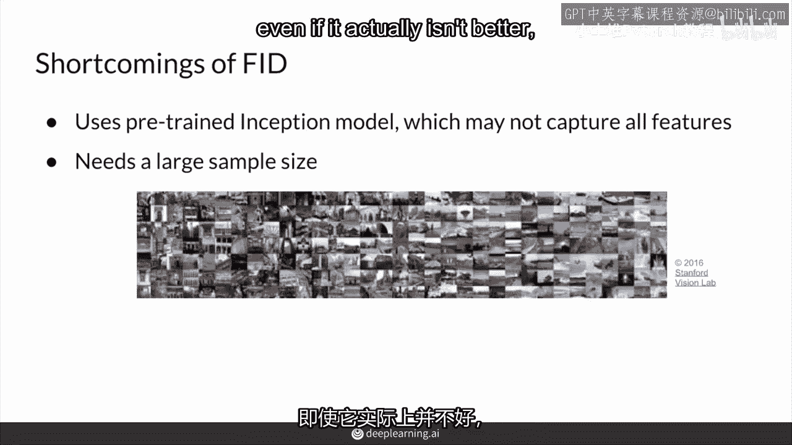

但是有很多研究试图克服这一点，创建一个无偏的。

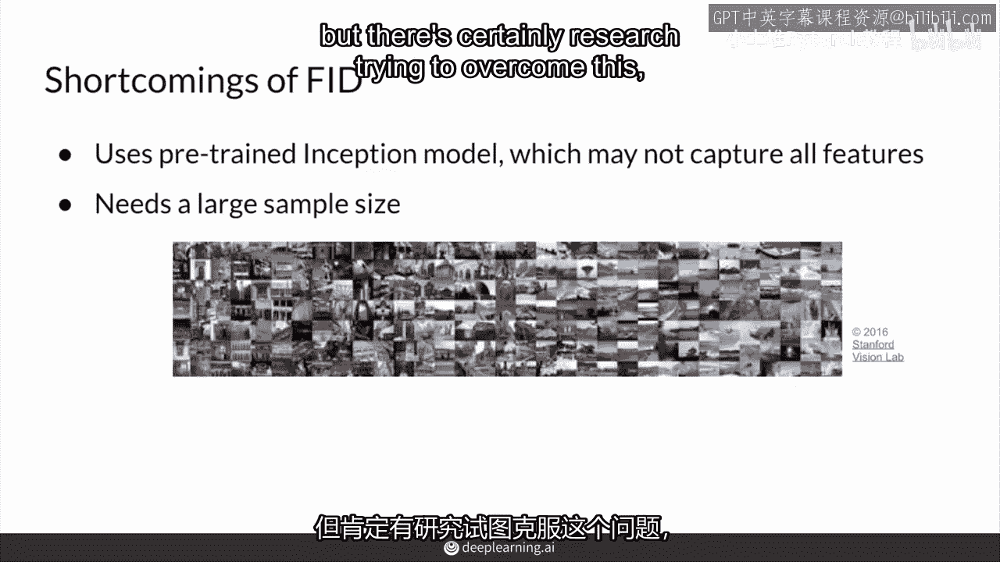

例如，但这种方法并不广泛使用，大样本量也会导致fid运行缓慢，最后。

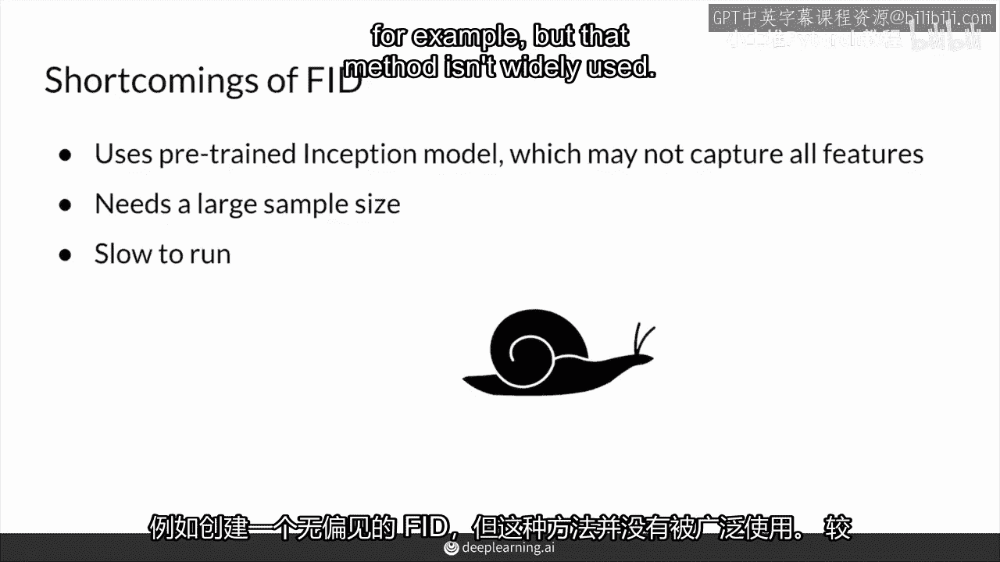

那些分布上收集的统计量数量有限，只有均值和协方差，这是分布的前两个矩或分布的属性，分布的其他矩也有很多，比如偏度和峰度，你可能很熟悉，记住，均值和协方差并不能涵盖分布的所有方面。

而且你的分布很可能并不完全符合多元正态分布，我们主要得到的只是均值和协方差，因为我们假设分布符合多元正态分布，但你的样本分布很可能并不完全符合多元正态分布，但这个假设是为了使比较中统计量的计算更加容易。

所以这些缺点不幸的是，意味着你还需要定性地检查你的样本，来找到你想要的模型并调试你的模式，现有的评估指标并不是最好的进步指标，尽管如此，fid仍然是评估gans的最流行的方法之一，因为它易于实现和使用。

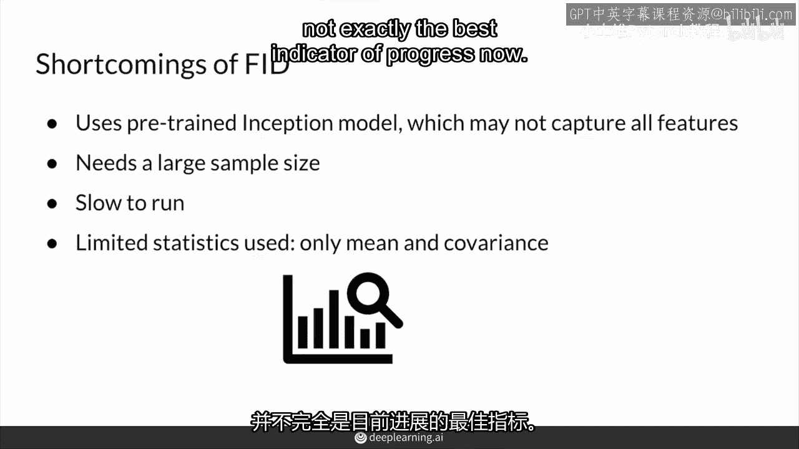

好了，那是一个详尽的视频。

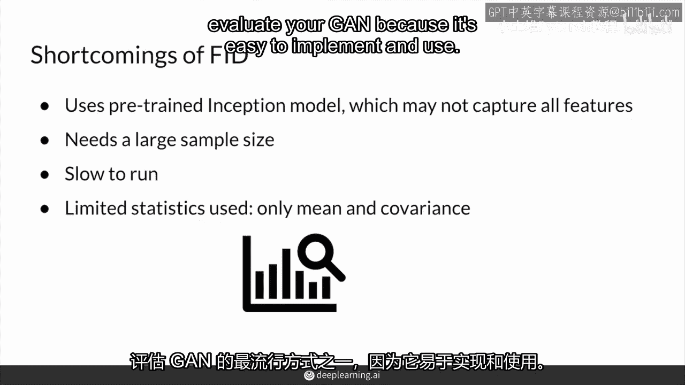

总结来说，你学会了i如何计算真实和假嵌入之间的差异，通过使用free chet di，fid有几个缺点，使得它，所以你仍然需要照顾你的模式并检查它的样本。

而不是仅仅比较训练期间保存的模型检查点的fid分数。

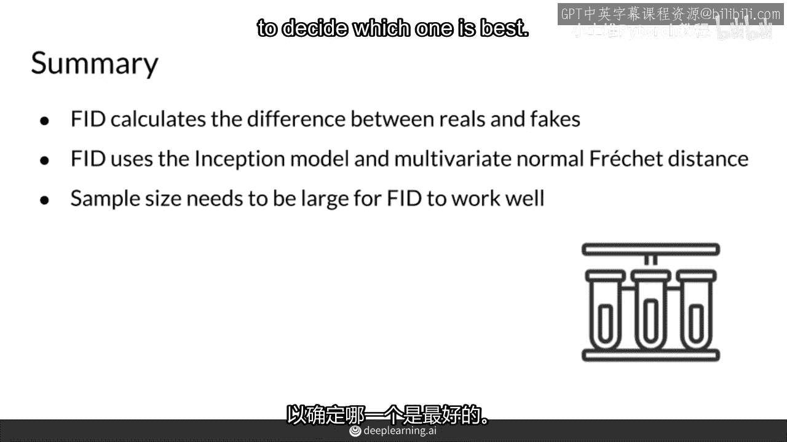