# P44：【2025版】44. 精确率和召回率.zh_en - 小土堆Pytorch教程 - BV1YeknYbENz

在本周的材料最后部分，你将学习到一个可以用于GAN的评价概念。

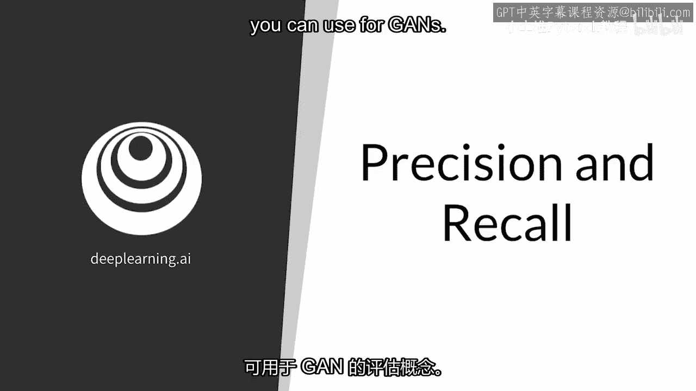

具体来说，你将学习在GAN评价上下文中的精确率和召回率，尽管这适用于所有生成模型，你将获得一些关于它们如何与保真度和多样性相关的直觉。

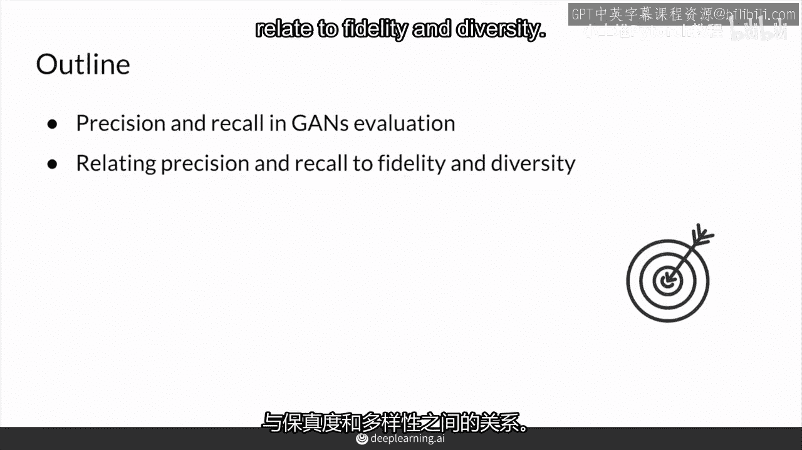

因此，最近出现了一些额外的评价指标，其中一些使用了精确率和召回率的概念，我发现这特别值得注意和有趣，召回和分类器，这是生成模型（如GAN）的一种酷炫扩展，想象一个实数的空间，这里的真实分布p。

p代表概率分布，R代表实数，在这里的红色区域，Pg是生成器可以生成的所有假分布，所以对于GAN来说最好的情况就是Pg完全重叠，Pr的每一方面，没有维恩图业务或同心圆，所以你甚至不想成为pr的一个子集。

你想要完全成为pr所以你的红色生成分布，与你的真实分布完全一样，所以你可能知道在这个重要的交集区域，并且精确率和召回率都会考虑这个交集区域。

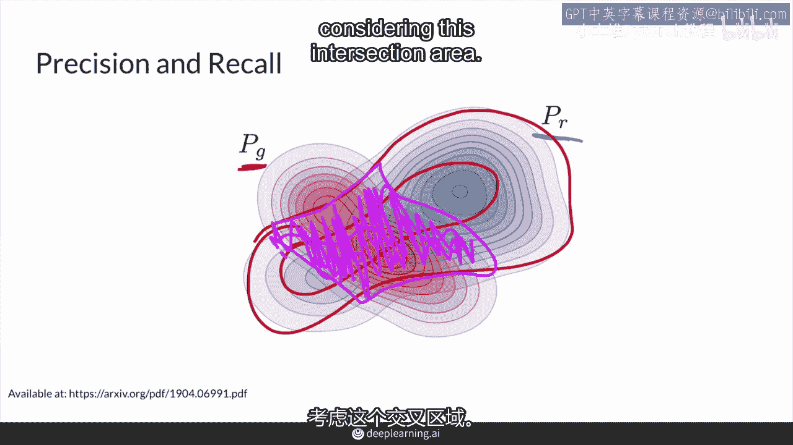

所以首先精确率关注在虚线内的点，而这些点都是生成的样本，而填充的点是生成的样本与真实分布重叠，蓝色的点和未填充的点是生成的样本，与真实分布不重叠，精确度衡量这个交集区域，具体来说。

假例子与视频重叠的比例除以整个虚线区域。

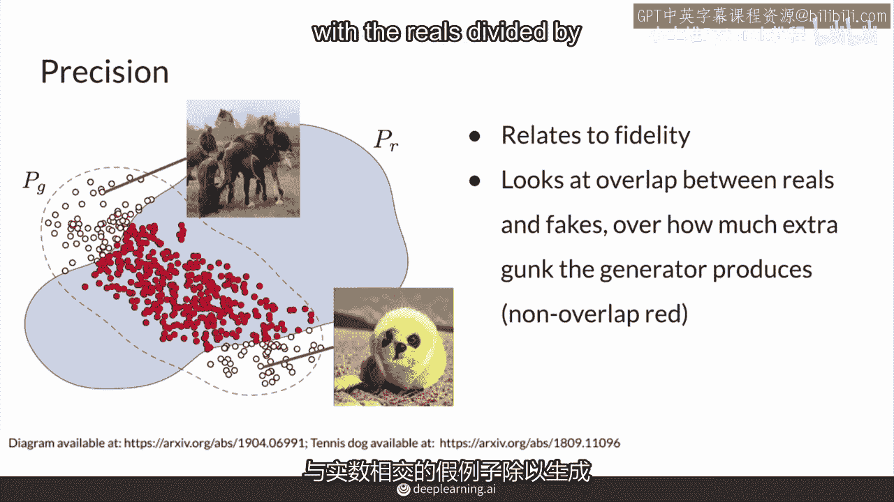

所有生成器可以生成的所有可能事物的区域。

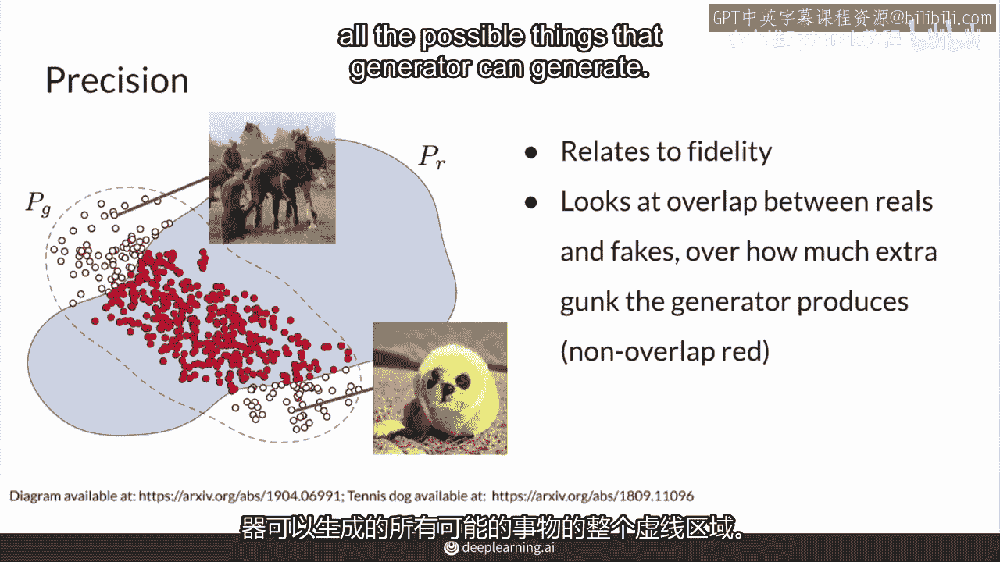

所以直观上，这意味着生成的图像看起来非常真实的重叠部分，因为它与真实空间重叠，除以整个空间，这不仅包括真实的东西，也包括一些看起来非常假的样本。

比如这个网球狗，或者我甚至不确定那是什么，那是一种马类的东西，所以完全是一堆垃圾，所以你不想要这些额外的垃圾，所以你这里有越多的东西，你的精度就越差，因为你的精度是这些重叠点除以所有假象。

所以你的精度本质上是真实看起来的假象除以所有假象，而你希望你的分母尽可能接近，那个重叠，所以完美的精度意味着你所生成的一切都会看起来真实，但这并不意味着你需要覆盖整个真实事物，你可以在这里成为一个子集。

精确度与真实性有关，因为存在一个额外的假东西模型。

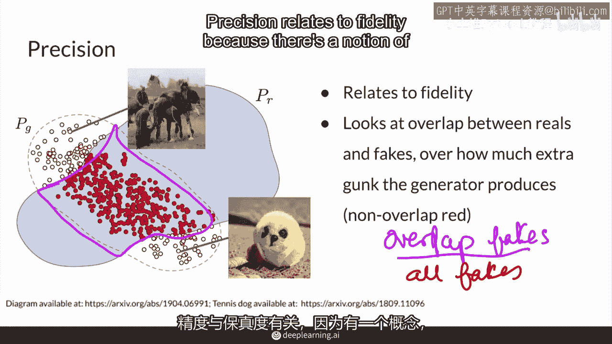

但它是多余的，你的精度越高，你生成的样本质量就越高，而截断技巧可以帮助提高精度，减少你的奇怪东西，但它也可能损害召回，因为它可能会将生成的部分缩小到很小，关于召回的话题。

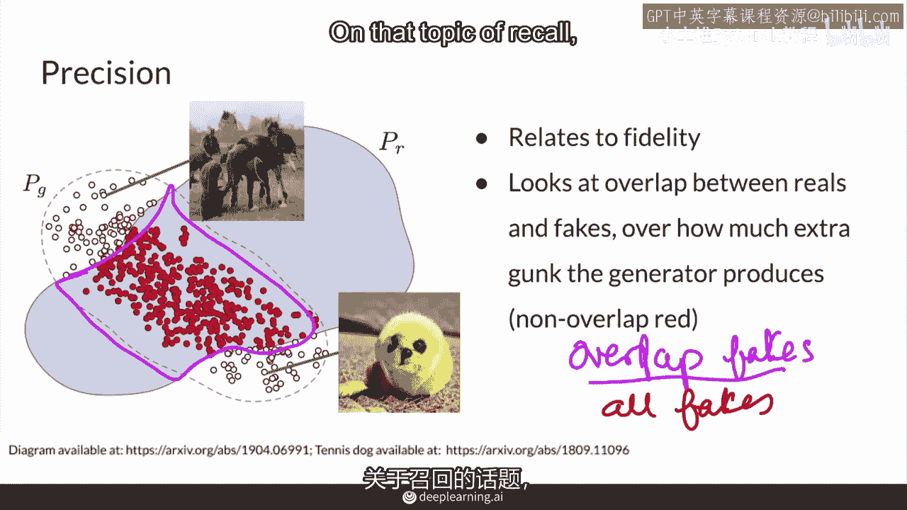

另一方面，是重叠部分占所有真实样本的比例，所以本质上是精度的反映，包括生成器无法建模的东西，这些点在这里，是真实样本。

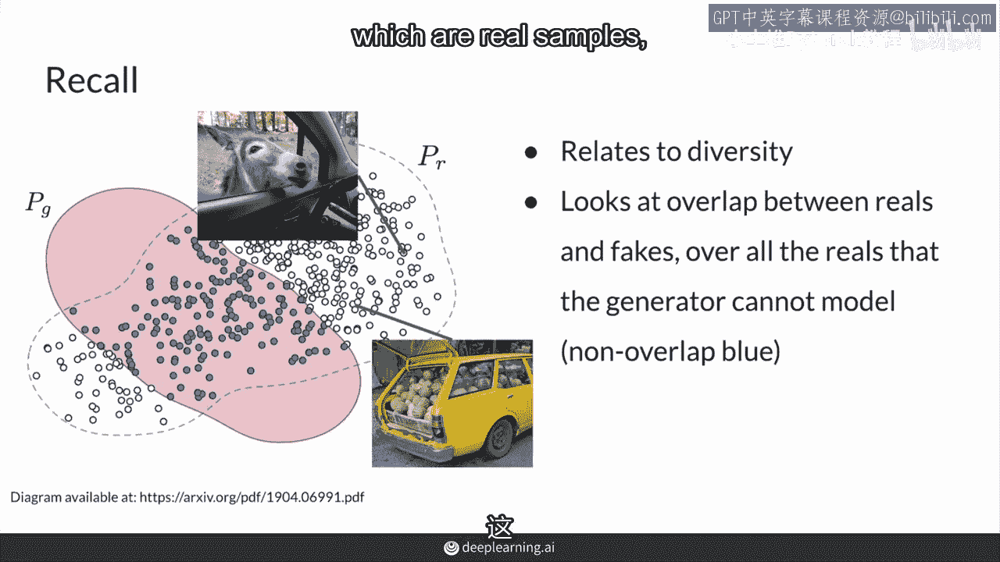

但生成器可能无法建模它们，它们看起来像非常奇怪的真实样本。

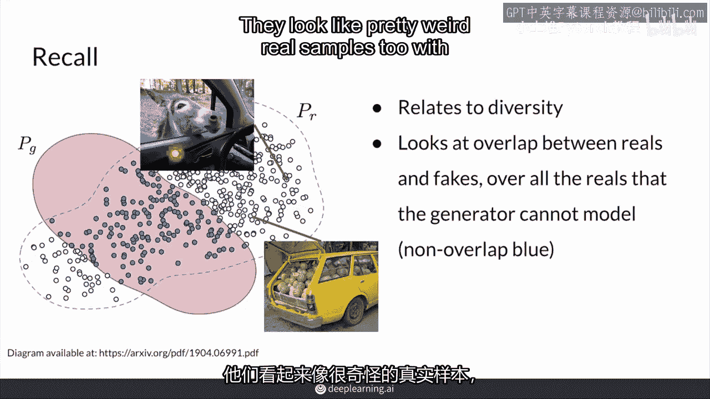

也，像这个看着的驴，和这个装满了西瓜的车，所以它基本上是一个衡量生成器能否建模所有真实样本的指标，并且忽略了我们之前所看到的所有额外垃圾，而这些额外垃圾在这里不计入召回的衡量中，召回与多样性有关。

你可以看到生成器能否建模真实样本的所有变化，并且与这里的精度进行比较，是真实样本的重叠部分占所有真实样本的比例。

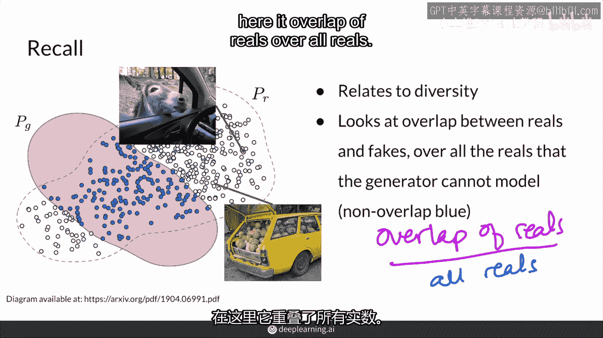

所以召回试图了解生成器能否建模，所有可能的真实图像，并且我看到的模型通常在召回方面表现良好，在某个噪声向量的值中，它们实际上可以生成数据集中的所有图像，并且可能更多，并且整个真实的分布。

所有可能的狗或面孔，或者你想要建模的东西，至少是在你的真实数据集中，但是通常这些模型，尤其是当它们很大时，会产生很多额外的垃圾参数，因为它们没有从判别器中得到很多反馈，因为模型中有太多参数。

所以不可避免地会产生一些垃圾，因为它已经能够建模所有真实样本，并且不需要削减。

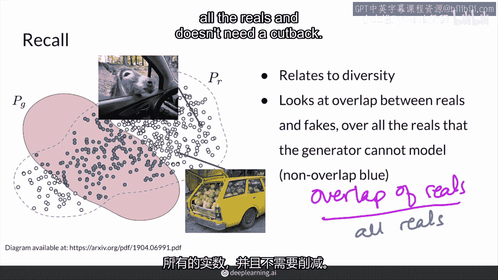

所以p(g)看起来更像这个，是所有真实样本的超集，因此，最先进的模型在精度方面通常不如召回，这就是截断技巧在下游应用中为什么有用，以去除所有额外的垃圾，也就是所有在虚线外的东西，然后总结一下。

你现在了解了生成模型中的精确率和召回率。

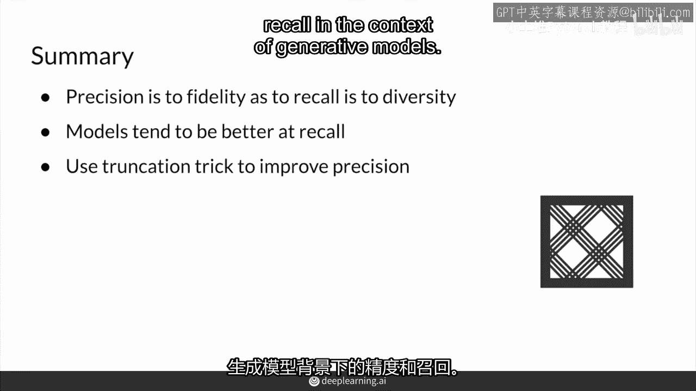

你现在可以关联精确率与真实性和召回率与多样性，在一定程度上。

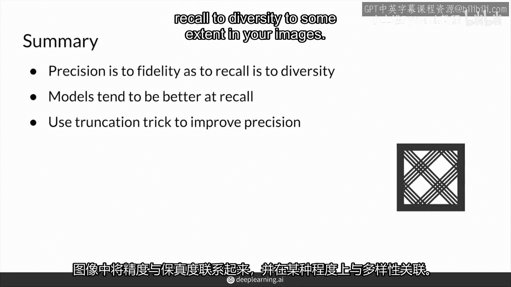

在你的图像中，模型仍然倾向于在召回或建模真实图像的分布方面表现更好，因为我们现在的模型参数数量巨大，但你可以在你的下游应用中使用截断技巧，以提高其精确率，去除那些无用的东西。

你现在已经完成了本周课程的所有材料，准备好进行编码任务，做得好，去享受吧，找出你的最佳检查点。

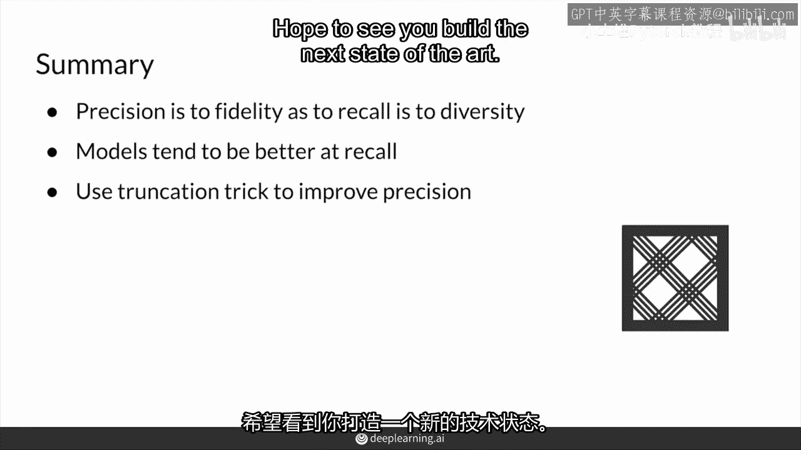