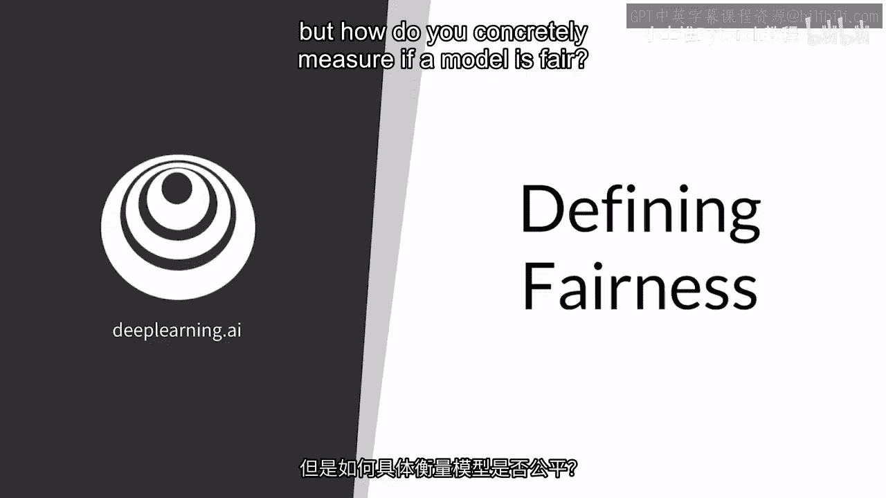
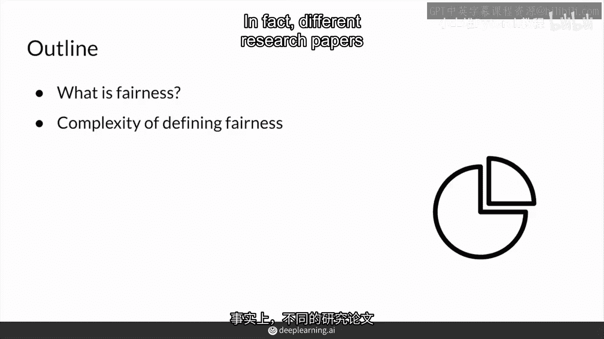
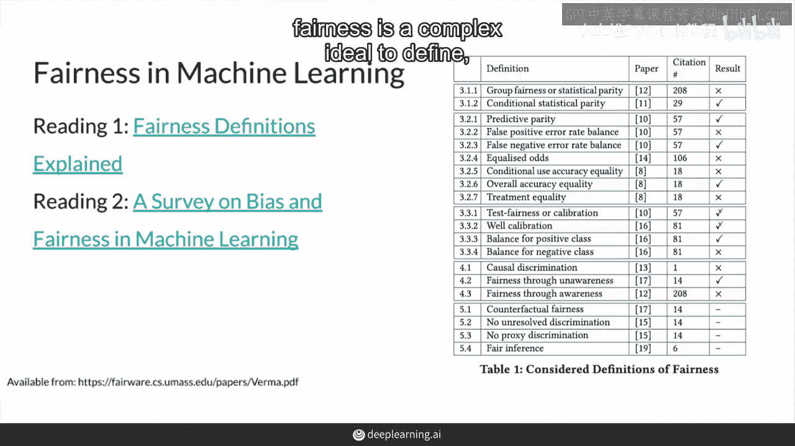
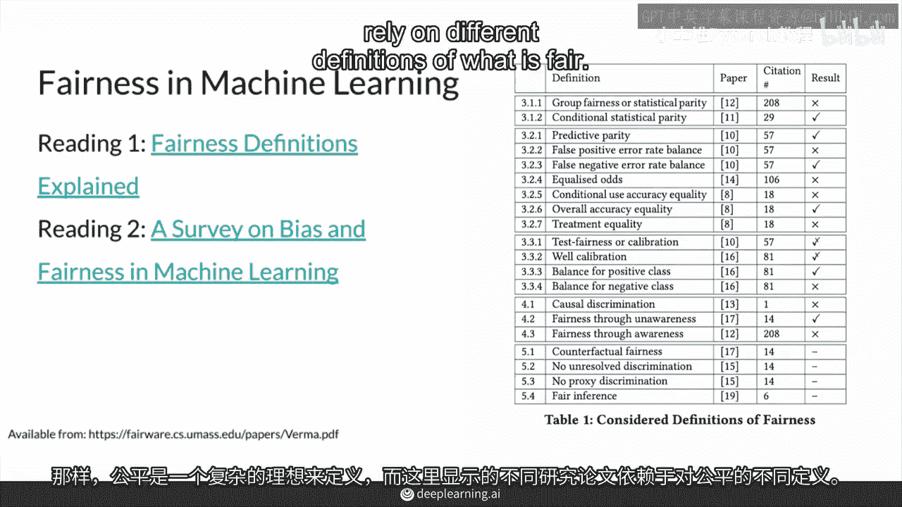
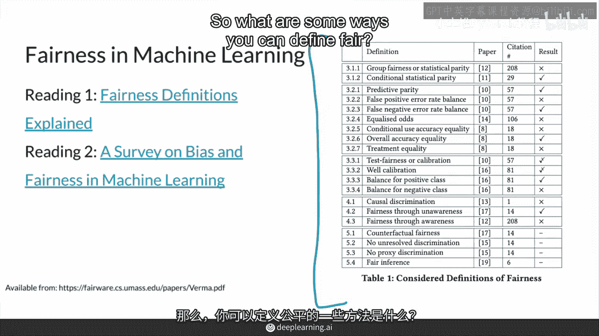
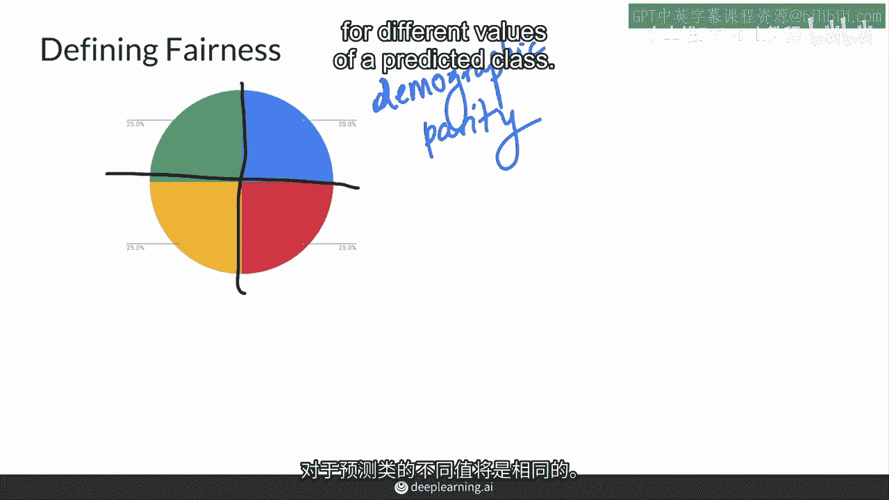
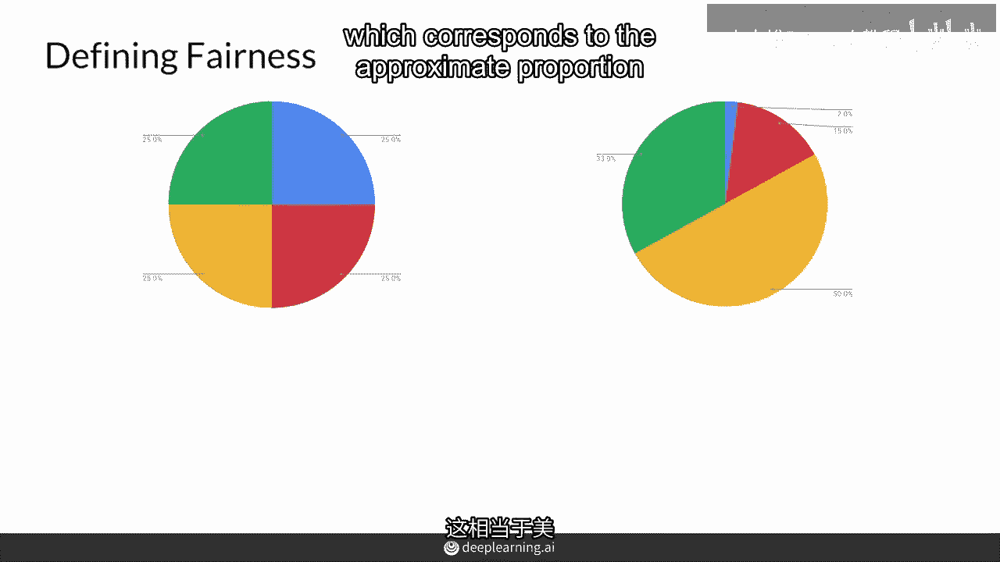
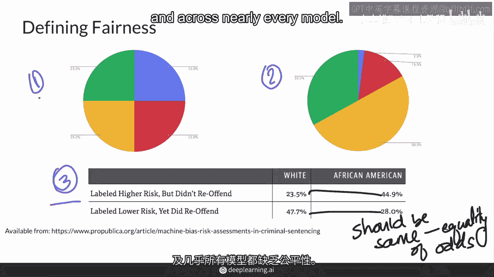
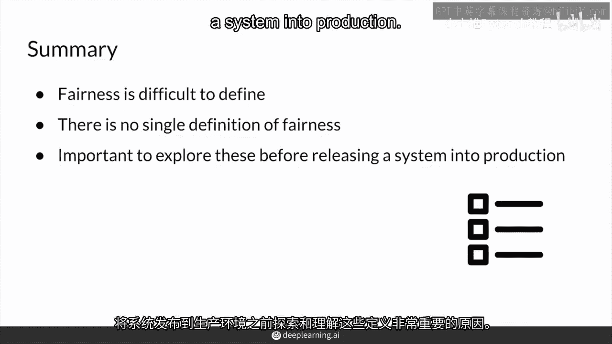

# P49：【2025版】49. 定义公平.zh_en - 小土堆Pytorch教程 - BV1YeknYbENz

继续讨论偏见，如何判断一个模型是否公平，指南针模型似乎很明显，但在这个视频中，如何具体衡量一个模型是否公平。

我将给你一些关于公平性的想法，乍一看似乎很简单，但公平性有很多定义，事实上，正如本周阅读的材料所示，不同的研究论文依赖于不同的定义。

公平性是一个复杂的理想概念。

如你所见，如图所示，不同的研究论文依赖于公平性的不同定义。

这些都是公平性的不同定义，当然还有其他的，公平性有哪些定义方式。

它可以定义为具有同等机会，结果独立于敏感属性，如种族，这也被称为人口统计学平行，你看到，基于某种敏感属性，结果的预期应该完全相等，基于该属性，因此，预测器（如你的机器学习模型）生成的预测总体分布。

对所有预测类的不同值都应该相同，你也可以将其定义为具有代表性的结果，即测试集的人口统计信息。

例如，在美国，这意味着生成亚洲美国人的面孔的比例应为6%，这与美国亚洲美国人的大致比例相匹配，或者，具有相同的假阳性率或假阴性率，在所有属性中，在之前的视频中看到的风险评估模型中。

所有其他条件相同的情况下，正确或错误预测的概率。

对于不同的保护类别的值应该是相同的，也称为平等机会，如你所见，公平性的三种不同定义，显然没有单一的公平性定义，这只是三种非常基本的定义，当然还有其他的，尽管没有单一的公平性定义。

但仍然可以观察到在所有这些定义中，几乎所有模型中缺乏公平性，总之，公平性难以定义，也没有单一的公平性定义，这就是为什么在将系统部署到生产之前，了解和探索这些定义非常重要，公平性的定义有很多。

当然还有其他的，尽管没有单一的公平性定义，但仍然可以观察到在所有这些定义中，几乎所有模型中缺乏公平性，所以，总结一下。

公平性很难定义，也没有单一的公平性定义，这就是为什么在将系统部署到生产之前，了解和探索这些定义非常重要，公平性的定义有很多，当然还有其他的。

