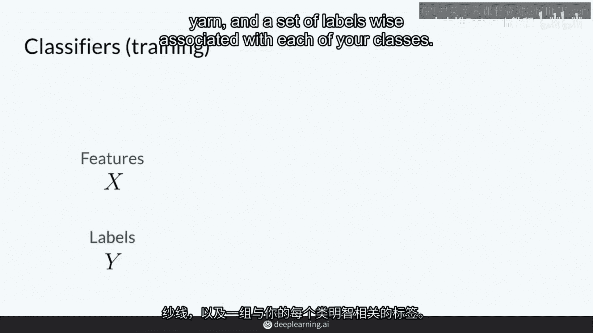
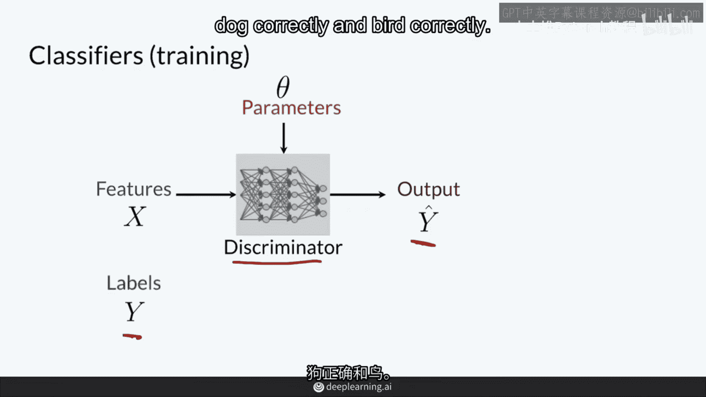
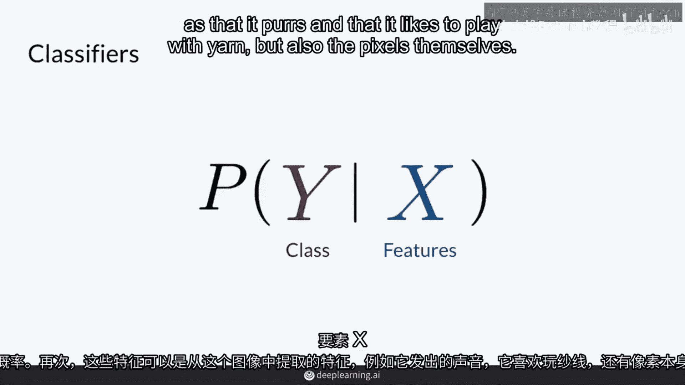

# P5：【2025版】5.判别器 - 小土堆Pytorch教程 - BV1YeknYbENz

所以，生成器由两个模型组成，判别器和生成器，在这个视频中，我将首先向您展示判别器如何工作。

判别器是一种分类器，所以我将从分类器的复习开始，然后，您将看到在概率术语中，分类器如何学习建模，这个视频的结尾，我将向您展示这如何转化为生成对抗网络（GAN）的判别器，所以，快速回顾。

分类器的目标是区分不同的分类，所以，给定这张猫的图片，分类器应该能够判断出这是只猫而不是狗，例如，实际上，它可以学习区分猫与其他多个类别，这取决于你想要它区分的类别，最简单的情况可能是猫和非猫。

分类器不仅仅局限于判断图像类别，你可以有像这样的一段文本。

它喵喵叫并玩线团，将其分类为猫，你可以有只猫的录像，它在发出各种声音，所以，分类器的一种模型是使用神经网络。

这个神经网络可以输入一些特征，例如这里，有x0，x1，x2，一直到xn，所以n个不同的特征。

它计算一系列非线性函数，稍后会详细介绍。

它认为这张图片是猫的概率是45%。

认为这张图片是狗的概率是45%，认为这张图片是鸟的概率是10%。

刚开始，这个模型可能不会正确分类，这就是为什么猫和狗在这里可能处于同一水平，它会随着时间的推移学习，试图提高其预测，根据数据中的真实标签，所以你会在最后告诉它，不。

这百分之百是猫，零百分比狗，零百分比鸟，所以这种学习过程可以总结如下，你有一些输入特征，X就像它发出咕噜声，并且它喜欢和线以及一套标签玩耍，Y与你的每个班级相关联。

例如，一只猫，一只狗和一只鸟，然后你使用你的神经网络，它输入这些特征并学习这些参数的集合，我将其称为theta，这些是你在神经网络中看到的每个节点，随着它学习猫的外观，这些权重随时间变化。

并且狗看起来什么样子，并且鸟看起来什么样子，这些参数theta试图将这些特征x映射到这些标签上，Y在这些预测中你将称之为y hat，因为它们并不是确切的y标签，它们试图成为y标签，因此目标是达到一点。

真值和预测y hat之间的差异最小化，Y和预测y hat之间的差异，这就是成本函数发挥作用的地方，并且它是通过比较y hat与y的接近程度来计算的，这就是成本函数的目标，它告诉这个判别模型。

这个神经网络，多接近正确分类猫，狗和鸟。

从这个成本函数你可以更新那些参数，那些神经网络中的那些节点，根据这个成本函数的梯度，这通常意味着那些参数应该朝哪个方向来尝试得到正确的答案，尝试得到尽可能接近y的y hat，然后你重复这个过程。

直到你的分类器处于良好状态。

所以让我们进入数学世界稍作停留，判别模型的目标是建模每个类别的概率，例如，不仅仅是猫，还有乌龟，鸟，狗和鱼，给定一组输入特征，例如，这是一个猫的图像，所以给定这个猫的图像，这个类别是什么，换句话说。

这是对给定输入特征x的条件概率建模。

y，这些特征可以是从这张图像提取的。

例如它会喵喵叫，喜欢和线团玩耍。

但也包括像素本身，这是一个条件概率分布，因为它是在给定一组特征的条件下预测类别的概率。

这个竖线表示的，模型只有在看到输入特征后，才会做出类别预测。

在这个例子中是图像，现在回到GAN的上下文中，判别器是一个分类器，它检查这些例子，它们是假的例子，真实的例子，并确定它们属于真实或假类别，所以对这个假蒙娜丽莎，而不是确定这个图像中是否有猫，狗或鸟。

并且鸟看起来什么样子，确定这张图片有多假。

以下是85%假的东西，从概率的角度来看，判别器模型，示例的概率是假的，给定一组输入x，例如，它会看这张假蒙娜丽莎的照片，并确定有85%的概率，它不是真的，作为简化，它会被分类为假，你也可以认为这是0。

1，5真，并重写为对真的概率。

给定那张图片，判别器模型。

示例的概率是假的，给定这组输入x。

例如，看一张蒙娜丽莎或假的照片，并确定有85%的概率。

这不是真的，85%假。

因此，它会被分类为假，并且这些信息，不仅仅是这些假的信息。

而且0。85会被给与生成器以改善其努力。

总结，判别器是一种分类器，它学习建模示例的概率，是真还是假，给定输入特征集，如RGB，图像的像素值，判别器的输出概率。

