# P54：【2025版】54. 渐进增长.zh_en - 小土堆Pytorch教程 - BV1YeknYbENz

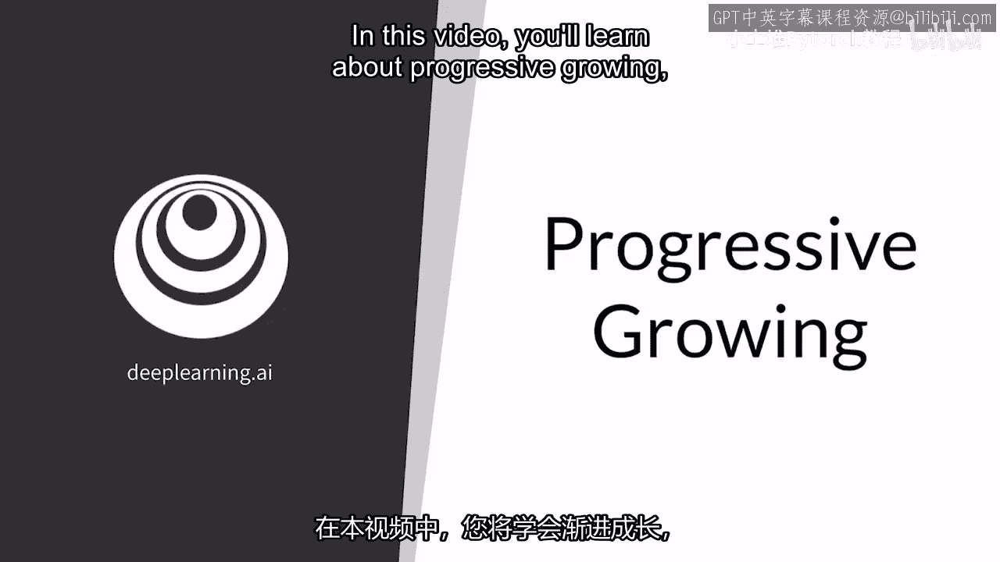

在这个视频中，你将学习渐进生长，这是风格GAN的一个组成部分，我将解释渐进生长的直觉以及动机，然后我将深入探讨如何实现它。

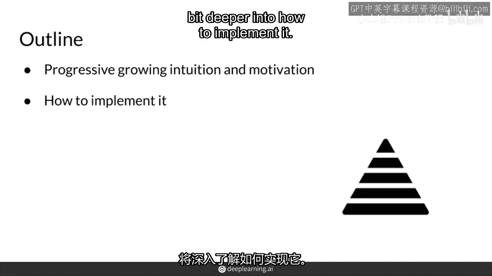

首先，在风格GAN中，渐进生长旨在，使生成器更容易生成高分辨率图像，通过逐步从低分辨率图像训练到高分辨率图像，从更容易的任务开始，说一个非常模糊的图像，生成只有16个像素的4x4图像。

然后随着时间的推移，生成一个高分辨率的图像，例如，这将是开始的样子，生成器只需要生成这个4x4的图像，而鉴别器需要评估它是真实的还是伪造的，当然，为了使真假不那么明显，图像也会被降采样到4x4。

图像也会被降采样到4x4，现在，渐进生长的下一步。

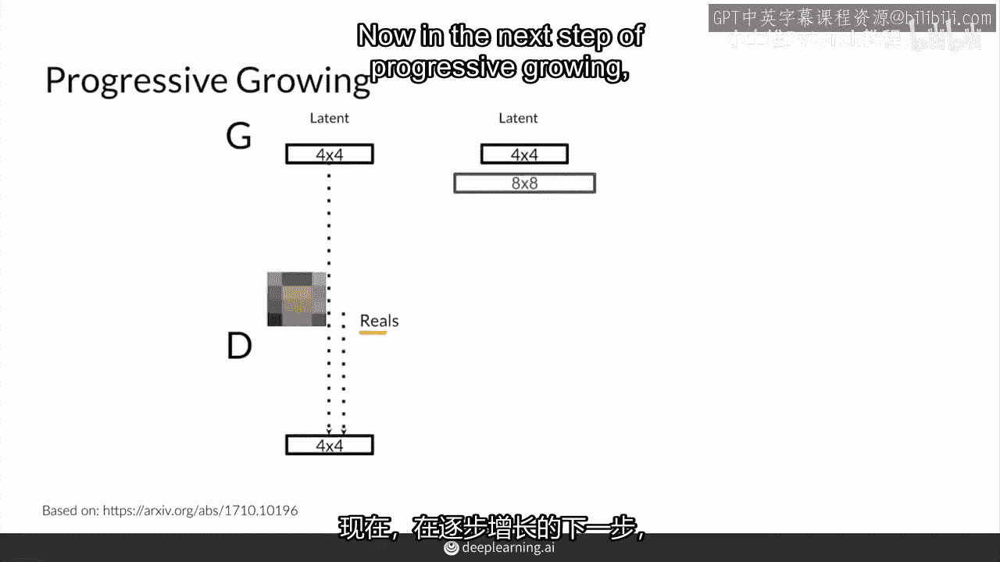

所有的内容都被加倍，生成的图像现在是一个8x8的图像，比之前的图像分辨率更高，但仍然比超高分辨率图像更容易，当然，卷积层也被降采样到一个8x8的图像，以便不那么明显，哪些是真实的，哪些是伪造的。

判别器现在将接收这个8x8的图像，并添加一个额外的卷积层来处理它，并且生成器也会具有这个额外的8x8卷积层，这将能够生成这个高分辨率的图像，这里8x8的卷积层，我不是指滤波器的大小。

我实际上指的是生成器这里预期的输出，以及判别器这里的输入高度与宽度，我们这里并不关注通道，最后，随着时间的推移，也许有很多不同的成长期。

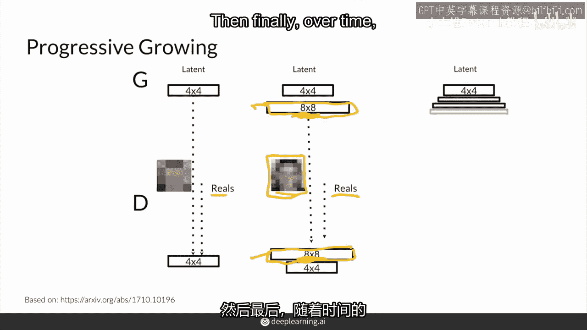

这些是训练期间的预定时间间隔，这些是训练期间的预定时间间隔。

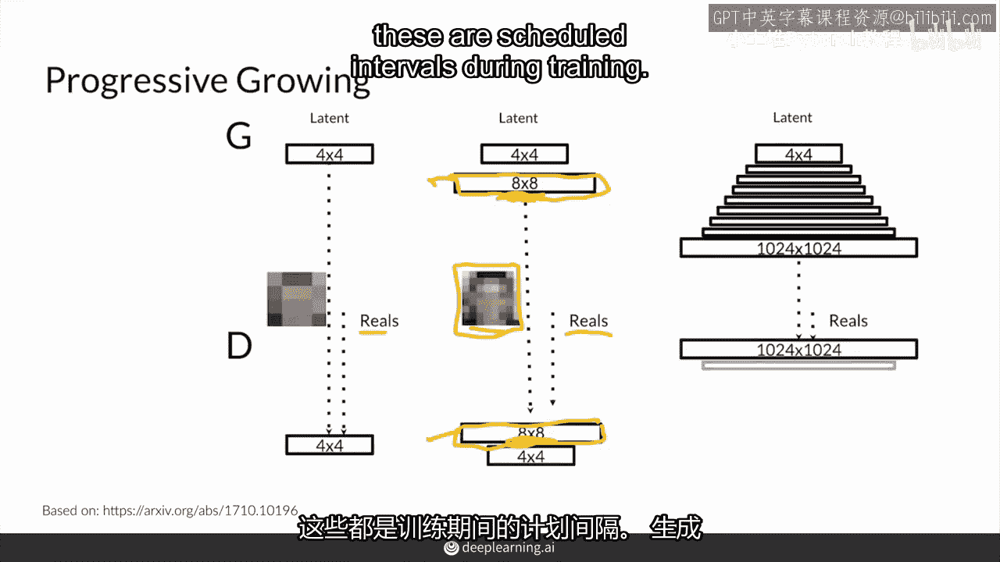

生成器将能够生成超高分辨率的图像，判别器将查看该高分辨率图像与真实图像。

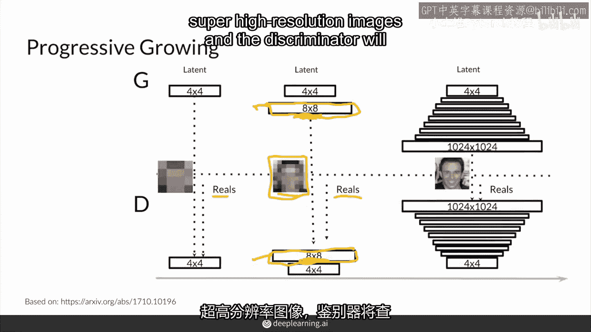

这也将是高分辨率。

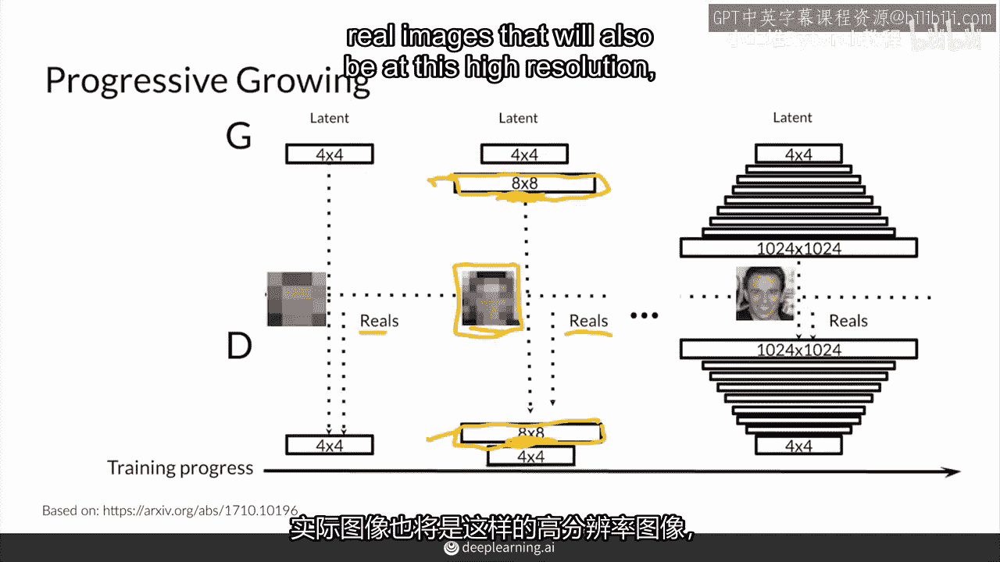

因此不再降采样并能够检测图像是真实还是伪造，这就是渐进生成在行动，从非常模糊的4x4像素，也许到超高分辨率的图像，这又是风格，训练在一个动漫脸数据集上，这个渐进生成并不是那么简单，直接就是尺寸翻倍。

在预定的时间间隔，实际上比那要稍微更渐进一些，所以最初会发生什么，当你第一次想要生成一个双倍大小的图像时，而不是在这里的四乘四的图像，我提到的四乘四是指高度与宽度，你实际上想要放大那个图像，放大。

这可能使用最近邻过滤器，这些不是学习参数，这只是非常基本的放大，你所做的就是将这个图像放大到这里，你所做的就是放大，然后在下一步，也许你做99%的放大，你做1%的将这个放大的图像输入卷积层。

生成一个8x8分辨率的图像，这样你就有一些学习参数，但你只等待这个方向1%，所以你做所有的学习，然后你仍然以99%的重量从这个纯放大，和1%从这些学习参数，然后随着时间的推移，你开始减少这个99%。

你想要增加这个1%，所以你越来越依赖这些学习参数。

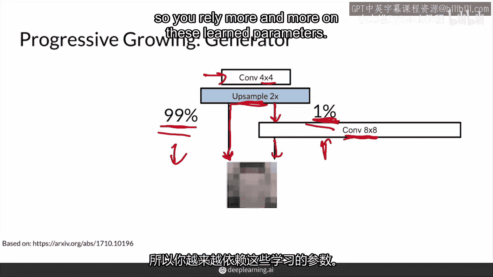

假设你有50%，五五开，你越来越依赖学习参数，你看到这个图像开始看起来，也许更像一张脸，而不是仅仅从最近邻放大，然后随着时间的推移，甚至更多，直到你完全不依赖这个纯放大，你只依赖这些学习参数。

所以到某个点，这将是100%，这将只是网络的一部分，这将只是网络的一部分，这将不再存在，更普遍地，你可以认为这是一个alpha参数，随着时间的增长。

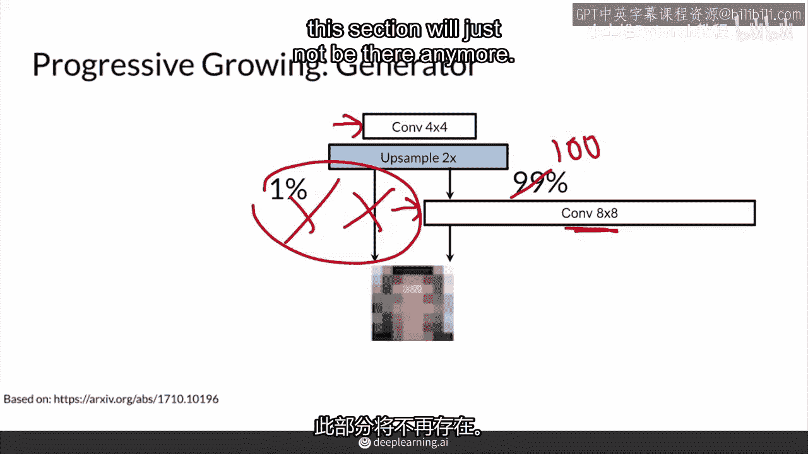

alpha开始时为0，这将是完全1，所以完全是这个方向，然后alpha增长到0。1， 0。2， 0。3，一直到1，当alpha为1，那么这将等于0，这里的所有事情，那么你不在乎这个，这将等于1。

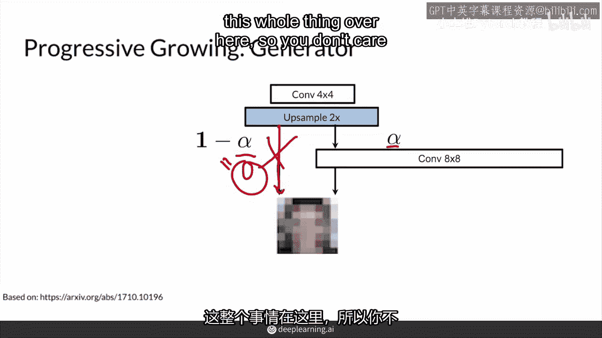

所以那是生成器，对于判别器，有类似的事情，但在相反的方向，所以现在你有这个更高分辨率的8x8图像，而在之前，你可能有一个4x4的图像，然后随着时间的推移，你将通过这个下采样层来处理这里的4x4图像。

然后处理这里的4x4图像，然后处理这里的4x4图像。

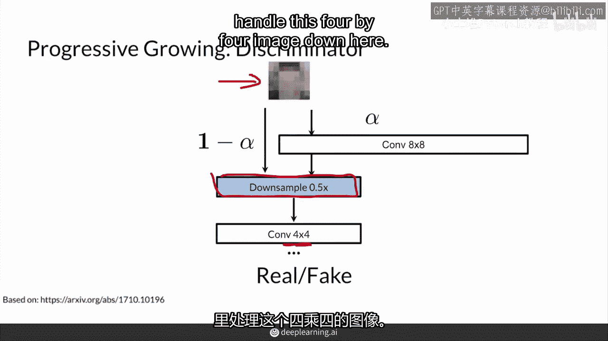

所以首先发生的是你会进行降采样，并且你的阿尔法值为零，所以你只沿着这个方向走。

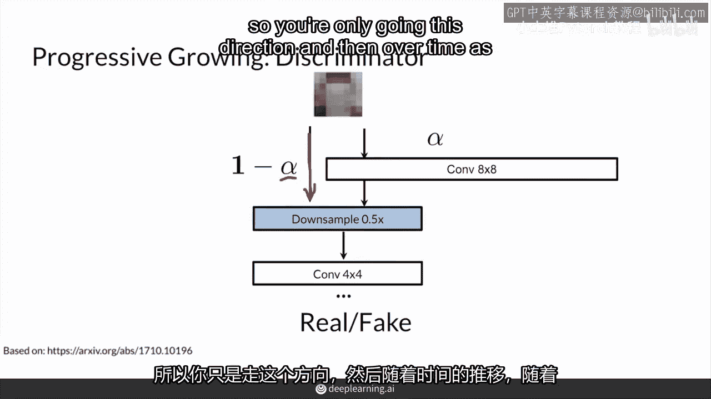

然后随着时间的推移，随着你的阿尔法值增加，这与你在生成器中看到的阿尔法参数相同。

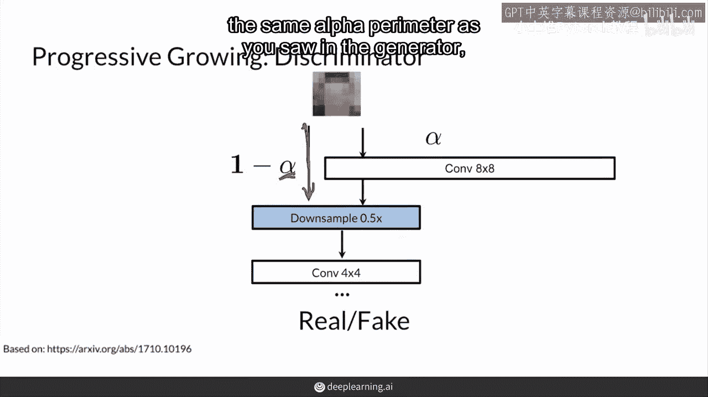

你会通过这些学习参数，以8x8作为输入。

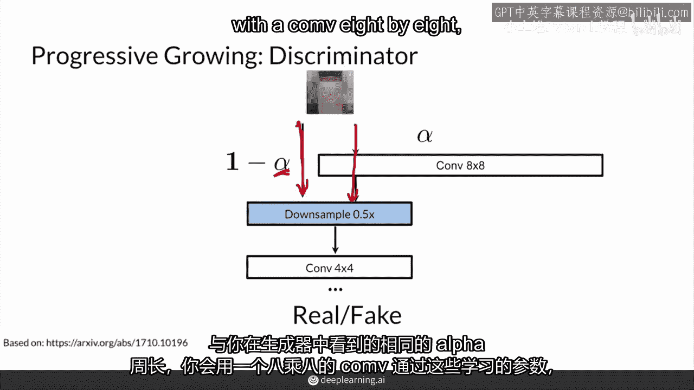

然后进行降采样，到这里变成4x4，所以本质上，判别器做的事情是相反的，并且使用相同的阿尔法，逐渐使用这些学习参数，当然，判别器输入的是图像而不是生成图像，在最后给出一个真或假的输出。

本质上是一个0到1之间的概率。

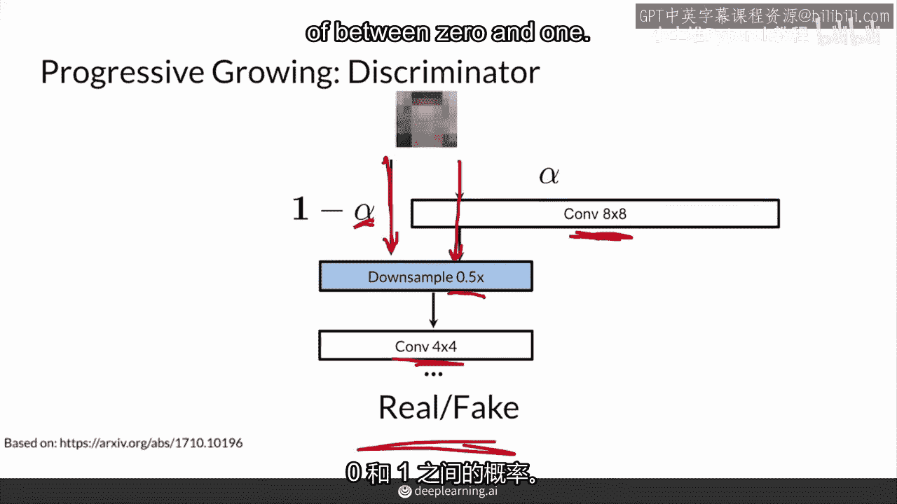

在风格生成对抗网络中，渐进生长，GAN，本质上是一系列这些块，逐步生长到更高分辨率的输出，生成器的单元格本质上看起来像这样，在每个这些块中，会有一个上采样层，以及一个卷积层。

实际上它们会有两个卷积层来学习更多，以能够学习更多。

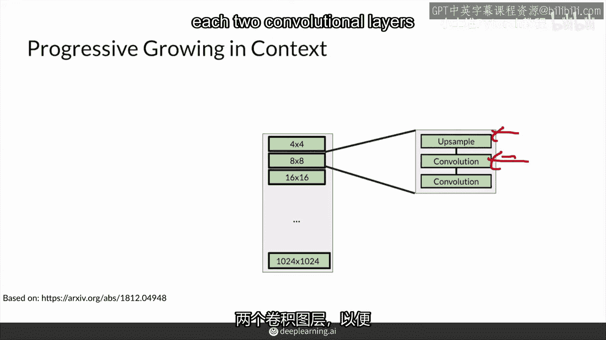

总之，渐进增长会逐渐将图像分辨率翻倍，这样随着时间的推移，你的风格更容易学习高分辨率图像。

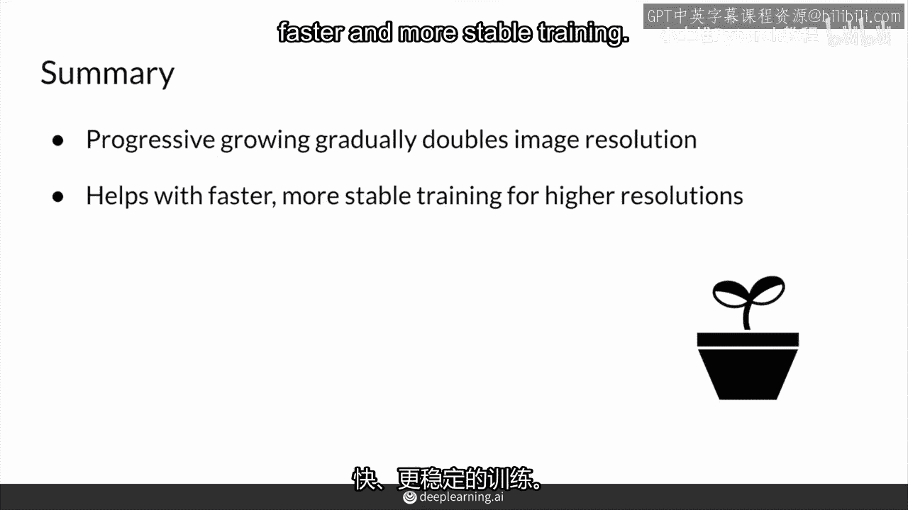