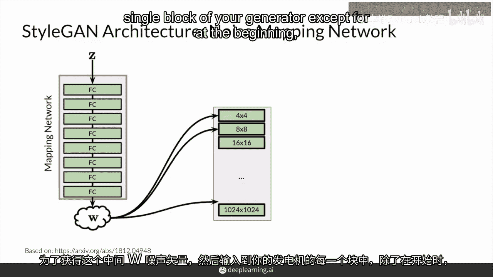

# P58：【2025版】58. 把各部分结合起来.zh_en - 小土堆Pytorch教程 - BV1YeknYbENz

好的，恭喜你走到这一步，让我们把所有你刚刚学到的风格生成对抗网络（StyleGAN）的知识放在一起。

我会回顾你所看过的所有主要组件，并将它们放在一起，所有这些组件都相当重要，StyleGAN的作者进行了消融研究，以了解这些组件的实用性，通过移除它们并观察模型在没有它们的情况下的表现。

他们发现直到这一步，每个组件都或多或少是必要的，当然。

还有其他方法来替换一些这些组件，以获得相同的结果，这是您在学习过程中肯定见过的。

但让我们把StyleGAN放在一起，然后实现所有这些组件。

首先，你学习了渐进生长，它本质上是随着时间的推移生成输出，从小输出到大输出，这使得生成器的基本块得以构建。

然后你有噪声映射网络，它将从正态分布中采样的z，像往常一样，对所有值进行处理，但也通过此多层感知机进行处理，这八个全连接层之间夹有sigmoid或其他激活函数，以获得中间w噪声向量。

然后将其输入到生成器的每个块中，除了在开始处。

这通常是怎么做的，但它在多个地方注入，然后你学习了自适应实例归一化（AdaIN）。

它用于在网络中的各个点应用样式，在各个点应用样式，在网络中的早期块中，我们将控制那些更细的样式或影响那些更细的样式，使用w的统计信息。

在网络后期块中，我们将使用那些统计信息。

以影响更细的细节。

你还学习了样式混合，它通过采样不同的c来获取不同的w。

然后将不同的w放在你的网络的不同点，所以你可以在网络的前半部分使用w1。

并在网络的后半部分使用w2。

你的生成输出将是w1和w2生成的图像的混合，最后是随机噪声，它影响小的，详细变化，比如一缕头发，或这缕头发的位置。

头发的卷曲程度，以及这些卷曲的类型，它在网络的多个点注入。

以影响更粗或更细的风格，根据你注入的区块而定。

这也有一个大的比例参数，说明在每个点噪声的重要性。

好了，恭喜你到这里，这是风格的主要组成部分。

渐进增长的噪声映射网络，自适应实例，归一化。

风格混合。