# P6：【2025版】6.生成器 - 小土堆Pytorch教程 - BV1YeknYbENz

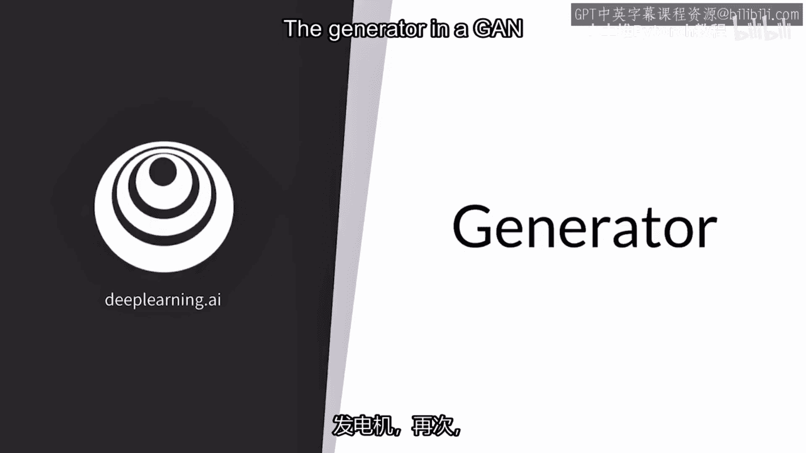

生成器就像一个心脏，在一个模型中扮演着核心角色，它是一个用于生成示例的模型。

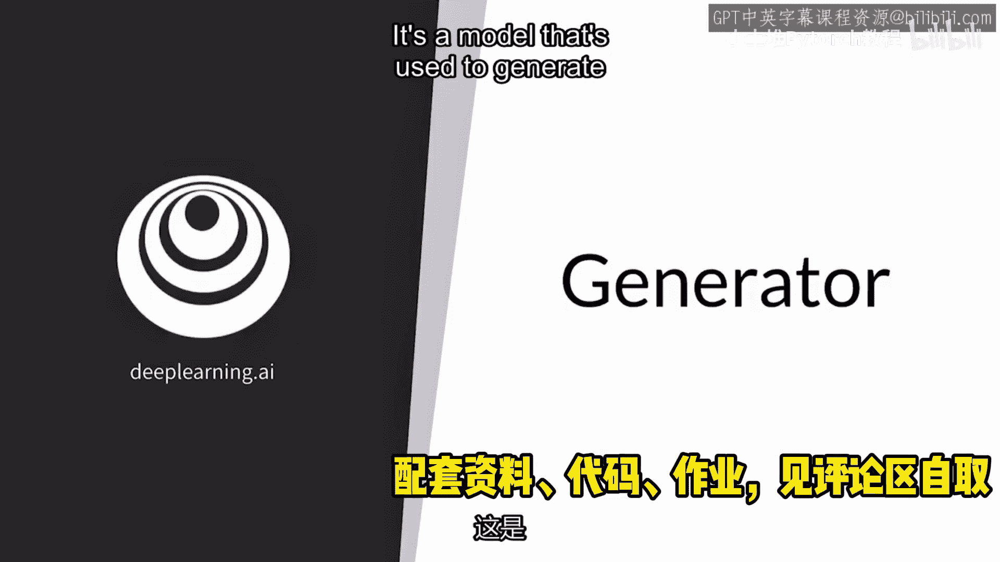

你应该专注于帮助它达到高性能。

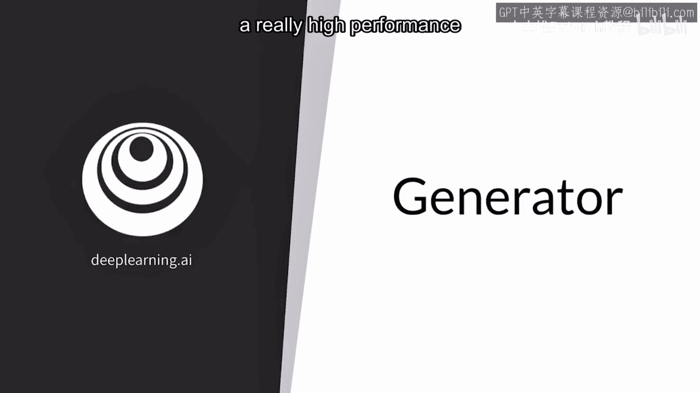

在训练过程的最后，在这个视频中，我将重新审视生成器的作用，你将看到它如何提高自己的性能，然后我会向你展示它在概率建模方面的工作。

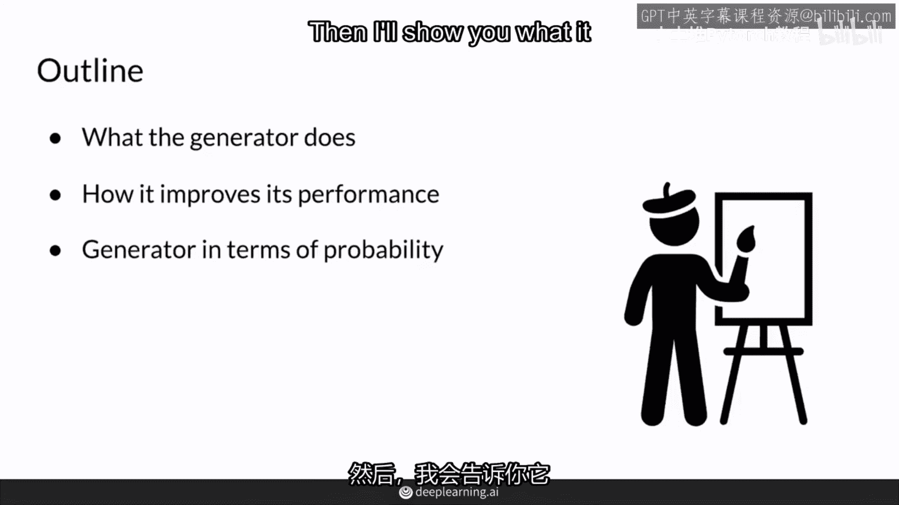

生成器的最终目标是能够生成一类示例，如果你训练它是从猫这一类。

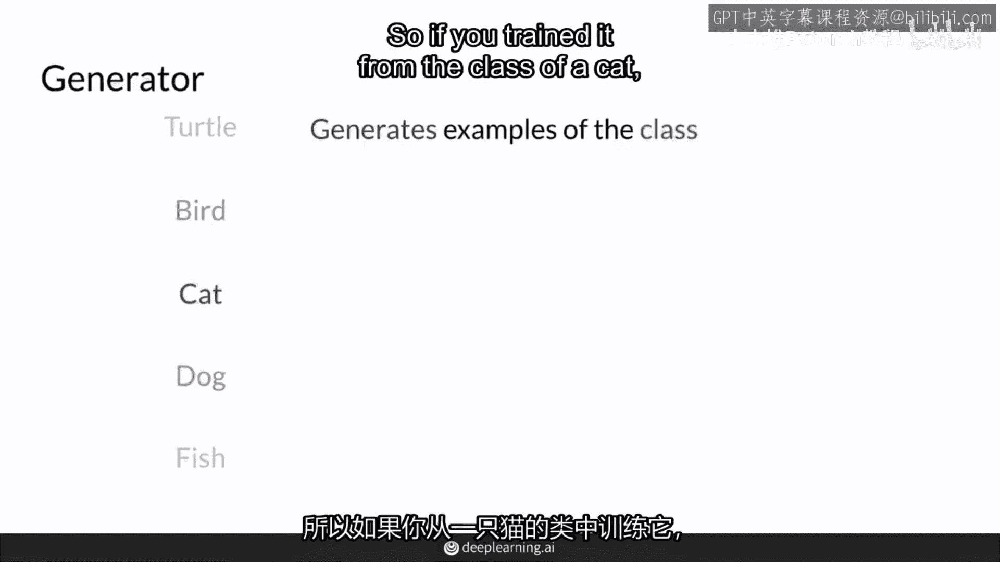

那么生成器会进行一些计算并输出一个看起来真实的猫的表示。

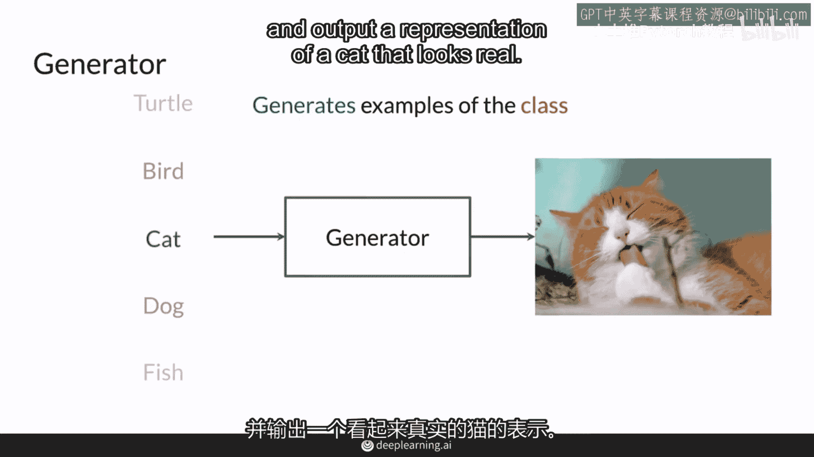

理想情况下，生成器每次运行时不会输出一样的猫，为了确保它能够每次输出不同的示例，你将输入不同的一系列随机值，也称为噪声向量，所以这里这个噪声向量实际上是一组值，这些不同阴影的单元格只是不同值。

你可以认为这是一、二、五、一，点五、五、五、二，然后这些噪声向量作为输入被送入，有时与猫这一类y一起输入到生成器的神经网络中，这意味着这些特征x0，x1，x2，一直到xn，包括类别以及噪声向量中的数字。

然后，在这个神经网络中生成器，会从这些输入计算一系列非线性结果。

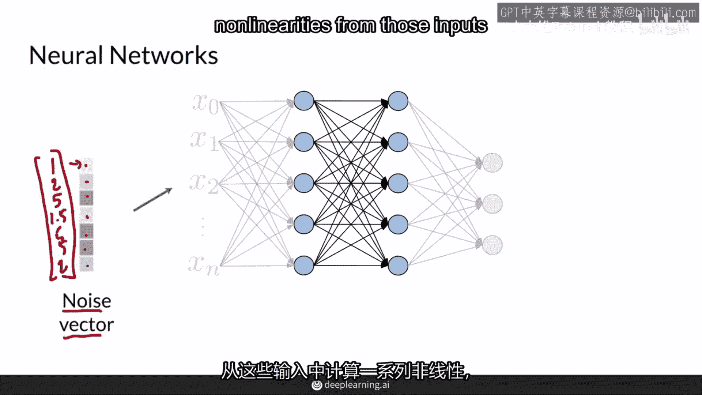

并返回一个看起来像一只可爱的棕色和白色猫的表示，所以这里，而不是不同的类别，它的输出实际上是一张图片，你可以想象这张图片有三百万个像素，你可以想象这些是三百万个最后的节点，它们并不表示类别。

而是每个像素值。

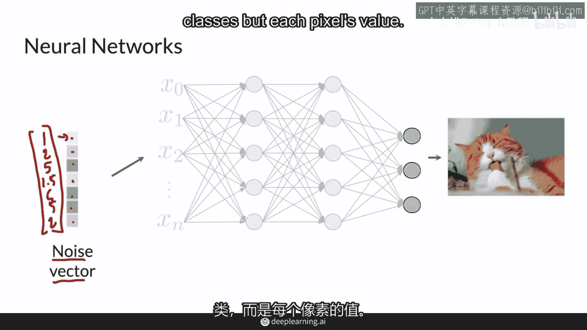

在另一个运行中它可以生成这一只无毛猫，在最后一次运行中，这一只savannah猫，这些都是用不同的噪声向量，让我们首先考虑概念上生成器如何随着时间的推移而改进。

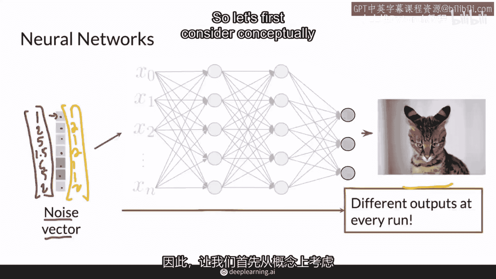

你有一个噪声向量或那些随机输入值，我将其表示为希腊字母si，并将它输入到一个生成器，表示为一个神经网络，以生成一个猫的图像特征集或一个试图生成猫的图像，例如，生成器可能会生成这个图像。

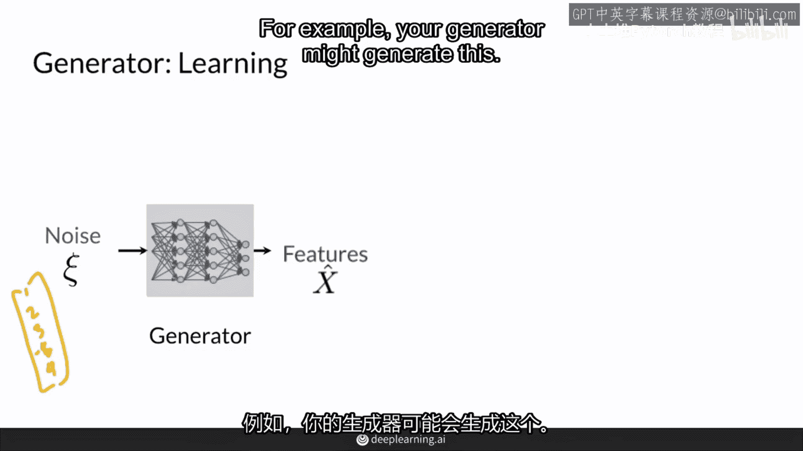

x hat被送到鉴别器，这决定了它根据对其的检查认为它是多么真实和多么虚假，以及之后判别器对它的看法，这是这里表示是判别器预测的y hat，代表它是判别器的预测，你可以计算一个成本函数。

基本上看生成器产生的例子被判别器认为是真实的程度，因为生成器希望这看起来尽可能真实，所以基本上生成器希望y hat尽可能接近1，即真实，而判别器试图让这为零，即虚假。

它使用这两个之间的差异来更新生成器的参数，然后让它随着时间的推移改善并知道移动其参数的方向，以生成看起来更真实并能愚弄判别器的东西，所以当你得到一个看起来不错的生成器时。

你可以保存生成器的参数theta。

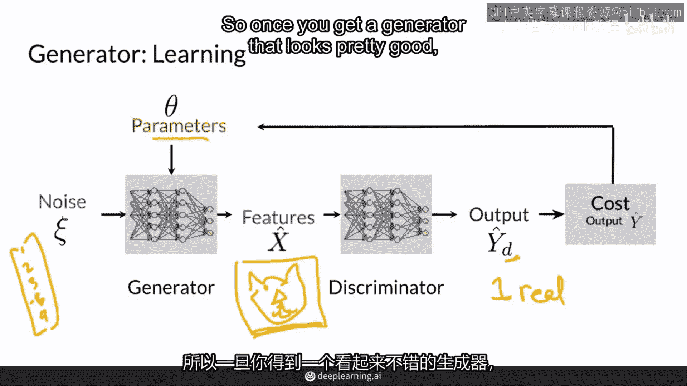

这通常意味着冻结那些theta值并保存到某个地方，然后你可以加载它回来，然后从保存的生成器中采样，采样基本上意味着你有这些随机噪声向量，当你将这些输入到保存的生成器中时，它可以生成各种各样的例子。

所以这个保存的生成器没有训练过猫，我希望没有，因为正在生成狗，请注意你可以继续生成新的噪声向量，将其通过此保存的生成器，然后采样更多狗图像，在这种情况下，所以在概率的世界里。

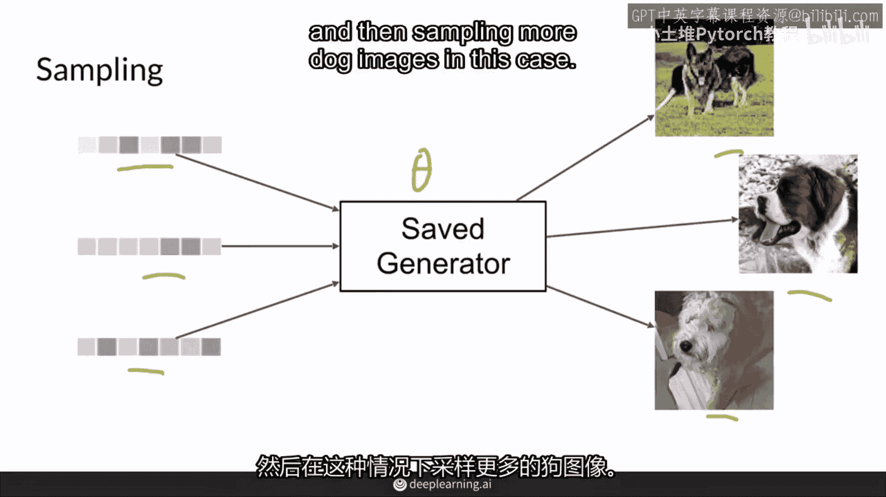

生成器模型一个例子的概率，例如猫，在前一个例子中，实际上是一只狗，当然你也可以做一个乌龟，鸟或鱼，请随意，更一般地，生成器试图模型，给定猫这种类别y的猫的特征x的概率。

例如舔它的爪子或可爱的胡须或各种毛皮，所以这是条件概率x给定类别y，然而，因为我们目前只有一个类别，例如只生成猫，那么y总是相同的，所以你实际上不需要这里，所以你有p x你正在模型，当然。

如果你希望你的生成器学习所有不同类型的类别并且你关心类别，那么你确实需要放那个类别，当然，如果你希望你的生成器学习所有不同类型的类别并且你关心类别，那么你确实需要放那个类别，并在课程一中稍后看到更多。

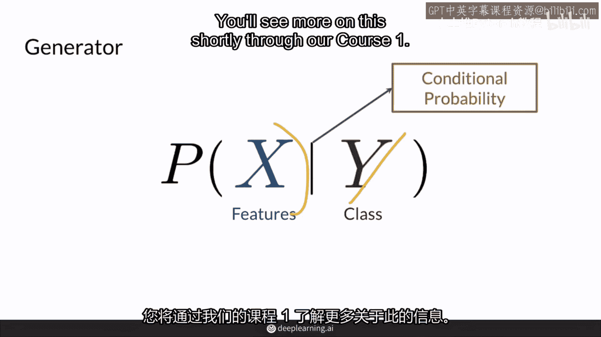

所以现在你有p x遍及世界上所有的猫类型，生成器将建模特征x的概率，没有其他附加条件，这是因为类别y总是为猫。

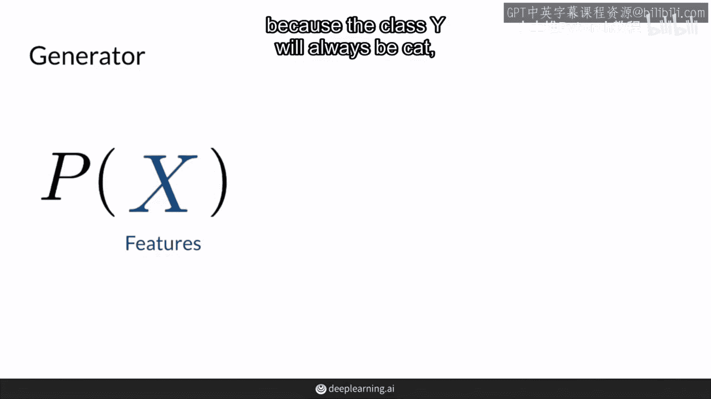

所以对所有概率x都是隐含的，在这种情况下，它将尝试近似真实分布的猫，最常见的猫品种实际上会有更多的生成机会，因为它们在数据集中出现得更频繁，而某些特征，如尖耳朵，会更常见，因为大多数猫都有。

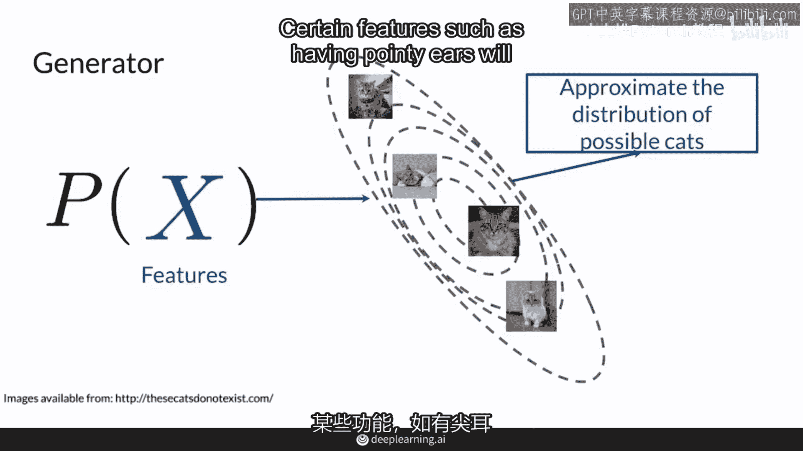

然后更稀有的品种将更有可能较少被采样。

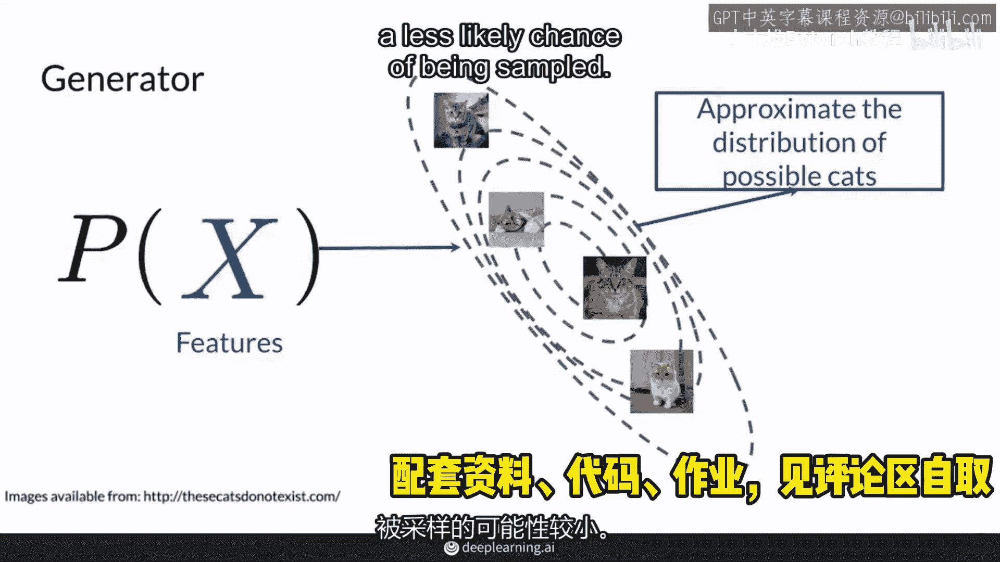

所以这些线条只是代表一个三维的概率分布，猫的分布，所以，猫携带的最常见的类型的特征，将显示并在这里采样，如果你认为这是三维表示，它将向你伸出，然后稀有品种或稀有外观的猫将在边缘。

这意味着最常见的猫品种将有更多的生成机会，而较少常见的品种，如斯芬克斯，则会很少生成，你将在未来的视频中看到，如何控制采样过程并得到你想要的，但现在，生成器的工作是仅仅模仿自然界中的猫。

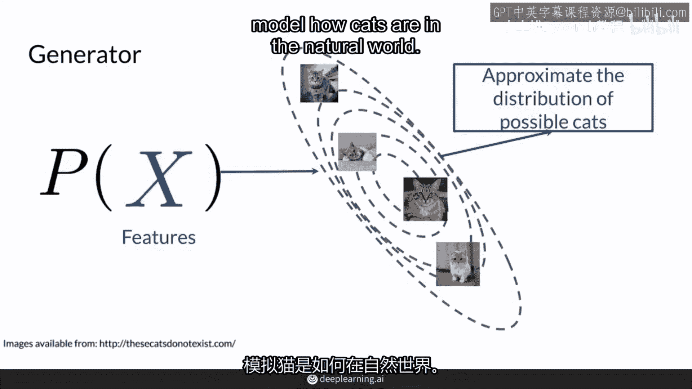

总结一下，生成器产生看起来真实的假数据，它学习模仿你数据的类别的特征x的分布，为了每次产生不同的输出，它以随机特征作为输入，这周的作业中，你将构建一个生成器对抗网络来生成数字的图像，它具有相同的设置。

你只需给它随机噪音，它可以产生所有这些不同的手写数字，这很酷，因为手写不总是完美，它每次看起来都不同，它将能够建模并生成这个数据集中的各种5和8，以及所有不同的手写数字。

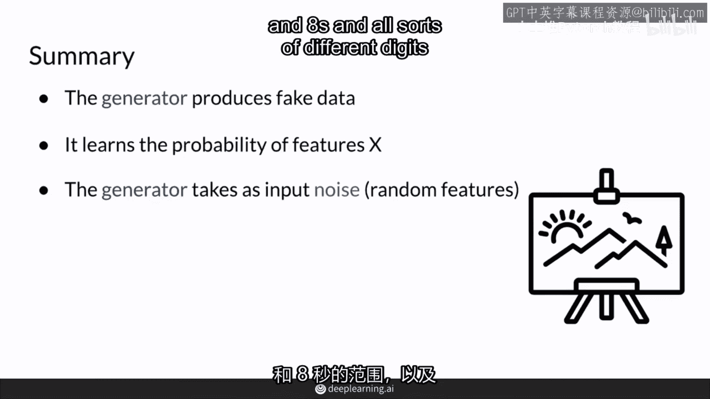