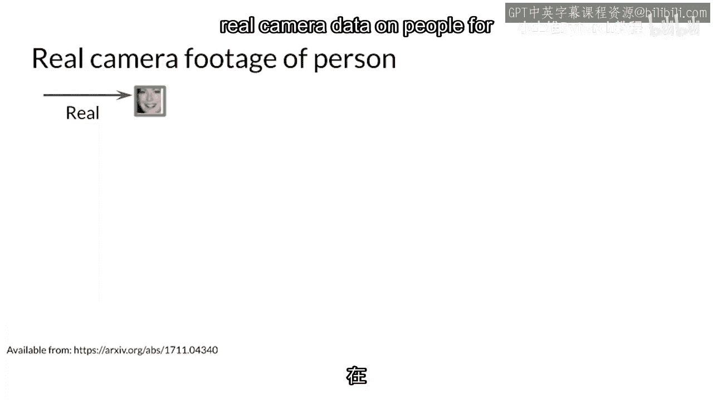
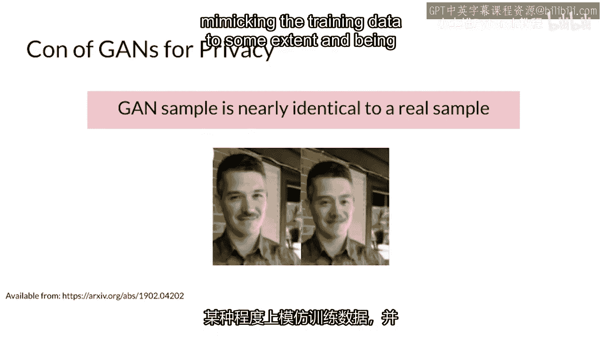
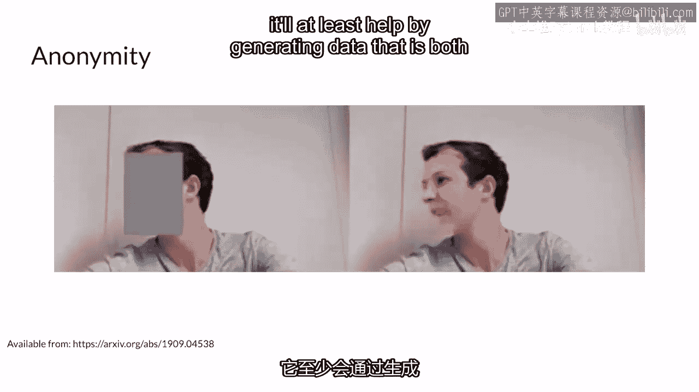
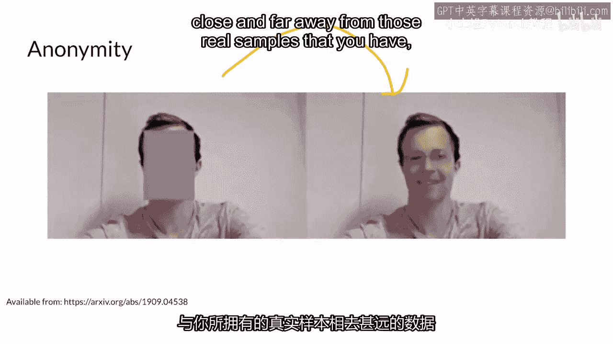

# P61：【2025版】61. 欢迎来到第1周.zh_en - 小土堆Pytorch教程 - BV1YeknYbENz

到目前为止，你已看到生成的数据本身非常有趣，但你生成的游戏数据也可以用来帮助分类器或检测器，或者你正在下游使用的另一个模型，这个过程被称为数据增强，例如，如果你正在构建一辆自动驾驶汽车。

但它在检测斯坦福这里的高尔夫球车时遇到困难，因为你的数据集中没有多少高尔夫球车的例子，你可以实际上使用你的GAN生成道路上的高尔夫球车图像，并将其添加到你的训练数据集中。

这样你的自动驾驶汽车现在可以检测到这些高尔夫球车，假设当地法律要求你不使用真实摄像头拍摄的人像来训练你的模型。

在你的自动驾驶汽车上，那么你可以使用你的GAN生成的数据来训练你的模式，仍然可以获得一定的准确性，同时保护隐私，你生成的GAN数据将在各种不同的场景中包含假人，这不是完美的，正如你所看到的。

扫描程序确实能够到一定程度地模仿训练数据，并能够建模你所有数据集中的现有真实数据，但如果它是一个好模型，至少会通过生成既接近又远离你真实样本的数据。

使识别出哪些人可能是真实的变得困难，这周你的分配中，你将看到GAN生成的数据如何帮助你，在下游分类任务中，在一个流行的数据集上。

使用一个流行的数据集。

你将看到GAN生成的数据如何帮助你，在下游分类任务中，在一个流行的数据集上。