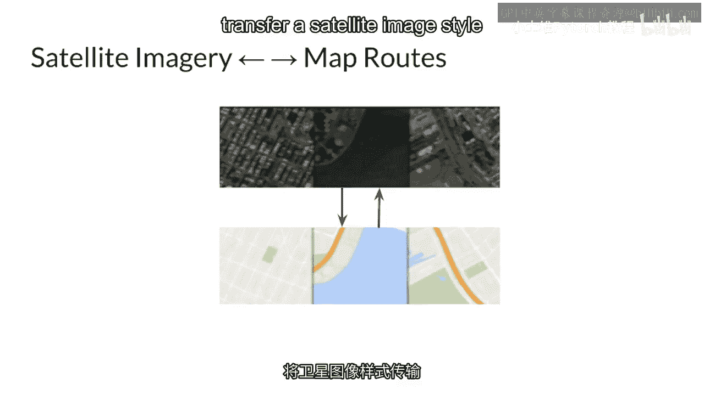
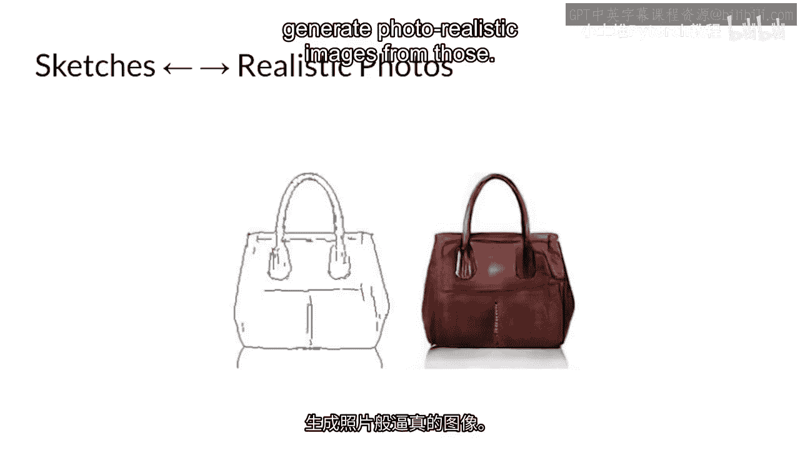
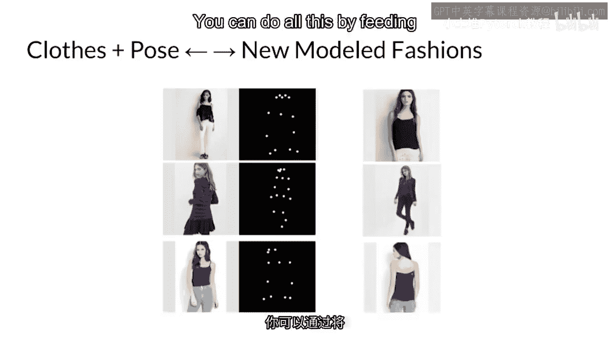
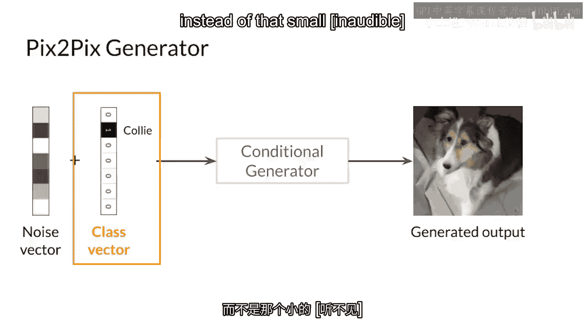
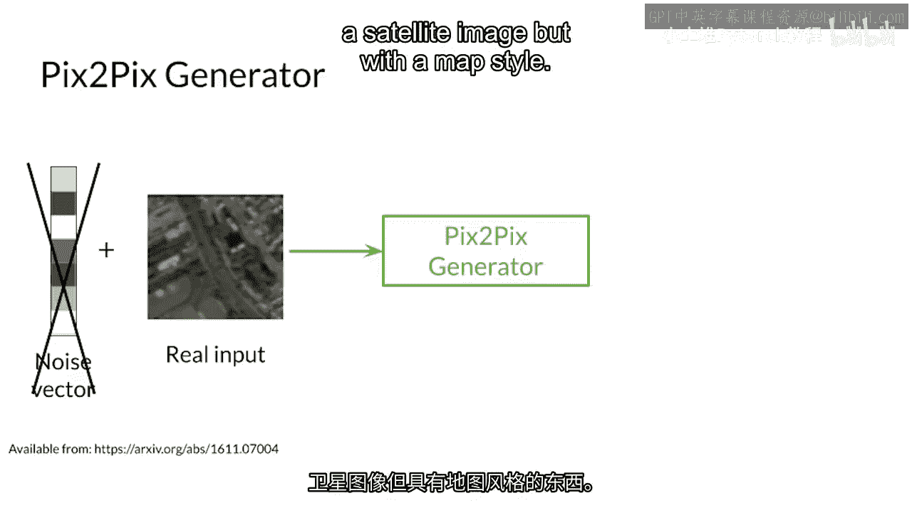

# P67：【2025版】67. 欢迎来到第2周.zh_en - 小土堆Pytorch教程 - BV1YeknYbENz

应用生成对抗网络（GANs）不仅仅是使用GAN生成的数据，你上周看到的数据增强，你也可以使用你的神经网络进行图像转换，这是一个将一种风格从一个图像转移到另一个图像的任务，并且这是基于它的广泛应用，例如。

这里是您可以构建一个再次将卫星图像风格转移到地图路线的地方。

反之亦然，你可以绘制草图，让你的程序从这些草图中生成逼真的图像代码。

也许对于你的新AI驱动零售店来说，这可能是不同的时尚。你可以通过将整个图像喂给你的条件生成器来完成这一切。

而不是那个小小的。

一热类向量告诉你的GAN，嘿，生成看起来像卫星图像的东西。

但地图风格，这种新的GAN架构叫做pixer picks有一个强大的生成器和判别器。