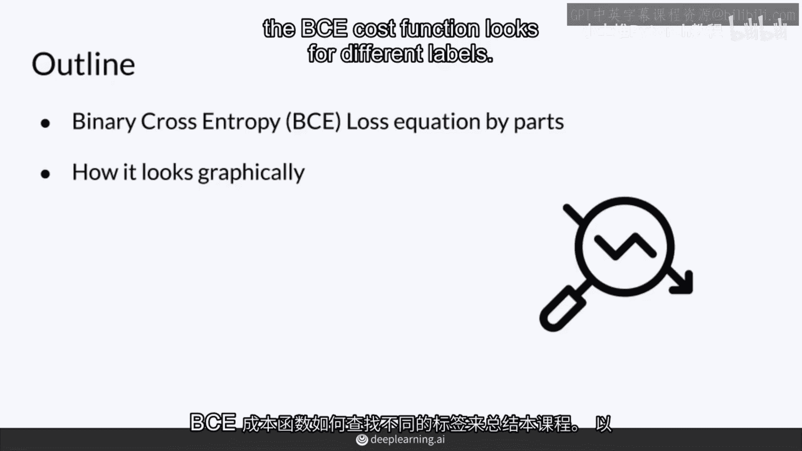

# P7：【2025版】7.BCE代价函数 - 小土堆Pytorch教程 - BV1YeknYbENz

二进制交叉熵函数，或简称BCE，用于训练GANs。

它对这些模型非常有用，因为它特别设计用于分类任务，其中存在两个类别，如真实和伪造。

在本视频中，我将向你展示用于获取BCE损失的方程式，并解释方程式中的每个部分的含义，我将通过向你展示BCE成本函数的工作原理来结束这一课，对于不同的标签。

好的，这就是完整的BCE成本函数，它可能看起来有点吓人，但我会分解这些每个组件，也会给你一些例子来提供一些直觉，了解它是如何工作的，首先，开始时，这里你看到一个求和符号，从1到m，除以m。

这基本上只是意味着对变量m求和，这实际上是整个批次中的例子的数量，并取这些例子的平均值，取这个小批次的平均成本，我会稍后解释这个负号是什么意思，所以，在整个视频中，H表示模型做出的预测，所以你可以看到。

这里为什么有不同的例子的标签，这些是真实的标签，表明某事是真实的还是伪造的，例如，真实可以是一个标签为一，伪造可以是一个标签为零，X是通过分类传入的特征，所以这可能是一个图像。

并且theta是计算预测的参数，所以，在这种情况下，它很可能是判别器，所以判别器在看这些特征的参数，这就是在做的，x逗号thet的预测，你经常也会看到这样写h of x分号theta。

这意味着由theta参数化，这就是稍微更准确的，但是你现在不必担心这些括号里的内容，你可以将这些分解成两个不同的术语，那么我们来研究每一个，所以左边的术语是真实标签的乘积，Y乘以预测的log。

这是h of x特征由模型参数化，为了理解这个值试图达到，让我们看一些例子，所以标签为零的情况，所以假设这意味着它是假的，你有任何预测在这里，那么这种价值实际上为零，如果你有一个预测为一的真实。

你的预测值非常高，接近0。99，那么你也会得到一个接近零的值，在真实值确实为真的情况下，但如果你的预测非常糟糕，接近零，那么结果就会远离一，你就会认为它是假的，但实际上它是真的，那么这种情况下。

这个值会非常大，主要是由于对数项的影响，所以，这种情况想说的是，当真实值是零时，那么这个项就不重要了，它只会趋向于零，所以这个项主要是在预测值为一时起作用，它会使结果为零，如果你的预测很好。

结果会趋向于负无穷。

如果你的预测很差，现在来看第二个项，它看起来非常相似，除了这些负号，那么在这种情况下，如果你的标签是1，那么1-y的值会等于零，实际上，无论你的预测是什么，这个值都会等于零，如果它是假的。

如果你的预测是，嘿，这很假，那么它接近零，那么这一项也会接近零，如果它是假的，但如果你的预测与事实相去甚远，认为它是真的，那么这一项会趋向于负无穷，所以，这两个项都会趋向于负无穷，如果对于相应的标签。

预测很差，那么这会影响到这个负号，所以，如果这两个值中的任何一个趋向于负无穷，那么这个负号是至关重要的，以确保结果是一个正数或正无穷，因为对于成本函数来说，你通常希望值很高，坏的结果。

而你的神经网络会尽可能减少这个值，所以，预测值越接近零，效果越好，因为你希望减少成本函数的值，随着学习不断优化，因此，预测值越接近真实值，效果越好，所以，总结来说，成本函数的一个项在标签为零时起作用。

另一个项在标签为1时起作用，无论哪种情况，log(1-x)的值都会趋向于负无穷，这就是为什么成本函数前面会有一个负号，以使结果为正，这就是为什么我们希望这个负号在前面。

这就是为什么我们希望这个负号在前面，为了确保这个数值大于或等于0。

好的，现在，我将向你展示损失函数在每个标签下的样子，在所有可能的预测中，在这个图中你可以将预测值放在x轴上，h是你的模型，基于x参数化theta给出预测，与该训练示例相关的损失值在y轴上。

在这种情况下损失函数简化为预测的负对数，当预测接近1时，尾巴，损失接近0，因为你的预测接近标签，做得好，这很好，当预测接近0时。

不幸的是你的损失趋近于无穷大，一个非常高的值，因为预测和标签差异很大。

当标签是0时，损失函数减少为1减预测的负对数，当预测接近0时，损失也接近0，这意味着你做得很好，但当预测接近1。

但真实值是0，它将趋近于无穷大，总之，BCE损失函数在每个类别中有两个主要项，当预测和标签相似时，BCE损失接近0，当它们不同，当它们非常不同，BCE损失趋近于无穷大。

BCE损失在一个迷你批次的几个示例中进行，例如，N个示例也许5个示例，N等于5，并且它计算这5个示例的平均值，并且每个示例都可能不同，其中一个可以是，你知道1。

