# P70：【2025版】70. pix2pix PatchGAN.zh_en - 小土堆Pytorch教程 - BV1YeknYbENz

你将学习的第一个组件是pixapix判别器，名为补丁的。

那么在这个视频中，你将会得到一个关于哈希卡架构的概述，这主要是关于输出一个值矩阵而不是单个值。

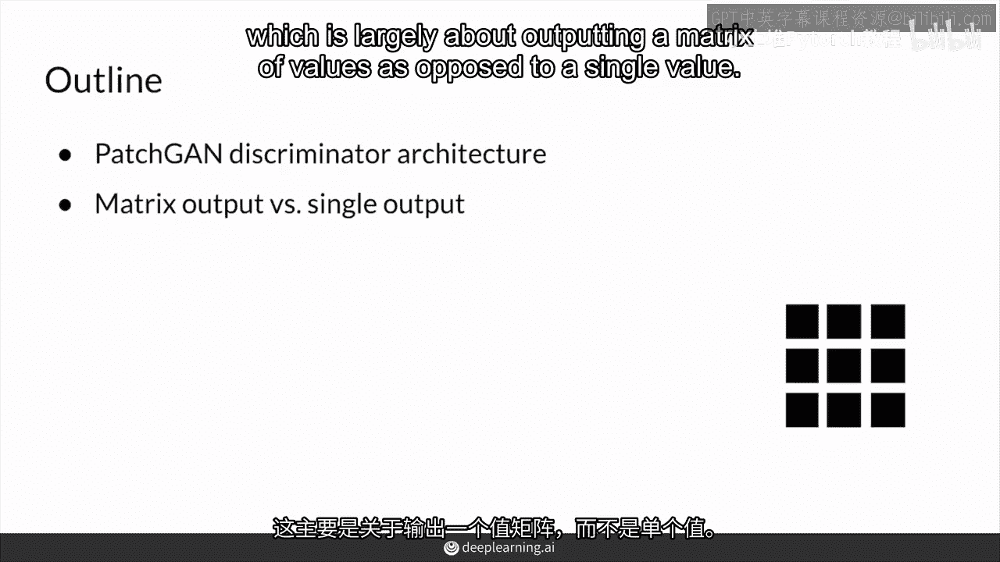

因此，补丁可以输出分类矩阵而不是单个输出。所以你可以在这里看到，它正在查看一幅图像的一小块区域，从包含不同值的整个矩阵中输出一个值。

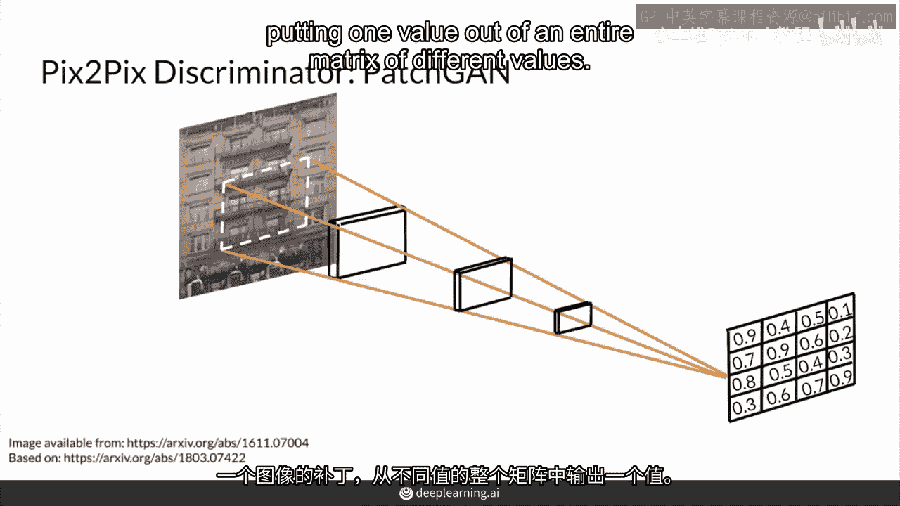

并且在这个值矩阵中的每个值仍然在零和一之间，在零是假的而一是真的情况下。

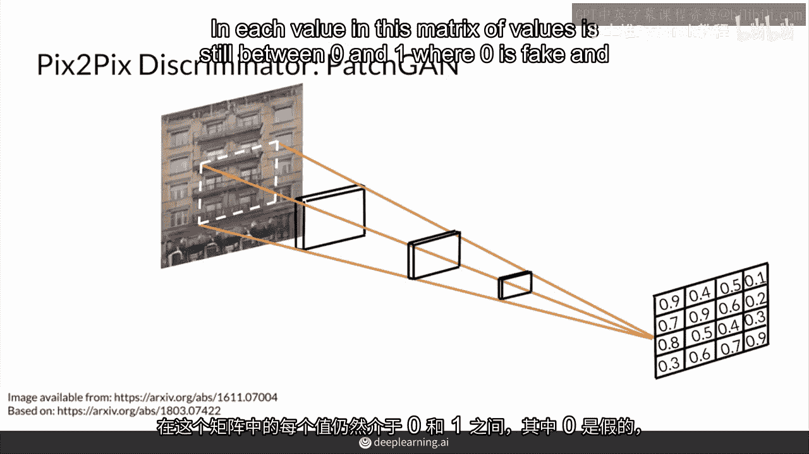

所以和以前一样，补丁可以这样做所有的70x70补丁。

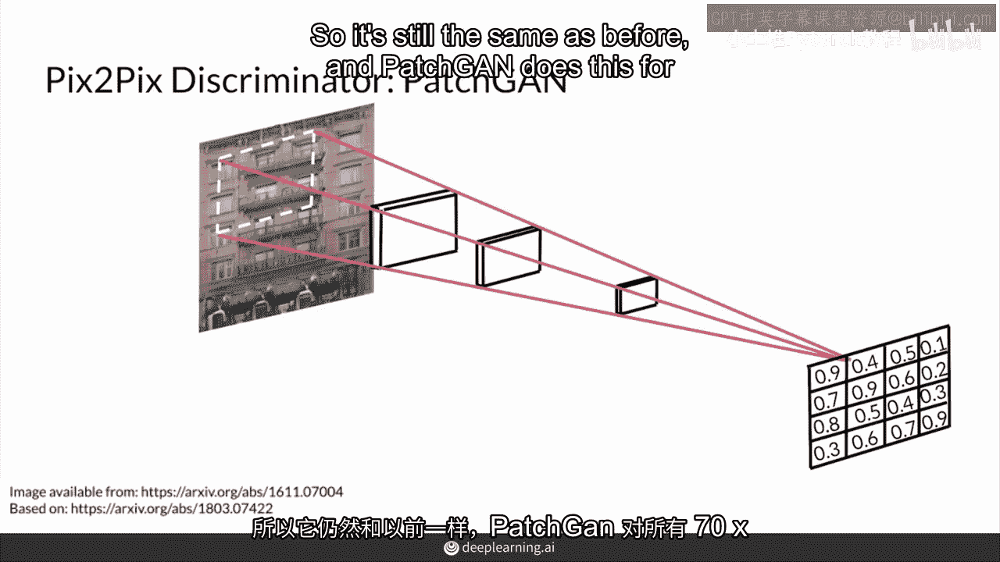

所以这个其他补丁对应于矩阵中的输出值。

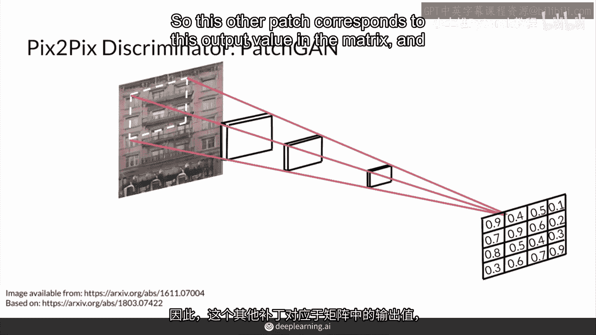

因此，通过将视野滑动到输入图像中的所有补丁上。

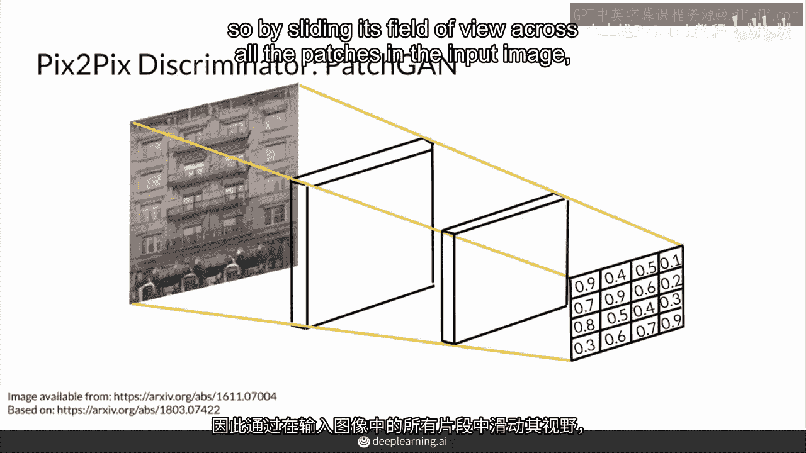

补丁可以然后对图像的每个区域或补丁给出反馈，因为它输出每个补丁成为真实的概率。

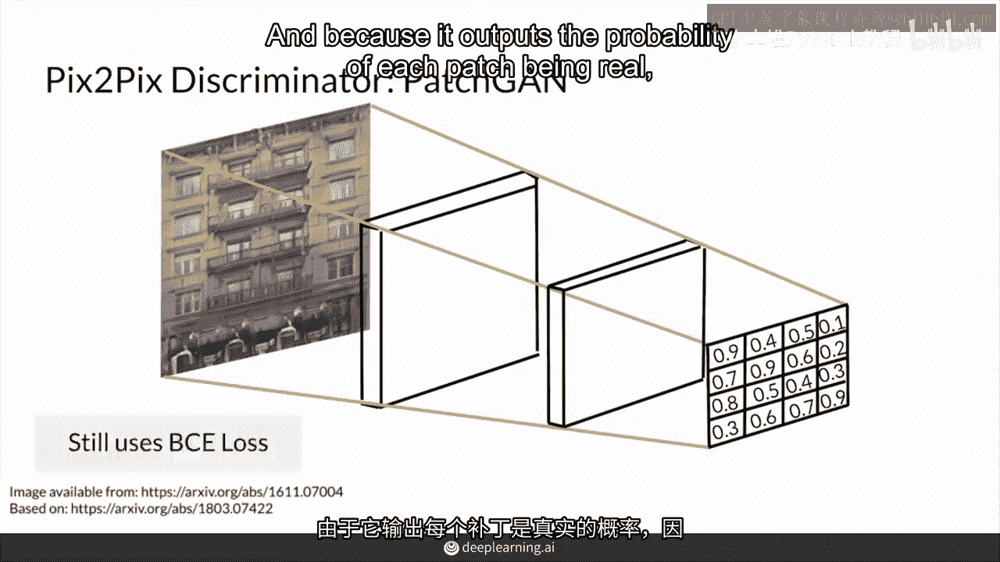

它可以用BCE损失进行训练，仍然如此，对于一个来自生成器的假图像。

这意味着补丁应该尝试输出一个全零的矩阵，所以标签为它，这里的对应标签是所有零的矩阵。

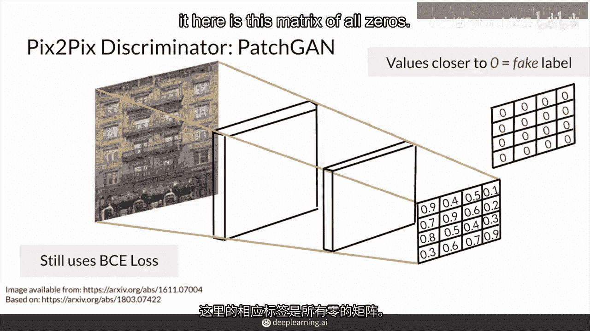

意味着是，这个图像的每一小块都是假的，同样的逻辑也适用于你数据集中的真实图像。

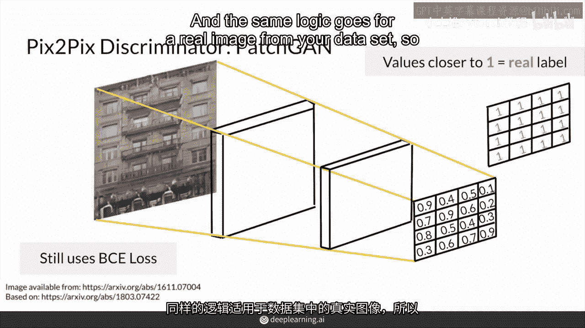

所以patch模型实际上会尝试输出一个所有一的矩阵。

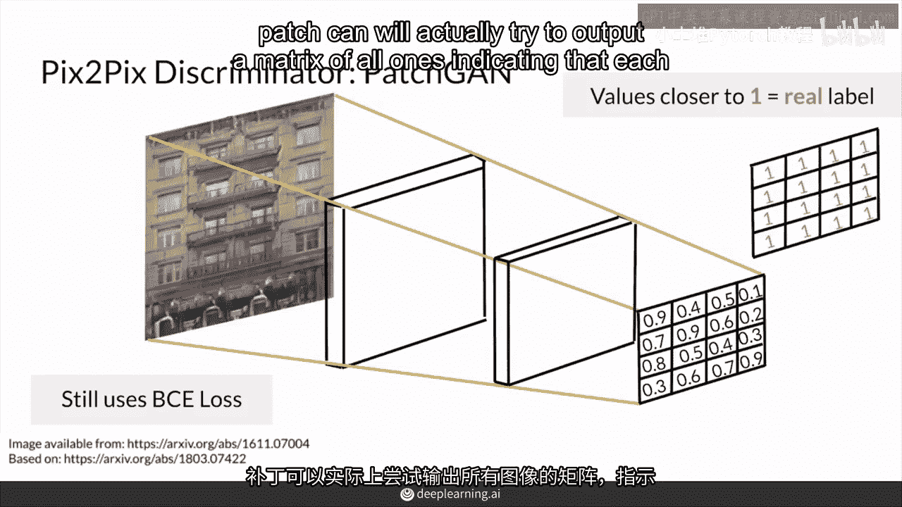

表示图像的每一小块都是真实的，总结来说，对于pixox，判别器输出一个值的矩阵，而不是一个真实或假的单一值，零仍然对应于虚假分类。

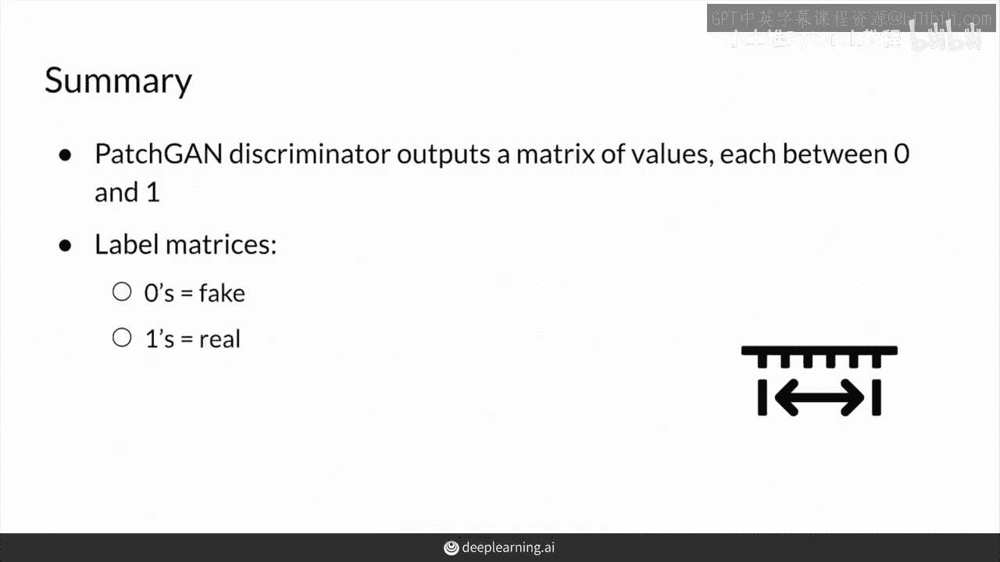