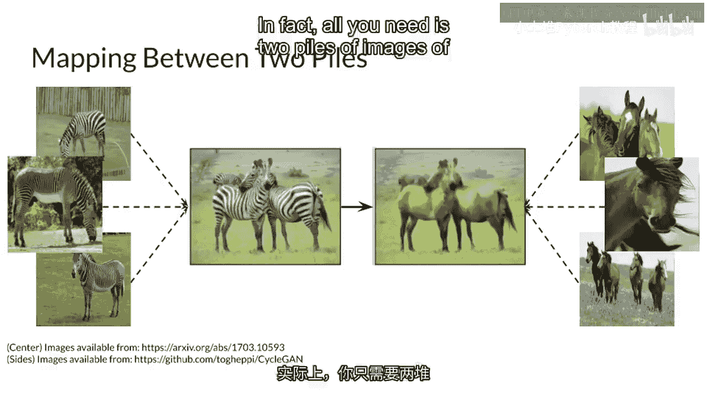
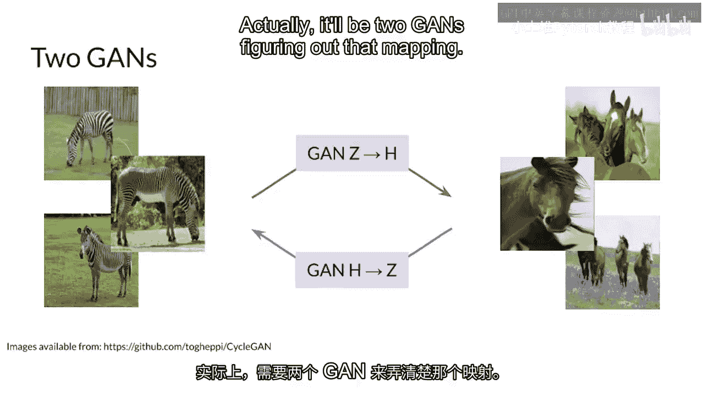
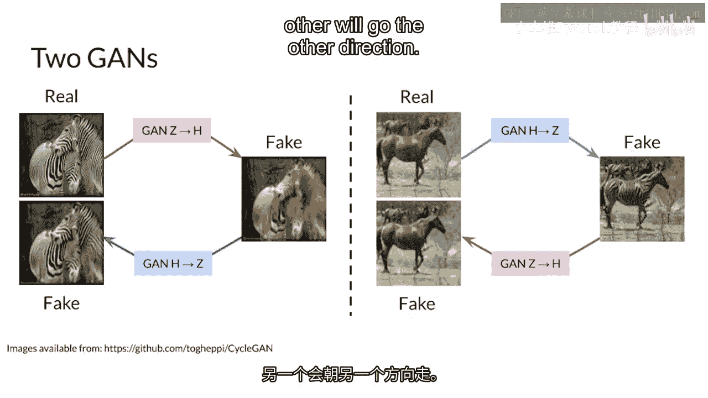
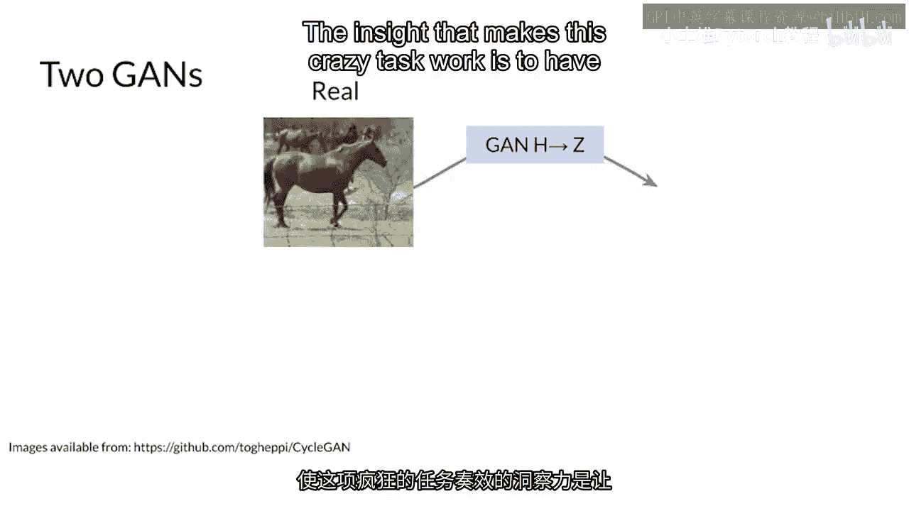
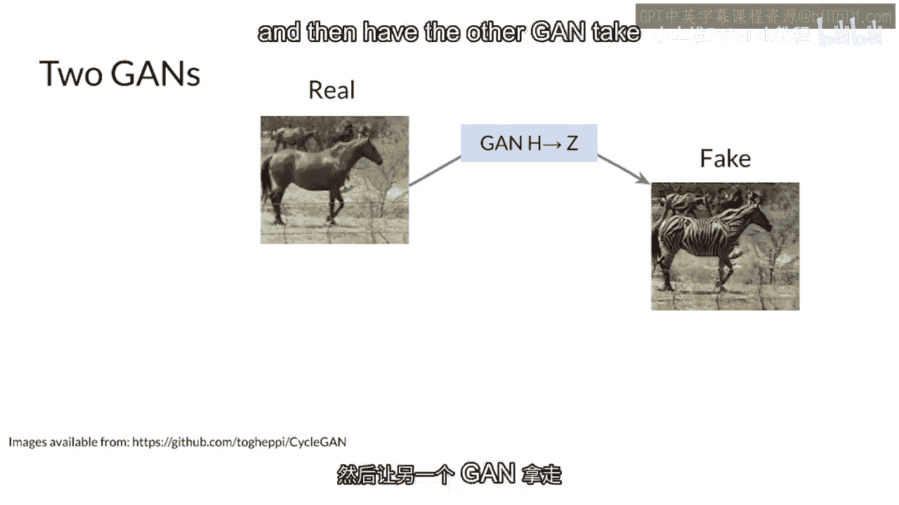
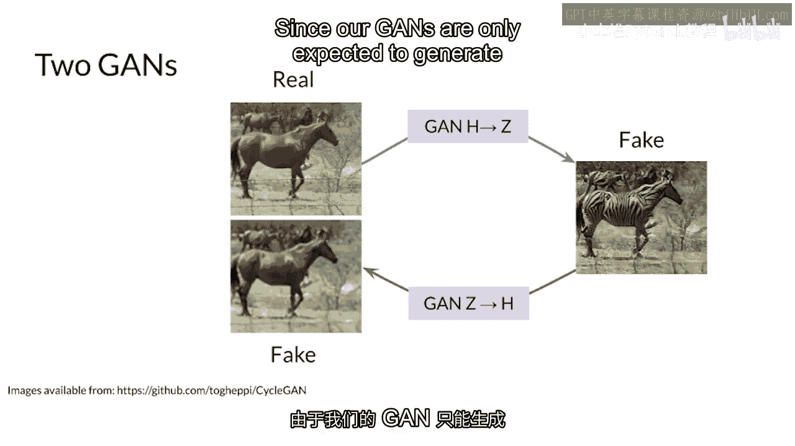
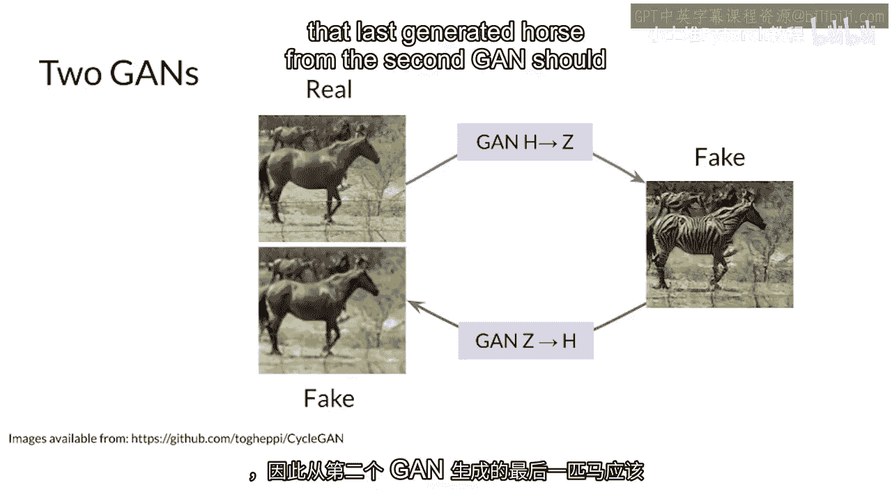

# P75：【2025版】75. 欢迎来到第3周.zh_en - 小土堆Pytorch教程 - BV1YeknYbENz

恭喜你完成了本专化的最后一周，我们将在上周的图像转换基础上进行构建，但你并不需要确切知道两张配对图像之间的对应关系，实际上你所需要的只有两堆不同风格的图像。

你的GAN会从那里找出映射关系，实际上，这将是两个GAN找出那个映射关系。

一个会朝一个方向走，另一个会朝另一个方向走。

正如你肯定一直在等待的，这是马周，斑马周，让这个疯狂任务工作的洞察力。

是让一个GAN将一匹马图像转换成斑马，然后让另一个GAN将那个假斑马转换成马。

由于GAN只被期望生成同一图像的不同风格。

第二个GAN生成的最后一匹马应该看起来像原始真实的马。

你把它输入到你的第一个GAN中，这些两个GAN之间的相互作用形成一个循环。