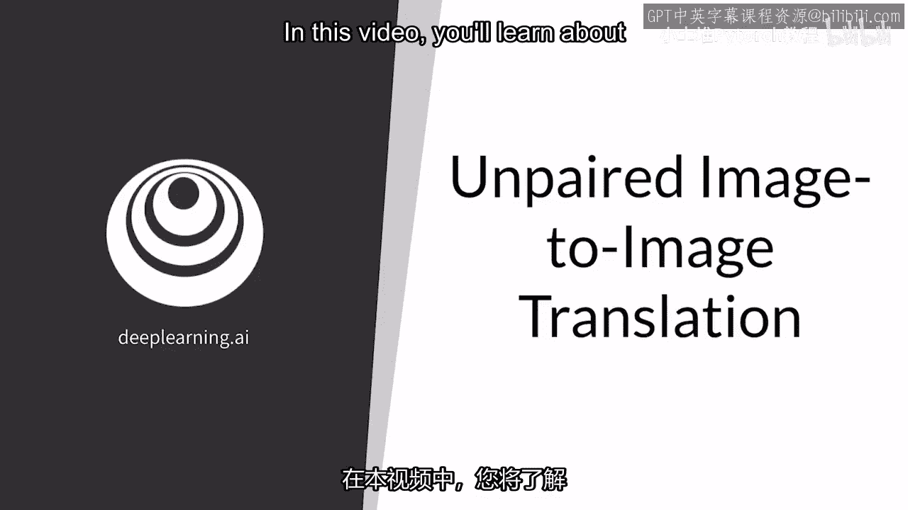
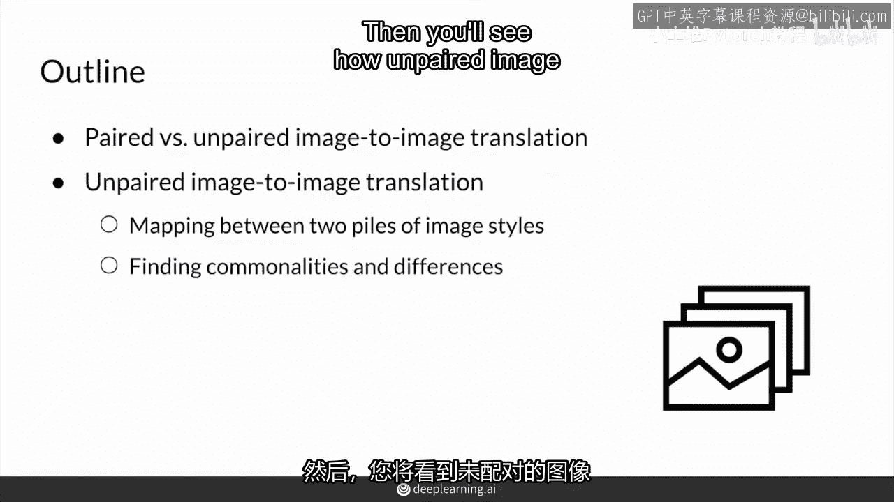
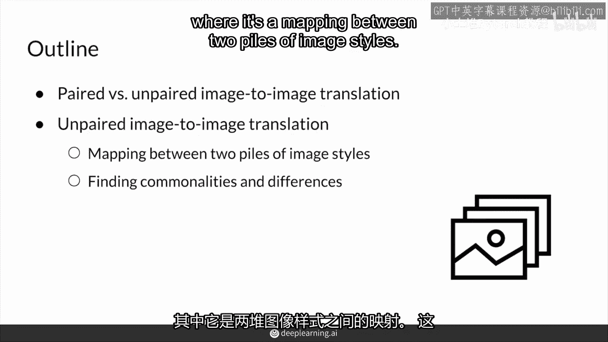
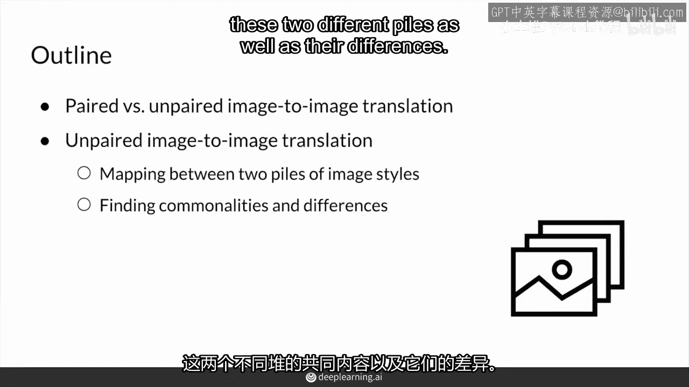
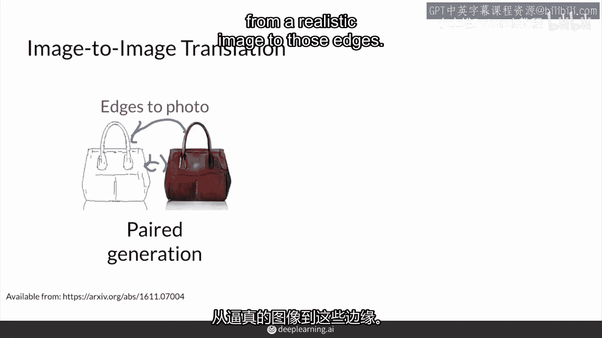
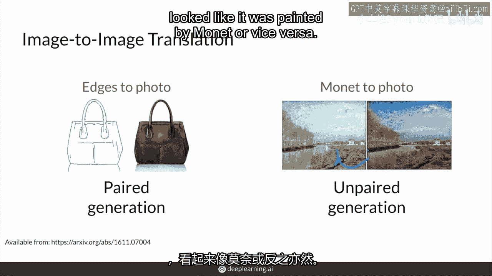
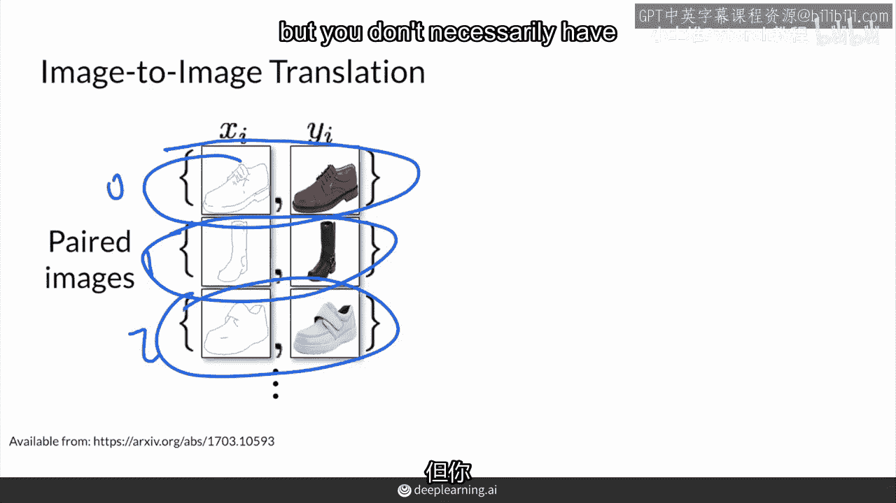
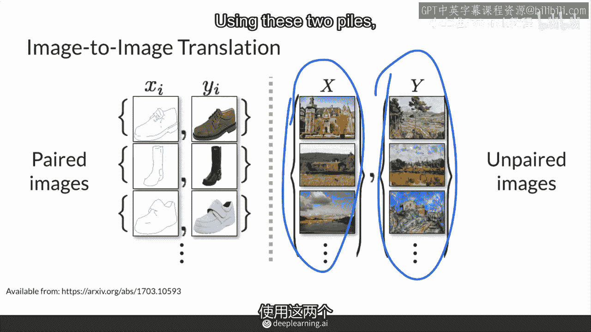
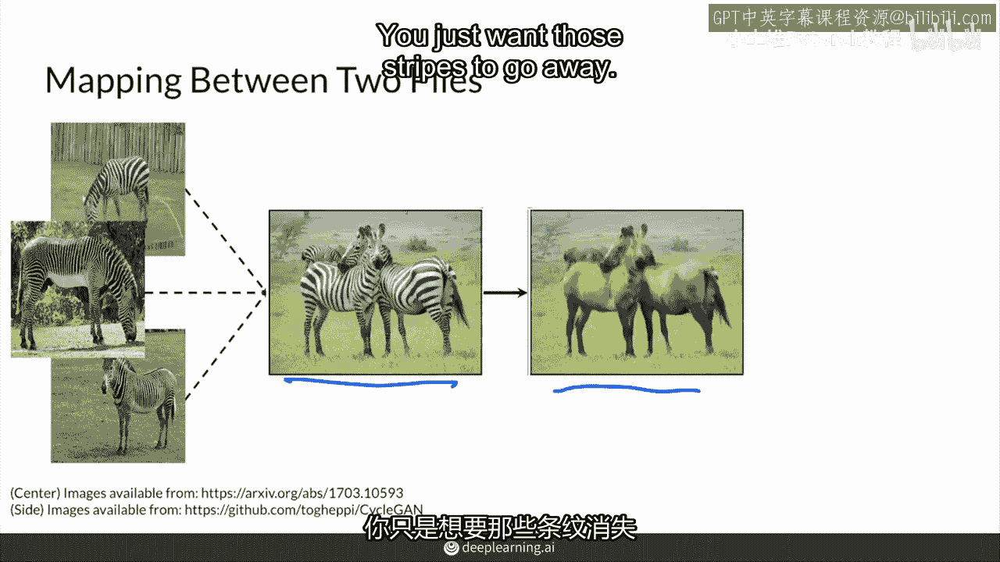
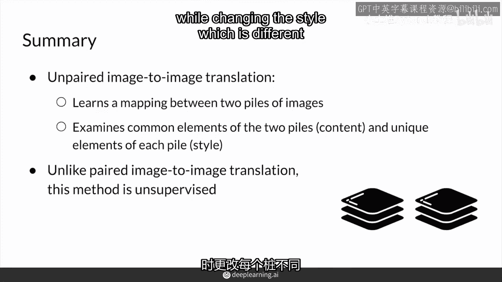

# P76：【2025版】76. 非配对图像到图像翻译.zh_en - 小土堆Pytorch教程 - BV1YeknYbENz

在这个视频中你将了解无配对图像翻译，首先我会比较配对图像翻译，你之前看到的像素匹配到无配对变体，然后你会看到无配对图像翻译是如何工作的。

这是两个图像风格之间的映射。

它实际上是在这两个不同堆中找到共同内容和差异。

所以你之前已经看到了配对图像翻译，这是有明确输入输出配对的情况，例如边缘和真实战斗，因为你会使用边缘检测器，并将真实图像转换为这些边缘，然后你就可以很容易地得到这些配对数据集。

但当你有某种算法来获取这些配对训练数据时，或者你已经出于某种原因拥有这个配对训练数据，无配对图像翻译，这并不直接，例如你想将一匹马变成斑马，或者这里有莫奈的画作，这种生成要困难得多。

因为你可能没有开始就有配对训练数据，你没有为每个照片，都有看起来像莫奈画的东西，或者反之亦然，可能没有上千对的训练数据。

这两种图像到图像翻译范式之间的区别，是前者你有这些配对图像，所以你配对x，i和yi，所以这里有可能是零一二，所以你有所有这些匹配的配对，但你不一定总是有这种对应关系。

而在无配对图像翻译中，你实际上只有两个不同的图像风格的堆，x和y，一堆可能是真实的照片，另一堆可能是莫奈或塞尚之类的，或者你可以有一堆看起来像冬天的图像，与夏季场景，或者一堆马与另一堆斑马。

使用这两个堆。

堆x和y，你想要你的模式从一堆学习到另一堆的一般风格元素，并将图像从一个堆转换到另一个堆，有时也可以反过来，所以从照片到莫奈，也许你也可以从照片到梵高，反之亦然到塞尚和由纪夫。

但关键在于你将这张罂粟田的照片，变成看起来像是莫奈画的，说莫奈，但这仍然是莫奈笔下的罂粟花田，因此仍然有一些内容被保存，只是风格元素发生了变化，这就是思考翻译任务的关键，因为存在同性和风格差异。

每个堆的独特之处，你需要能够区分出共同的部分并保留这些共同元素，只传递每个堆的独特元素。

具体来说，从这个斑马图像生成马，你有一堆斑马，你想要从这个斑马图像生成的马，应该仍然保持相同的方向，你只想让那些条纹消失。

所以，模型的目标是学习这两堆斑马和马之间的映射，并找出那些共同的和不同的元素，共同的元素通常被称为内容，即这两堆图像的共同内容，而风格通常指的是它们之间的不同之处，这里的内容是马的一般形状，甚至是背景。

风格显然是斑马的条纹，而不是马的单一颜色或较少的模式，你将在本周的后续视频中了解这是如何实现的，总结来说，无配对图像到图像转换使用不同风格的图像堆而不是配对图像。

模型通过保留在两者中都存在的内容来学习这两个堆之间的映射，同时改变与每个堆不同的或独特的风格。

