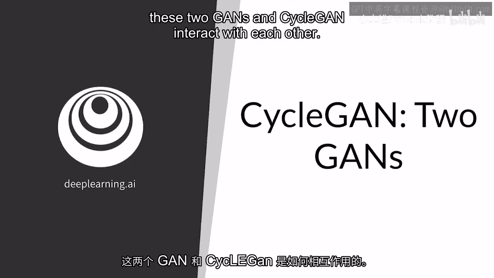
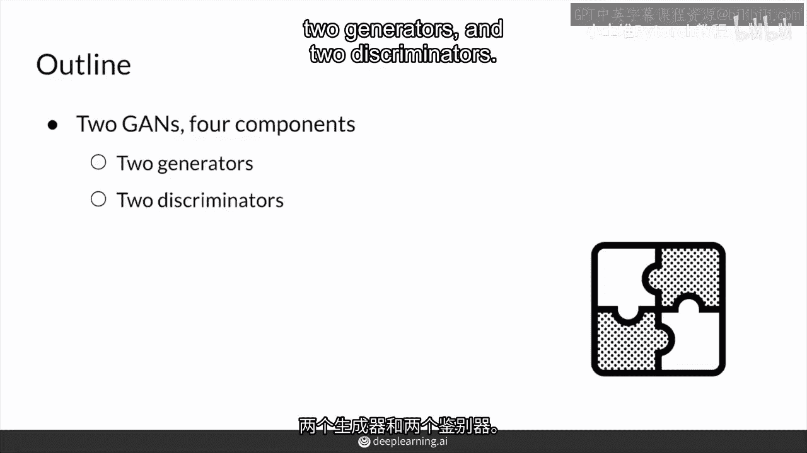
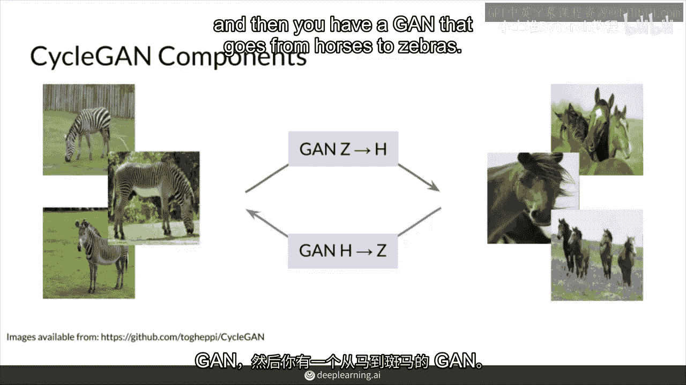
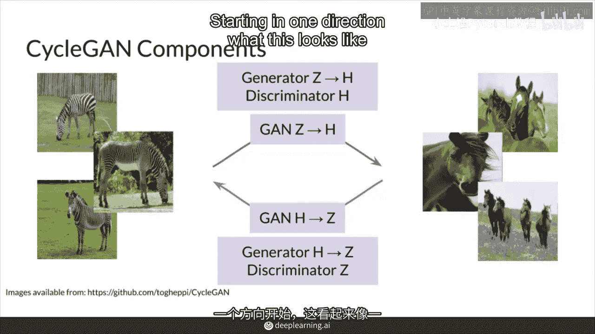
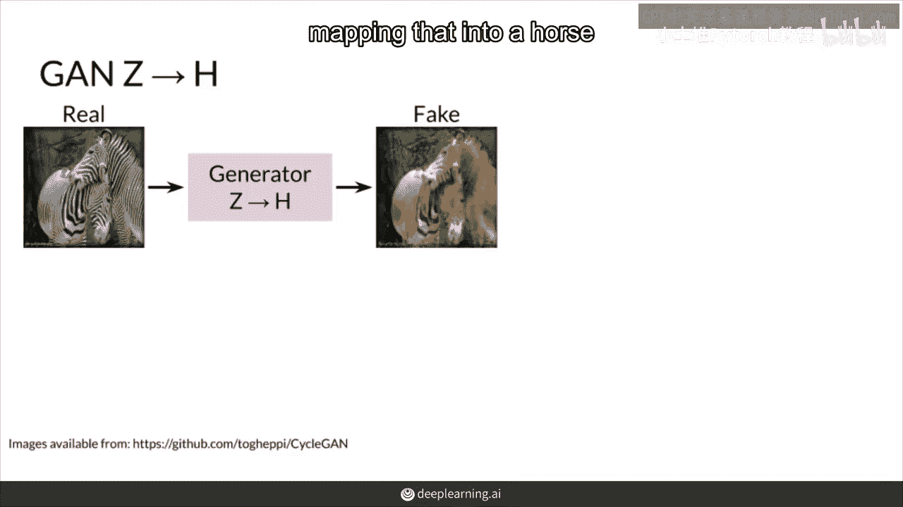
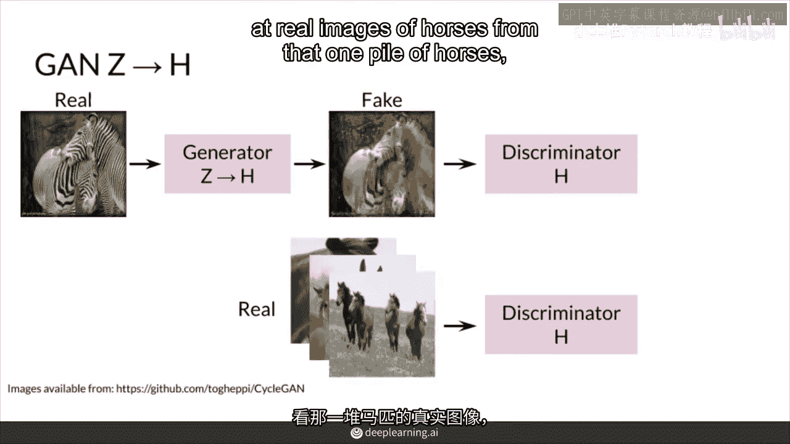
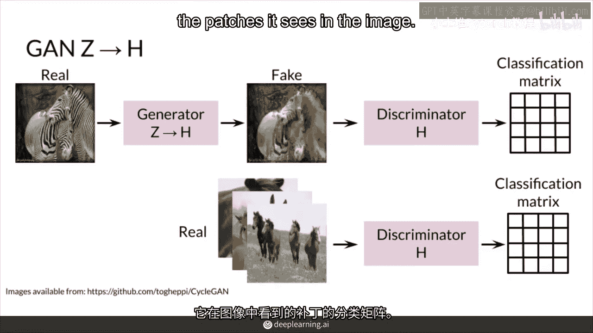
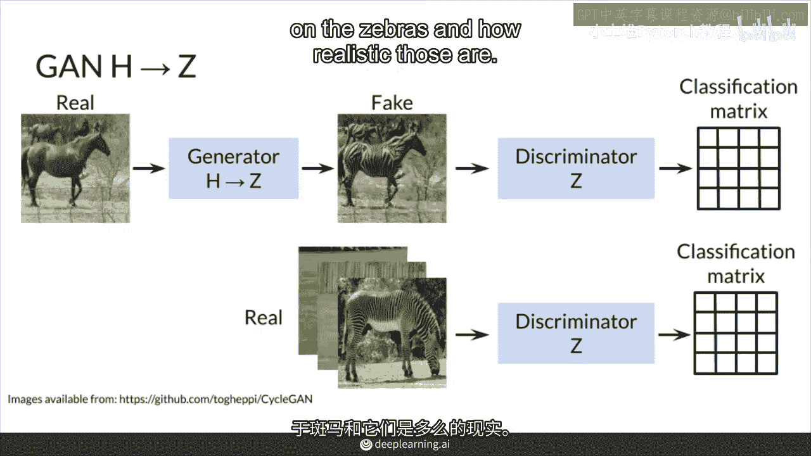

# P78：【2025版】78. CycleGAN两个GAN.zh_en - 小土堆Pytorch教程 - BV1YeknYbENz

在这个视频中，你将会看到这两种GAN和CYAN如何相互影响。

正如预期的那样，这两种GAN各有四个组成部分，两个生成器和两个判别器。

首先，你有一个从斑马到马的GAN，然后你有一个从马到斑马的GAN。

所以你的四个组成部分，一个是学习从斑马到马的生成器，另一个是判别器，检查马的图像的真实性，然后你有一对相反的方向，从马到斑马。

以及检查斑马真实性的判别器，所以，从一个方向来看，输入斑马图像，通过斑马到马的生成器映射到马。

然后，马的判别器负责检查真实的马图像。

来自一堆马，包括那些伪造的马，以确定它们的真实性，当然这是一个补丁GAN。

所以它输出图像中看到的补丁的分类矩阵，相反方向从马到斑马，判别器将关注斑马的真实性。

总结，循环GAN由四个部分组成。

两个GAN各有一个生成器和一个判别器，生成器和判别器的输入与PixaFix相同，但是，没有配对的真实图像，所以你没有之前看到的额外的像素距离损失，因为没有目标输出，相反，你查看两个不同图像的堆。

没有目标输出，因此，你不需要像之前那样有一个真实的目标输出，因为没目标输出。

