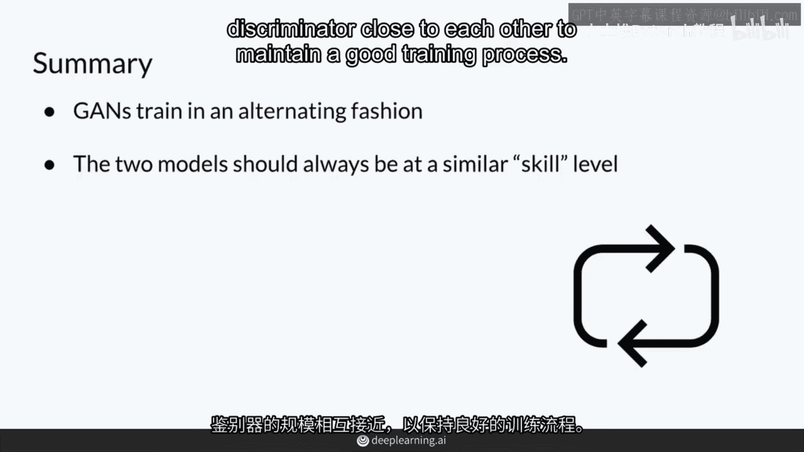

# P8：【2025版】8.结合各个部分 - 小土堆Pytorch教程 - BV1YeknYbENz

所以你已经看到了所有基本的东西以及GAN及其组成部分的直觉，在这个视频中。

你将回顾我之前介绍的一些先前概念，并将它们放在一起，这样你就可以开始训练你的GAN。

首先，我会分享一个GAN架构的可能表示。

然后，我会向你展示如何训练GAN，通过交替训练判别器和生成器。

所以，回想一下，在一个基本的GAN中，生成器以随机噪声作为输入，使用希腊字母ψ表示。

然后生成器产生假例称为x hat，所以这些都是假图片，例如，我不需要经过生成器的课程，但我可以，如果我生成了很多不同的分类，我不需要将分类传递给生成器，稍后我会向你展示这是如何工作的。

然后生成的示例和一些真实示例被传递给判别器，这个概率，这个判别器的输出被称为y hat。

所以，判别器的目标是很好地区分生成的示例和真实的示例，生成器的目标是通过产生看起来尽可能真实的假示例来愚弄判别器，看起来尽可能真实。

所以再次训练基础，你交替训练生成器和判别器。

所以让我们首先看看判别器是如何工作的，首先，当然，你从生成器生成的假示例x hat，由输入噪声产生。

然后那些示例，假 x 帽和真 x 帽，都未经告知就被输入到鉴别器中，鉴别器并不知道哪一些是真实的，哪一些是假的，然后鉴别器做出预测，Ŷ hat，即哪一些是真实的，哪一些是假的，或者更具体地说。

是一个概率，一个关于这些图像是多么假，又是多么真的分数，在那之后，预测结果被用来计算BCE损失。

与真实的和假的标签进行比较，以获得最终的结果，并且这有助于更新其参数，或者theta d，其中d表示判别器的参数，因此这仅更新判别器的参数，仅此一个神经网络，而不是生成器。

对于生成器，它首先生成几个假例。

X hat，这是从输入噪声中产生的，然后这些再次被传递给判别器，但在这种情况下，生成器只能看到自己的假例子，它根本看不到真实的例子，所以它只知道这些例子被传递给了某个判别器，然后判别器做出预测。

Y hat 预测这些是真实的还是假的，然后预测结果使用 VC 损失与所有标签相等进行比较，因为生成器试图让这些假图像等于真实，或者尽可能接近标签1，所以这有点棘手，在生成器和判别器之间有点不同。

鉴别器希望假例子看起来尽可能假，但生成器希望假例子看起来尽可能真实，那就是它想愚弄鉴别器，因此计算完成本后。

梯度然后反向传播，生成器的参数或theta_sub_g被更新，现在只有生成器，在这个过程中只有这个神经网络被更新，不是鉴别器，所以你交替训练它们，每次只训练一个模型，而其他模型保持不变，因此。

当以交替方式训练GAN时。

重要的是要记住，两个模型应该一起改进，并且从训练开始时，应该保持相似的技能水平，这样做的原因是，如果你有一个比生成器更好的判别器，比如超级好，你会得到它的预测。

告诉你所有假例子都是100%假。

这对生成器没用，那对生成器没用，发电机不知道如何改进。

一切，看起来超级假，没有告诉它应该朝哪个方向走，也许，你知道，添加一些更现实的东西，以及如何随着时间的推移学习，同时，如果你有一个完全超越的优越发电机，鉴别器，你将得到预测。

告诉你所有生成的图像百分之百真实，所以当以这种交替方式训练GAN时，重要的是要记住，两个模型应该一起改进，并且从训练开始时就应该保持在相似的技能水平，而这背后的原因很大程度上是因为判别器。

判别器的任务要容易得多，它只是在试图分辨哪些是真实的，哪些是假的，相比之下，生成器，整个类别可能看起来的空间，所有的猫都可能长什么样子，因此，判别器的工作比生成器的容易得多。

一个常见的问题是判别器太强大，判别器学习得太快，当它学得太快时，它突然看一张假图片并说，你知道这百分之百是假的，我知道这是假的，但这百分之百对生成器毫无用处，因为它不知道如何成长和学习，因此。

判别器的输出更加具有信息量，比如0。87假或0。02假，而不是仅仅100%假，1概率1假，对生成器来说，这种信息更加具有指导意义，以便更新其权重，使其。

随着时间的推移，学习生成逼真的图像。

因此，这里最重要的一点对你来说是，GAN训练通常以这种交替方式进行，为了提高训练效果，你必须让生成器和判别器的规模保持接近，为了保持良好的训练过程。

当然，如果你的生成器已经很好。