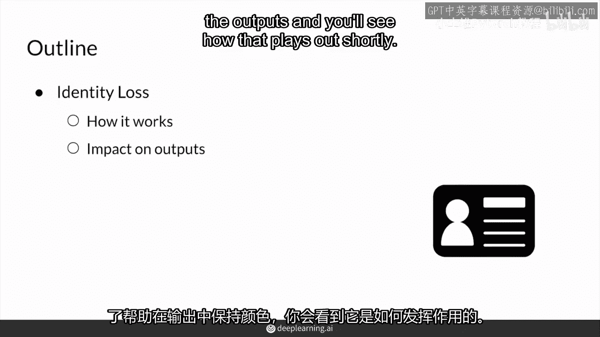
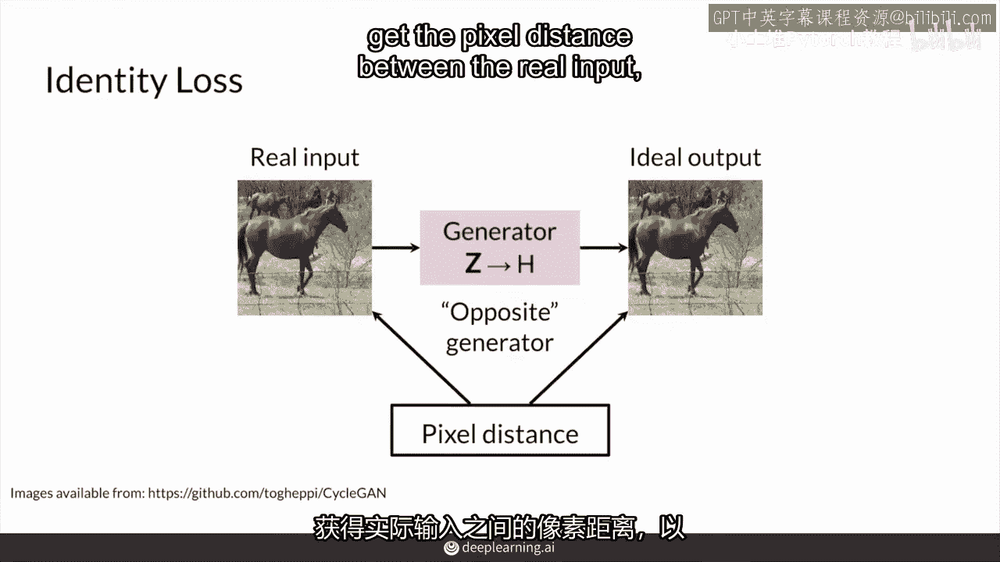
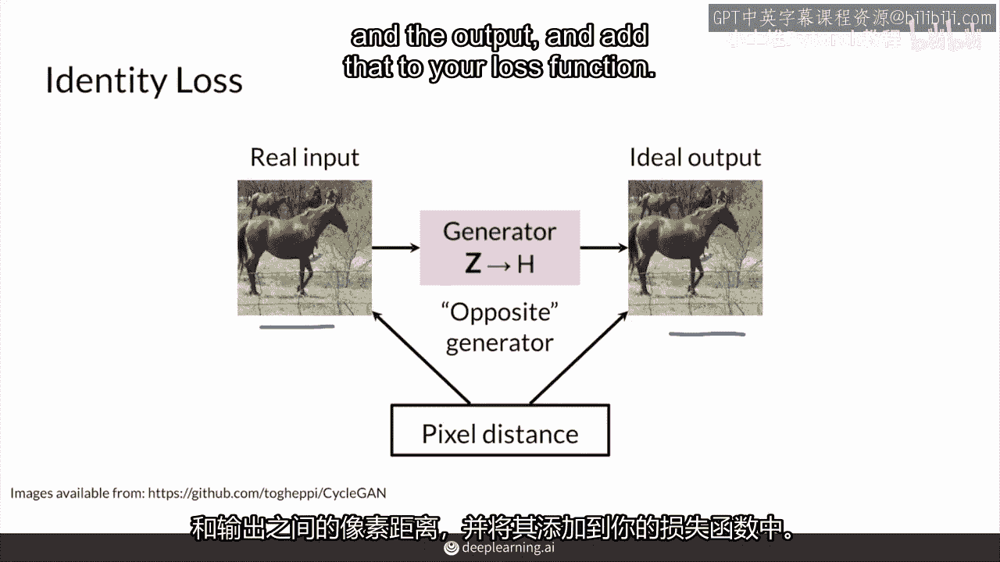
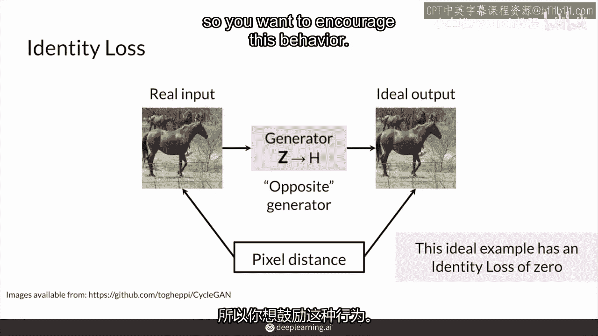
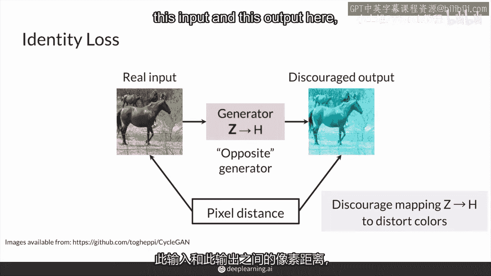
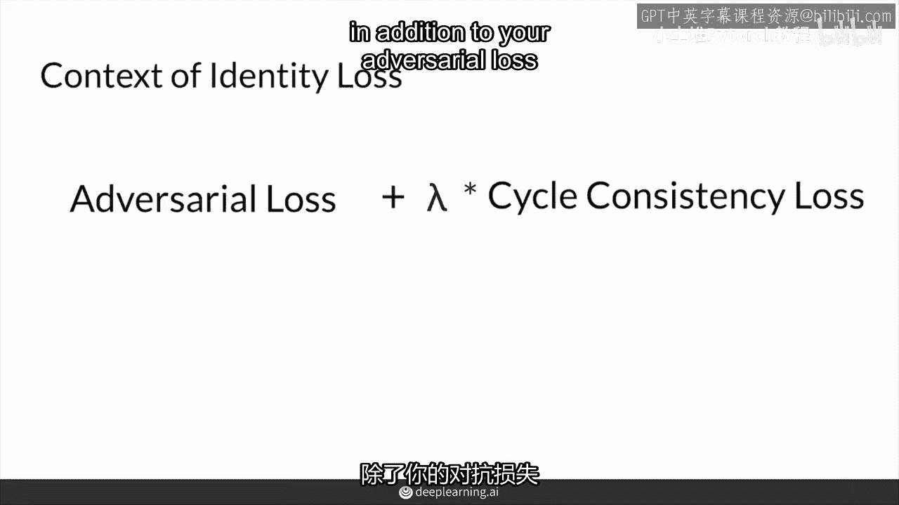
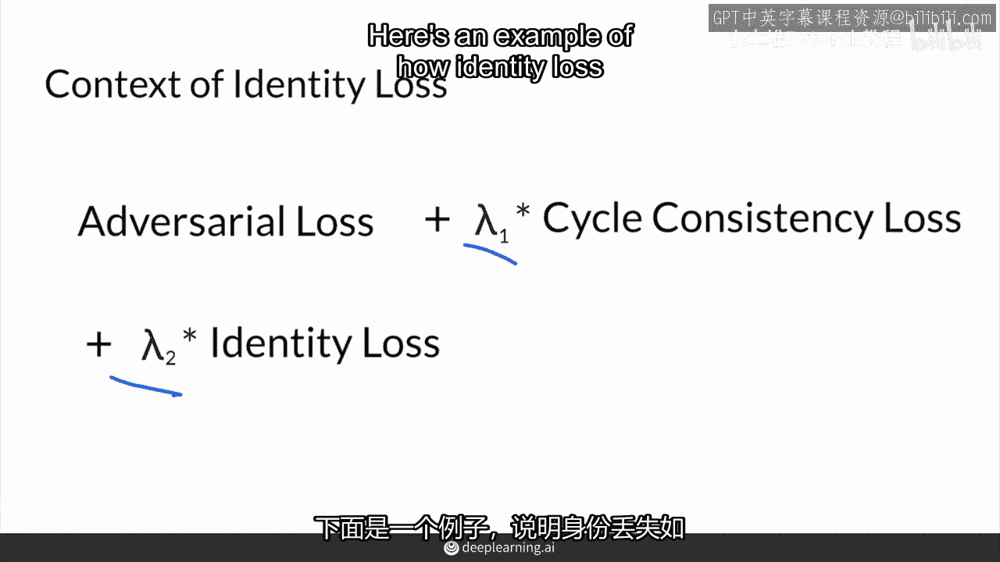
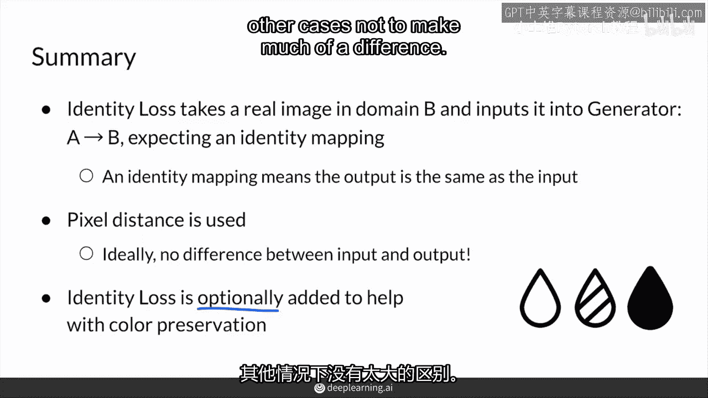

# P81：【2025版】81. CycleGAN身份损失.zh_en - 小土堆Pytorch教程 - BV1YeknYbENz

在这个视频中，首先你将学习身份损失是如何工作的，然后你将看到这如何影响输出，身份损失是一个额外的损失项，是的，你将会有更多的损失项，但这是一个可选的损失项，是被提出的。

循环神经网络主要是为了帮助输出中的颜色保存的，你将看到它如何发挥作用。

除了对抗性损失和循环一致性损失项，还有一个像素差异损失项可以使用，这个也是可选的，称为身份损失，身份损失有助于保留图像的颜色，使映射更具意义，这意味着它确保将像这样的马图像输入到这个相反的生成器中。

我称之为它，这是从斑马到马的生成器，当你将这个真实输入放入斑马到马的生成器中，它应该理想地输出一个完全相同的图像，因为它已经是一匹马的风格，它不是斑马，所以你期望的是斑马到马的生成器会应用身份映射。

或者本质上输入到输出的没有变化。

并且，所以对于你丢失的术语，你可以获取真实输入和生成器在输出产生的像素距离。

并将它添加到你的损失函数中，在这个案例中，像素距离为零。

身份损失的损失为零，这就是理想的，这就是理想的，这就是你想要你的生成器做的事情，它已经是一匹马，你不想让你的生成器把它变成任何其他东西。

所以你想鼓励这种行为，而相反的是，如果生成器将这匹马的图像映射到一些奇怪的东西，它以某种方式改变了图像，也许它改变了颜色，例如，这并不罕见，因为生成器将可能黑色和略带白色的颜色映射到棕色。

所以它可能找到了另一种方法来实现这一点，它会试图将输入图像的整体色调转化为其他东西，所以这里你需要计算输入和输出之间的像素距离。

并阻止这种映射除了身份映射之外的任何其他映射，在青色的整个损失函数中，除了您的对抗性损失和循环一致性损失之外。

您现在具有对斑马到马生成器以及马到斑马生成器的额外身份损失，您将马输入其中，以及将斑马输入其中，因此，这些构成了身份损失。

或者这个，你又想添加一个lambda项，所以我会说这是lambda1，这是lambda，对循环一致性损失项和身份损失项的不同加权，所以这是身份定律如何帮助指导你循环的例子。

所以假设，作为输入你有这些图像，并且这些图像被输入到一个试图将它们映射到不同类型的场景的游戏中，让我们假设将它们映射到不同的场景，并且与身份损失一起，你真的想鼓励这种身份映射。

让我们假设我们期望一个身份映射，然而，没有身份映射。

你偶尔会得到这些类型的颜色失真，我可以想象这些试图将夏季和冬季场景之间进行映射，并且试图为冬季制作一个更蓝的色调，这就是没有身份损失项时发生的情况，当我们实际上想要这种身份映射时，总之。

身份损失将真实图像之一输入到相反的生成器中，并且你期望的实际上是一个身份映射，因为你输入到生成器中的输入图像已经具有，生成器试图映射到的风格，像素距离用于确定这一点，并且理想情况下。

输入和输出之间没有差异，身份损失为零，身份损失总体上，是一个可选的损失项，在某些任务中已被证明有助于颜色保真度，它之所以是可选的原因是在许多情况下，已被证明在许多情况下非常有帮助，但在其他情况下。

并没有多大区别。

