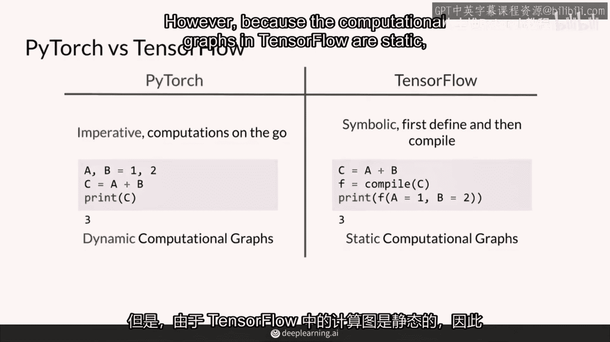
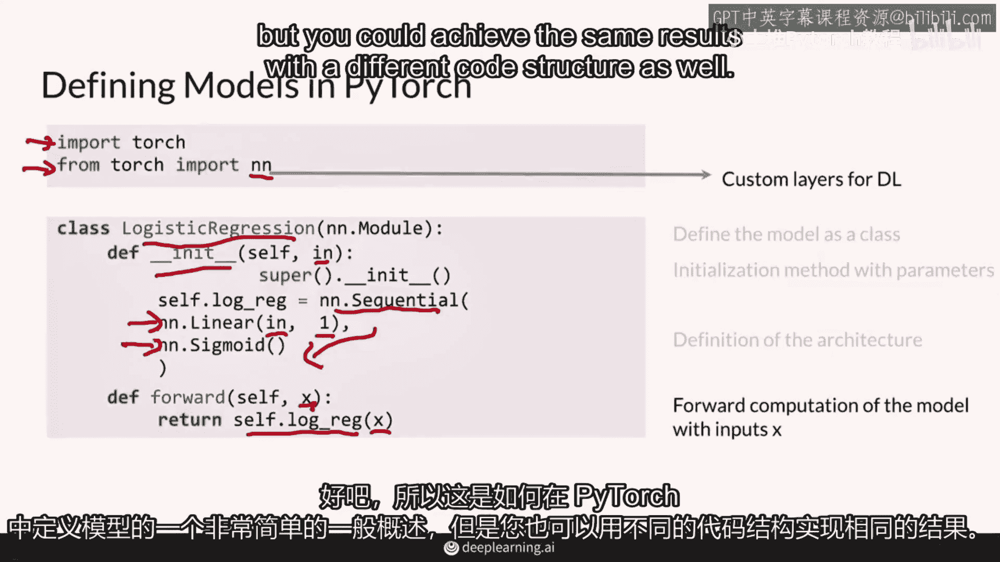
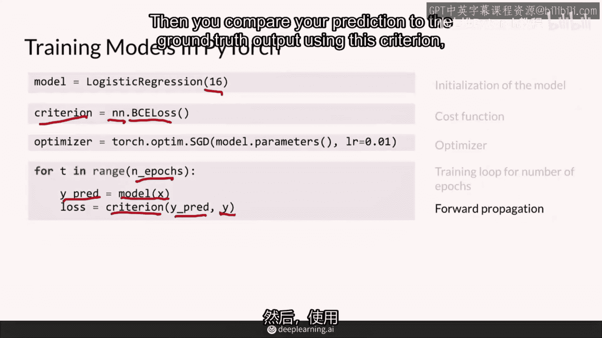
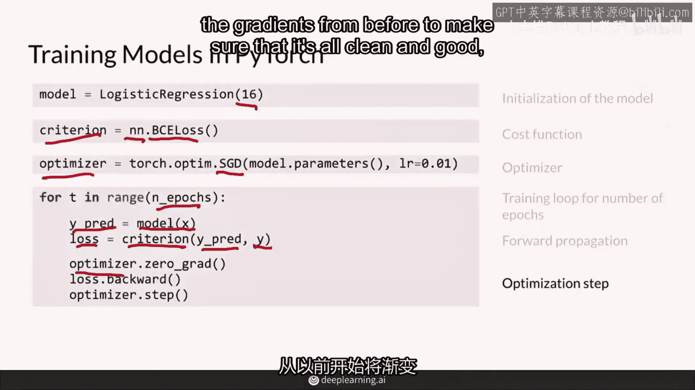

# P9：【2025版】9.PyTorch入门可选内容 - 小土堆Pytorch教程 - BV1YeknYbENz

这个专业中的一些笔记本使用了Pytorch，这是一个由Facebook开发的非常受欢迎的深度学习框架。

我真的很喜欢它，但如果你还没有使用过它。

不要担心，你会发现它与其他框架如TensorFlow非常相似，在每个笔记本任务中。

都会有提示来帮助你使用Pytorch框架。

首先我会比较Pytorch和TensorFlow，然后你会看到如何使用Pytorch定义模型以及如何使用它进行训练。

所以Pytorch和TensorFlow可以说是目前最受欢迎的深度学习框架。

现在，如果你参加了深度学习专业，你可能对TensorFlow很熟悉，但这是个秘密，我更喜欢Pytorch。

它们之间的主要区别在于它们通常在Pytorch中做计算的方式，你在进行中计算，在TensorFlow中，有时被称为命令式编程，你首先定义如何计算。

然后你之后再做计算，被称为象征性的方法。

所以这就意味着在PyTorch中，你有一些变量的值，A和b。

就像它是一，B是二，当你把他们加起来时，你得到了三个结果。

在TensorFlow中，你没有给a和b的初始值，但你可以将它们的和存储在另一个变量c中。

所以这里稍微有点抽象，然后编译c并获取该计算的值。

你必须给a和b赋值，这使得pi torch能够拥有动态计算图。

这意味着你的神经网络可以在每次运行时很容易地改变其结构。

然而，由于tensorflow的计算图是静态的。

这些模型倾向于运行时间更短。

所以，因为你在描述这个c等于a加b或者你的整个神经网络就像那样。

这些计算图被认为是静态的，最近在tensorflow2。0中。

有一种叫做急切执行的东西，这与pytorch动态计算图非常相似。

总之，动态计算图在pytorch中感觉更自然。

总的来说。

这些框架目前非常相似，你会发现从一个框架到另一个框架的转换从未如此容易。

特别是从tensorflow到pytorch的方向，所以，专注于PyTorch。

让我们从如何使用PyTorch定义模型开始，首先，你需要导入PyTorch，使用import torch这条语句，这只是PyTorch库，然后，也很有用导入nn模块，它代表神经网络。

它包括用于深度学习模型的自定义层。

所以，非常有用，非常实用，在PyTorch中定义模型的常见方法是使用nn模块的子类。

这里，logistic regression类将帮助我们创建一个逻辑回归模型。

该类的初始化方法接受你想要为你的模型设置的参数。

这是典型的Python面向对象编程，在这里，变量在这里决定了这个逻辑回归模型的输入变量数量，然后，你定义模型的架构作为构造函数中的一个属性。

对于逻辑回归，你可以使用一个线性层和一个sigmoid激活函数。

在一个称为顺序模块中。

顺序模块只是顺序地添加层，首先给我一个线性层。

然后给我一个sigmoid激活函数。

在这里，线性层中你可以看到这是从这里传递的变量，所以这是输入的大小。

然后输出是1。

我只想从这些输入中得到一个预测，这里可以是猫的类别或不是猫的类别。

然后通过sigmoid激活函数产生0到1之间的值，最后，在init这里定义你模型类的前向方法。

前向方法只意味着你模型在前向传递中做什么。

给定输入产生输出。

这不是后向传递与反向传播。

前向传递是你输入输入时发生的事情，它如何产生输出，在输入x中，你放输入x。

通过这一系列顺序层。

在这里，你定义顺序模型，self。logistic regression，你只是返回，给定输入x。

你将其通过这一系列顺序层，好的，所以这是一个非常简单的一般概述，如何在PyTorch中定义模型。

但你也可以用不同的结构实现相同的结果。

现在，为了训练这个框架中的模型，你必须初始化你定义的模型类的一个实例，这里逻辑回归类，这个模型从上一个幻灯片有16个输入变量，然后你确定你的模型的成本函数。

我将其称为准则，所以这是你的模型学习的准则。

这就是在PyTorch中给成本函数起的典型名字。

我在这里初始化BCE损失作为成本函数，它通过nn库可用，PyTorch神经网络库，然后您需要选择要使用的优化器。

例如，随机梯度下降传递您模型的参数，所以这些是您之前见过的theta，并且在训练过程中将被更新权重，然后你必须为这个优化器指定不同的超参数，例如。

学习率在这里，你可以为你的模型训练多个不同的epochs。

所以让我们开始训练循环，进行n个epochs，在这个训练循环中，你将输入传递给你的模型。

你得到你的模型的预测。

然后你将你的预测与你的真实输出进行比较，使用这一标准。

使用你的成本函数，然后你得到这个步骤的损失。

然后朝着你的最优解前进一步，使用你定义的优化器。

你不需要担心这里的确切语法，但基本上发生的是，这个优化器，我们正在清零之前的梯度，以确保一切都干净且良好，这是反向传播的重要步骤。

这为反向传播步骤做好准备，而这个最后的优化器点步骤这里。

意味着使用随机梯度下降对模型参数进行操作，使用这个小的学习速率来朝着那个方向前进并更新那些参数。

总之，Pytorch在运行中进行计算，这使得您可以在每个单独的运行中尝试可以改变的模型。

但是，正如您在本视频中所见，Pytorch只是另一个深度学习框架，实际上与TensorFlow非常相似。

您可以无任何问题地在这些框架之间切换。

