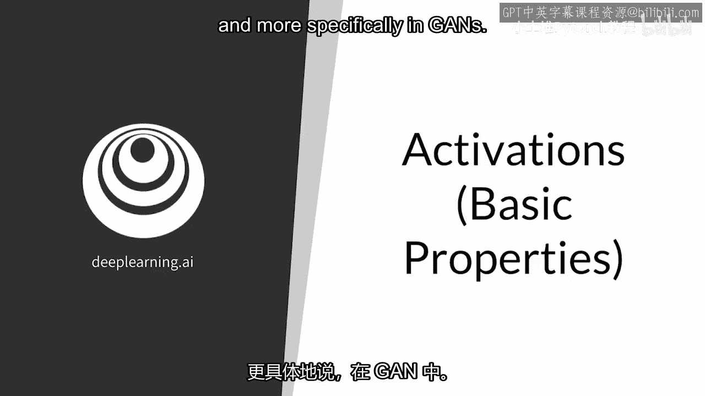
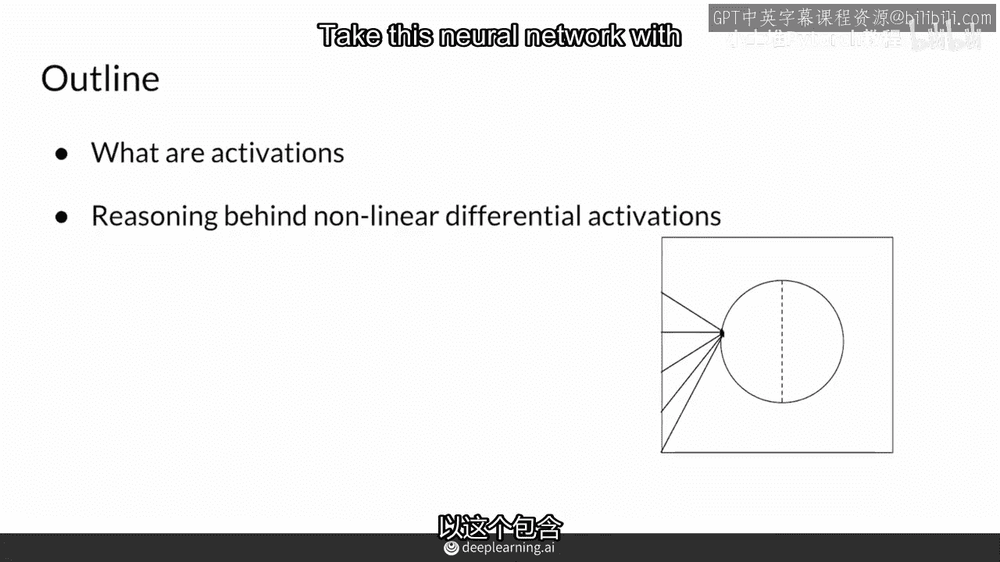
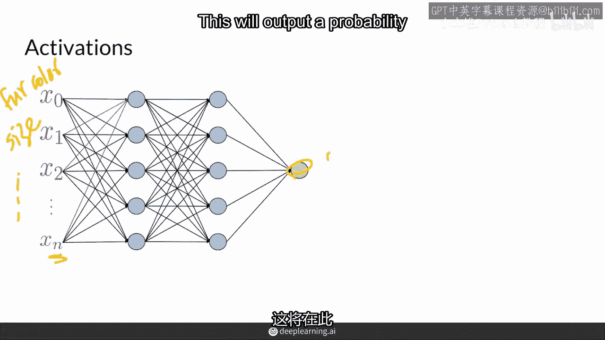
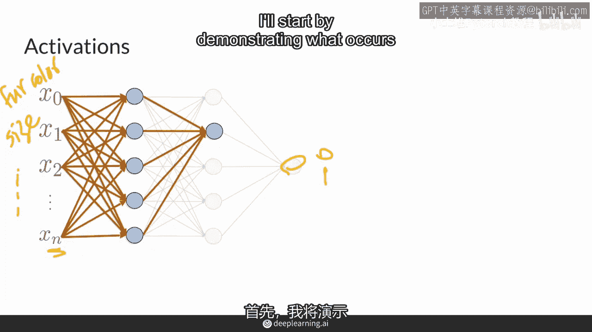
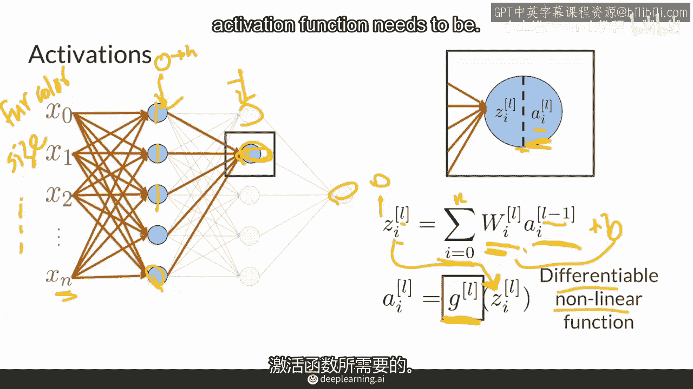
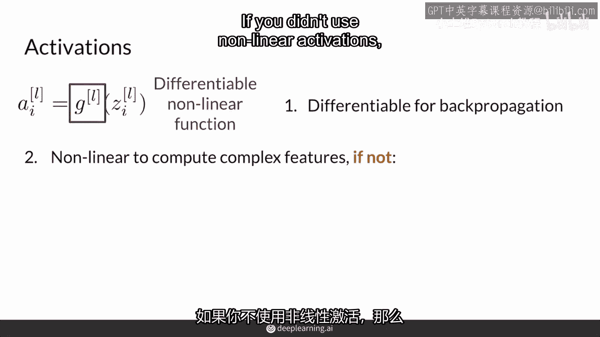
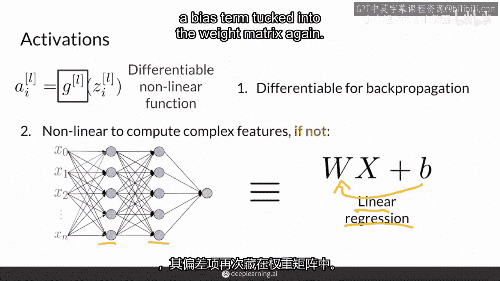
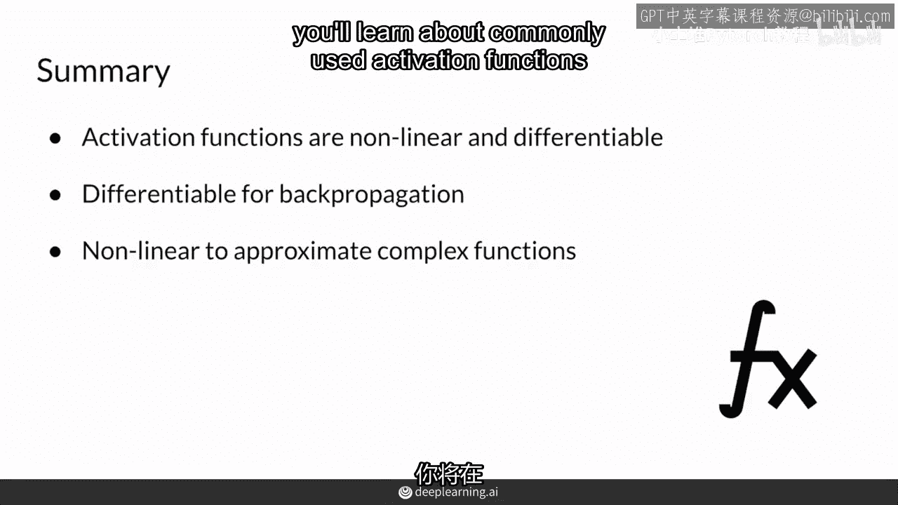

# P11：【2025版】11.激活函数的基本属性.zh_en - 小土堆Pytorch教程 - BV1YeknYbENz

激活函数是输入任何实数的函数，也称为其定义域，并输出一个特定范围内的数字，使用非线性可微函数，您通常在深度神经网络的某些层之间使用它们进行分类，在本视频中，我更详细地介绍了GANs中激活函数的使用。

我将解释激活函数的概念，以及它们为什么必须是非线性且可微的，这意味着它们可以有导数，意味着它们有梯度，所以，将这个拥有两个隐藏层和多个输入的神经网络。

例如，X0可能是毛色，X1是动物的大小，以及其他各种特征，并且说这个神经网络预测这些特征是否构成一只猫，所以，这将在最后输出一个0到1之间的概率。

那么，这些中间的所有节点呢，所有这些节点一起，构成了整个神经网络的架构，我将从演示每个节点的操作开始。

所以这里的一个节点从前一层接收信息，并且预测两件事，我将用这条虚线分开，首先它计算z，其中i表示是哪个节点，所以这里是01，是第一个节点，所以i等于1，而l表示层，这里是第0层，这里是第1层，所以再次。

L是1和z，这里等于前一层输出的各种权重的总和，所以你在这里看到a，但这里的a是来自前一层的这些节点的另一侧，而l-1仅仅意味着它是前一层，所以这里是第零层，并且它查看所有这些不同的值。

其中i等于0一直到，i等于n直到这里，因此z正在观察前一层并加权它们，所以z是这些值w加权前层的输出，这通常被称为线性层，它包括权重的缩放值，以及偏置项，这将移动那些值，所以这里可以表示为加上b。

但通常你可以将b纳入矩阵w中，而在另一边是a，a是激活函数的输出，我将其称为g，输入为z值，这层输出，我将快速解释，什么是可微分和非线性，因为这就是激活函数需要成为的。

所以你需要你的激活函数g是可微分和非线性的，它需要是可微分的，因为你使用反向传播来训练你的神经网络并更新其参数，所以它需要是可微分的并能够为前一层提供梯度，它也需要是非线性的。

所以你在神经网络中计算的特征可以很复杂，如果你不使用非线性激活。

一个具有多个隐藏层的神经网络，实际上可以被简化为一个简单的线性回归，这些原始输入作为x，这两个层实际上可以变成一个单层，因为没有非线性，因为线性层可以堆叠在一起，线性回归就是一个带有偏置项的线性层。

总结一下，你需要非线性可微分的激活来利用深度学习模型，并且让层堆叠在一起，构建一个复杂的神经网络来建模复杂的非线性函数，因此，非，线性性特别地，确保你的线性层不会简化为一个线性回归的单个线性层。

所以你的网络可以学习更复杂的函数，可微分的方面确保你的网络可以通过反向传播学习，通过计算导数，你可以使用任何自定义函数作为你深度学习模型的激活，只要你确保它是非线性和可微分的。

研究人员经常实验看看什么效果最好。

