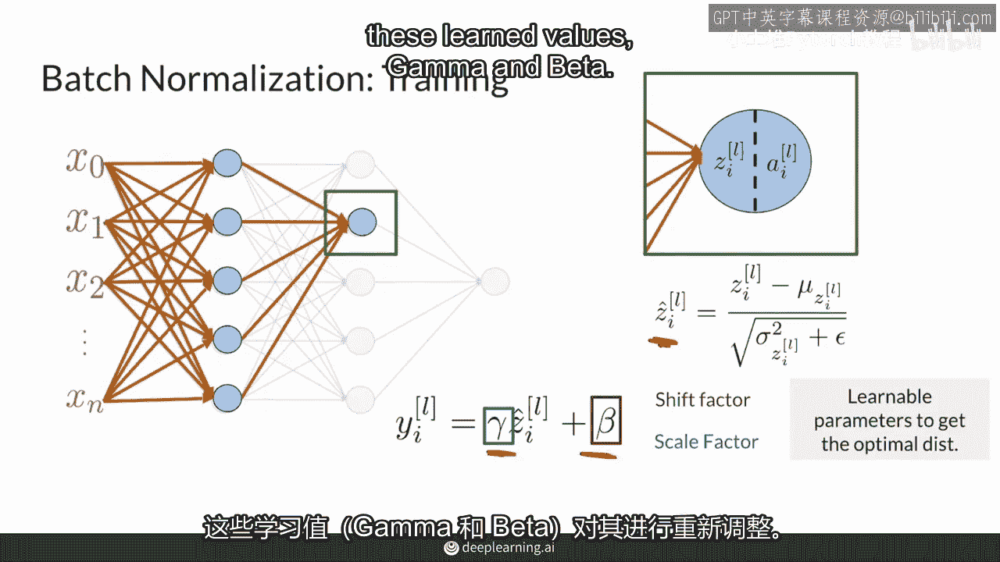

# P14：【2025版】14. 批归一化过程.zh_en - 小土堆Pytorch教程 - BV1YeknYbENz

批量归一化可能听起来很吓人，但实际上它是一个相当直接的过程，你可以从零开始实现它，然而，像PyTorch这样的框架实际上会为你做这件事，在这段视频中，我将向你展示它是如何工作的。

你将了解批量归常化操作在这个视频中，以及在训练和测试期间的差异，批量归一化创建这些快乐的归一化值分布。

就像你看到的这里一样，假设这个具有两个隐藏层的神经网络。

有多个输入和一个输出，我将专注于这个内部的隐藏层来解释批量归一化是如何工作的。

所以从输入开始，这里Z来自所有过去的节点，批量归一化考虑每个示例，批中的张量Zi，例如，你可以有一个批大小为三二，所以你将有三二，Z的这里再次，作为提醒，这里I表示这是第i个节点在这个层。

并且l表示这是第l层，例如这里是第零层第一层，或者这里是第零节点，第i一个节点，因此批量归一化取批的大小，例如32，并且它有32，Z的这里并且从这些三二，Z的它想要归一化它。

以便它有一个均值为零的标准差为一，所以你所做的是你得到批的均值你的mu，并且这只是这些三二值的均值，然后你也得到批的方差sigma平方，这也是这些三二值的值，为了将这些e值归一化为均值为零标准差为一。

你减去均值并且除以标准差，或者这里是方差的平方根，并且在这里添加一个epsilon以确保分母不为零，并且最后你得到这些归一化Z的值。

我将其称为z hat，所以当你得到归一化值z hat之后，你会在批量归一化层中学习参数，这意味着你会有一个叫做beta的值，这将是偏移量并且gamma将是比例因子，并且这些参数是在训练期间学习的。

以确保你将Z归一化为你的任务最优的分布，所以在你完全归一化之后。

然后你根据这些学习值gamma和beta来缩放它们。

这就是归一化输入和批量归一化的主要区别，因为这里你没有强迫你的分布为零，均值和标准差为1每次，在归一化之后，然后你可以继续调整以适应必要的任务，这里关键的是，批量归一化给你控制那个分布的外观。

在神经网络的前进，这个最后的值在移位和缩放后会被称为y。

这个y然后会进入这个激活函数。

所以这是在训练和测试期间，您希望在不同的批次之间防止出现不同的均值和标准差，因为这意味着相同的示例，但在不同的批次中会产生不同的结果，因为它由于特定的批次均值，或特定的批次标准差而进行了不同的正常化。

因此，您希望在测试时间和测试期间获得稳定的预测，您使用的是在整个训练集上计算的运行均值，和标准差，并且在训练后这些值现在是固定的，所以它们不会移动，但之后你只需遵循一个非常相似的过程。

这就是那些z值的期望值，这就是移动平均值，这里是那些z值的方差，当你取平方根时，这里会得到标准差，你仍然有这里这个epsilon来防止分母变为零，之后你只需遵循训练时的相同过程。

并将这些归一化值输入到学习参数中，然后激活函数，但是不要太担心这个过程的细节，如我之前所说，像tensorflow和pytorch这样的框架，会为你跟踪这些统计数据。

你所需要做的就是创建一个批处理归一化层，然后当你的模型处于测试模式，运行统计数据将为你整个数据集计算或保存，这真的很好，你可能也听说过测试模式被称为测试时间，推理时间，评估模式，这些大致等效。

你可以将它们视为非训练时间。

总之，批标准化与标准正则化不同，因为训练时，您使用每个批次的统计数据，而不是整个数据集，这减少了计算时间，使训练更快，不必等待整个数据集被处理完才能使用批标准化，第二，通过引入可学习的偏移量和比例参数。

你不强迫目标分布具有零均值和标准差为1，最后，在测试时间，训练期间的运行统计应用于整个数据集，这保持了预测的稳定性，因为训练值是独立的和固定的，一个重要的注意事项是。

深度学习框架在训练和测试期间实现了整个流程，所以你需要知道何时使用它，在你的GANs或其他一些令人惊叹的模型中，你想要训练，你也将了解即将到来的几周内更先进的归一化技术。

