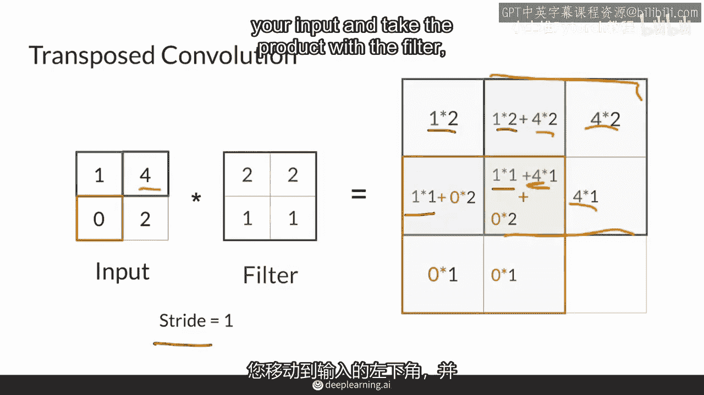

# P18：【2025版】18. 转置卷积.zh_en - 小土堆Pytorch教程 - BV1YeknYbENz

现在，你已经熟悉了卷积、池化和上采样层，让我们在这个视频中谈谈转置卷积。

我将讨论转置卷积和上采样技术，那使用了一个可学习的滤波器来扩大你输入的大小，然后，我会向你展示这种方法的输出结果有一个非常特别的问题。

与像素值计算的方式有关。

所以，将这个以2x2输入的示例放在心上，你想要将样本上采样到一个3x3的输出，使用转置卷积，你可以使用一个2x2的学习滤波器，步幅等于1，完成这项任务，通过遵循与早期在本课程中展示的卷积非常相似的程序。

所以您首先从输入中取左上角值，并将其与过滤器中的2x2值相乘，然后将此值保存在输出左上角的2x2值中，所以这是那次操作的乘积值，接下来，您将过滤器向右移动一步，然后在下一个像素上重复相同的过程。

然后您将过滤器向下移动一步，并在下一个像素上重复相同的过程，现在，它位于你输入的右上角。

以及这里外面的这四个像素点，以及你的输出。

你将产品放在那里，哪里重叠，你就把产品加到之前的产品上。然后，你将移动到你输入的左下角，取过滤后的产品。

然后取结果，以此类推。就这样，直到你覆盖了整个输入。

所以，经过这样的计算，你可以看到，输出中的一些值对输入中的值的影响要大得多。

例如，输出中心像素受到所有输入值的影响，而角落只受到单一值的影响，这就是转置卷积操作，在滤波器中，这就是它正在做的全部，这些值是学习的，但存在一个问题，中心像素被访问了四次。

并且受到所有像素的影响，而其他像素则没有，这会导致在使用转置卷积时出现的一个常见问题，这张图片展示了一个转置卷积的真实输出。

圆圈并不是生成的，它只是对棋盘格问题的放大，请注意，图像具有类似于棋盘格的图案，这是因为当你用滤波器上采样时，一些像素被影响得更多，而周围的像素则影响较小，尽管存在这个问题，然而。

转置卷积在研究社区中仍然相当流行，尽管，使用上采样后跟卷积现在是一种更流行的技术，为了避免这种棋盘问题，总结一下，转置卷积被用作一种上采样方法，它们与上采样层不同，具有可学习的参数。

使用转置卷积产生的一个问题是输出存在棋盘问题，然而，输出存在棋盘问题，尽管如此，这些层仍然很受欢迎。

