# P21：【2025版】21. BCE损失的问题.zh_en - 小土堆Pytorch教程 - BV1YeknYbENz

二元交叉熵损失或VC损失传统上用于训练GANs，但这不是用BCE损失训练GAN的最佳方法，GANs容易陷入模式崩溃和其他问题，本视频中。

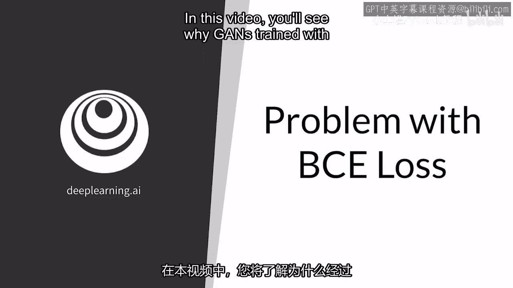

你将看到使用BCE损失训练的GANs容易受到梯度消失问题的原因，为此，你将回顾BCE损失函数，以及这对生成器和判别器的目标意味着什么，然后，你将看到。

何时以及为何使用BCE损失的GANs可能出现梯度消失问题。

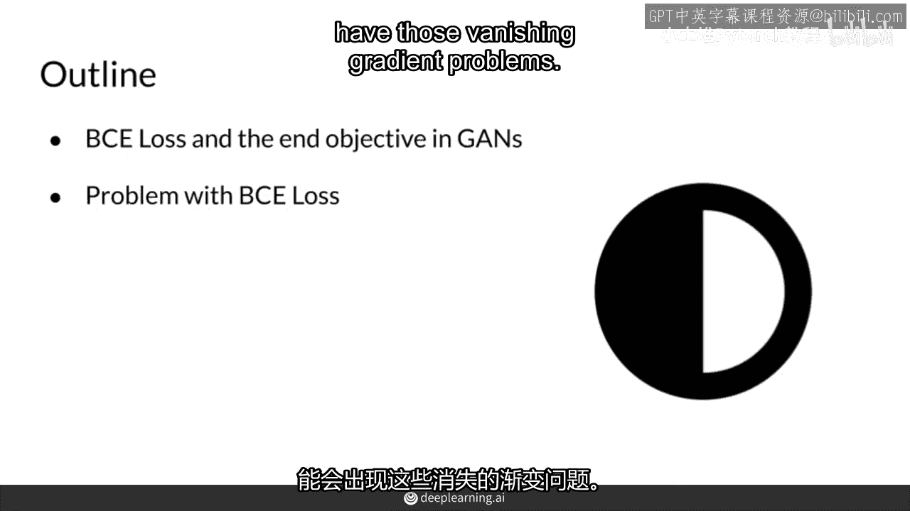

所以记得损失函数的形式，它只是分类器对真实和假观察错误分类的成本的平均值，第一个术语是真实的，第二个术语是假的，第一个术语是真实的，第二个术语是假的，成本值越高，鉴别器做得越差，生成器想最大化这个成本。

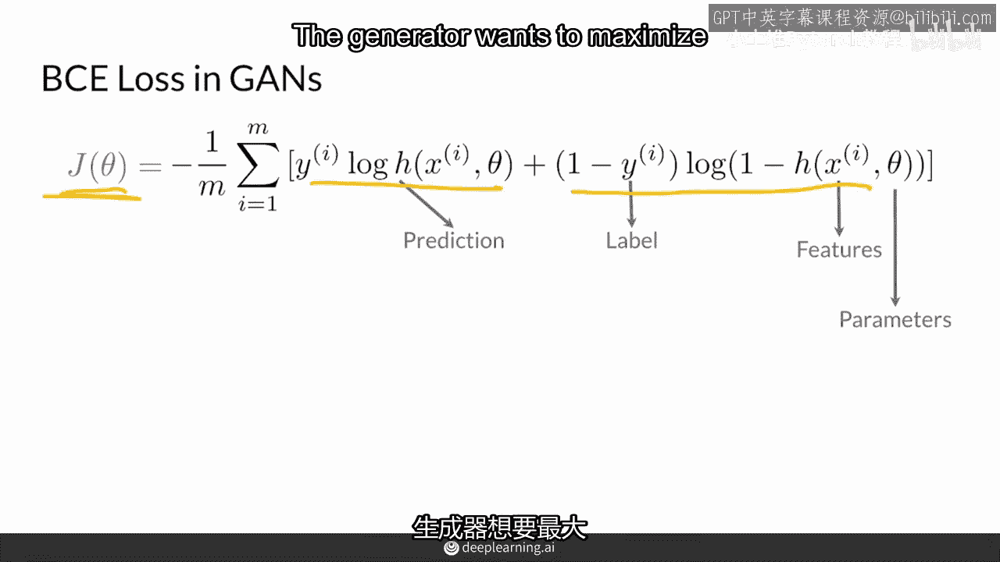

这意味着鉴别器做得不好，并将假值分类为真实。

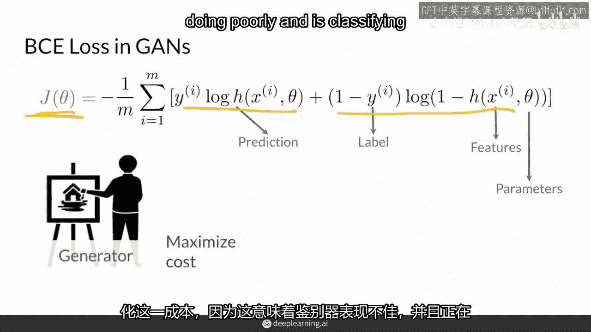

而鉴别器想最小化这个成本函数，因为这意味着它正确地分类了事物，当然，生成器只能看到事物的假象，所以它实际上对真实的事物一无所知，而这种最大化和最小化通常被称为最小最大化游戏。

这就是你可能听到它被提及的方式。

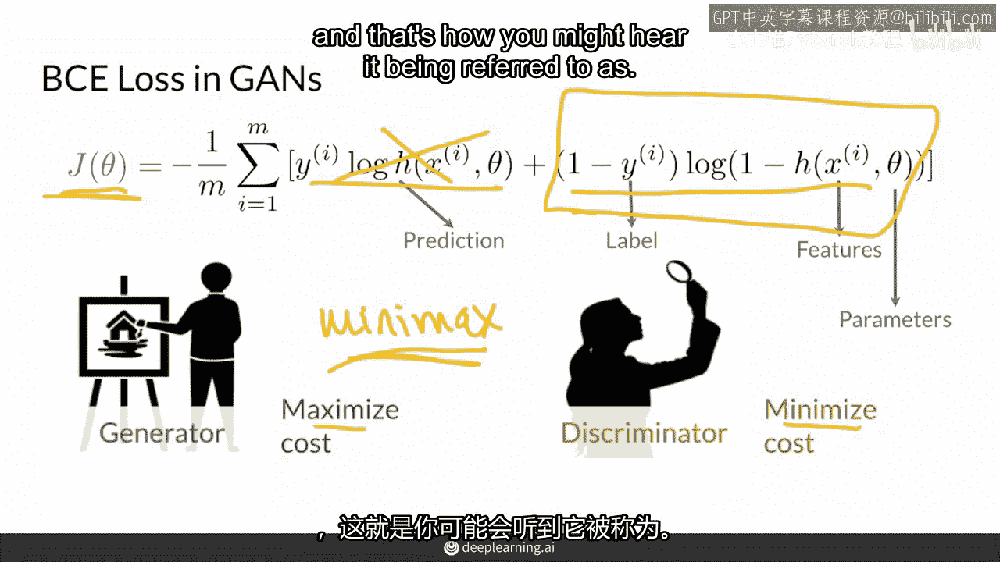

在最小最大化游戏的最后，生成器和判别器之间的互动转化为整个GAN架构的更广泛目标，那就是让真实和生成的数据特征分布非常，非常相似，试图让生成的分布尽可能接近真实，因此。

这个二进制交叉熵损失函数的极小极大值在某种程度上近似于最小化另一个复杂的成本函数，试图实现这一点。当然，在整个训练过程中，判别器自然试图尽可能清晰地区分真实和伪造的分布。

而生成器则试图使生成的分布看起来更像真实的。然而，让我们再次退一步，考虑生成器和判别器的角色。再次，判别器只需要输出一个0到1之间的单一预测值。而生成器实际上需要生成一个相当复杂的输出。因此。

这个二进制交叉熵损失函数的极小极大值在某种程度上近似于最小化另一个复杂的成本函数，试图实现这一点。当然，在整个训练过程中，判别器自然试图尽可能清晰地区分真实和伪造的分布。

而生成器则试图使生成的分布看起来更像真实的。

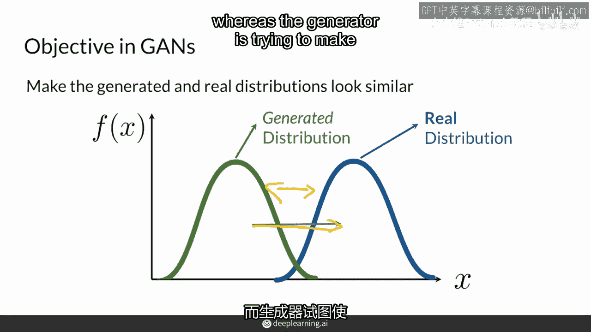

然而，让我们再次退一步，考虑生成器和判别器的角色。再次，判别器只需要输出一个0到1之间的单一预测值。而生成器实际上需要生成一个相当复杂的输出。

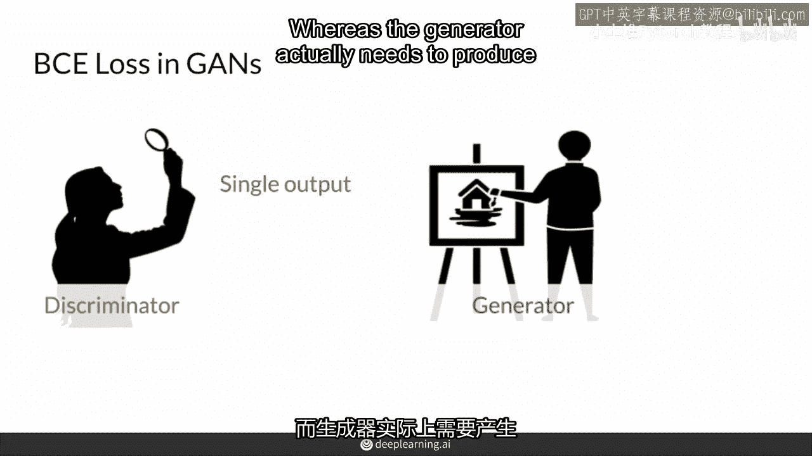

由多个特征组成，试图愚弄判别器，例如，一张图片，结果，判别器的工作往往更容易，可以说，另一种方式，在博物馆看画比创作那些杰作更容易，因此，训练期间，判别器可能比生成器表现得更好，非常有可能。

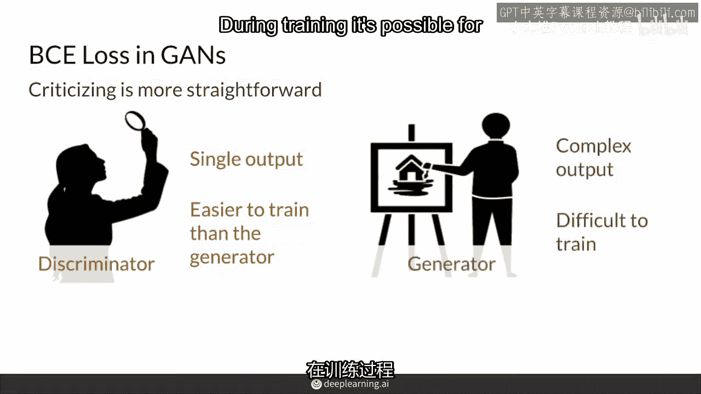

事实上，这是很常见的。

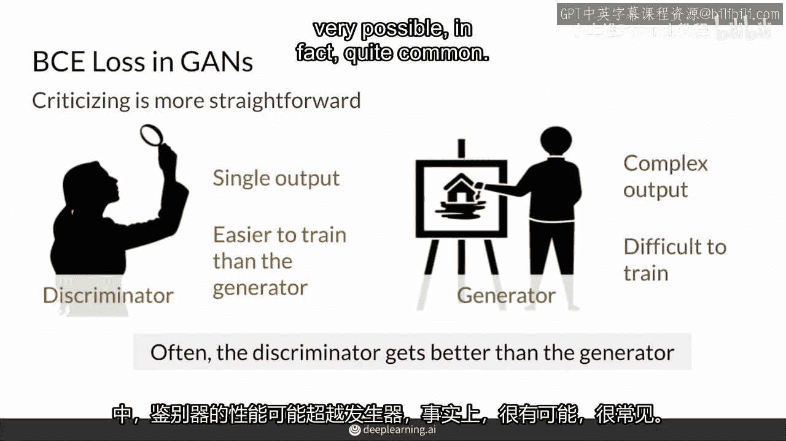

但在训练开始时，这个问题并不是很大，因为判别器并不够好，所以它很难区分生成的和真实的分布，两者之间有一些重叠，它并不确定，结果，它能够以非零的梯度形式给出有用的反馈，反馈给生成器，然而，随着它越来越好。

它开始更清晰地区分生成的和真实的分布，这样它就能更好地区分它们，真实的分布会集中在一个点上，而生成的分布会逐渐接近零，结果，当判别器越来越好时，它会开始给出较少信息的反馈，实际上。

它可能会给出接近零的梯度，这对生成器没有帮助，因为生成器不知道如何改进，这就是梯度消失问题出现的原因。

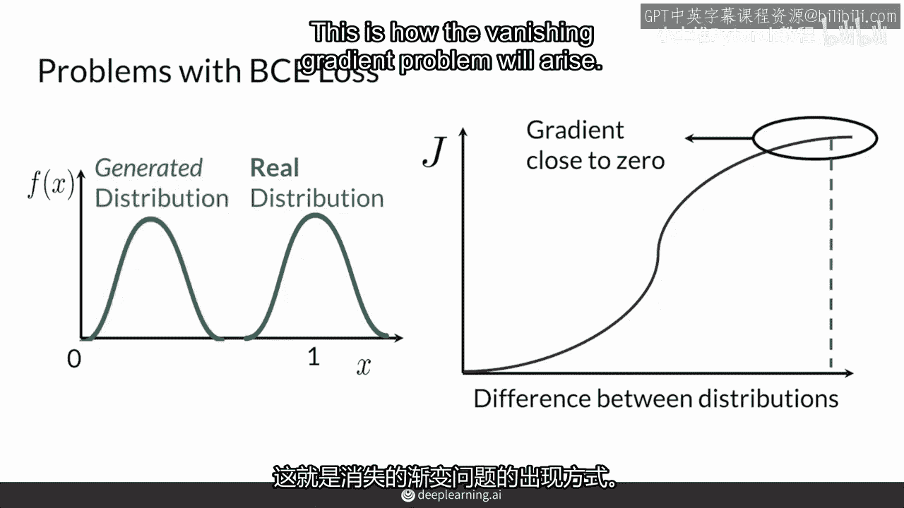

总结，GANs试图让生成的分布看起来与真实的分布相似。

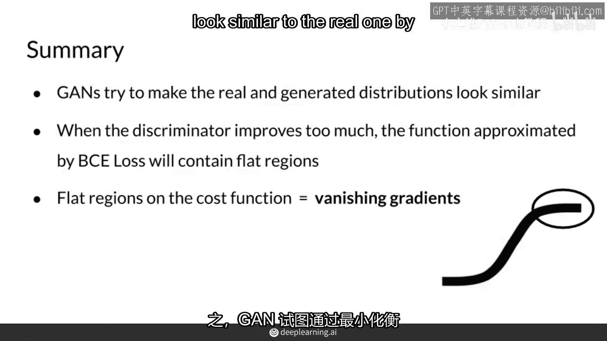

通过最小化那个衡量分布差异的代价函数，随着判别器的改进，有时比生成器更容易改进。

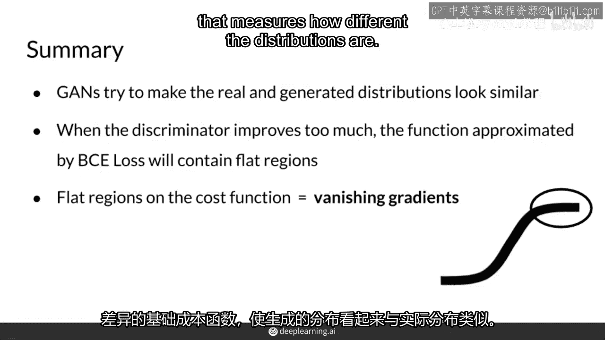

那个代价函数会在分布差异很大的地方出现平坦区域。

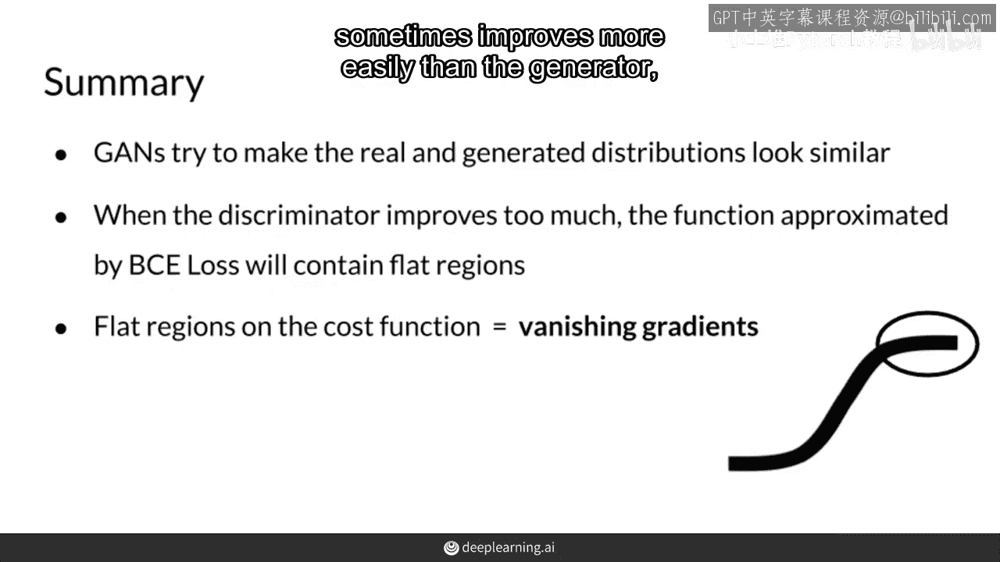

判别器能够更容易地区分真实和伪造的数据，并给出标签1表示真实，标签0表示伪造。

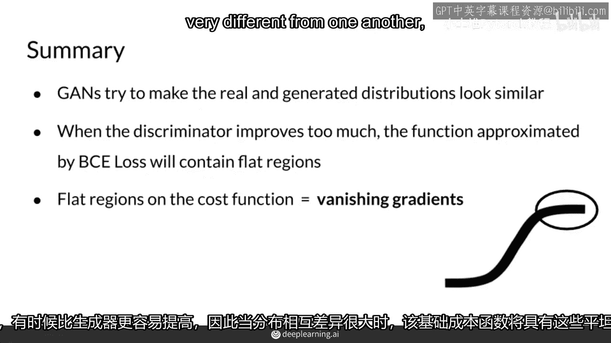

所有这些都会导致梯度消失问题，所以，你知道，真实的看起来非常真实，标签1，伪造的看起来非常伪造，标签0。

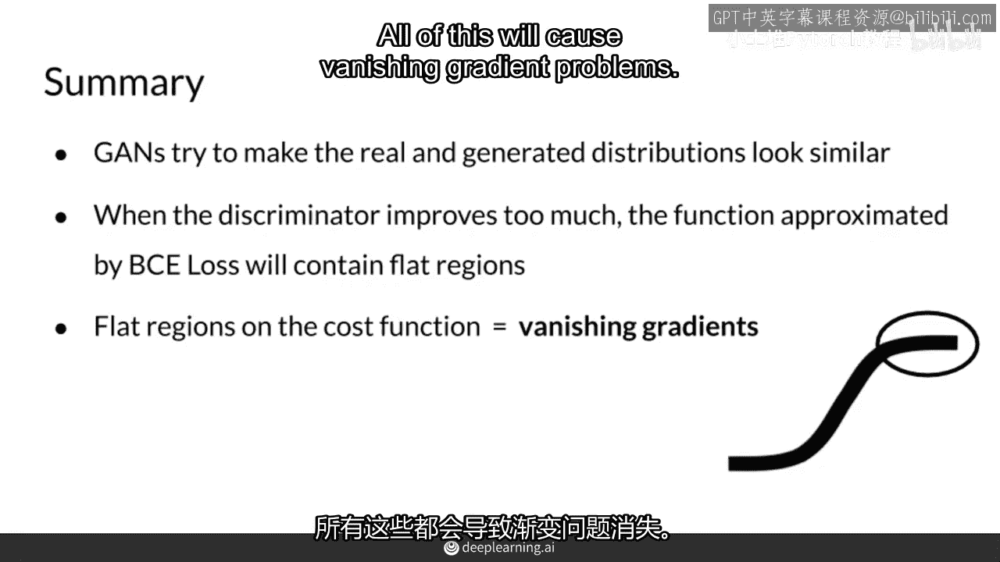