# P24：【2025版】24. 对Wasserstein判别器加条件.zh_en - 小土堆Pytorch教程 - BV1YeknYbENz

Wasson损失或W损失解决了GANs面临的一些问题，如模式崩溃和梯度消失，但要想效果好，批评家的神经网络需要满足一个特殊的条件。

在这段视频中，你将看到对批评家神经网络提出的连续性条件意味着什么。

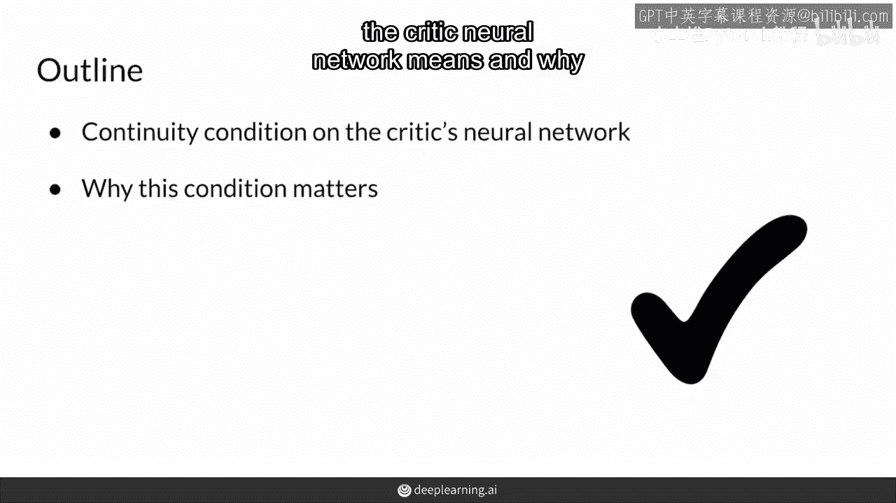

以及为什么当使用W损失训练GANs时，这个条件很重要，这绝对值得一看。

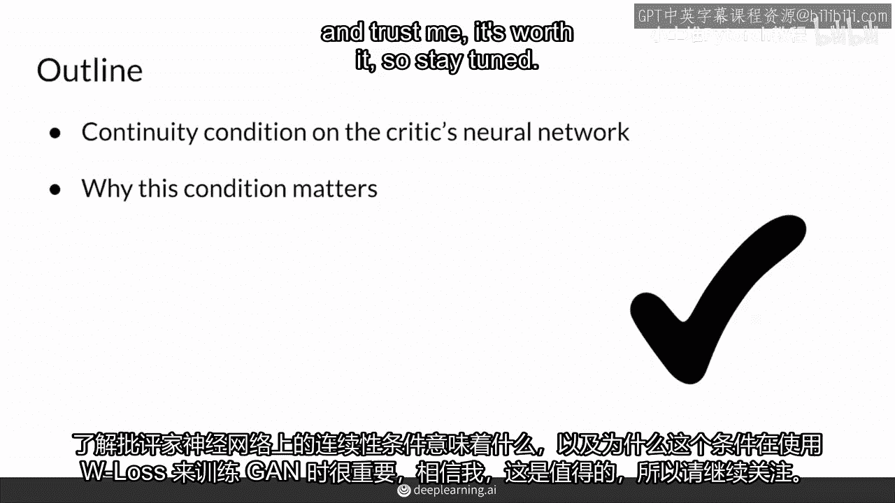

所以请耐心等待，W损失是一个简单的表达式，它计算批评家输出期望值的差异。

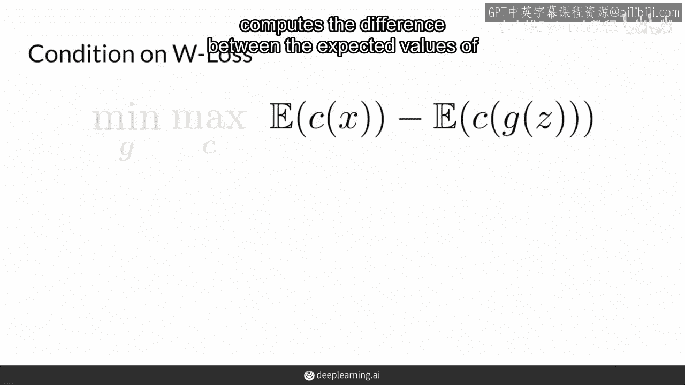

对于真实的例子x及其对假例子的预测。

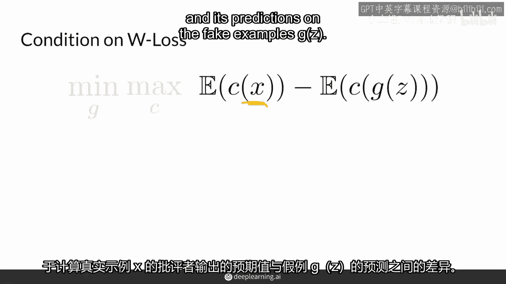

生成器G试图最小化这个表达式，试图使生成的例子尽可能接近真实例子，而评判者希望最大化这个表达式，因为它希望区分真实和假例子，它希望距离尽可能大，然而，在使用WGANs训练时，评判者有一个特殊的条件。

它需要成为所谓的一阶光谱连续函数或简称一阶L连续函数。

这个条件听起来比实际上更复杂，对于像评判者这样的功能，神经网络要成为一个Lipschitz连续函数，它的梯度的范数需要小于或等于1，这意味着在任何一点，斜率不能大于1，在任何一点，它的梯度不能大于1。

要检查一个函数在这里是否是Lipschitz连续的，你需要沿着这个函数的每一点走。

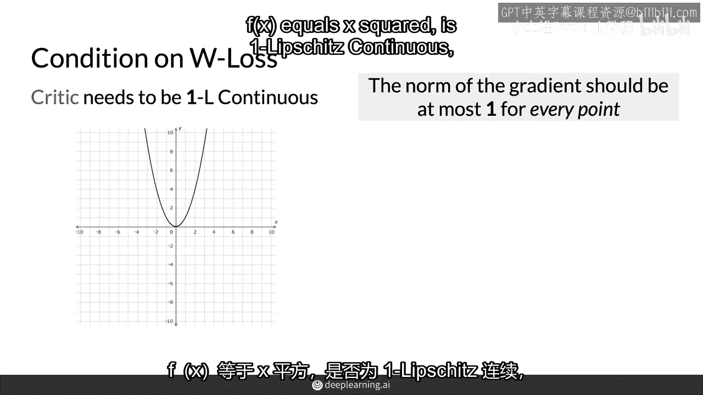

并确保斜率小于或等于1，或它的梯度小于或等于1，你可以做两件事，你可以实际上画两条线，一条在这个特定点的斜率正好是1，你在评估这个函数，并且有一个斜率是负的情况，一个你正在评估这个函数的情况。

并且你想要确保，这个函数的增长永远不会超出这些线之外，因为保持在这些线内意味着这个函数是线性增长的。

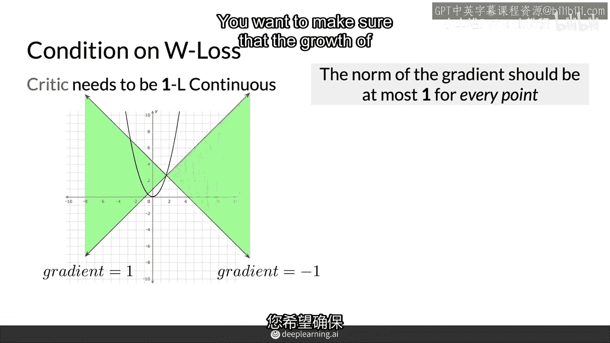

所以这里这个函数不是Lipschitz连续的，因为它在这些部分都超出了范围，它没有保持在这个绿色区域。

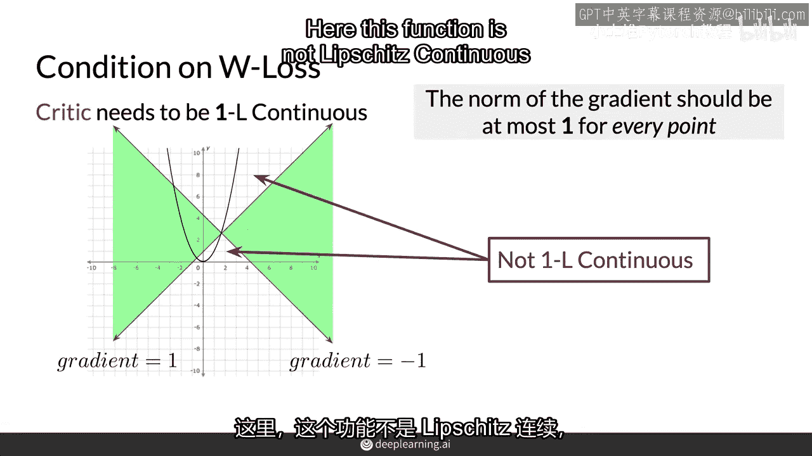

这表明它增长超过了线性，所以看另一个例子这里。

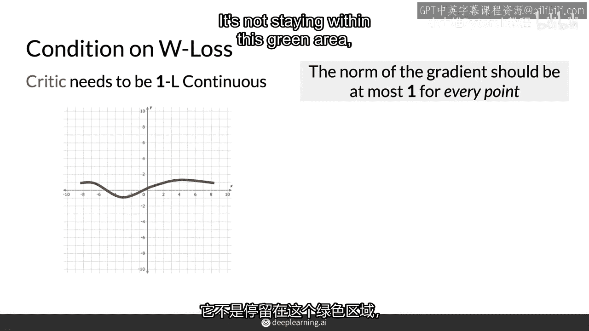

所以这是一个光滑曲线函数，您需要再次检查这个函数上的每个单个点，在您能够确定这是否是一个Lipschitz连续函数之前，在这里看起来有趣。

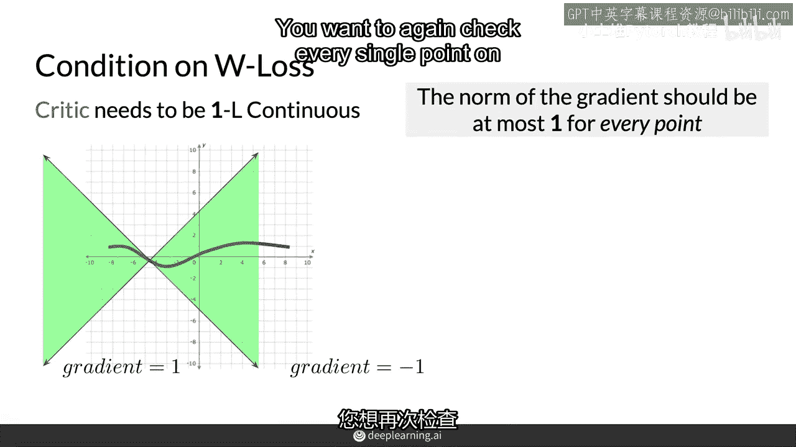

函数在这里看起来不错，它也在这里看起来不错，它看起来不错，所以让我们假设您检查了每个单个值，并且函数从不以超线性方式增长，因此这个函数是Lipschitz连续的。

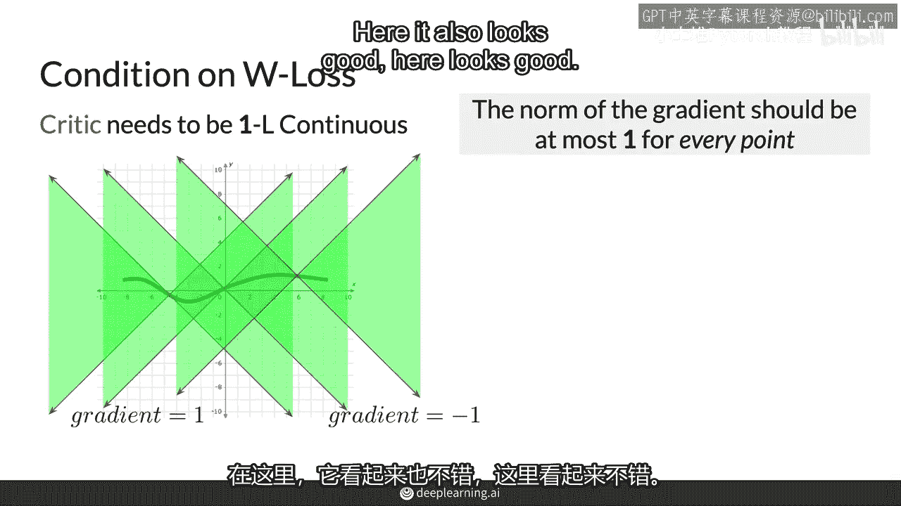

对于w损失的批评神经网络这个条件很重要，因为这样可以确保损失函数不仅连续可导，而且不会增长过多，并在训练过程中保持一定的稳定性，这也是使底层地球移动距离有效的原因，这正是W损失所基于的。

这对于训练批评者和生成器的神经网络都是必需的。

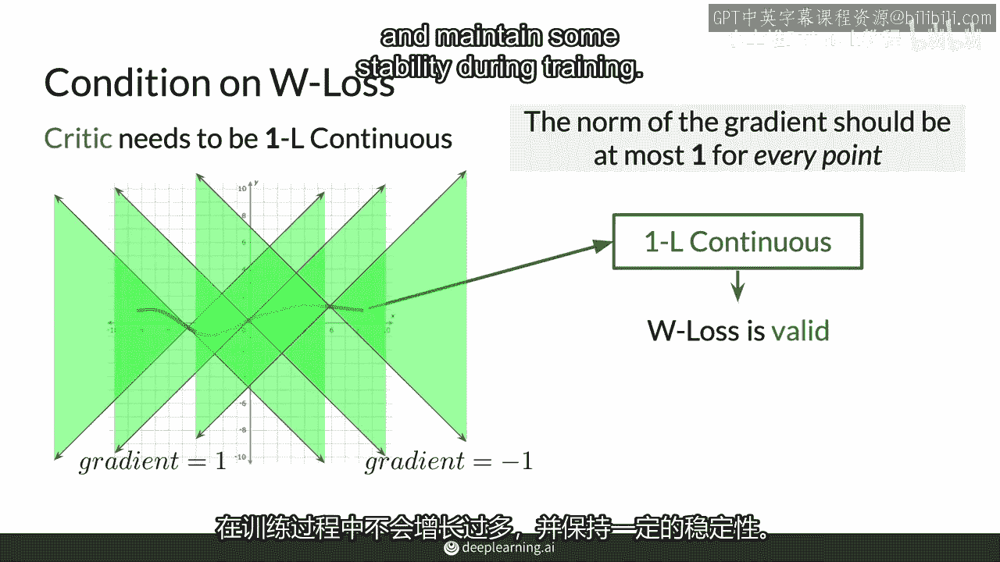

这也增加了稳定性，因为GAN学习的变化将被限制，因此，总结起来，在使用W损失训练的GAN中。

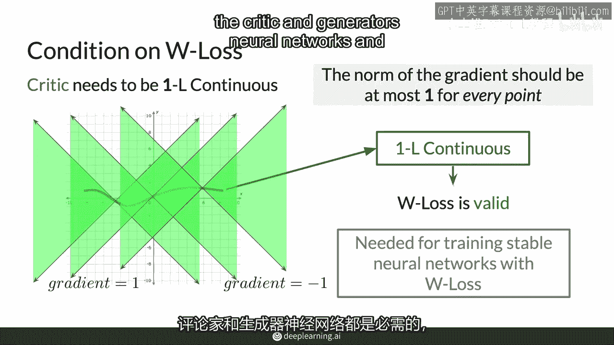

批评者需要是Lipschitz连续的，以便其底层的地球移动距离，在真实和假数据之间的比较，在真实和假数据之间的比较，为了满足或尝试满足这个条件，需要进行有效的比较，在训练期间，有多种不同的方法。

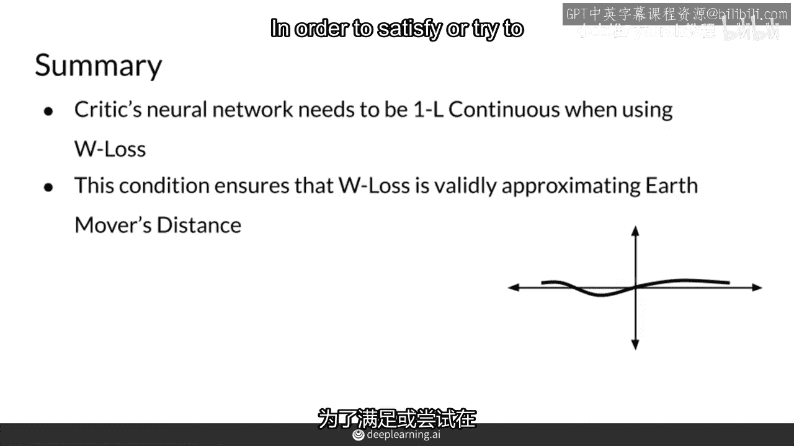