# P25：【2025版】25.1-Lipschitz连续性强制.zh_en - 小土堆Pytorch教程 - BV1YeknYbENz

一阶李普希茨连续性，或者批评神经网络的L1连续性在你的Wasserstein损失中，GAN确保Wasserstein损失是有效的，所以你已经看到了这意味着什么。

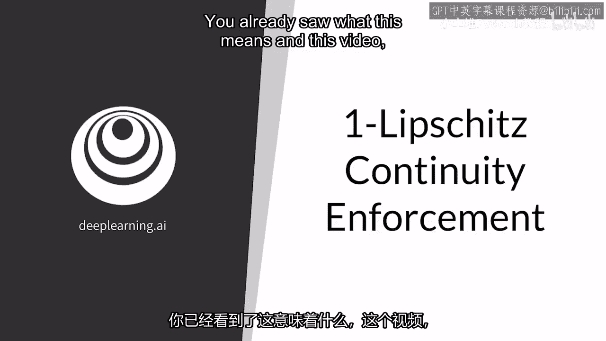

在这段视频中，我将向你展示如何训练你的批评者在训练过程中强制执行这一条件。

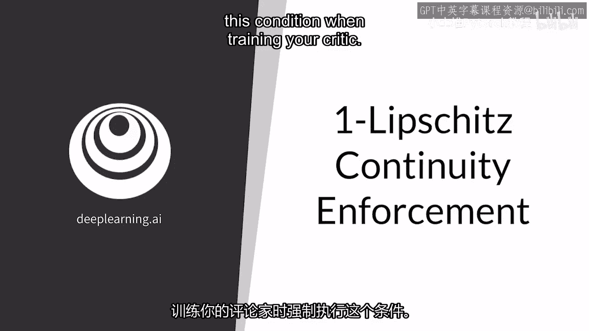

所以首先，我将向你介绍两种不同的方法来对批评者执行一阶李普希茨连续性，即权重剪切和梯度惩罚，然后，我将讨论梯度惩罚相对于权重剪切的优势。

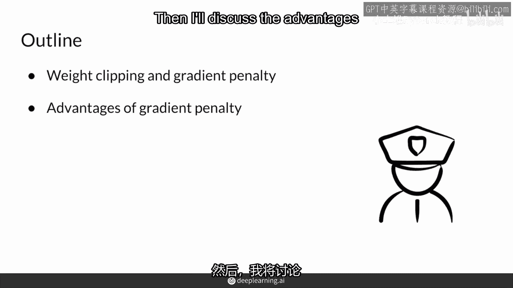

首先，回顾一下，批评者的一阶李普希茨连续性意味着它在该函数的每个点的梯度范数不超过1，这意味着批评者的一阶李普希茨连续性，这个倒立的三角形是用来表示梯度的，这就是函数，也许f是评判者，x是图像。

这就是表示梯度的范数小于等于1，使用L2范数在这里是非常常见的，这仅仅意味着它是欧几里得距离，或者经常被认为是你的三角形距离的斜边，这是这两个点之间的距离，不是朝这个方向走，它是这个斜边。

所以直观上在二维中，斜率在每个点的值都小于或等于1。

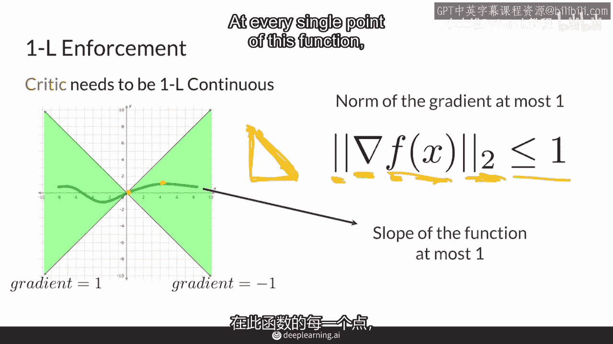

它将保持在这些绿色三角形内，确保这一条件的两种常见方法是权重裁剪和梯度惩罚，在权重裁剪中，批评神经网络的权重被强制限制在一个固定的区间内。

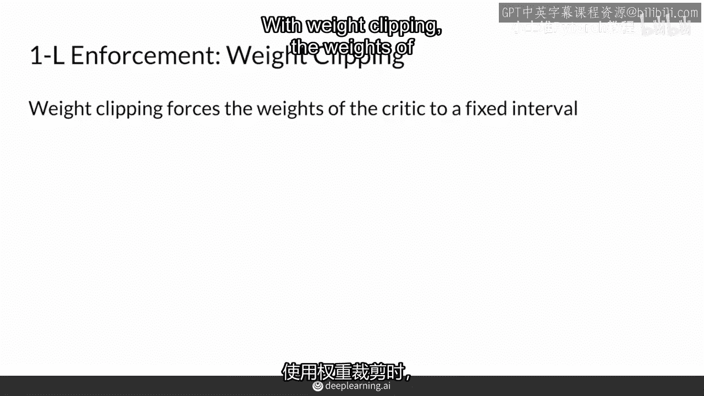

在梯度下降更新权重后，您实际上会裁剪任何超出所需区间的权重，这意味着超出该区间的权重，无论是过高还是过低，将被设置为允许的最大值或最小值，这就是剪切权重，这是强制一L连续性的一种方式。

但这有一个严重的缺点，强制批评者的权重限制在一定的范围内，可能会限制批评者的学习能力，最终会影响GAN的性能，因为如果批评者不能采取许多不同参数值，它的权重就不能采取许多许多不同的值。

它可能无法轻易改进或找到良好的局部最优解，这不仅是在执行一L连续性约束，这可能也会限制批评者太多，或者另一方面，它可能会实际上限制批评者太少。

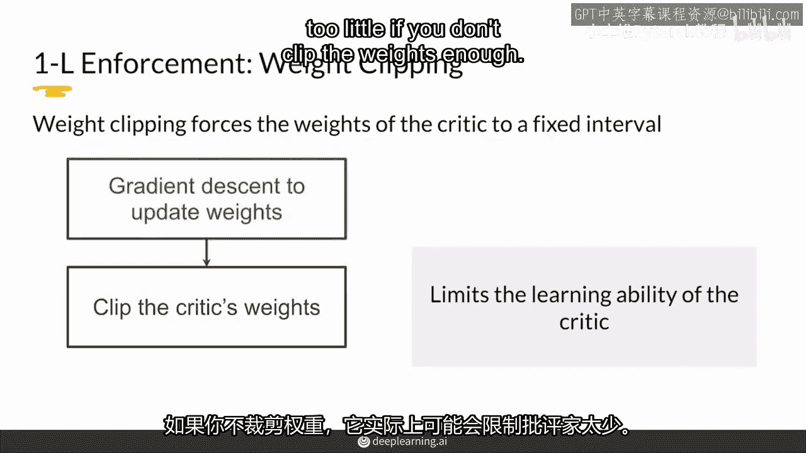

如果你不足够剪切权重，所以涉及很多超参数调整。

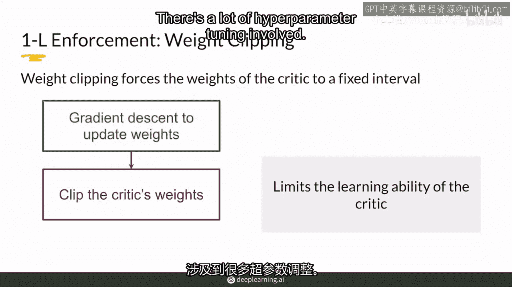

梯度惩罚，这是另一种方法，是更柔和地强制批评者成为Lipschitz连续的一种方式，因此，使用梯度惩罚，你所需要做的就是在你的损失函数中添加一个正则化项，并且这会对你的w损失损失函数做什么。

这就是当其梯度的范数高于一时惩罚批评者，所以我会深入探讨这意味着什么，所以正则化项是这个rag在这里，我会很快展开，而lambda只是一个超参数，损失函数主项与这个正则化项的权重。

为了检查批评者的梯度在每个可能的特征空间的点，那几乎是不可能的或者至少不实际。

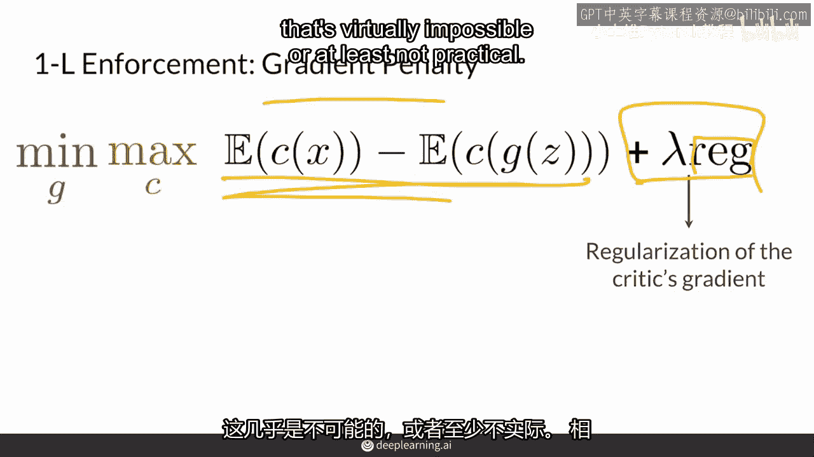

所以取而代之的是在实现过程中，当然。

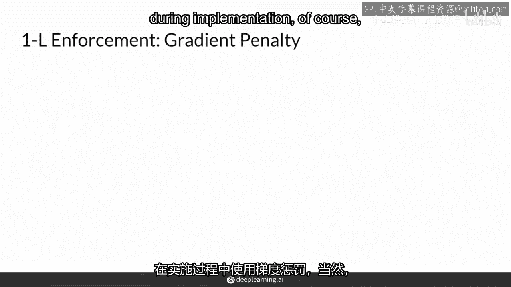

你所做的只是采样一些点，通过在真实和虚假的例子之间插值。

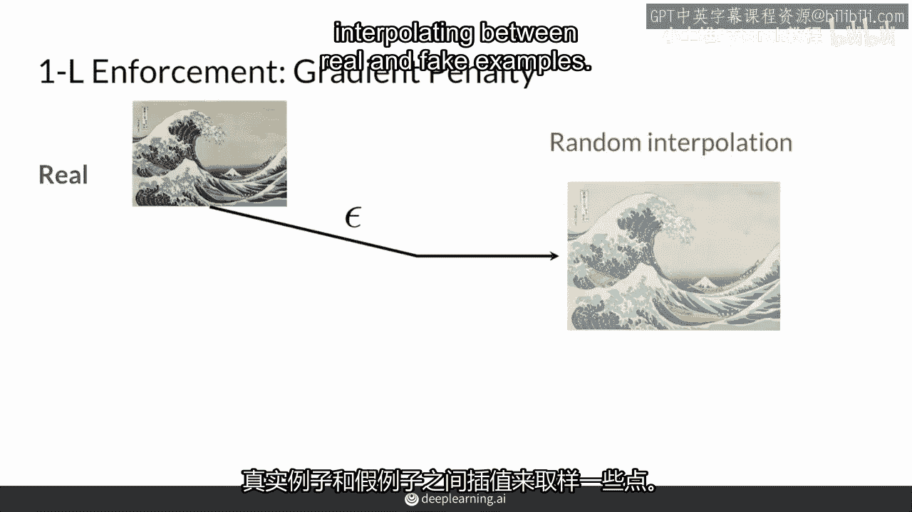

例如，你可以采样一个包含真实和虚假图像的图像集，然后你抓取每个图像中的一个，你可以通过随机数来插值这两个图像，得到中间图像，这里可以是一个随机数，所以这里可以是一个权重0。3。

在这里它将评估1-epsilon为0。7，这将给你一个在这两个图像之间的随机插值图像，我将这个随机插值图像称为x hat，这就是你想要的批评家梯度小于等于一的帽子。

这就是你想要的批评家梯度小于等于一的帽子。

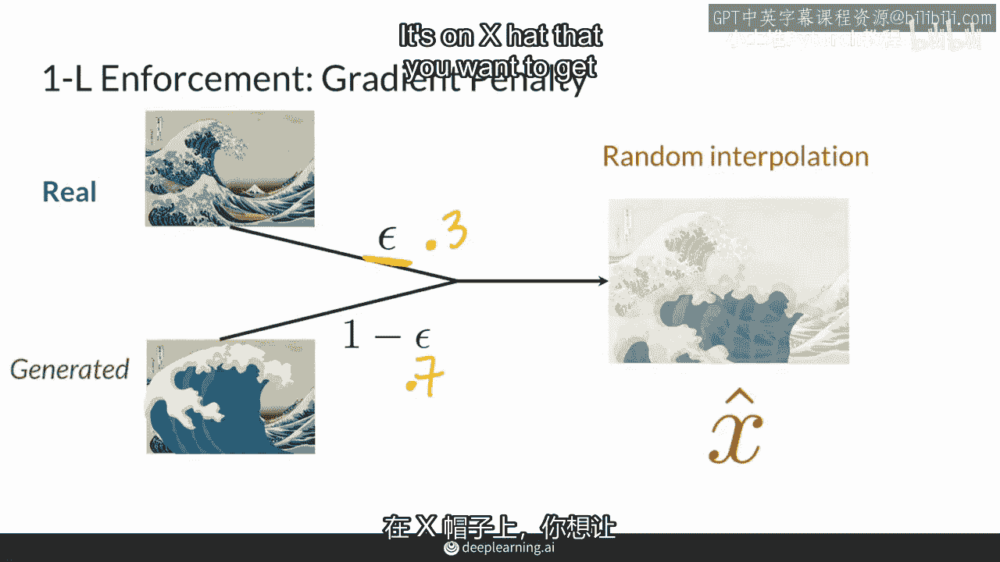

这就是在这里发生的，批评家看帽子，你得到批评家的预测在帽子上的梯度，然后你得到这个梯度的范数，你想要这个范数等于一，所以这里更容易说，嘿，我想要梯度的范数等于一，而不是最多等于一。

因为这实际上对任何偏离1的值进行惩罚，这里的2只是表示，我想要平方距离而不是它们之间的绝对值，对偏离1的值进行更大的惩罚，具体来说，x hat是一个中间图像。

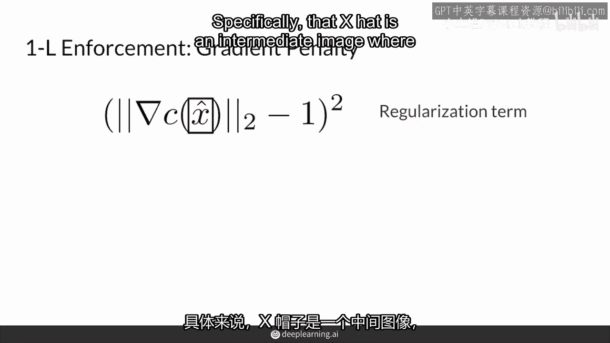

它在真和假之间用epsilon进行加权，用这种方法，你不严格地强制执行1-L连续性，但你只是鼓励它，这种方法被证明效果很好，比权重裁剪要好得多。

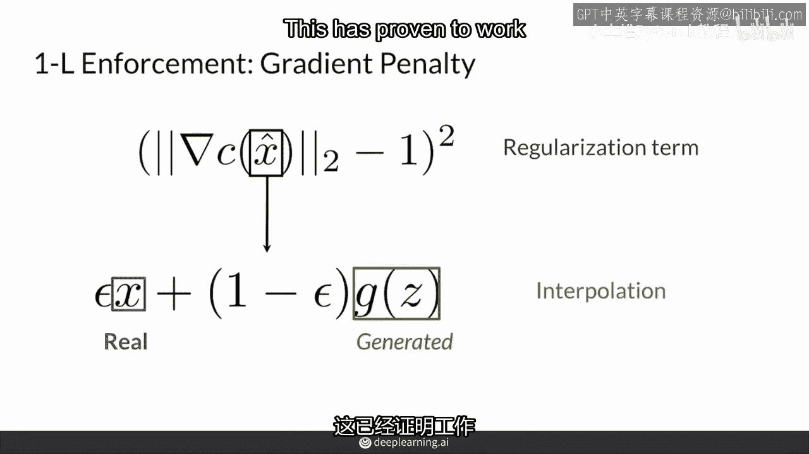

因此，用于训练的损失函数的完整表达式再次。

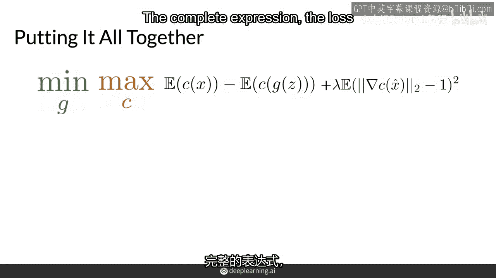

在w损失和梯度罚函数中，现在包含了这两个组成部分。

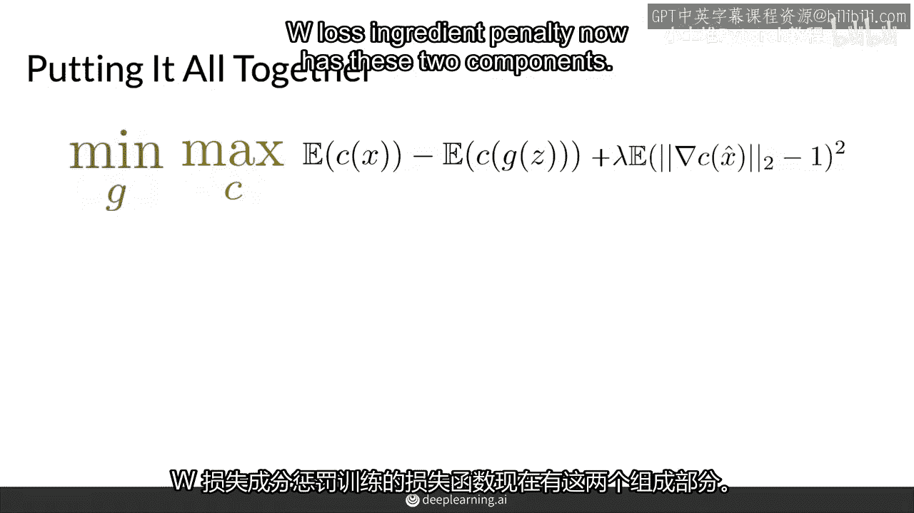

首先，通过主要w损失组件来近似地球移动距离。

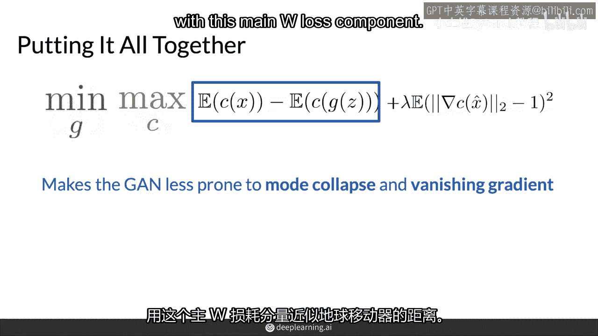

这使得模型在生成样本时，不易出现模式崩溃，避免了生成样本的缺陷，这个损失函数的第二部分是一个正则化项，确保满足条件，这是为了使主要项有效，批评者在训练过程中需要满足的条件，当然。

这在一定程度上对批评者的Lipschitz连续性进行了软约束，但研究表明，这种约束非常有效，通过保持批评者的梯度范数接近1，几乎在所有地方（实际上是一个技术术语），几乎在所有地方。

实际上这是一个技术术语。

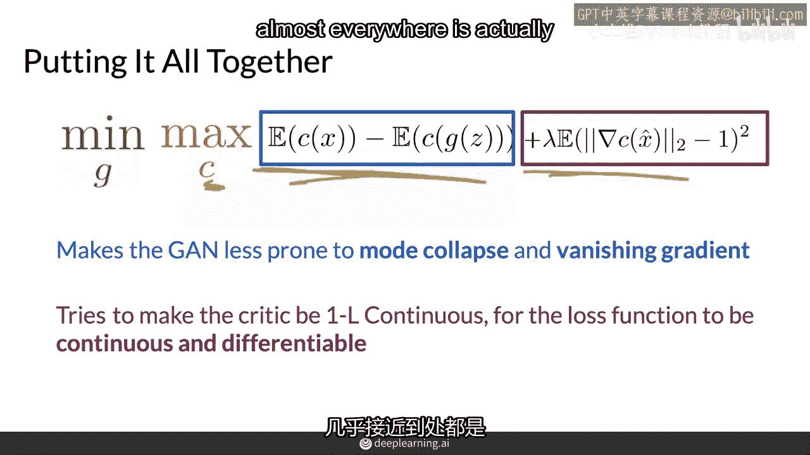

最后，总结一下本集视频，我给你提供了两种方法来强制批评者成为Lipschitz连续的，或者一种L连续，权重裁剪作为第一种成分，惩罚作为第二种，权重裁剪可能存在问题。

因为你在训练期间强烈限制了批评者的学习方式，或者你过于温和。

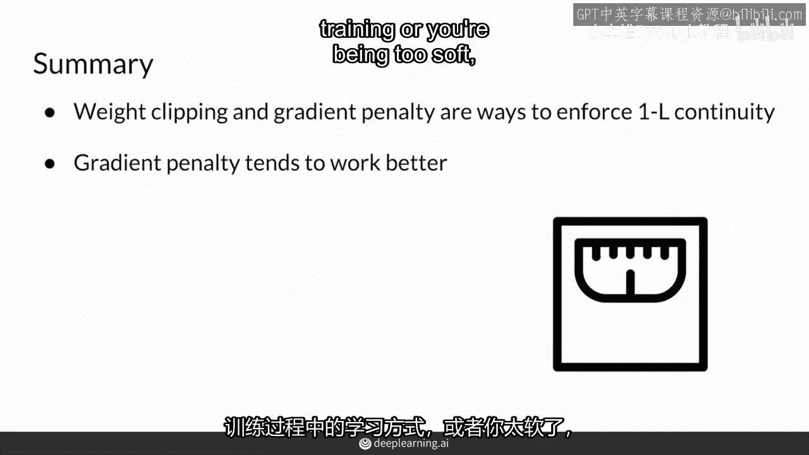

因此，梯度惩罚有一些超参数调整，另一方面，这是一种更柔和的方法来强制执行Lipschitz连续性。

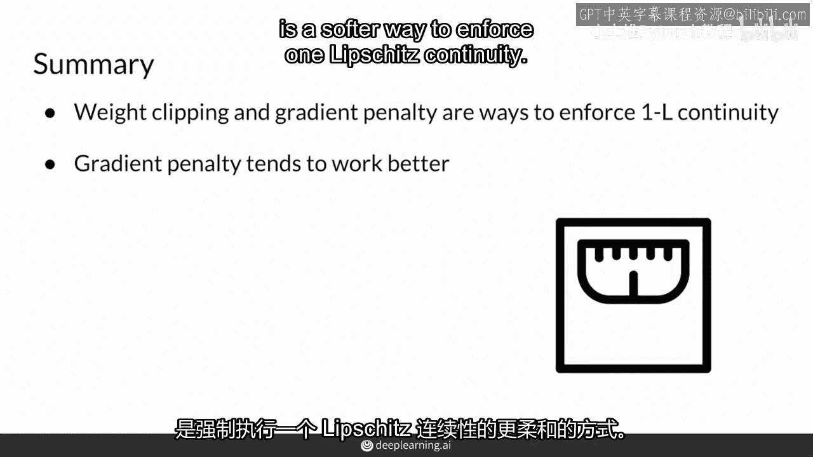

虽然它不会严格强制批评者的梯度范数小于1，在每个点。

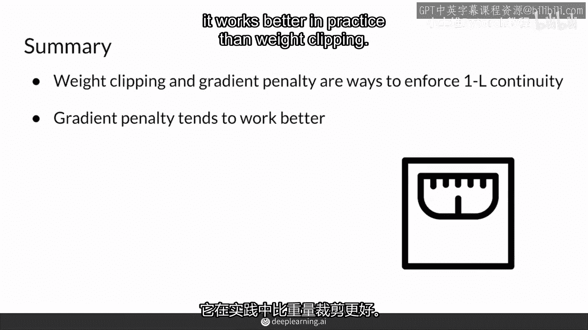