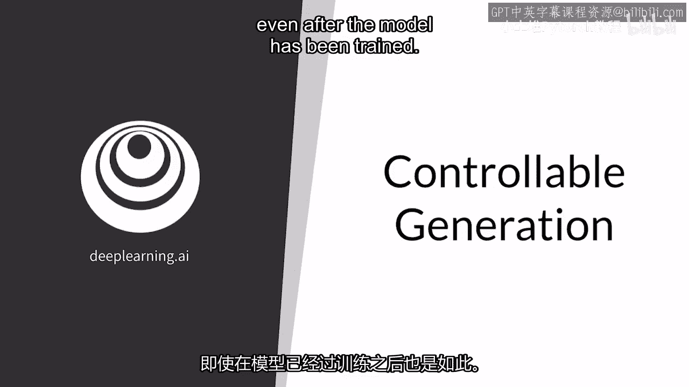
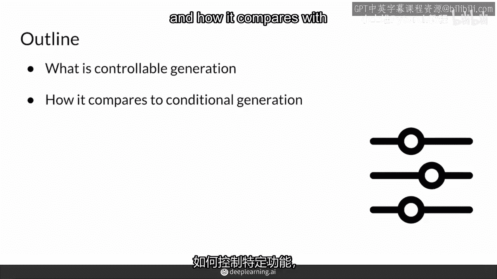
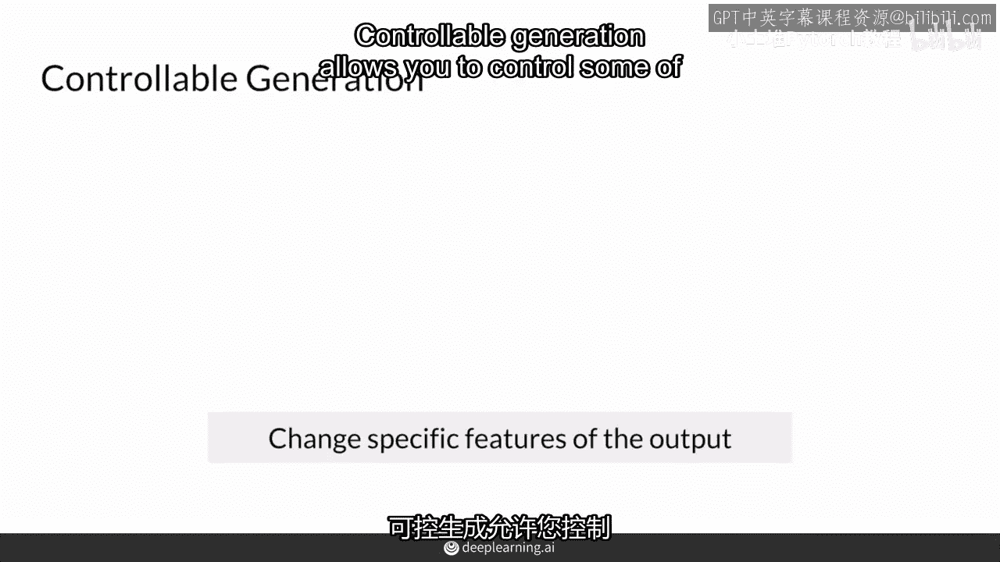
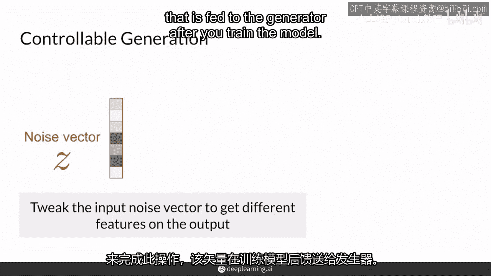
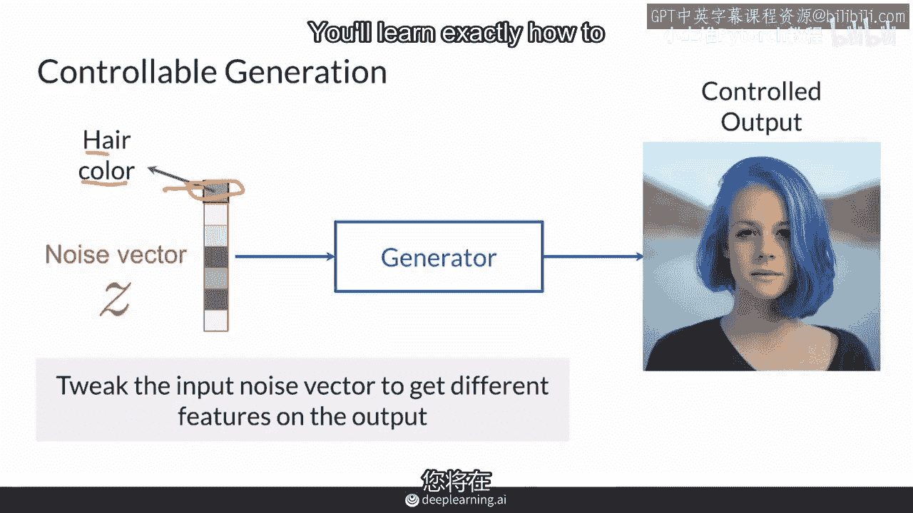
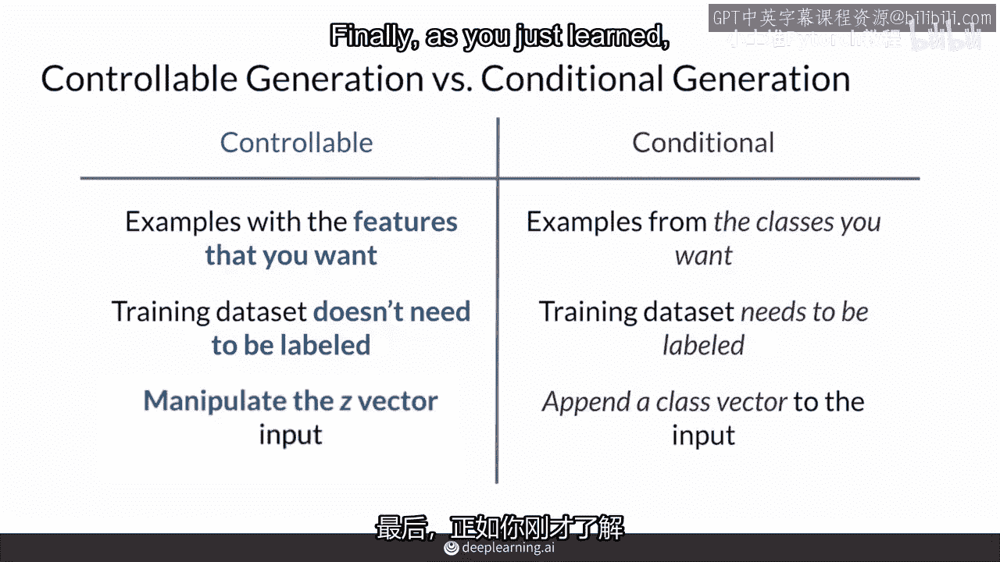
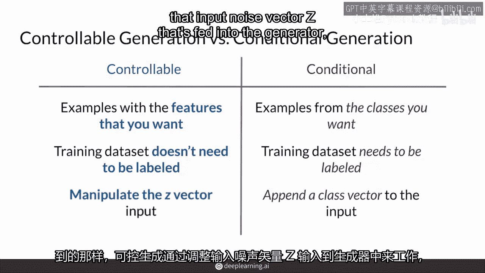
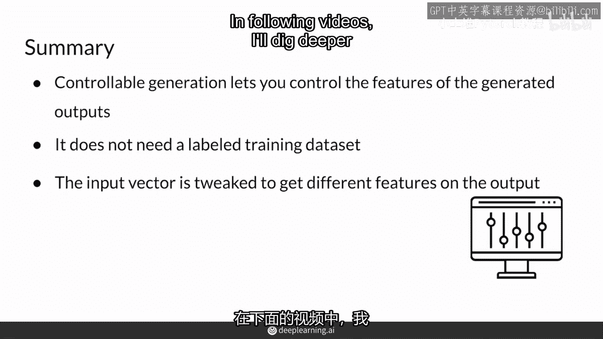

# P29：【2025版】29. 可控生成.zh_en - 小土堆Pytorch教程 - BV1YeknYbENz

另一种控制GAN生成输出的方法是在模型训练后，或者更普遍地说，可控生成，虽然条件生成在训练时利用标签，这个视频将专注于控制你想要在输出示例中的特征，即使模型已经训练完毕。

你将学习如何控制特定的特征，以及它与你在前一个视频中学到的条件生成相比。

可控生成允许你控制你想要在输出示例中的特征。

例如，对于一个执行人脸生成的GAN，你可以控制人物在图像中的年龄，或者他们是否戴太阳镜，或者他们在图片看的方向，或者他们的感知性别，你可以通过调整输入的噪声向量z，在训练模型后，将其喂给生成器。

来达到这个目的。

例如，使用输入的噪声向量z，你可能得到这张女人的红头发的照片，假设你调整了这个输入噪声向量中的一个特征，你可能得到这张女人的蓝头发的照片，也许这是因为这个特征代表改变发色，这真是太酷了。

你将在下一节课中学习如何精确地调整z。

但在此之前，为了更好地理解可控生成，我将快速比较它与条件生成，我将使用这个术语，因为研究人员通常使用这个术语，尽管它并不总是很清楚，有时可控生成确实包括条件生成，因为你仍然以某种方式控制GAN，所以。

可控生成中，你可以得到具有你想要特征的示例，例如，老年人，绿色头发，戴眼镜的脸，而条件生成中，你可以得到你想要的类别的示例，比如人类或鸟类，当然，你也可以想要一个戴太阳镜的人，到目前为止，它们有些相似。

但可控生成通常意味着你想要控制特征的程度，或者你想要多少特征，它们通常是连续的特征，比如年龄，而条件生成，另一方面，允许你指定你想要的类别，这是完全不同的事情，并且通常需要在训练时使用标记数据集实现。

你可能不想为每个发色都标记数据，可控生成会为你做这件事，它更多是关于找到你想要的特征的方向，并且可以在训练后进行，当然，可控生成，可控生成，可控生成，可控生成，可控生成，可控生成，可控生成。

你也会在训练过程中偶尔看到这种情况发生，为了帮助模型朝着一个更容易控制的方向前进，最后，正如你刚刚学到的那样，可控生成是通过调整输入噪声向量来实现的。

那就是输入到生成器的东西。

在条件生成时，你需要传递额外的信息，表示你想要附加到噪声向量的那个类。

因此，总结来说，可控生成让你能够控制生成对抗网络（GAN）输出中的特征，与条件生成形成对比，不需要标签训练数据集，所以为了以可控的方式改变输出，输入的噪声向量以某种方式被调整。

