# P32：【2025版】32. 分类器梯度.zh_en - 小土堆Pytorch教程 - BV1YeknYbENz

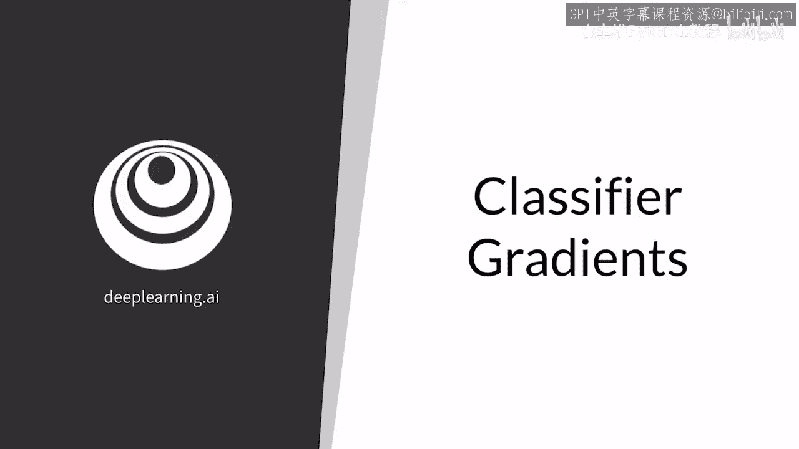

可控生成通过在z空间根据对应所需特征的方向移动来工作，如延长头发或缩短头发。

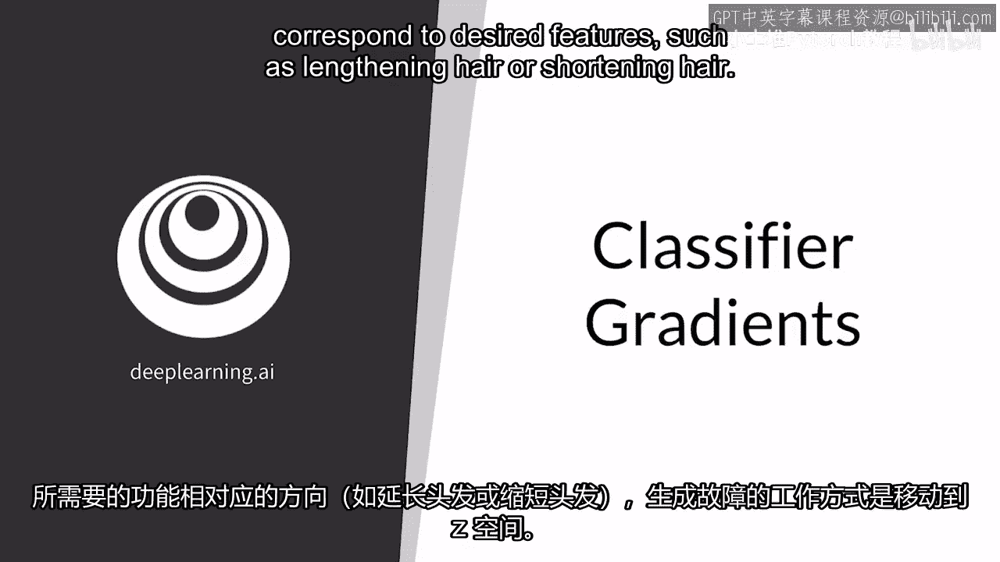

在这段视频中，你将学习一种非常简单的方法，用于找到这种方向，使用训练好的分类器的梯度。你将了解这种方法的要求。

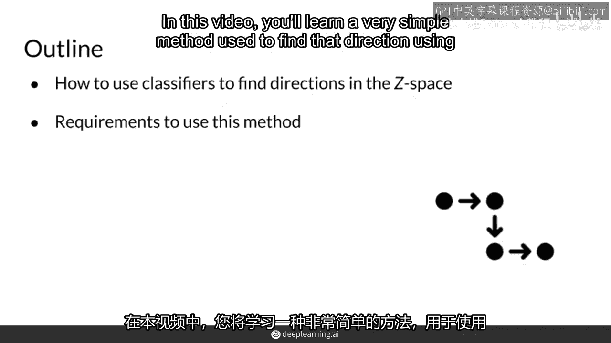

为了在z空间中找到修改输出特定特征的方向，例如墨镜的存在，可以使用一个训练好的分类器来识别图片里的人是否带有墨镜。

为了做到这一点。

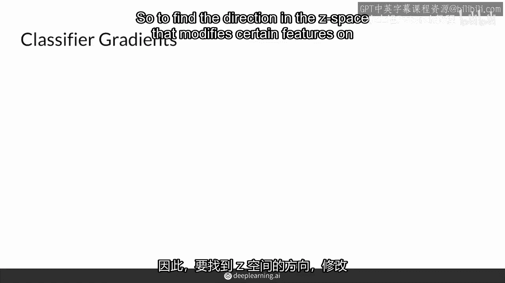

你可以取一批噪声向量z，通过生成器得到一些图像，然后你将这些图像通过墨镜分类器。

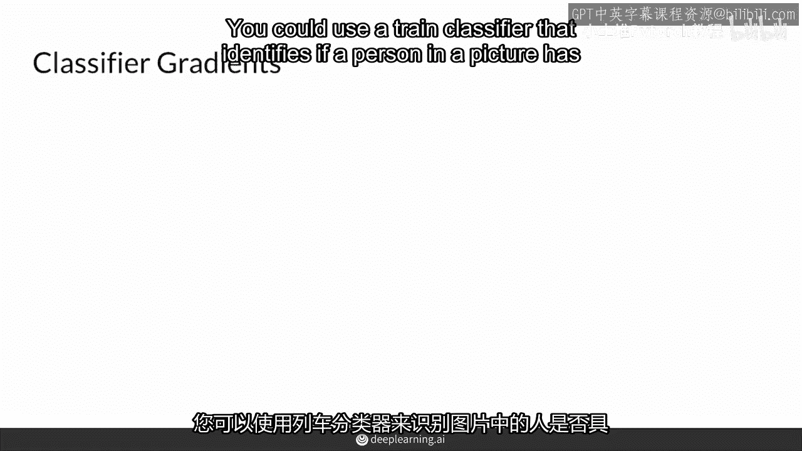

这将告诉你输出是否对应于带有或不带有墨镜的人。然后，你可以利用这些信息来修改你的z向量。

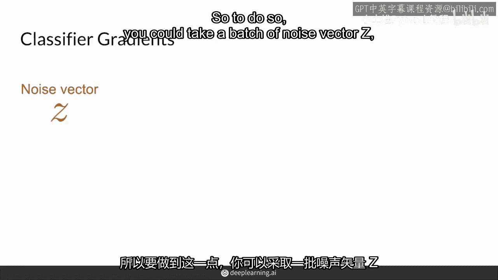

而且这完全不需要修改生成器的权重。

所以，生成器的权重被冻结，训练已经完成。

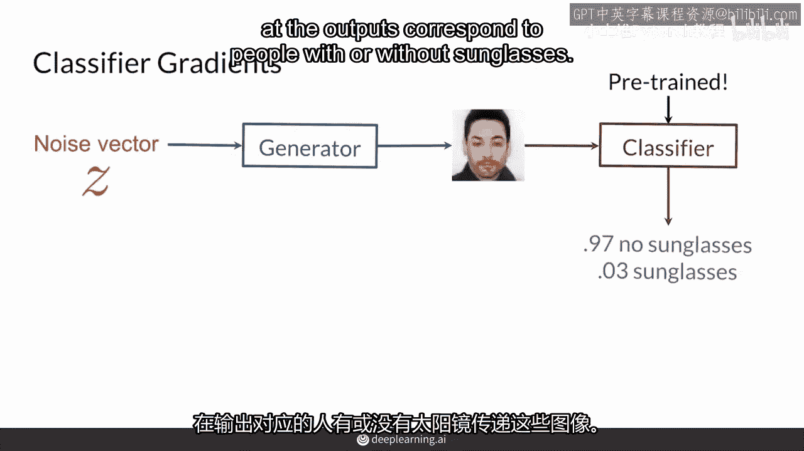

你通过梯度的方向来修改你的z向量。同时，模型会对每个被分类为不带墨镜的图像进行惩罚。然后，重复这个过程，直到图像被分类为带有墨镜的人。这种方法非常简单和高效。

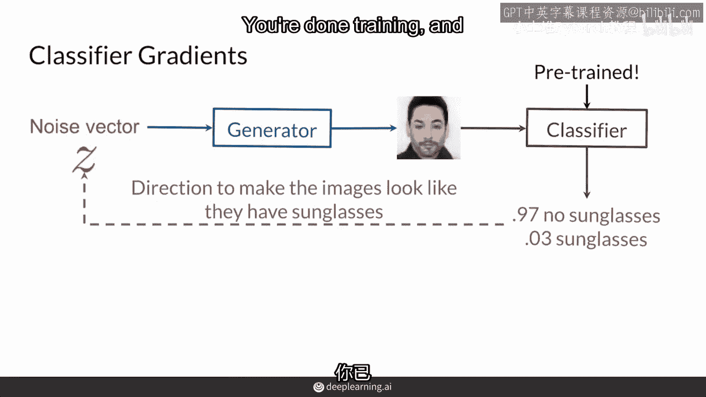

有些人可能会认为它很懒惰。

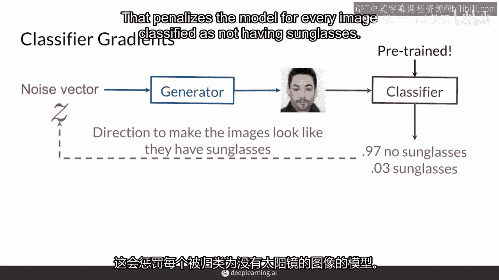

因为你在使用一个已经为你准备好的分类器。但我认为，你利用预训练分类器的能力是非常棒的。

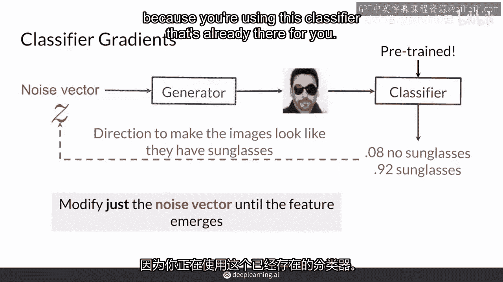

然而，当然，这也有缺点。

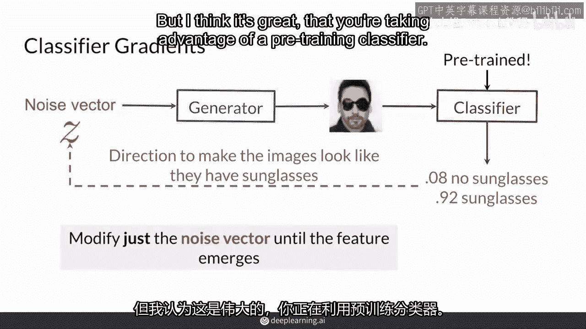

你需要一个事先训练好的分类器，它能够准确地检测到你想要控制的特征。你可以自己训练一个。

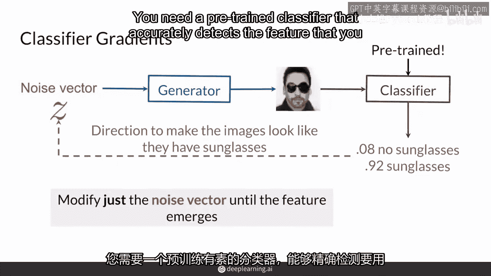

当然，例如，如果你想要一个检测胡子的分类器。

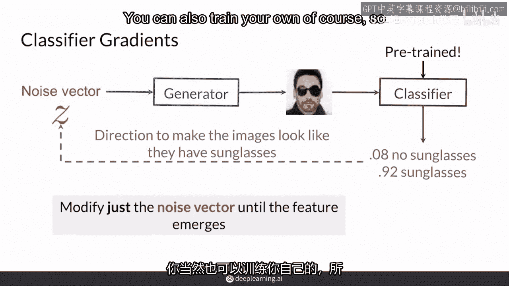

如果市场上没有现成的，你可能需要自己训练一个。但你应该总是检查一下是否有现成的可用，因为这可能是一个简单而酷的方法。

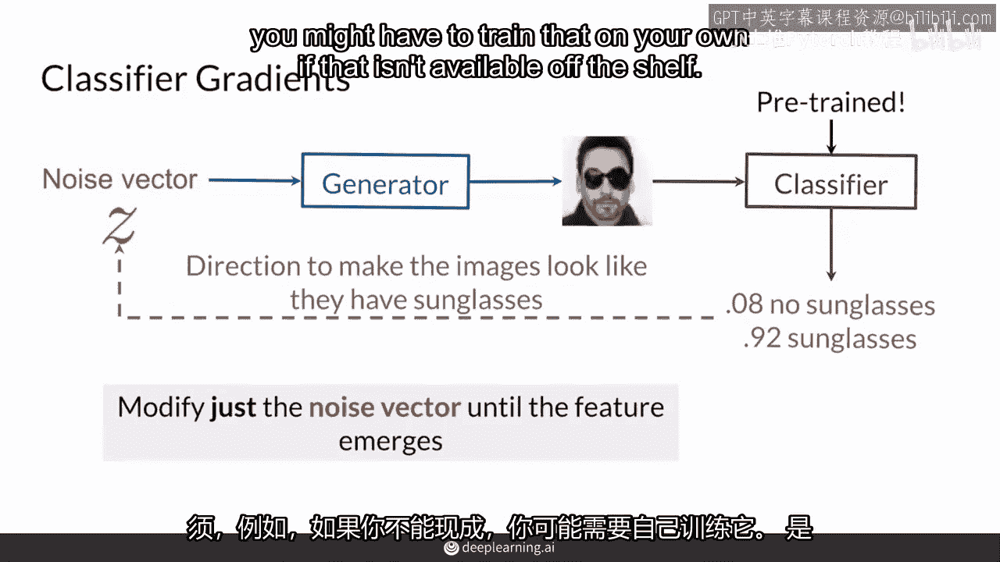

让你开始控制你的GAN。

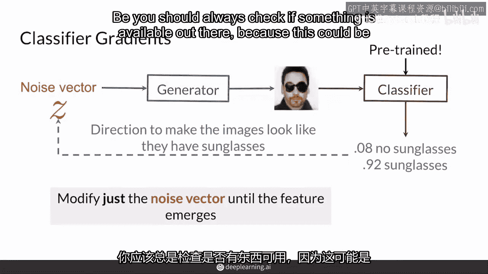

所以。

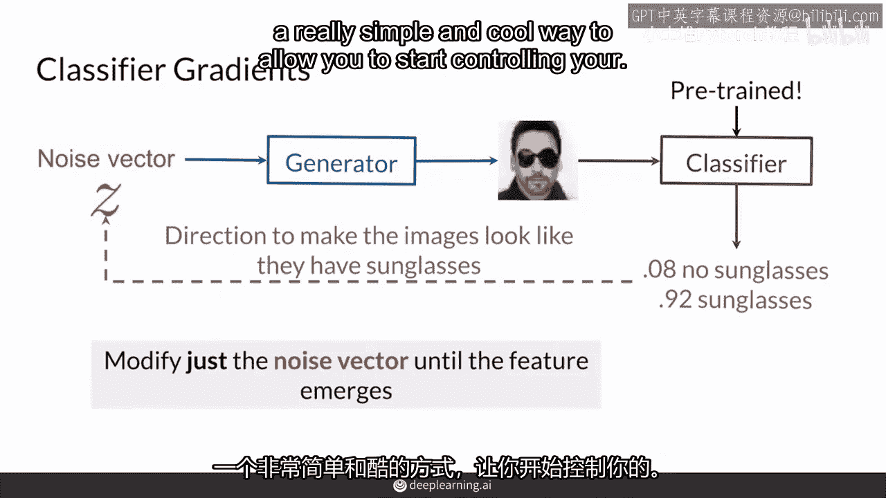

你应该从这段视频中学到，预训练的分类器可以用来在z空间中找到与GAN输出特征相关的方向。

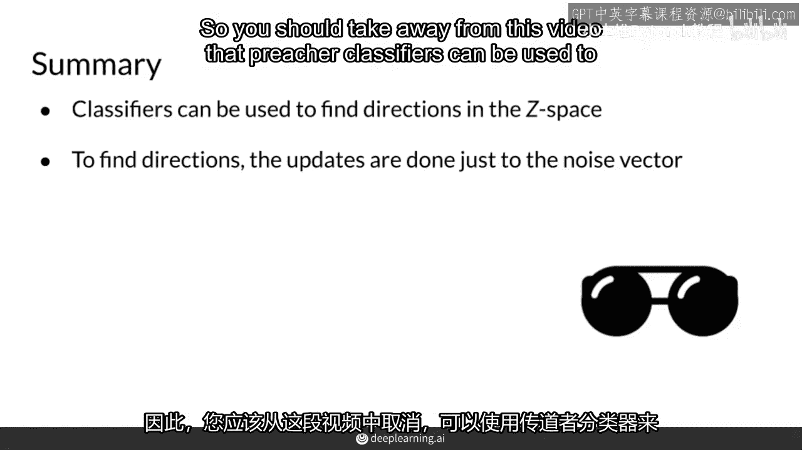

并且通过分类器的梯度来找到这些方向。为了找到这些方向，你需要修改噪声向量，而不改变生成器。记住。

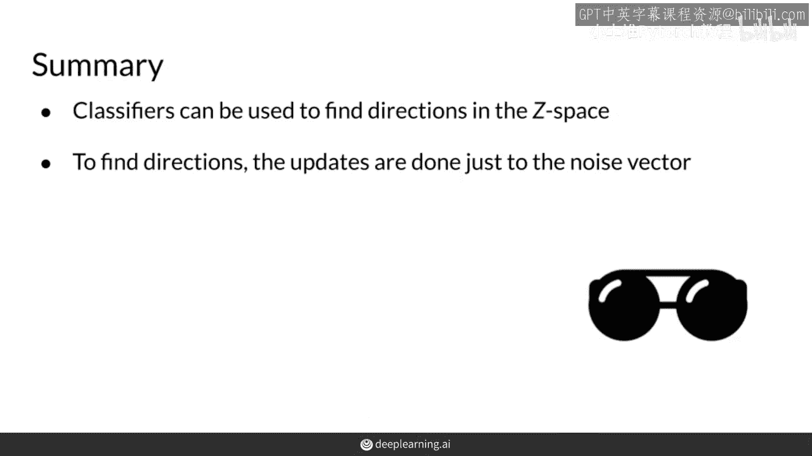