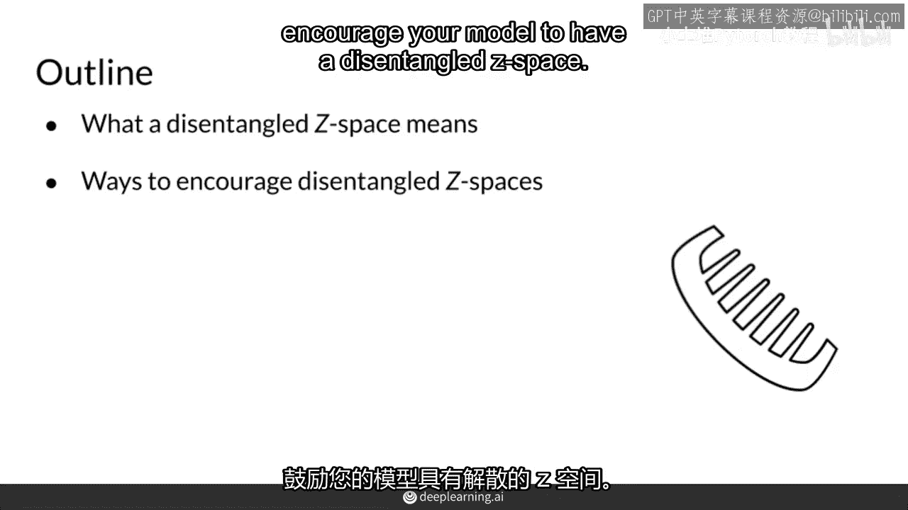

# P33：【2025版】33. 解耦.zh_en - 小土堆Pytorch教程 - BV1YeknYbENz

之前你见证了在z空间中纠缠的含义，以及为什么这在可控生成中是一个问题。在这个视频中，我将讨论解纠缠和一些鼓励模型实现这一目标的方法。首先，我将回顾纠缠和非纠缠z空间的含义。然后。

我将提到一些最受欢迎的方法，以鼓励模型拥有非纠缠的z空间。

所以，首先，我将回顾纠缠和非纠缠z空间的含义。然后，我将提到一些最受欢迎的方法，以鼓励模型拥有非纠缠的z空间。

所以，假设我们有以下z噪声向量v1和v2，并且想象这些来自一个非纠缠的z空间。现在，右边我可视化了z空间的两个维度，当然，正如你可以从这些噪声向量中看出，现在有很多不止两个维度，如果这是解缠的z空间。

那么这些位置中的每一个都将对应输出中的单一特征，例如，他的第一个元素，噪声向量的第一个维度对应于发色，而第二个维度对应于发长等等，所以如果你想在一个图片中改变发色。

你实际上只需要改变第一个元素在噪声向量中的值，或者在z方向上的z空间中移动。

这就是你所要做的全部，改变发色，然后为了改变头发长度，只需在种子二维度上移动。

这就是改变这里第二位置的这些值，而且，这些噪声向量可能已经解耦，与这两个不同的特征有关，其余的值没有任何意义，这是因为您通常希望噪声向量的大小大于您想要控制的特征数量，这使模型更容易学习。

因为它允许这些值在训练过程中随时间变化，例如，如果您只想控制这两个特征，如发色和发长，那么使噪声向量大于两个维度可能是明智的，但如果您有三或更多个特征，其他值不会控制特定的特征。

它们只是帮助模型在训练中适应，因此，解耦Z空间中的噪声向量的组件。

这是因为您通常希望噪声向量的大小大于您想要控制的特征数量，这使模型更容易学习，允许您更改输出中您想要的那些特性，它们通常被称为潜在因素，变异因素，‘潜在’这个词的来源，噪音向量的信息不在输出中直接显示。

但它们决定了输出的外观，有时候，您可能会听到噪音向量被更广泛地称为潜在因素，‘变异因素’意味着这些只是不同因素，例如，发色和发长是您想要变化的，并且只有这些因素。

你正在变化的那个特性，除了那个特性之外。

所以本质上，解耦的z空间意味着噪声向量上有特定的索引，这些特定的维度会改变生成对抗网络输出的特定特性，例如，在生成的图像上，人是否戴眼镜，或者是否有胡须，或者是她的头发特征。

所以这些单元格将对应你想要改变的东西，你可以通过改变那个维度的值来适应眼镜，胡须或头发，在解缠z空间和缠缠z空间之间一个关键的区别是，在解缠z空间中，当你控制输出特征之一，例如，眼镜，其他特征保持不变。

所以胡须和头发保持不变。

或者如果我改变，某人是否有胡须，眼镜和头发将保持不变，这意味着，在一个解耦的c空间中。

你更有可能添加一副胡子，到一个看起来非常女性化的人身上，而不改变她的头发或面部特征。

鼓励你的模式使用解耦的这些空间之一种方法是标记你的数据，并遵循与条件生成类似的过程，但这一次，来自类的信息嵌入在噪声向量中，所以你不需要这个额外的热一类信息或类向量，然而。

使用这种方法对于连续类可能会出现问题，想象一下，需要标记数千张人脸的头发长度，当然，如果你这样做，即使有几种不同的分类，几个不同的桶可能会实际上引导你的生成器朝正确的方向。

所以，另一种鼓励你模型的方法是使用解耦的z空间。

而不需要标记任何示例，相反，你可以向损失函数的损失项中添加一个正则化项，比如bce或w损失，为了鼓励你的模型将噪声向量中的每个索引联系起来。

输出结果：两个不同的特征在输出上，并且这种正则化可能来自于分类器的梯度，并且也存在许多更先进的无监督方法可以做到这一点，没有标签的意义。

因此，总结来说，解耦的 z 空间，让你通过将特定的z值直接对应于你想要控制的特定特征，来控制单个输出特征，为了鼓励你的模型使用解耦的噪声向量。

