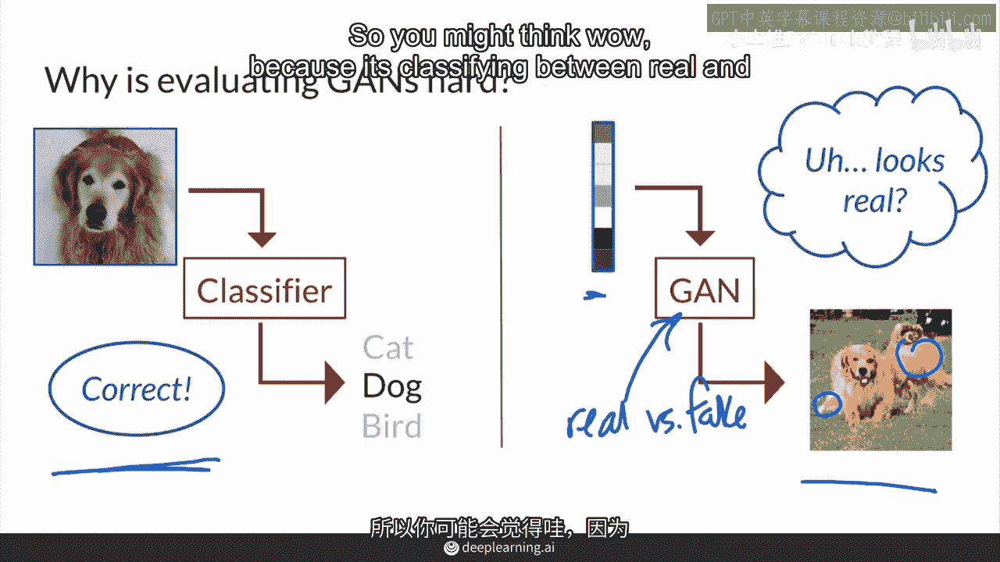
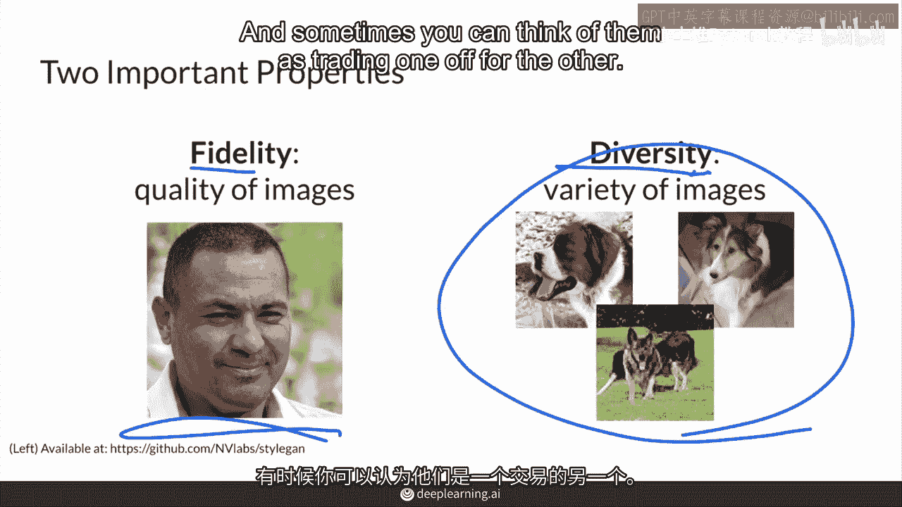
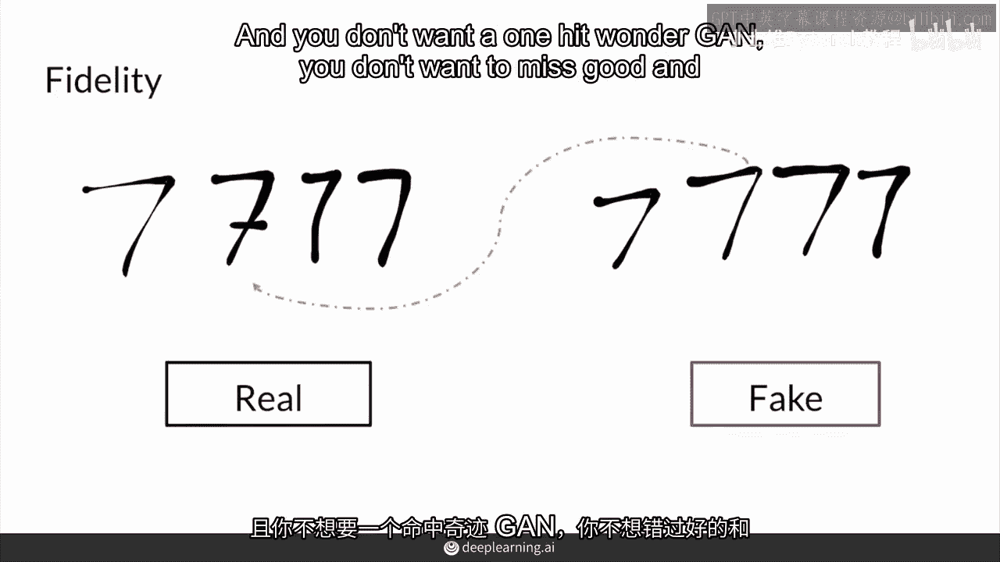
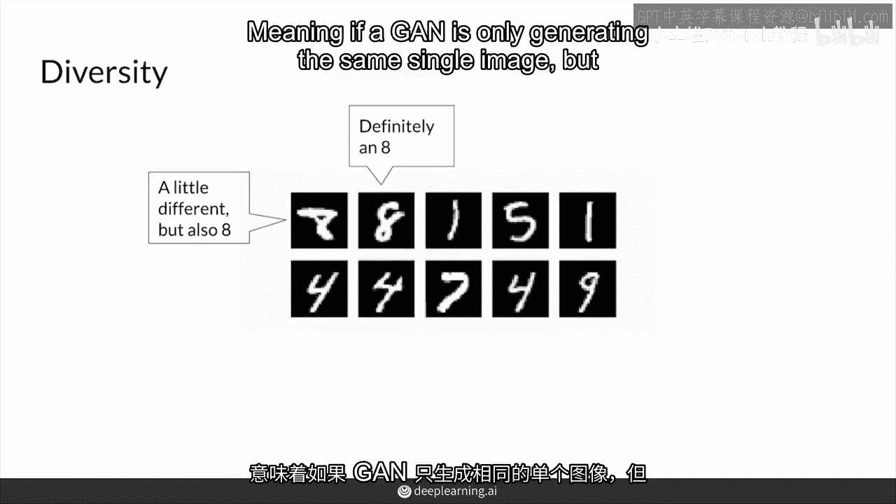

# P37：【2025版】37. 评估.zh_en - 小土堆Pytorch教程 - BV1YeknYbENz

在本次讲座中，你将学习如何评估生成对抗网络（GAN），首先，你将了解你希望GAN具有的几个标准或属性。

首先，你将了解为什么评估GAN具有挑战性，然后，你将学习到两个最重要的属性，真实性和多样性。

评估GAN与评估其他模型相似，通常，您会取一个模型的检查点权重，并在某一点冻结它们。

然后比较其输出与一些指标。

这些指标可以在模型之间使用，不仅仅是为自己的独立评估，而是评估生成对抗网络（GANs）是一项特别具有挑战性的任务，这是一个活跃的研究领域，最近取得了很大进展，为了说明这一点。

首先，在监督学习中使用分类器，有一些测试你可以通过。

这些图像上有标签，告诉你它们应该如何分类。

根据这些标签，你可以评估你的模型是否正确或错误。

它是否正确，你在这里有一种正确感，通常这里有一个保留的，测试集，你可以评估你的模型是正确的还是错误的。

这个测试集可以用来评估你的模型或其他人的模型。

然而，对于生成对抗网络，你将一些随机噪声输入进去。

然后你得到这个假图像，但是没有一个明确的方法来判断这些生成的图像有多真实。

你不知道它应该生成的确切像素。

你不能说，哦，这里的像素稍微不对或对。

应该要有绿色，所以。

因为那里有，没有明确的目标告诉你应该生成什么像素，给定这个噪声向量。

所以这个模型更像是一个高级艺术家学习如何绘制杰作。

而不是学习已知画作中的精确笔触，这就是分类器的正确性，因为对错分明。

此外，这个判别器。

区分真实与虚假，永远不会达到完美，常常过度拟合于区分真实与虚假的图像。

所以你可能会想，哦哇，因为它在真实与虚假的图像之间分类。

也许它对此有用，但是不，这是对生成器过度拟合，所以它很可能会认为你特定生成器中的很多图像，尽管它们看起来逼真，实际上是假的，因为它们可以捕捉到某些特性，而这些特定的特性可能很小。

有时甚至是生成器产生的可感知的东西。

因此，没有完美的或通用的判别器可以同时看两个生成器，并且明确指出这个比另一个更好。

那么，你是如何评估生成式对抗网络的呢，你可以首先定义你想要的属性，你可能想要。

并且一个主要属性。

一个主要目标是的确定性，或者你生成的图像的质量。

以及它们看起来多么真实，你可以将整体质量和确定性整体视为其真实度因素。

但也包括图像的清晰度，例如，一个模糊的脸可能看起来仍然很真实，但这并不是真正的高保真度，这个人的图像保真度在这里很好。

但仅仅生成一个单一的图像不是你想要的。

一个好的生成器也能产生良好的图像多样性。

仅仅产生这个单一的图像并不很有用，所以你通常关心的第二个属性是多样性。

范围是什么，这个生成器能够产生的图像多样性是什么。

它是否能够产生训练数据集中的固有多样性。

或者你正在建模的所需类别，那是所有的狗，在这种情况下我能建模所有种类的狗吗。

所有的犬种，不同地方的狗，不同的位置。

或者只是生成一个单一的，非常逼真的图像，就像这里的这张脸。

这就是为什么当你再次评估时，重要的是要考虑不仅仅是忠实。

那种图像的质量，这显然非常重要，但也包括多样性方面。

的，它能生成什么样的图像范围，以了解你的生成器是否覆盖了一个良好的图像多样性，以了解它是否覆盖了预期的和真实的图像，所有这些都可能非常困难，因为如何真正评估或量化某物是否具有足够的多样性。

当你不希望它记住训练数据集时，总之，我们有两个属性，真实性和多样性，它们位于两个轴上，有时你可以将它们视为在二者之间进行权衡。

现在我们深入探讨每个属性，对于真实性，你可以考虑你的图像看起来有多真实，这样想，对于每个假样本。

它与最近的真实样本有多不同，你也可以更广泛地思考。

即一百个假样本与一百个真实样本有多远，以获得更好的代表性。

你不想再出现一锤子买卖，你不想错过好的和坏的高、低真实性样本。

因为这些可能会区分这个扫描与其他GAN，你想要一个能够持续提供好结果的GAN。

你可以用几种方法来进行这种比较。

你将在后续课程中学习一些方法，关于多样性，你想要生成的图像覆盖整个多样性。

真实分布的多样性，意味着。

如果GAN只生成相同的单一图像，即使它非常真实，那不是一个表现良好的模型。

你可能记得这与模式崩溃类似。

所以你需要一个能够生成不同图像的GAN，例如这些用不同风格写的8。

你也可以测量并感知到，例如100个样本的分布，与100个真实样本的分布。

在评估GAN时，真实性和多样性都是你关心的标准。

通过捕捉真实性和多样性，你可以得到一个很好的关于你生成器生成假图像质量的概念，这可能只是看你的假图像与你的真实图像有多接近。

总之评估GAN是具有挑战性的。

因为没有全局判别器，提供可以作为基准来公平比较不同GAN的ground truth，为了评估GAN，你需要考虑真实性，即图像的质量，以及多样性，即那些图像的多样性，有了这些属性这些标准。

