# P42：【2025版】42. Inception分数.zh_en - 小土堆Pytorch教程 - BV1YeknYbENz

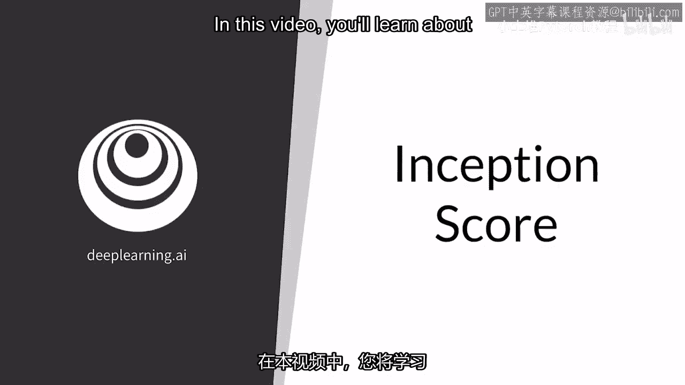

在这个视频中，你将学习另一种计算真假之间的距离的方法，使用Inception V3模型。

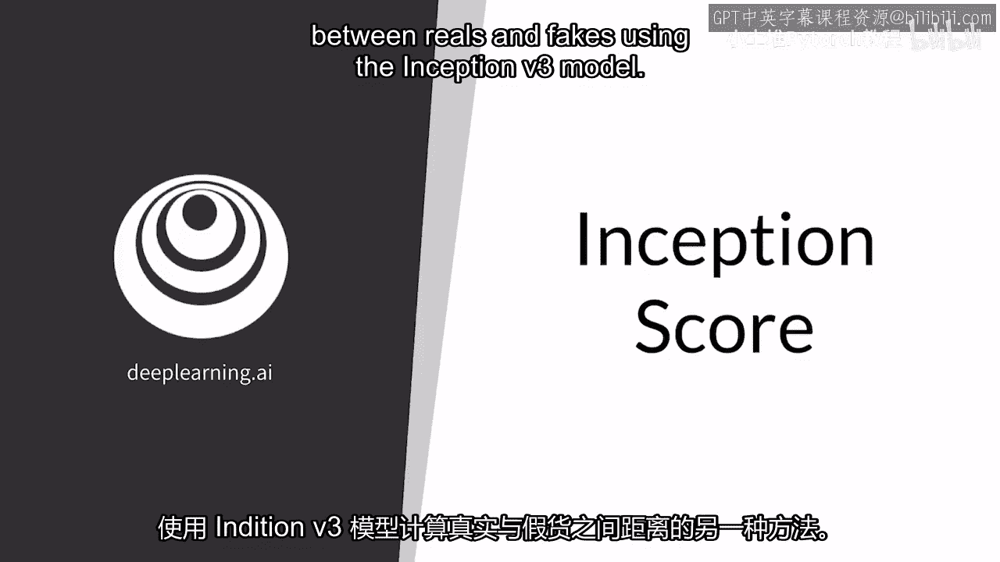

这种方法是在I之前开发的，过去被广泛使用，但现在已经被FID大大取代，总的来说，Inception分数。

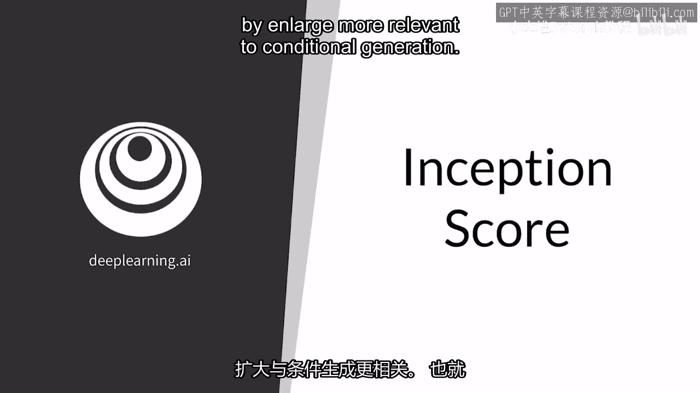

也就是它的名字，在许多论文中被报道，所以，了解它在测量什么以及它与FID的区别仍然很重要。

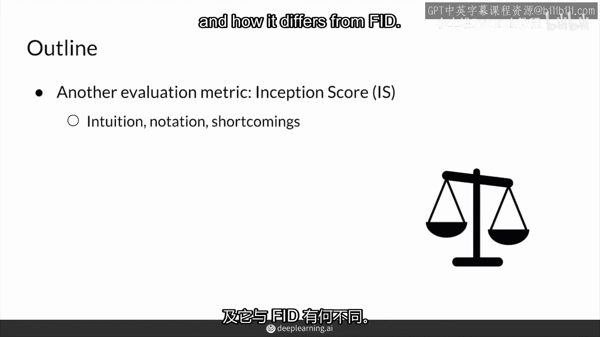

所以记得Inception V3分类器，它在ImageNet上预训练并用于特征提取，Inception分数也使用这个模型，然而，与FID不同，您使用分类器，而不是将其作为特征提取器，因此。

您保留分类器的完整性，不使用任何中间输出，首先，您输入一张生成的图像，然后，看Inception v3分类器怎么说，它被分类为。例如，也许这张图片看起来像0。6只狗，0。3只猫和0。1只鸟，所以。

直观上，一个类别的值很高，例如，这里一只狗在其他方面的得分很低，暗示这张图片明显类似于其他类别中的一类，那就是它可能是高保真的，你可以对许多样本进行观察，以了解其表现如何，总的来说。

这次扫描能够生产出清晰的物体。当然在分类器的判断中，而且现在如果这只狗是九岁，那么这将做得更好，它无疑会更清晰地展现出一只狗，所以现在更清晰了。因为你希望你的模型也能产生多样化的输出，那么。

如果你观察多个样本，你应该期望生成多种不同的类别，所以你应该期望在所有训练样本中，包含所有这些类别，也许你会看到狗、猫和鸟，不仅仅是每次出现狗，再次，这可以通过使用这个分类器来观察这个分布。

你希望这个多样性的概率分布对所有不同类别很好地分布，而不是集中在单一类别上。

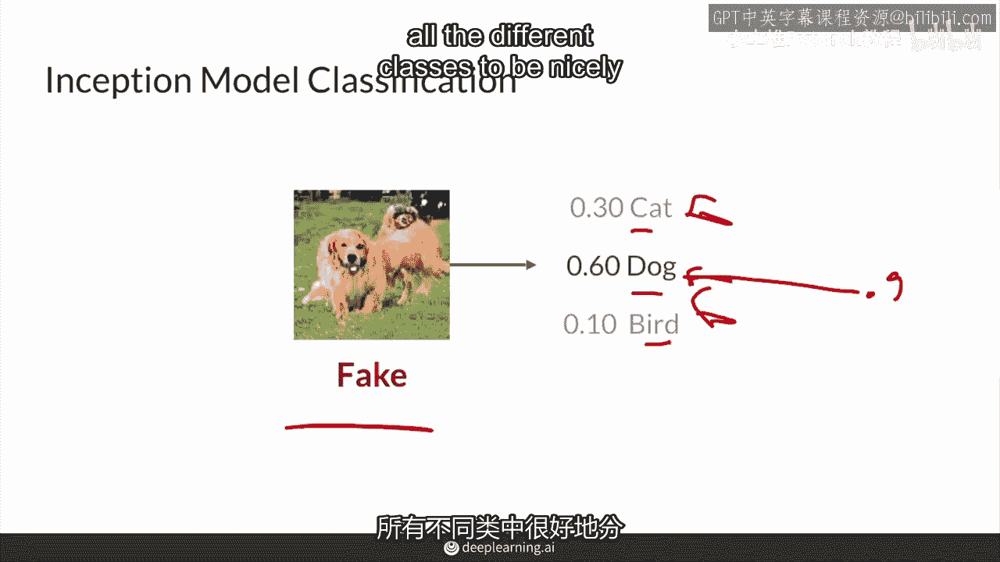

不希望集中在单一类别上，那么更正式地说，第一项指标，它关注的是给定一张图片，类别的分布，即衡量给定图片x条件下类别y的分布p(y|x)，给定你的图片x，类别的分布是什么，对于那些清晰度高的生成对象图片。

类别的分布应该在几个选定的类别或甚至只有一个类别上出现高概率的峰值，并且在几个选定的类别上总体概率很低，这项指标试图近似或信号的是，生成的图片被分类器明确地识别出清晰的对象，这就是所谓的熵低。

因为概率分布集中在那些特定点上，而不是分散，关于熵的一切，在某种程度上是随机性，这种忠实度测量对应于低熵，现在在多样性方面，你想要生成许多样本中的多个类别，因此，样本中类别的分布应该具有高熵。

这意味着它不集中在特定的或少数几个类别上，这将使你想起模式崩溃，如果你戴上思考帽，因为这意味着你只生成某一种类型的东西，其他什么都不生成，这种分布也称为边际标签分布或p(y)，这就是所有标签的分布。

所以这是你整个数据集或大量样本中所有标签的分布，这可能会让人困惑，因为你在这里有高，而在这里有低，但请记住，这两个应该是非常不同的，这才是关键所在。

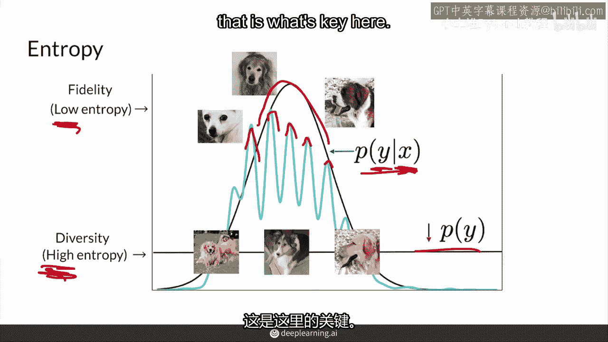

有了这种忠实度低熵和多样度高熵的概念，你可以将它们结合起来形成一个单一的分数，这很方便，因为这样你就可以对你的模型进行评分并说，我正在变得更好，或者我正在变得更差，通过获得多样性，一个高值。

减去忠实度一个低值，并且Inception分数特别使用了称为KL散度的东西，从p(y)到p(y|x)，KL散度试图测量你从p(y)中可以恢复多少信息。

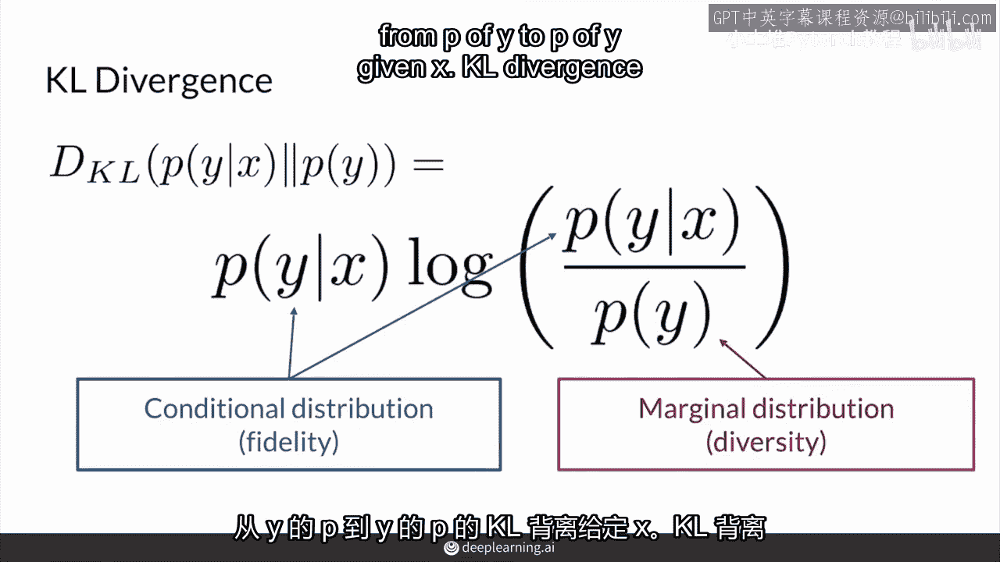

给定p(y|x)的情况下，如果你只有p(y)的信息，让我们假设p(y)在所有不同类别上非常均匀，它就是这个均匀分布，那么你对p(y|x)的猜测会非常困难，对吧，与此同时，如果p(y)非常集中。

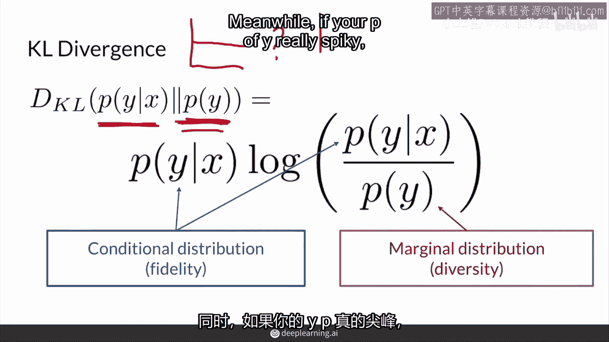

那么你对p(y|x)的猜测可能会集中在这个区域，如果p(y)基本上不具有信息性。

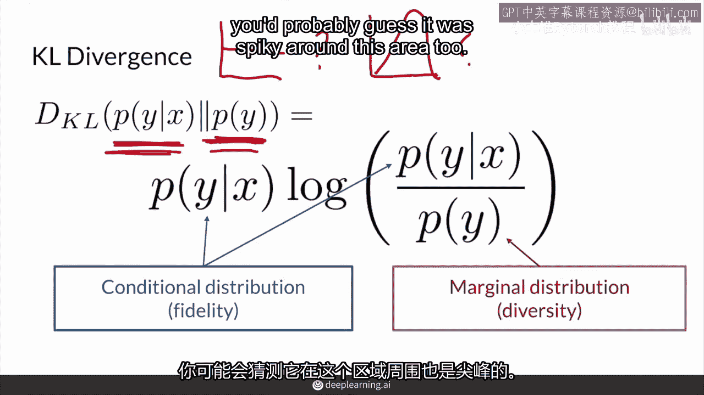

就像在高熵情况下，因为它有很多随机性，并且所有类别都均匀分布，那么你无法从p(y|x)中获得多少信息，你不知道哪个类别是从哪里来的，然而，如果p(y)充满了峰值或一个峰值在这里。

那么你可能对p(y|x)有一个好的猜测，至少可能是那个峰值。

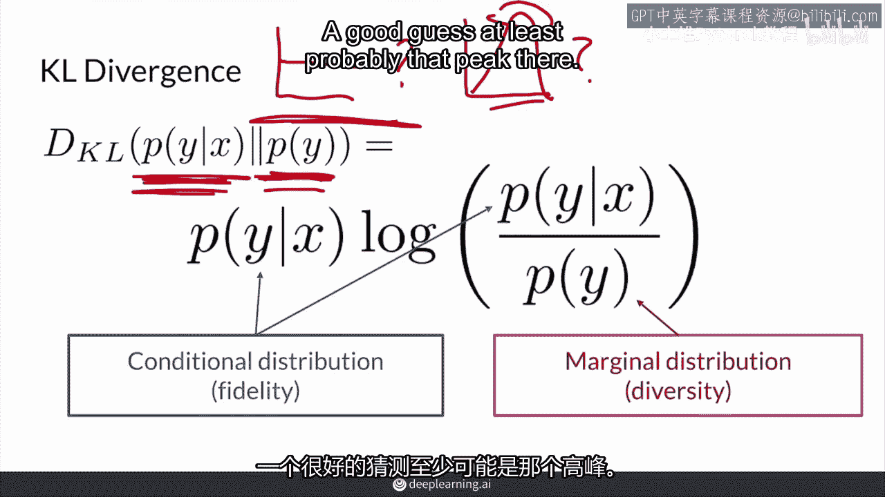

如果p(y|x)充满了峰值，那么你比猜测所有类别都均匀更难猜测那个确切分布。

如果你只是猜测所有类别都均匀，那么猜测这个人比。

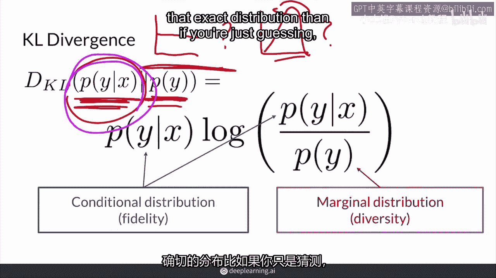

然后猜测，然后猜测，所以现在这是一些非常基本的直觉，不要担心，如果你完全理解不了凯尔分歧在理解概念核心的目的，你可以把凯尔分歧这里想成大约，理解条件标签分布与多样性边际标签分布之间的差异。

这是他们之间的相对熵，实际上有原因为什么它不是叫做KL距离，因为KL分歧在相反方向上并不等于，如果这两个项颠倒过来，它实际上并不是一个相等的值，但它是一个非常接近的差异概念，因此。

你会期望在高KL散度中看到分布相差甚远，这正是你所希望的，你想要一个高，你想要另一个低，换句话说，基本上，当假图像各有一个独特的标签时，并且那些假图像的标签范围也很广泛，在那些假图像之间。

你可以更深入地研究KL散度，这在机器学习中是一个非常有用的概念。

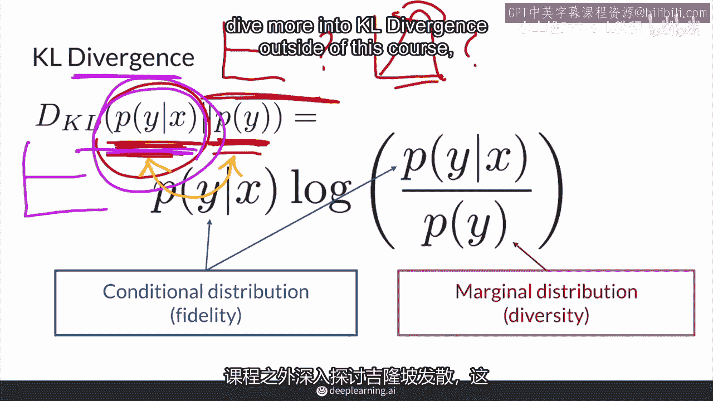

它是评估模型与真实值之间的核心信息理论组成部分，但本质上，它评估了这里条件分布的查看。

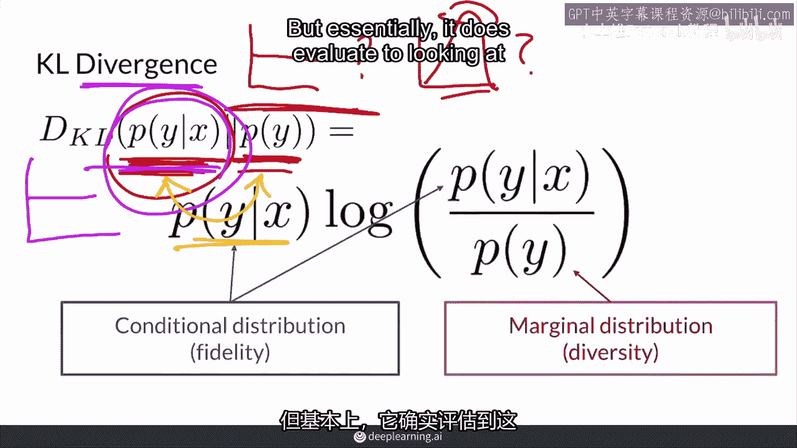

也评估了这里边际分布的查看，因此，生成分数然后对所有图像求和，对所有类别求平均，所以你看到这ε的p，也许更好的说法是，P的g是从你的生成器中采样的图像，然后在最后有一个指数。

所以这就是做e到这上面的这个大的项，而这个指数并不是为了计算这个值或对KL散度重要，以任何方式，这实际上是为了给出一个易于阅读的分数，比如一百分的生成式模型分数和零点，哦，哦，哦。

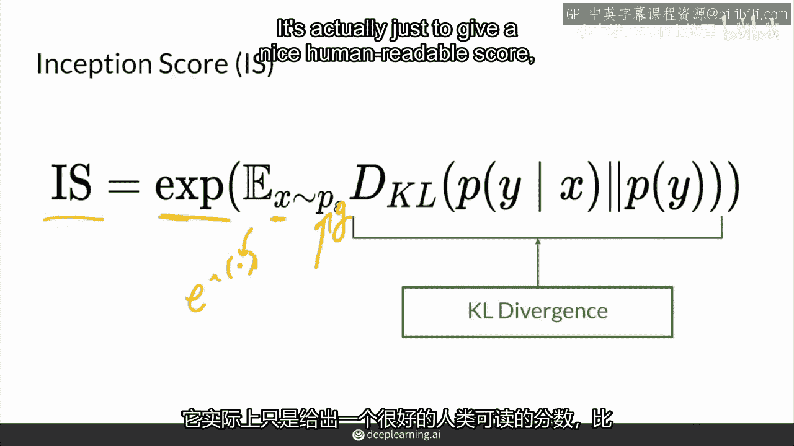

哦，哦，一，这在可能的输出中并不是很有用，所以从数学上讲，最低可能的值是零，最高的是无限，但在实施过程中，在这个案例中，最低可能的生成分数会是1，而最高的或最好的分数会是类别的数量或1000。

在这个案例中，因为Inception v3分类器是在含有1000个类别的ImageNet数据集上训练的，分数越高，就越好，这意味着条件概率分布的熵很低，能够找到相关的物体和特征，而边缘概率分布很高。

寻找一组多样化的特征，通常分数低或差的情况，是因为两个分布要么熵低，峰值高，所以没有多样性，或者两个分布熵高，没有明显的对象被发现。

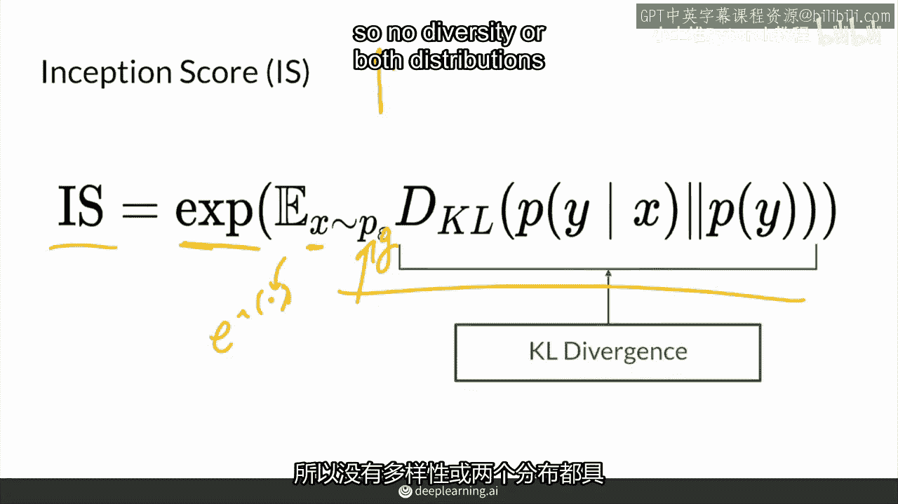

然而，如你所猜测，使用 inception 分数有很多缺点，首先这个指标在多样性方面容易被利用或作弊，因为如果你的生成器为每个分类器类别生成一个真实图像。

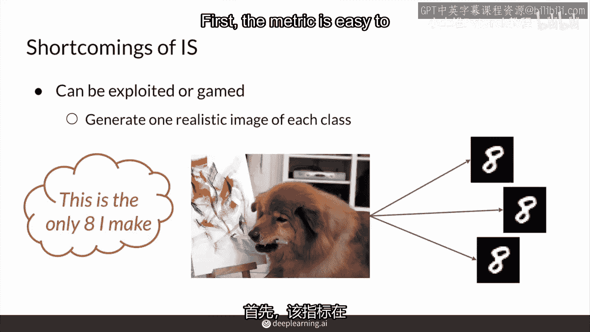

那么对于imagenet中的每个类别，它将生成1000个图像。

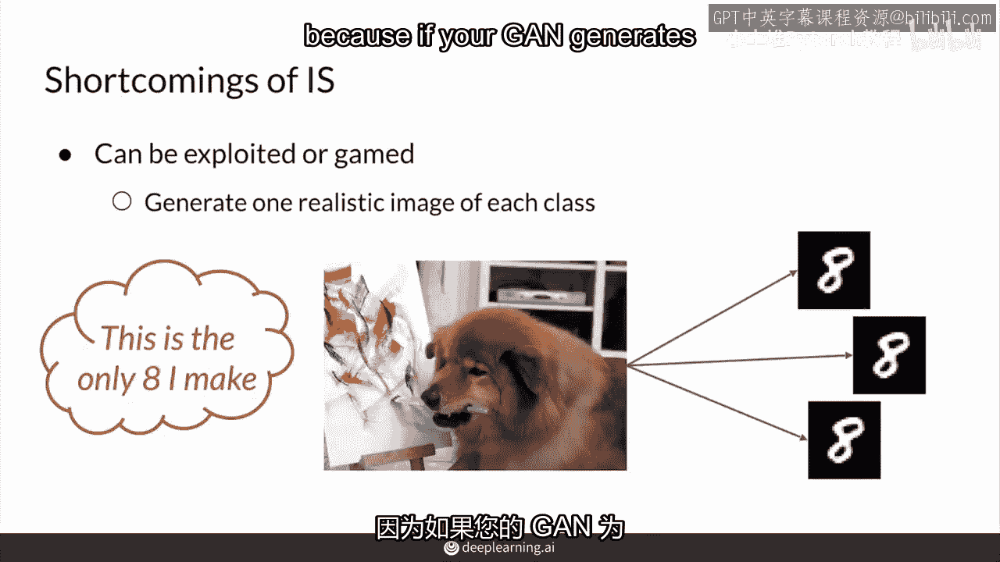

那么它实际上会得到一个完美的分数，但理想情况下，你的生成对抗网络应该能够生成每个类别不止一个图像。

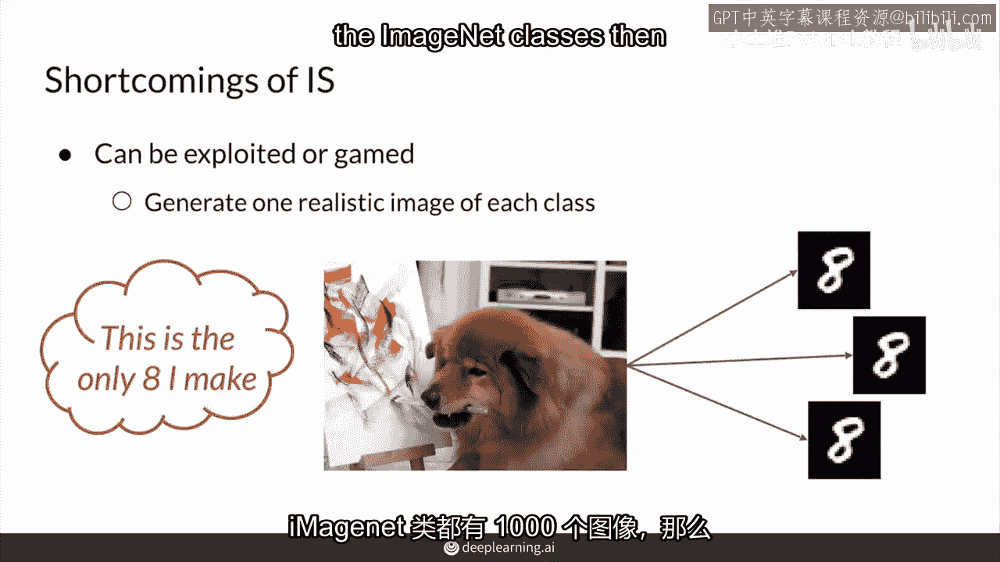

我想要两只金毛寻回犬，请。

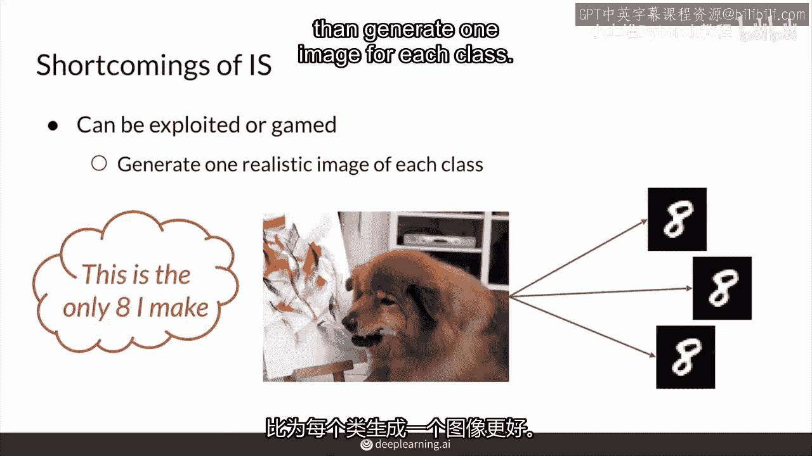

这绝对是模式的一种崩溃，我可以不被inception分数检测到。

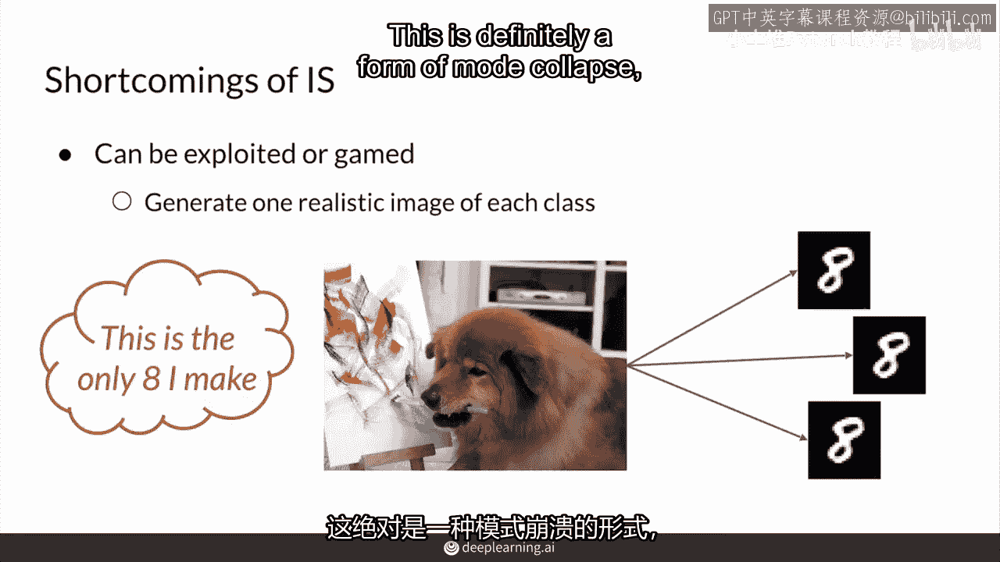

另一个大问题是inception分数只关注生成的样本，你可能已经注意到了，我从未提及真实的样本，也没有将生成的样本与真实图像进行比较，因此这些代理统计数据可能偏离理想状态较远。

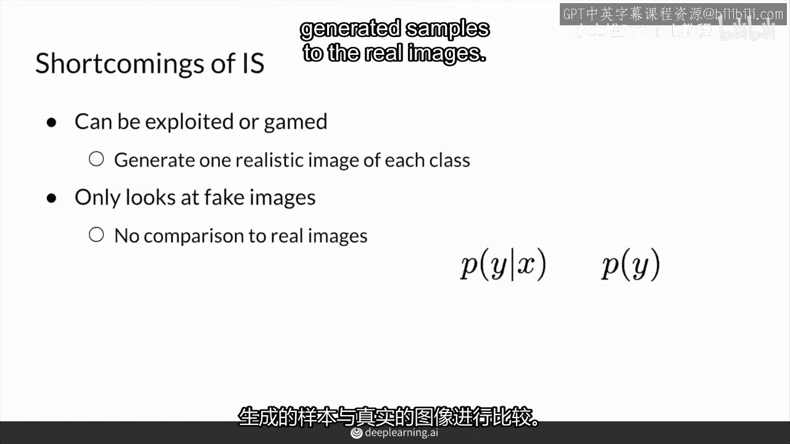

这也依赖于分类器，任务和能力，最后，由于分类器是在大型视觉识别数据集ImageNet上训练的，这些值和分数可能非常不准确。

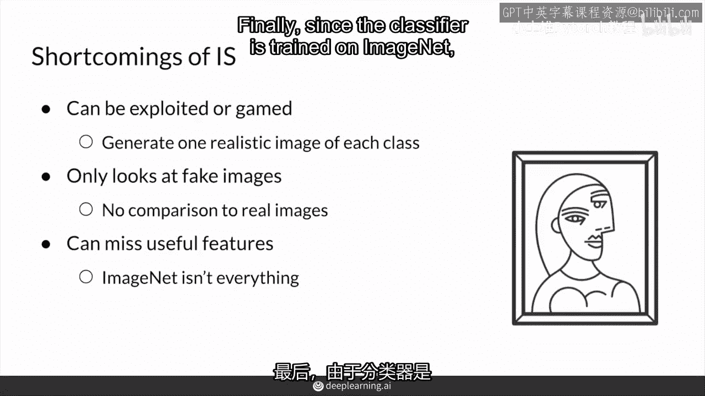

以类似于鱼短路的方式，例如，如果生成的图像中有很多物体会怎样。

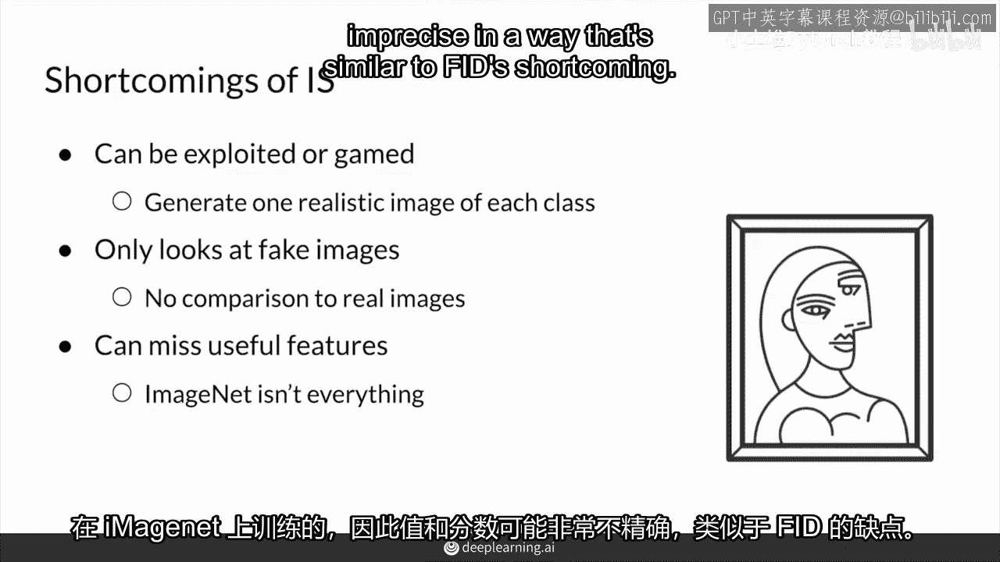

所以你会预期高熵，分类器输出的不同类别，如充满不同物品的卧室或办公室，因为它在那一张图片中捕捉到了许多不同类别，或者如果存在许多未被分类器检测到的特征，因为它们无关紧要，例如，只生成面部轮廓的生成器。

当分类器主要是为了训练犬种和其他物体。

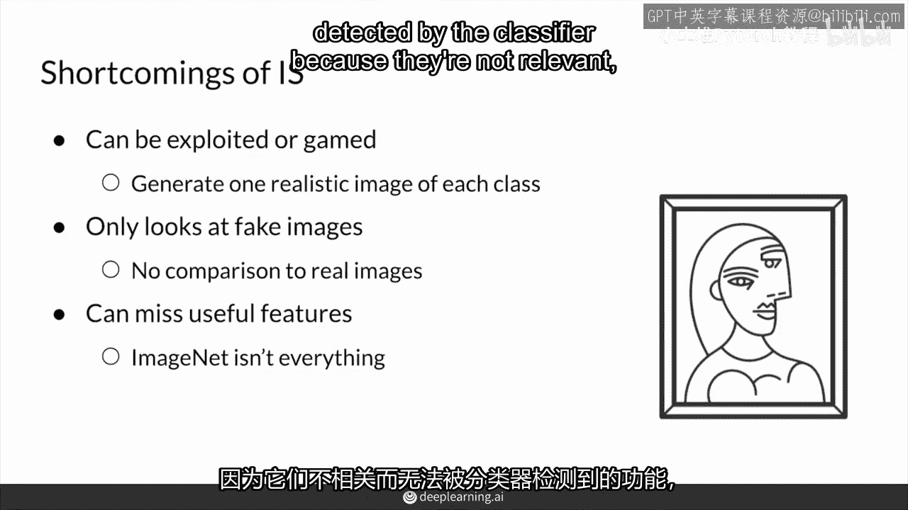

甚至生成面部特征位置错误的人类面孔的生成器，但看起来真实，因为你的分类器清楚地找到了面部的组件，因此，空间关系特别可能对 inception score 构成问题。

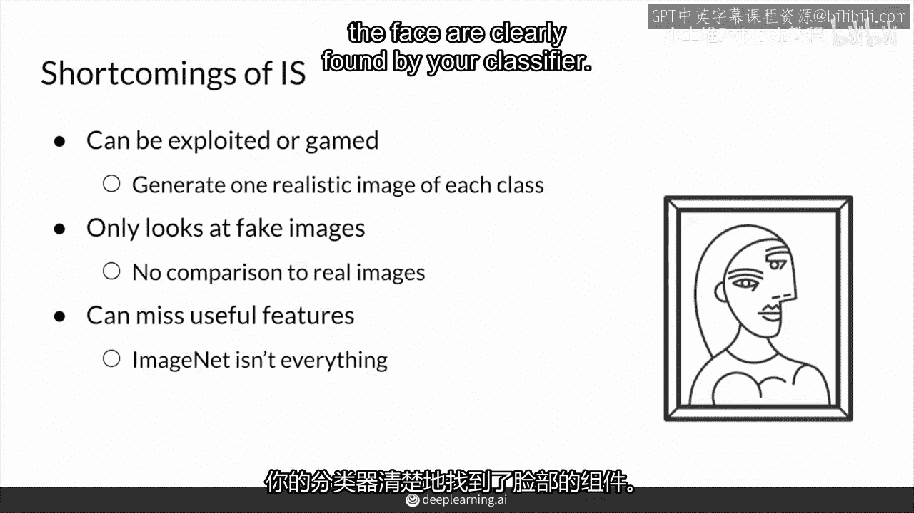

只有在训练数据集接近 imagenet 时，这才有意义。

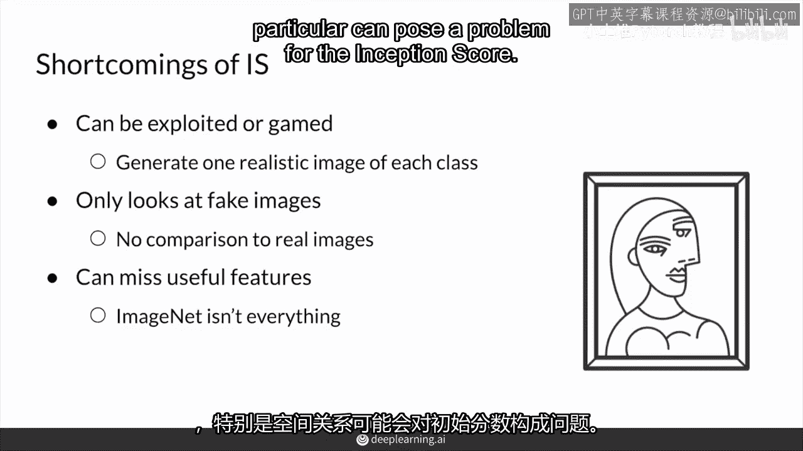

这像鱼一样，尽管所有。

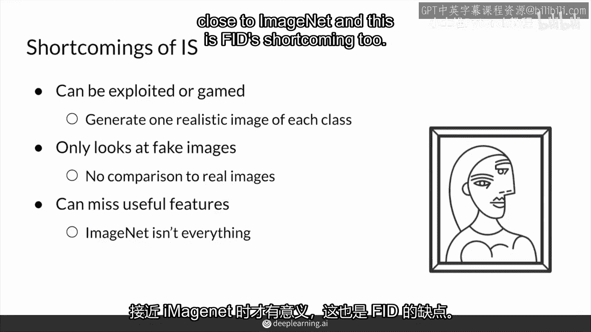

这个，生成对抗网络（GANs）中最广泛使用的指标之一 inception score 仍然存在，即使 fid 之后，这主要适用于期望明确类别的条件 GANs。

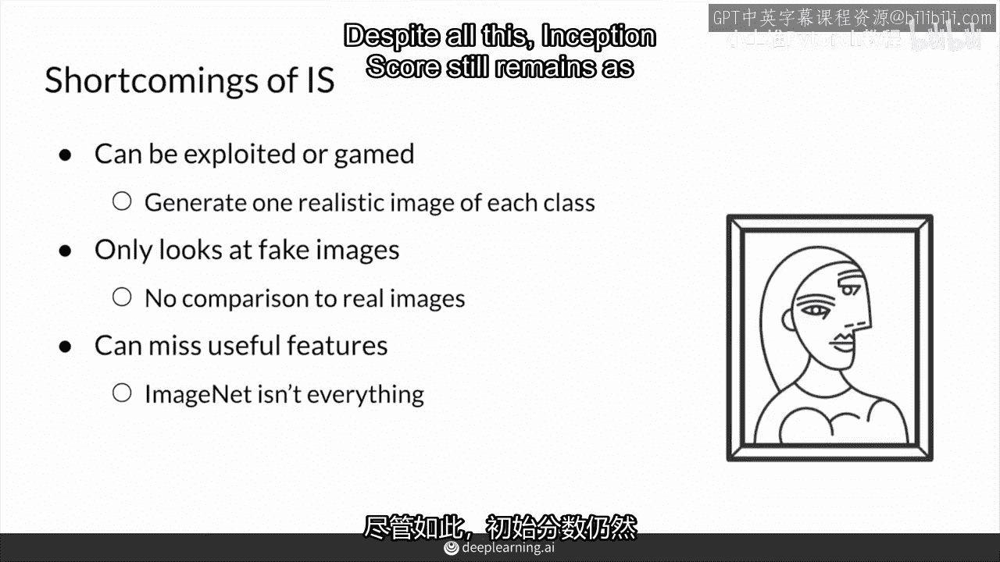

所以现在你知道如何将一致性和多样性转化为低或高的熵，以及如何找到两者的分歧来得到 inception score，这个分数相当受欢迎，但现在很大程度上被自由生成模型取代，但你会在许多地方看到它。

许多不同的论文。

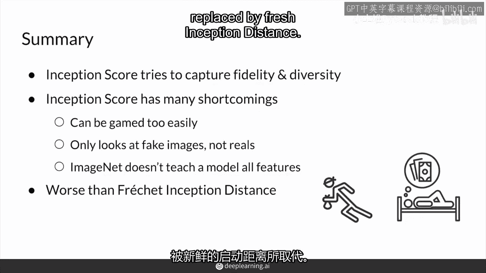