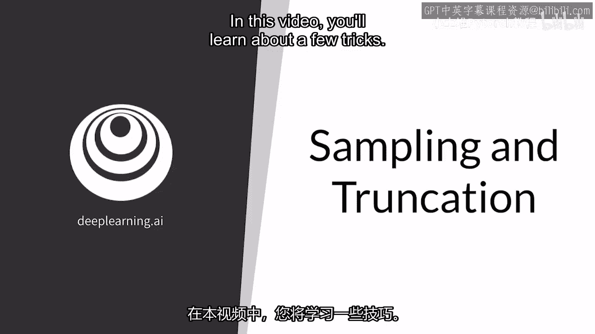
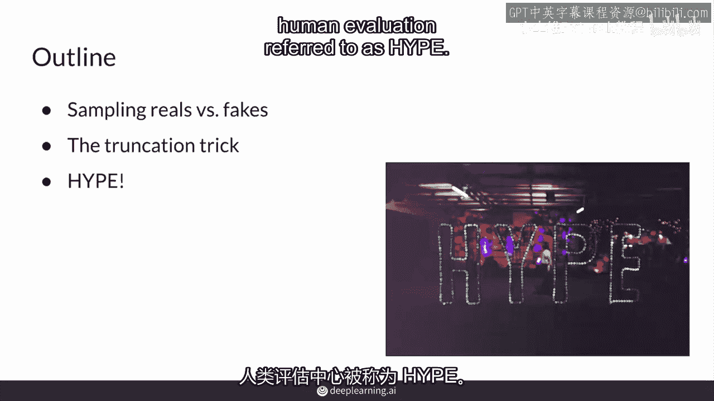
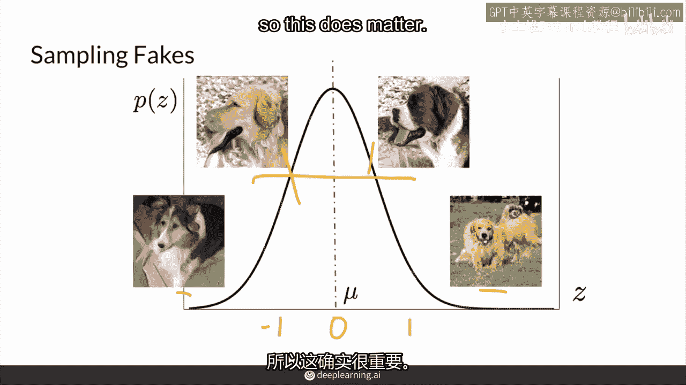
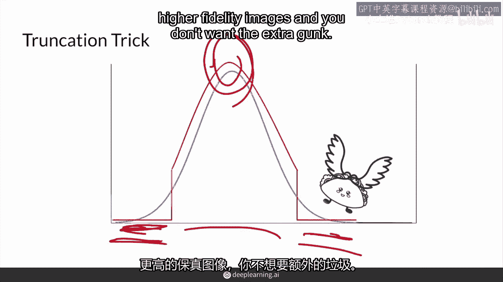
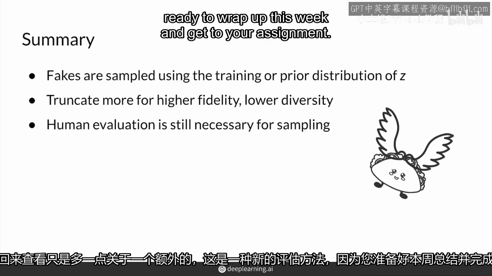

# P43：【2025版】43. 采样和截断.zh_en - 小土堆Pytorch教程 - BV1YeknYbENz

你现在已经知道关于这个视频中GAN的主要评估方法，你将学习一些评估生成对抗网络（GANs）的技巧。

在抽样方面，真实数据与伪造数据的统计数据都很重要，你会发现它们有何不同，并且我会讨论一个你在训练后可以做的技巧，转向更高的真实性或多样性，也兴奋起来，因为接下来我会谈论最近开发的用于人类评估的沙器。

它被称为炒作。

因此除了样本量之外，在评估时，你是如何选择样本图像的，特别是在处理真实数据时，你可以随机均匀地采样，但对于伪造的，通常的做法是根据训练数据集中的z值进行采样，或者噪声向量的先验分布，z的概率分布。

因为你通常会使用正态分布的噪声向量来训练GAN，这意味着，选择的z值来自正态分布，就像你看到的这里，它以零为中心，标准差为一，因此在训练期间，接近零的向量值比远离零的向量值出现的频率更高，结果。

当你使用接近零的值进行采样时，你的结果图像实际上看起来会相当不错，但这只是精确度，因为这也会导致多样性的损失，正如你所看到的，这两只狗看起来不错，但它们的多样性较低，然后这些外面的可能会看起来有点奇怪。

你可以通过选择在哪里采样来采用精确度和多样性，所以你可以选择在哪里采样来采用精确度和多样性，在中间取样会让你得到看起来更正常的东西，因此，无论好坏，你的抽样技术实际上成为评估和下游使用的一个重要方面。

并且因为你的评价指标如fid或inception score是基于你模型的样本运行的，不是你的模型参数，这意味着再次评估的结果很大程度上依赖于样本，所以这确实很重要。

因此，遵循对忠诚与多样性的观察，有一种叫做截断技巧的采样技巧被广泛使用，并且截断技巧正是一个技巧，因为这是在模型训练完成后进行的，它大致在保真度和多样性之间进行权衡。

它实际上会截断你在蓝色中看到的正态分布，这是在训练期间你从哪里采样噪声向量的，通过截断这里的尾部，这意味着你将不会采样到这些值，这个超参数，这个超参数决定了你会保留多少尾部，你可以在这里截断一个。

你可以在这里截断一个，这样你就可以保留更多的曲线，这样如果你想要高保真度，这大约是你图像的质量和真实感，你想要在零附近采样并截断你尾部分的更大部分，但这会减少你生成的图像的多样性。

因为这里是你生成古怪飞行玉米卷的地方，以及其他更奇怪的东西，这些在训练中没有得到太多判别器反馈，如果你想要更大的多样性，那么你就想要在你分布的尾部更多地采样，并且有一个较低的截断值，截断超参数值，然而。

这些图像的保真度也会降低，因为你的生成器不习惯得到它的权重，将那个噪声向量变成美丽真实的图像的反馈，那就是，它在这些区域采样的噪声向量在训练中没有得到太多的关于现实的反馈。

最后你可以肯定地训练你的模式在一个不同的先验噪声分布上，从哪你采样你的噪声向量，例如均匀分布，这里没可能有值的集中像这里，但正态分布因为人们可以使用截断技巧而很流行。

这可以用来调整你想要的保真度和多样性的权衡，这里展示了这一点，而且当人们尝试不同的先验噪声分布时，人们还没有发现一个显著的区别，并且，正如预期的，一个模型的fiscore会更高。

这意味着缺乏多样性或保真度时它会更差，所以这些样本在使用截断技巧时可能不会做得很好，尽管使用截断技巧可能在你应用它们的应用中符合你想要的，你在寻找应用它们的下游应用，你需要更高的保真度图像。

并且你不想要额外的垃圾。

所以说到使用那些截断样本，因为它们在人的眼中看起来更好，而不是fi，使用人们来评估和评估样本仍然是评价的一个巨大部分，并且通常是开发一个gan过程中的一个重要部分，而且什么是酷的是。

有一些系统地评估质量的方法，基于原则的众包和感知任务，事实上，最近开发的一个sanders for gan，fidelity是我在2019年与斯坦福的其他研究人员一起发明的，它的名字有点俏皮。

叫做hype for human eye，感知评价生成模型和hype显示一系列图像一个接一个地在亚马逊机械土耳其众包评估者，它要求评估者评估每张图片是真实的还是伪造的，而酷的是，一个名为hype的版本。

被称为hype的实际上以不同毫秒的时间闪动图片给你看，看看您在什么阈值可以判断出图片是真实的还是伪造的，您的生成模型越好，人类就需要更多的时间来决定那张图片是否是伪造的。

hype infinity移除了那个时间阈值，实际上它只是在浏览图片，当然，hype是基于高质量的控制并能够管理学习效果的，随着评估者对假图像与真实图像的区分能力越来越强，尽管所有这些。

最终评估将取决于您想要的下游任务，例如，如果你的GAN生成了带有肺炎的X光图像，您希望确保您的医生同意那里实际上有肺炎，也许不想让没有医学学位的亚马逊机械 Turkers来决定。

你可能不想让预训练在ImageNet的分类器来提取特征，并告诉你这是否接近肺炎的X光图像，在你声称你的假图像在X光上产生肺炎之前，好吧，所以现在你知道如何通过在训练期间使用 z 的先验分布来采样伪造。

在测试或推理时间，你也有了一个新的技巧，截断技巧，这可以让你截断你的采样分布的尾部，多一点或少一点，取决于你是否对更高的保真度或更高的多样性感兴趣，在采样的图像中显而易见。

自动化的评价指标仍然不能完全捕捉到我们想要的，但它们是一个良好的近似，这就是人类感知评估仍然设定基准和标准之处，这也是快速评估图片的一种方法，感谢您花时间与我一起学习。

请回来看看关于另一种新的评估方法的更多信息。

