# P46：【2025版】46. GAN的缺点.zh_en - 小土堆Pytorch教程 - BV1YeknYbENz

之前你学习了如何让Gan工作，主要关注其优点，比如它惊人的实际效果。

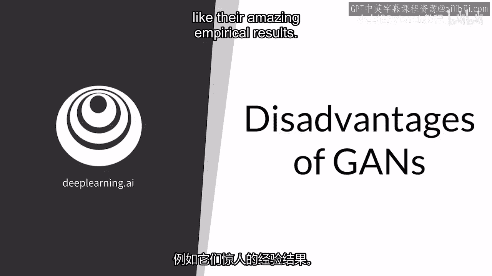

现在，你将看到Gan的一些缺点，因为这当你学习任何新技术时同样重要。

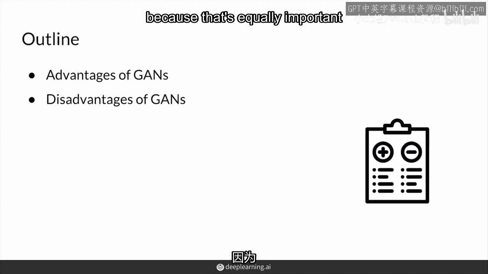

所以记住，Gan的一个显著优势是它们可以生成高质量，对肉眼来说非常逼真的图像，就像你和我的眼睛，你可能会被这些图像欺骗，相信这些人实际上存在。

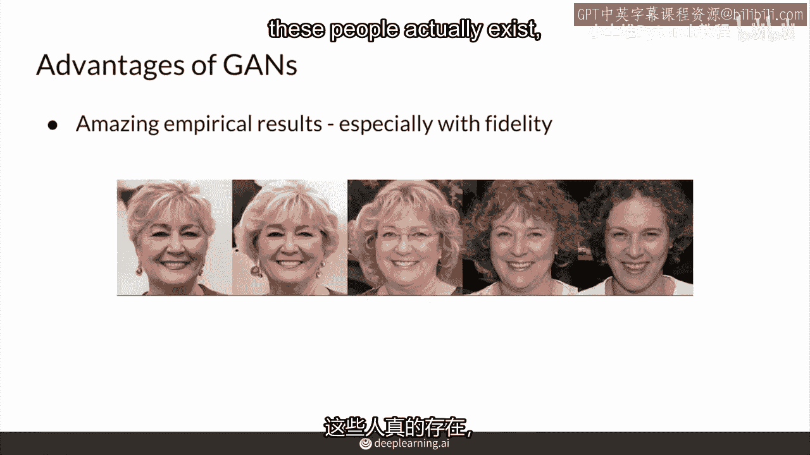

但这些都是生成的，另一个优点是，一旦你有一个训练好的模型。

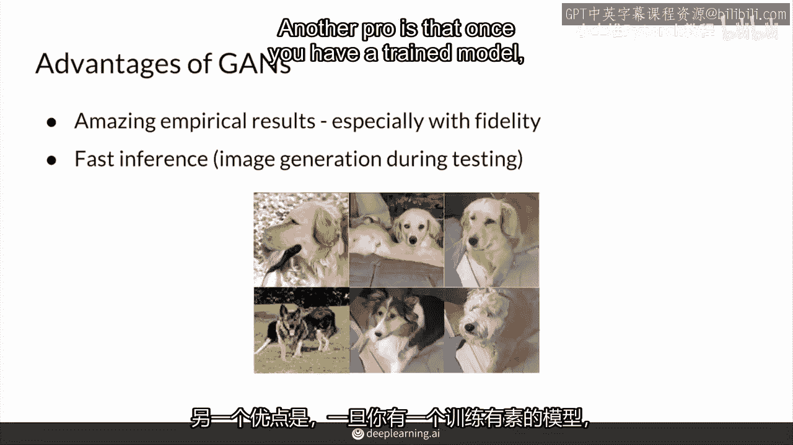

你可以快速生成对象，你可能记得在你的作业中看到过这一点。

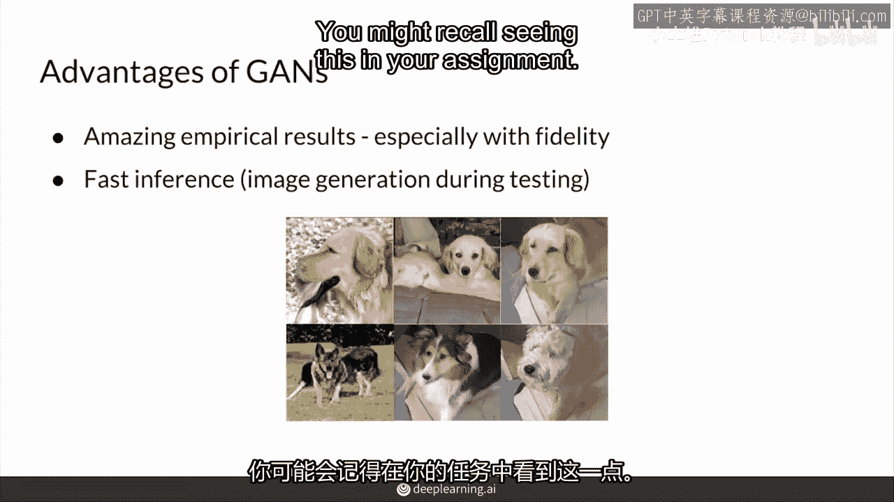

你所需要做的就是加载模型的权重，然后输入一些噪声，然而，Gan也有其缺点。

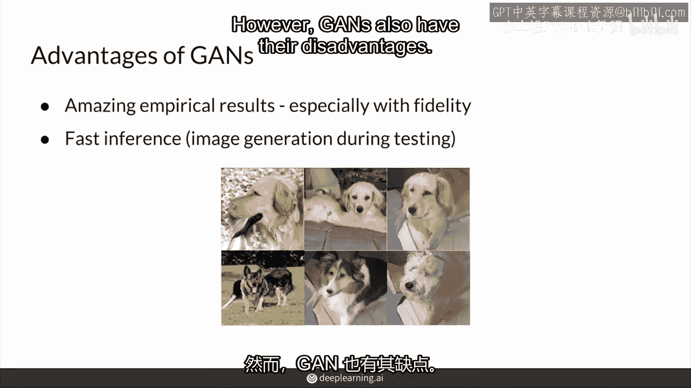

首先，它缺乏明确的，理论上的，内在的评价指标，你怎么衡量它们的性能，你不能只是看看模型，权重或输出，并轻易地说，啊哈，这个模型是最好的，这个模型比那个更好，为了评估你的Gan。

你可能记得通常需要比较许多生成的样本的特征，并与真实图像进行比较，甚至这种方法也不可靠，那只是你理想评价方法的一个近似估计，另一个缺点是，在训练过程中。

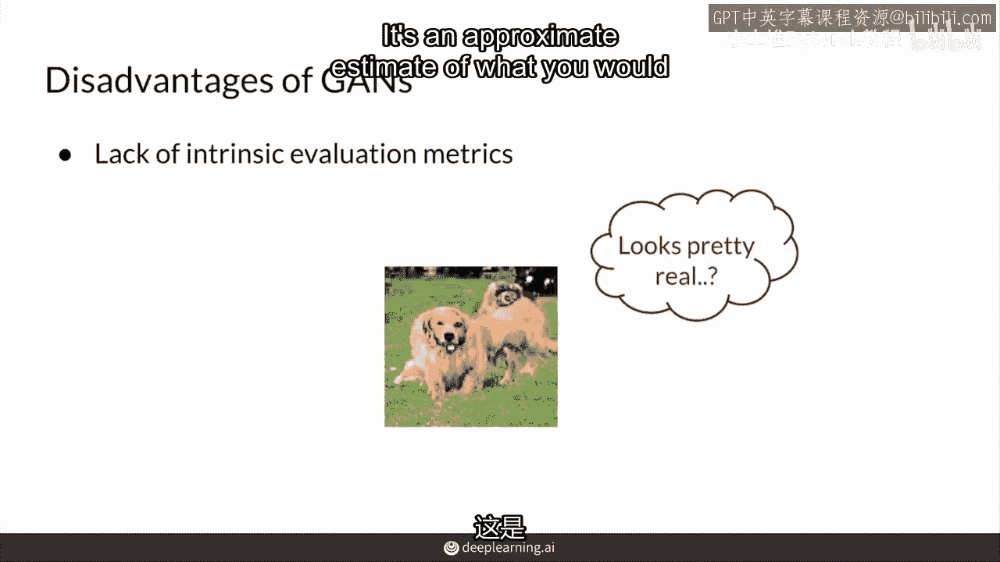

模型可能会不稳定，需要很长时间才能训练，有时感觉更像是一门艺术而不是科学，因为梯度下降并不总是能给你一个生成器，你需要，例如，比如模式崩塌，你看到这种产生所有7的情况，当生成器卡住时。

你不能继续训练并期望你的Gan会收敛，你需要照顾它，经常检查何时停止训练，你需要定性地检查那些样本，但同时，你也看到了这个问题被w loss a bit和Lipschitz连续性所解决。

所以虽然这是一个问题，但它已经不再是一个巨大的问题，所以也许我们可以划掉它，尽管这在Gan的早期确实是一个缺点，所以，我们可以把它划掉。

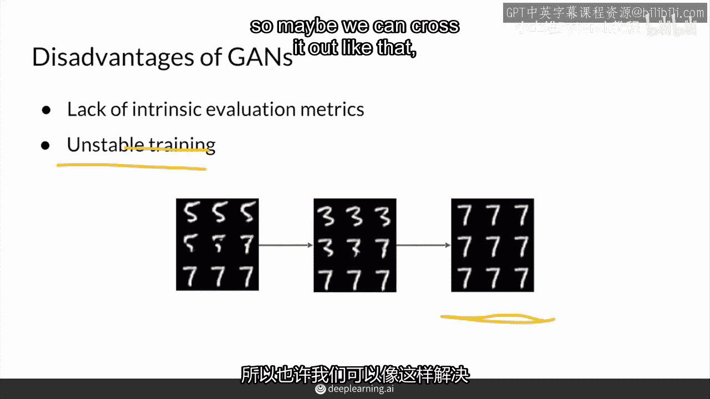

尽管这在Gan的早期确实是一个缺点，取决于你想要用它做什么。

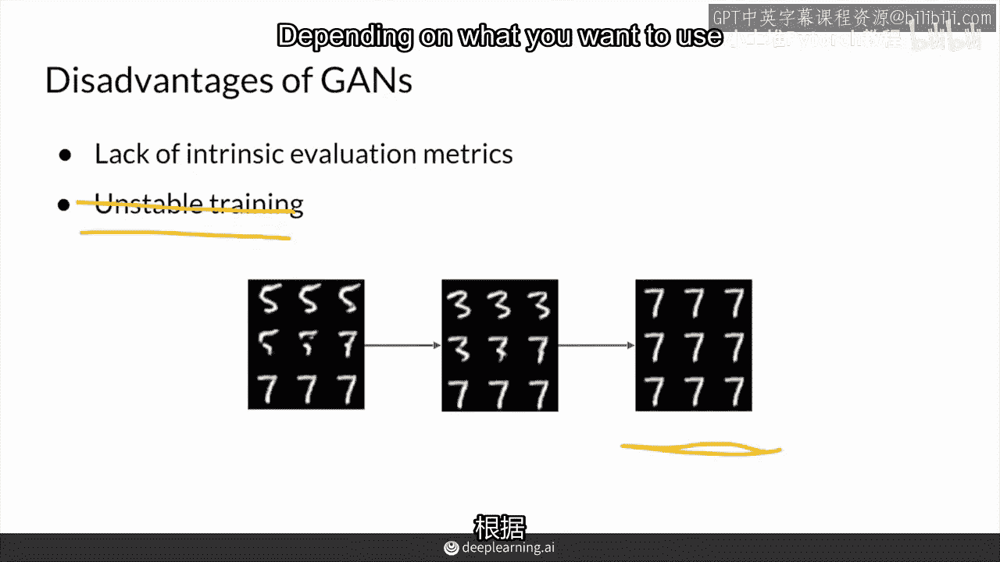

你的生成模型可能不是GANs的正确类型，如果你想要明确地获取你建模的特征上的概率密度，这意味着，比如说，一个特定图像的可能性，这些特性出现自己的可能性有多大，这可能会有用，如果你想说的话。

通过观察一个不太可能的狗看起来像什么，与一个可能的狗进行异常检测，也许这不太可能，或者它可以检测到非常猫狗，在那边非常不可能，这就是密度估计，因为它正在估计这些特征的概率密度。

密度估计有助于了解金毛和长耳等特征在狗中的出现频率，例如，通常这些特征构成了狗，这可以进一步用于下游任务，例如，寻找异常情况，即在大量样本中某些特征的概率较低，但通过许多样本，你可以。

当然，得到生成对抗网络的某种近似。

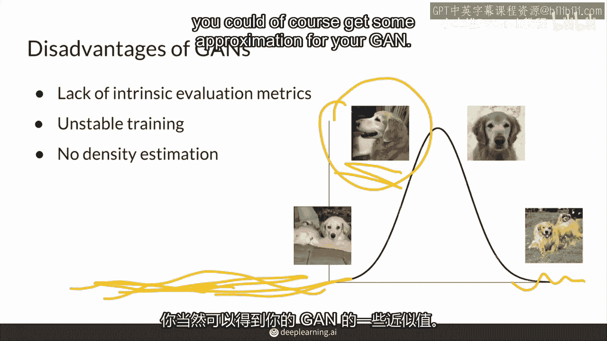

最后，生成器没有被训练成可逆的，这意味着你可以输入一张像这样的图片，然后找出它映射到了什么样的噪声向量，也就是相反的任务。

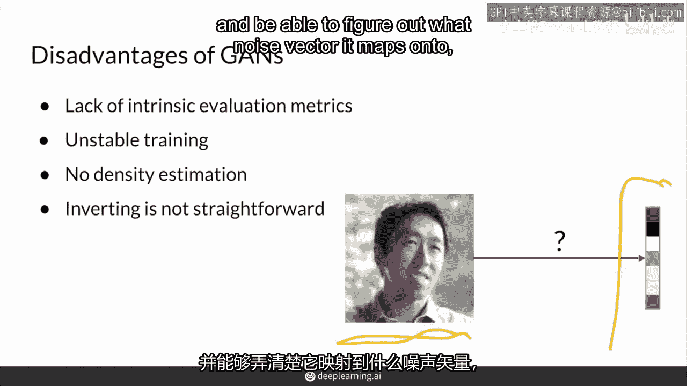

所以，不再是输入一个噪声向量然后输出一张图片的常规任务，现在，你想要输入一张图片来找出它的关联噪声向量，出现了一些新的方法来解决可逆性问题，通常使用另一个模型来做相反的事情。

也有一些GAN被设计成同时学习两个方向，一个GAN朝一个方向走，另一个GAN朝另一个方向走，你可能在想为什么反转会有用，反转对于图像编辑可能特别方便，因为这意味着。

你可以将可控生成技能应用到你找到的任一图像的噪声向量上，这可能是一个真实图像，它不一定必须是已经生成的来找到噪声向量。

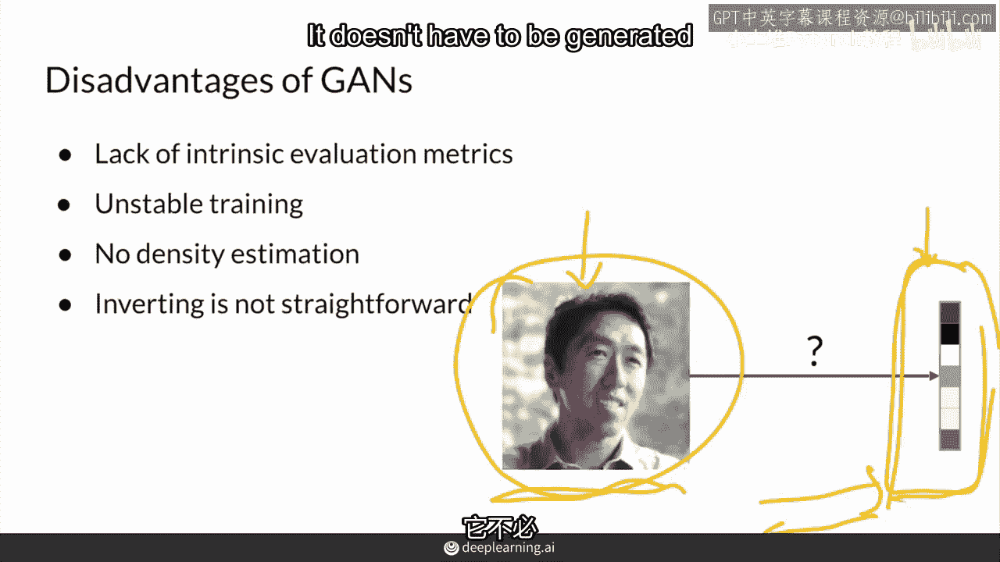

然后你可以使用你现在拥有的可控生成技能来调整那个噪声向量。

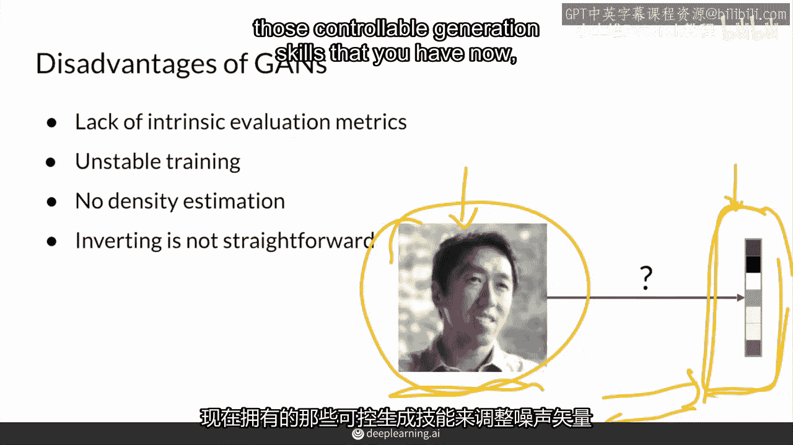

所以这张图像可以是，例如，更年轻的，更年长，或者有蓝色头发。

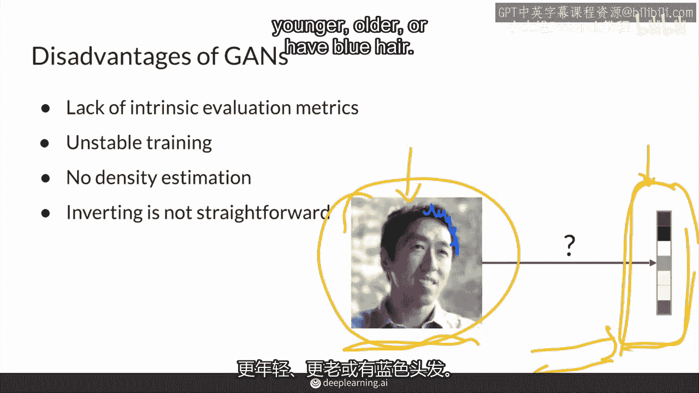

那该有多好，好吧，所以总结来说，GANs具有难以置信的高质量结果和相对较快的训练模型生成，然而，缺乏内在评估指标导致训练不稳定，尽管这个问题已经得到了一定程度的解决，模型没有正式的密度估计。

而且将图像转换为其潜在空间表示可能具有挑战性，尤其是如果模型非常大，很难找到那个潜在模式在哪里，但这我认为很重要，强调高保真结果的重要性，生成对抗网络(GANs)可以说是最好的也是最早的。

AI模型来实现如此逼真的输出，而且非常一致，因此，GANs经常被用于其他地方以增强输出的真实性，这真的很关键，这就是GANs可以在许多不同领域应用的地方，在下一个视频中。

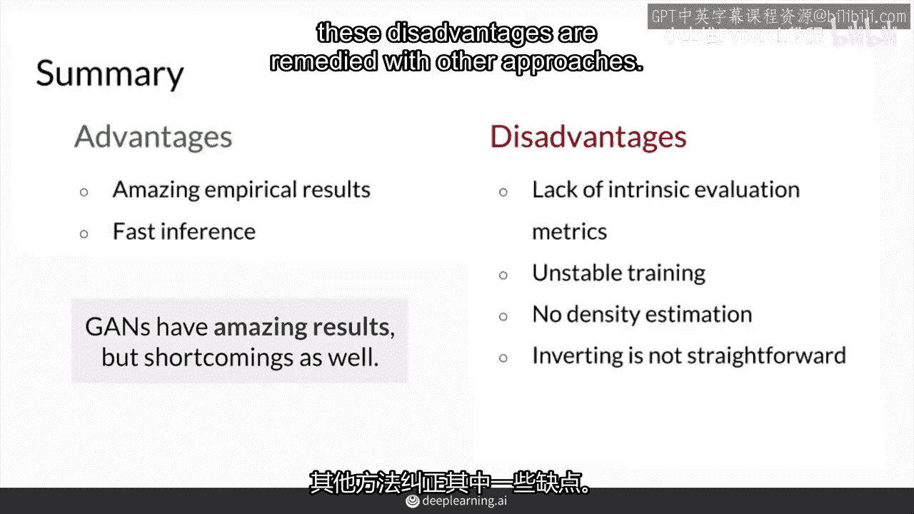