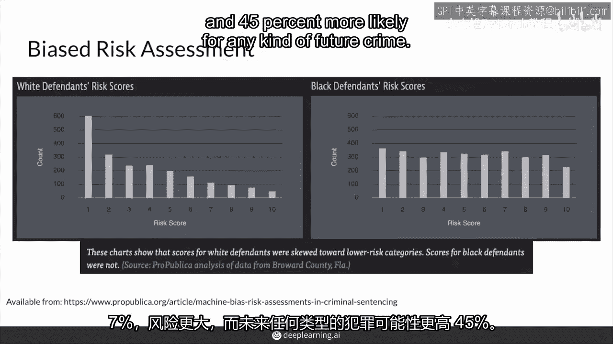

# P48：【2025版】48. 机器偏见入门.zh_en - 小土堆Pytorch教程 - BV1YeknYbENz

在以下视频中，我将从生成对抗网络（GANs）后退一步，讨论偏差问题，这是一个全球性问题，渗透到生活的许多方面，这在机器学习和GANs中也不例外，这些视频的目的是提高人们对机器学习中偏差的意识。

特别是对GANs中的偏差，这是消除模型中偏差的第一步。

因此，您将获得一个对《机器偏差》杂志文章简介，并讨论在全国范围内使用的专有软件中发现的种族差异，那是用于整个美国的软件，在刑事判决以及这带来的影响，首先。

我将概述《普罗大众》新闻文章中的主要观点。

名为《机器偏见》的美国，司法系统法院越来越多地依赖风险评估，或者你未来犯罪的可能性，许多风险评分计算现在计算机化，它们开始依赖于机器学习。

越来越多，普罗大众，通过公共记录请求评估了机器偏见系列中的两个领先商业模型之一，这个算法叫做指南针，指南针的目的是为了减少预审量刑的偏见，它的目的是减少偏见，但普罗大众的发现表明。

这个算法本身实际上存在显著的偏见。

关于指南针的一个重要事项是，用于计算分数的计算方法被认为是专有的，公司没有分享它们确切的内容，计算基于被告填写的问卷，以及他们的犯罪记录，没有关于种族的疑问，但它会问一些问题。

比如你的父母是否有人被送进监狱，一个饥饿的人是否偷窃是错误的，所以有点哲学，也许道德，然后法官可以根据风险评分的评价增加或减少刑期，是的，这些问题根本不涉及种族。

但我们会看到一些替代性问题可能会试图触及这一点，或者可能会因为所问的问题而有偏见，不幸的是，指南针算法只有大约20%的时间正确预测了暴力犯罪的复发。

在Pua中发现，模型预测黑人被告有70%，7%的可能性和更高的风险犯下未来暴力犯罪。

和4，5%的可能性犯下任何类型的未来犯罪。

在图表中可以看出，虽然白人被告和高风险评分的数量同时减少，这张图表显示，黑人被告的可能性保持不变，这开始表明，白人被告的分数偏向于这些较低的，风险类别。

尽管黑人被告的分数没有，所以，以某个例子来说，格雷戈里·卢戈。

他是一个白人，与玛洛里·威廉姆斯，她是一个黑人女性。

两人都因酒驾被捕，但他们的前科记录不同，卢戈实际上在他第四次严重犯罪前有三次酒驾记录。

以及袭击。

威廉姆斯实际上在她只有两次轻罪记录的情况下，第一次面临严重的指控，这比醉驾的记录要少，所以，即使威廉姆斯的历史，在犯罪行为方面，比卢戈要轻得多，但她的风险评估分数实际上更高。

6分，而不是这里的1分，那么这些风险评估分数对个人有什么影响呢？保罗·齐利。

一个正在康复的吸毒者复吸并偷了一台割草机。

他的认罪协议被推翻。

双方都同意的，检察官和被告，他的刑期从县监狱的一年增加到州监狱的两年。

在法官看到他的高风险评分后。

但在上诉后，他的刑期从两年减少到18个月。

上诉法官指出，如果没有同情心，西利本会被判一年或六个月。

这意味着这个风险评分实际上使他在监狱中待得更久。

另一方面，萨奇·琼斯，她在被捕时年仅18岁，没有前科。

在骑一辆未上锁的自行车后被评估为中等风险。

她的保释金从推荐的0美元提高到1000美元。

因此她现在仍然难以找到工作，因为她的犯罪记录，这就是高风险评分的一些后果，即使这个人之后可能没有做坏事，这主要基于模型的预测，如果模型以偏颇的方式预测，以偏颇的方式，那样可能不太公平。

研究人员还发现，该模型在所有地区仅60%的时间正确预测了再犯者，一次，再犯风险，暴力犯罪风险和未能出庭风险。

仅针对暴力犯罪的准确率仅为20%。

然而，问题开始出现，因为错误对那些白人和黑人不同。

与黑人相比，所以对于假阳性，接近4%，非裔美国人中，被标记为未来有高犯罪风险的，实际上并没有犯罪行为，这与2%，3。5%，白人美国人相比，然后对于假阴性，我，E，那些被标记为低风险但实际上重新犯罪的人。

所以我们应该抓住的人，两个，非洲裔美国人8%和4，8%的白人美国人，所以很明显，这个模型在评估方法的公平性方面存在问题，一旦这些细节被揭露，总之。

为了在刑事司法系统中预测谁有可能重新犯罪，谁没有可能，创建了模型来减少偏见，预测谁有可能重新犯罪，谁没有可能，实际上似乎只反映了我们自己的偏见，加强了重新融入的困难，对于历史上被忽视和歧视的群体。

由营利公司创建的专有风险评估软件只使理解并改善这些系统更加困难，因为他们的计算结果不公开，而且通常对软件准确性的调查是由同一批人进行的，他们创建了软件，另一个需要考虑的是，这些模型没有全面看待人。

比如人们努力改造自己的真诚努力。

或者更长的刑期对他们的家庭照顾能力的影响。

