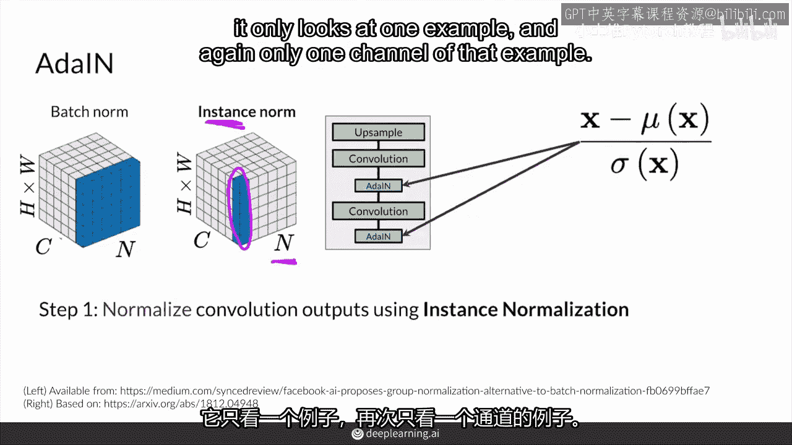
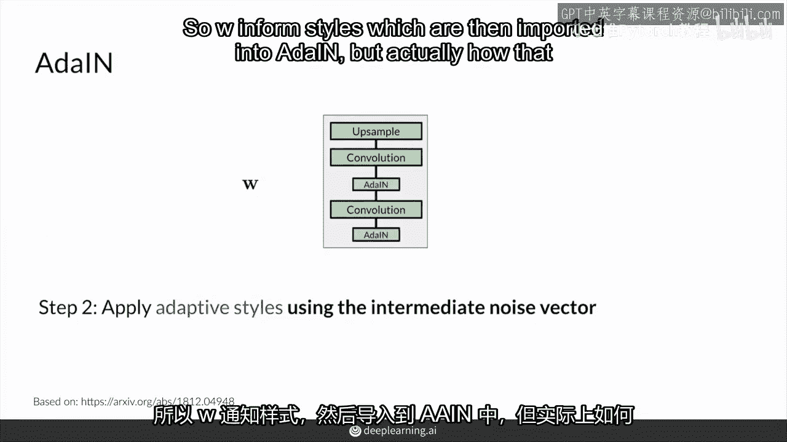
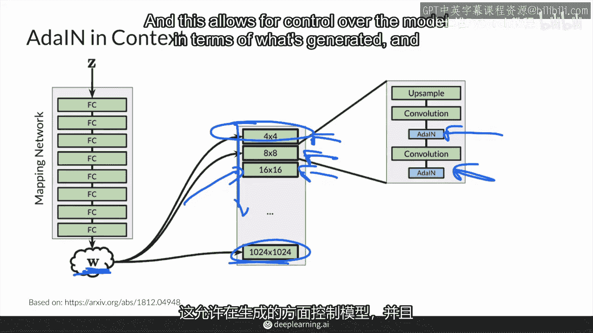

# P56：【2025版】56. 自适应实例归一化(AdaIN).zh_en - 小土堆Pytorch教程 - BV1YeknYbENz

好的，所以现在，是时候更详细地看一下，你的中间噪声向量是如何被整合到网络中的。

这涉及到适应性实例归一化或简称add it in。

首先我会谈谈实例归一化。

并与你更熟悉的批量归一化进行比较，然后我们会讨论适应性中的适应性。

以及add it in或适应性实例归一化在哪里和为什么被使用。

所以首先add it in在风格游戏的上下文中，你已经学习了渐进增长的这个中级块。

你还学习了这里的噪声映射网络。

它向这些渐进增长的不同块注入w。

你看到有一个上采样层，一个卷积和另一个卷积。

以帮助学习额外的特征，以及使用上采样层将图像大小加倍。

但这实际上并不是全部，自适应实例归一化添加进来。

实际上在每个卷积层之后添加，你会看到它如何添加。

并且这些块中流入的内容实际上也会进入这里。

首先，我们只关注这个块，自适应实例归一化的第一步是实例归一化部分。

这里发生了什么。

如果你记得，归一化做了什么，它从卷积层中提取输出x。

并将它们归一为零均值和一标准差，通过计算这些值的均值和标准差来实现，然后使它们围绕零中心，标准差为一。

但这还没完。

因为它实际上并不基于批次，你可能更熟悉批归一化。

在批归一化中，你横跨图像的高度和宽度，这是在你看到的高亮蓝色轴上。

在这里你看一个通道，所以在RGB中。

你只看R，例如，你在小批次中的n个例子中看。

然后你得到均值和标准差，基于所有高亮蓝色单元的一个通道在一个批次中。

然后你也为下一批做同样的事情。

也适用于下一个频道，但实例归一化有点不同。

实例，归一化在这里使用相同的图表进行比较实际上只查看一个示例或一个实例。

示例也称为实例。

所以它不会查看整个批次的统计数据，它只查看一个示例。

再次只查看该示例的一个通道，所以如果你有一个带有RGB通道的图像，那将只查看该通道。

假设这里的b只是这蓝色通道，只从蓝色通道获取平均值和标准差。

没有其他东西，没有任何额外的图像。

只从那一个通道获取统计数据，一个实例并在那里对这些值进行归一化。

基于它的平均值和标准差。

为了在方程中表示这一点，我们实际上在这里调用实例i。

所以会是那个实例的x i，以及那个实例的平均值或mu。

以及标准差，再次在这里，这意味着每个实例的值都会被归一化为均值为零。

标准差为一。

这就是自适应实例归一的第一步，这就是实例归一部分。

而自适应部分就在这里，是将自适应样式应用到现在归一化的值集上，在这里实例归一可能比批量归一更合理。

因为它真正是关于你生成的每个单个样本，而不是批量或批量内的归一。

例如，好的，因此，自适应风格来自于你的中间噪声向量。

在你被输入到网络多个区域的事情上听说了。

因此，自适应实例归一化就是w将发挥作用的地方，所以，你有一个原始的z向量，它的每个值都是从正态分布中抽样得到的，它通过你之前学过的这个映射网络噪声映射网络被发送。这是一个多层感知器。

用于获取您的中间噪声向量。

我们输入样式，这些样式然后被输入到添加它中。

但实际上，它是如何通知那些样式的，实际上并不是直接输入w在那里。

相反，它通过学习参数进行。

例如两个全连接层并为我们产生两个参数。

一个是y s，它代表尺度，另一个是yb，它代表偏置。

你可能能猜到这些术语是为什么缩放的参数这个，并且偏置参数或偏移参数是另一个。

然后这些统计数据就会被输入到添加层中。

所以那是放在那里，然后另一组这些值会被放入到另一个中。

并且它们确切地是如何被放入 y s 和 y b 的，在那之后，你做了这个实例归一化步骤吗？

这部分是哪里，然后你想乘以你的值，这些值现在归一化到零。

标准差为一。

这跟批量归一相似，然后你想重新调整和缩放你的值。

基于从w中间噪声向量提取的统计数据。

所以第二步是获取这些自适应样式，它们是自适应的。

因为你的w可以改变，或者提取的这些值会改变，因此，观察这种风格实际上归结于重新缩放和重新。

调整值到某个范围内。

即均值和标准差，你可以将其视为具有一定内容的图像，并且通过调整y值y s和y b值。

它会像毕加索的德鲁伊。

或者像莫奈画的那幅画，但它仍然具有相同的内容，对吧。

它仍然是一张脸，仍然是一片向日葵田，但它会是一种不同的风格。

将你的值调整到不同的范围意味着标准差实际上会给你带来不同的风格。

这真的很酷，注意这里还有一个i，实例。

因为这是实例归一化，所以你有这些y s和y b值。

仅针对那个实例，注意，在应用这些风格之前，本质上，这个中间的实例归一化部分试图消除任何与风格相关的信息。

以便获取某种内容。

以便有效地在下一步应用这种风格，好的。

所以，稍微退一步，add it in在哪里再次发挥作用呢。

生成器由许多块组成，其中早期的块实际上大致对应于较粗的特征，而后面的块对应于较细的细节。

这在所有神经网络中都是相当一致的。

在这里，有趣的是，add it in被用于生成器中的每个块，以基本上从w中获取风格信息。

所以w被添加到这些块中。

并且在添加到这些早期块时。

它会影响这些较粗的细节，而在这些较后的块中，它会影响较细的细节。

由于add it in自适应实例归一化在归一化步骤中，将统计量归一化为零均值和一标准差。

由于这一步骤发生在每个块中。

这意味着每个块都将控制该块的风格。

并且在下一个块中，它将被下一个add it in所覆盖，后者归一化了之前的输出。

即使在块内部，这也会发生，就像这里所示，这允许对模型进行控制，以生成内容，以及生成哪种风格。

想象在不同的块中注入不同的风格，以允许粗粒度或细粒度的控制。

这将在下一个视频中介绍。

所以w可能不仅仅在这里，总结来说。

自适应实例归一化是将中间噪声向量w中的风格信息传递到生成的图像的方式，实例归一化实际上对每个样本进行归一化。

所以，实例归一化，是将风格信息从中间噪声向量w传递到生成的图像的方式。

实例归一化实际上对每个样本进行归一化。

每个实例，在自适应实例归一化中的自适应部分。

能够根据中间噪声向量w应用不同的样式到那张图像上。

或者应用到那个中间特征图上，在下面的视频中，你可以看到样式部分是如何起作用的。

也许可以更好地适应你的w。

