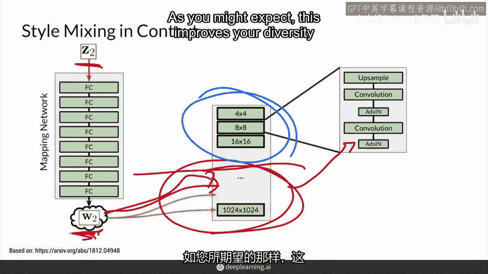
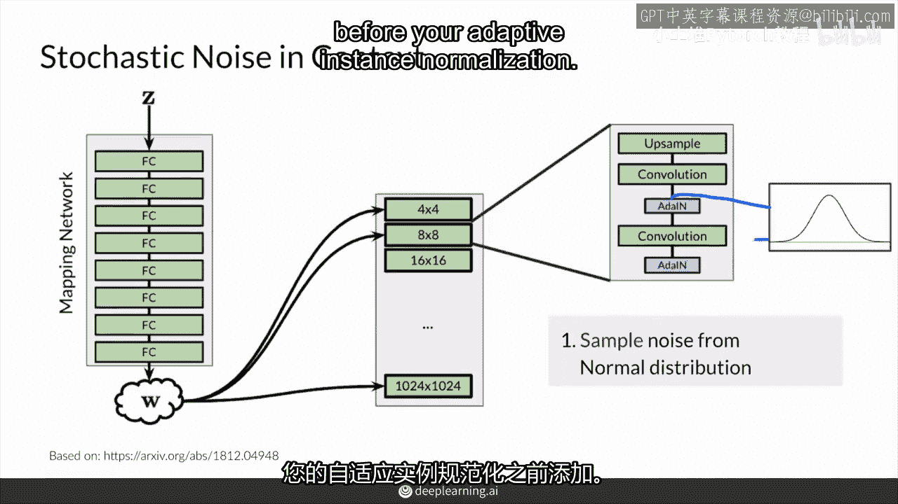
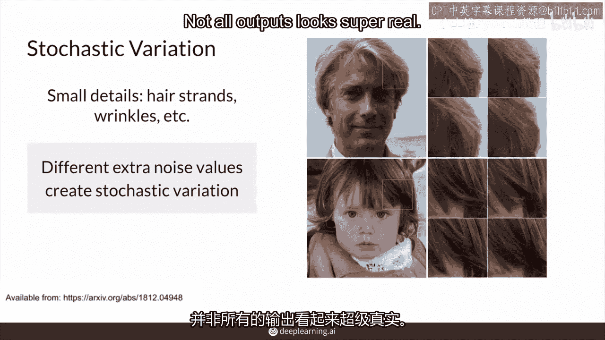

# P57：【2025版】57. 风格和随机变化.zh_en - 小土堆Pytorch教程 - BV1YeknYbENz

在这个视频中你将学习风格混合的知识，它将混合不同的中间噪声因素以及随机噪声，这将为你的模型和图像添加一些额外的噪声。

所以在这个视频中你将学习如何通过风格GAN控制合唱和精细风格，使用两种不同的方法，第一种是风格混合以增加训练和推理时的多样性，这是将两个不同的噪声向量输入到模型中。

第二种是添加随机噪声以增加图像的变异性，这将添加小的细节。

例如头发的一丝一缕，所以为了理解风格混合，所以你可以看到第一行的虎斑猫，这些也是生成的虎斑猫和礼服猫。

这些底部和中间的图像也是生成的，你看到的其实是两种的混合，虎斑猫和礼服猫的混合。

这就是风格混合的目的所在，如果你能从第一行生成图像，也能从第三行生成图像。

那么你也许可以通过某种方式在第二行生成图像。

好的，所以你已经提前看到了，这如何在之前的视频中工作。

所以尽管w在网络中多个地方被注入，但实际上每次不需要使用相同的w，所以你可以说。

你知道我不想在最后一个区块这里注入w，或者我不想在这里的任何地方注入它。

我只想在那里注入，或者我只想在网络的前半部分和后半部分注入。

例如，所以你实际上可以做的是，你可以实际上有多个w，所以你实际上可以采样一个z，假设z1，所以你正在采样那个z，它通过映射网络，你得到一个w，它与w1相关联，并将其注入到，假设网络的前半部分。

记得那是通过输入的，全部添加，然后您再采样另一个z z two。

这样就得到w two，然后将其输入网络的第二部分，您将此注入网络第二部分的所有不同区块，再次通过，逐层添加到那些区块的一部分，在w one和w two之间切换实际上可以在任何点进行。

实际上不一定非得是网络正好一半，这可以帮助您控制您想要的哪种变化，因此，开关越晚，效果越精细，W2提供的特性越精细，这些精细的控制特性主要由W2决定，而你的W1最初控制这些更粗略的特性，正如你所料。

这也提高了多样性。

因为你的模型是这样训练的，使得它能够不断混合不同的风格。

从而产生更多样化的输出，好的，让我们看看这看起来像什么，这是一个使用风格生成对抗网络（Style GAN）生成的人类面孔的例子。

在这第一列中，是W1生成的图像，你可以想象这是W1a，这是W1b，这是W1c，这些肯定不是同一个W生成的这三张图像，但我们暂且称它们为W1，而W2则在这第一列这里，这些是所有W2a，b，c，d，e。

这些都是W2，有趣的是，如果你只看这一行，实际上它从W2获取了粗略的风格，从上面这一行，它获取了这些粗略的风格，你可以看到大致的面部形状，以及可能与性别相关的东西，然后它获取了精细的风格。

以及所谓的中间风格，来自这W1图像这里，并且是应用到这里，这是一个混合，这些每个都是这两个不同的中间噪声向量的混合，生成了上面这些图像，以及这一张图像，然后如果你看这最后一行，暂时跳过第二行。

如果你看这最后一行，这个女性这里，你实际上只获得了W2的精细风格，你只获得了上面这些精细的风格，你可以看到这些精细的风格只是告知，这个面孔的微小和细微的变化。

并且这个人继承了这个原始向量生成的这个面孔的所有粗略和中间风格，所以这些看起来都相当相似，在中间这里它是一个两者的混合，所以你可以看到生成这个图像的向量实际上是由上面这些图像的中间风格形成的。

所以你可以看到比这里上面的图像有更多的变化，但你可以看到比这里上面的图像较少的变化，并且你看到它与这个原始图像更加相似，但当然没有这里下面的图像那么夸张，这就是风格混合的全部内容。

你可以输入不同的w one w two向量，你可以得到这些混合，你可以控制你想要的一个图像相对于另一个图像的程度，你想要的图像类型，中或你喜欢的乐趣，这肯定比只有三种方式要多，中程和精细。

这只是三种粗略的思考方式，因为你在你的w中间噪声向量中注入了很多，很多次，比你的风格生成器多三倍以上，好的，那真的很酷，但是，对于那些不需要你混合两个不同图像的轻微变化怎么办，那些不需要你必然说。

我想要那个人的风格而不是这个人的风格，我只想对这个生成的东西进行微调或看差异，再次有两个，这是在模型中添加额外噪音，通过在模型中添加这个额外的噪音。

这将为图像添加随机变化。

如图所示，这真的很酷，前半部分将随机噪声注入到更精细的图层中，模型后期的图层，这使得人物头发的卷发更小，眉毛更稀疏，而在网络早期图层注入噪声，预期噪声会产生更多的粗略变化，图像上产生更大的卷发。

眉毛更平滑。

这似乎在这里，为了做到这一点。

实际上是一个单独的过程，即在注入噪声，这与这里的z或w无关。

那个噪声是，它将实际上在你自适应实例归一化之前添加。

但首先，你想从正态分布中采样噪声，所以你只是采样本质上是从这个中随机值。

然后那些噪声值就被连接起来，你的x，就是你的卷积特征图输出，在它进入自适应实例归一化之前。

添加进去，这样就是给图像添加一些随机性，添加一些随机性到你的图像中。

直接添加到这些值中，这种噪声对卷积输出的影响程度由一个因素控制，我们称之为lambda1和lambda2的因素，这些是学习得到的值，所以lambda1可以是，比如说0。0，0。0，哦，哦一个。

这样对它的影响不大，假设lambda2为零，0。5，所以这很重要，这会大大增加卷积输出，这不是实际的缩放值。

这是一个学习值，表明它有多大帮助，这种变化甚至可以改变非常微妙的事情，我觉得这太酷了。

这改变了这个人的头发，这是放大这个人的头发，这是生成的，只是这个个人的头发的轻微变化。

以及这个人的头发，这代表，你知道的，Style GAN的能力来建模这一切。

虽然我会说，我经常注意到这一点，这个婴儿，下面的这里看起来不真实，所以你知道，不是所有的输出看起来都很真实。

好的，所以总结一下，Style，与你的中间噪声因素混合可以增加模型在训练期间看到的多样性，并允许你控制，当然或更精细的风格，随机噪声是另一种向输出注入变化的方式，当然或精细程度取决于在哪个网络。

你的风格混合或噪声添加，早期为较粗的变化，晚期为较细的变化，这在神经网络中是一致的，包括分类器。

