# P59：【2025版】59. 课程2总结.zh_en - 小土堆Pytorch教程 - BV1YeknYbENz

恭喜你完成课程二，你将学习如何构建一个最先进的生成对抗网络及其组成部分，现在是时候深入研究你可以将你的生成对抗网络应用于哪些用途了，在课程三中。

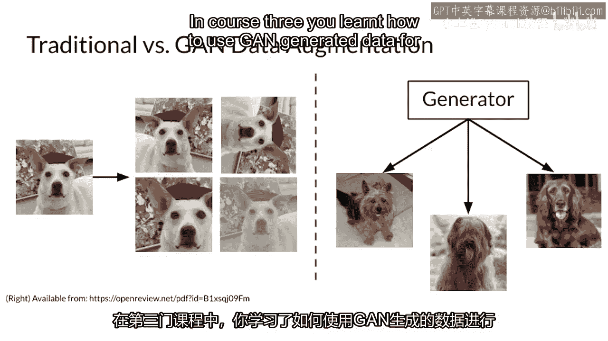

你将学习如何使用你生成的对抗网络数据进行数据增强，以帮助任何你可能拥有的下游模型。

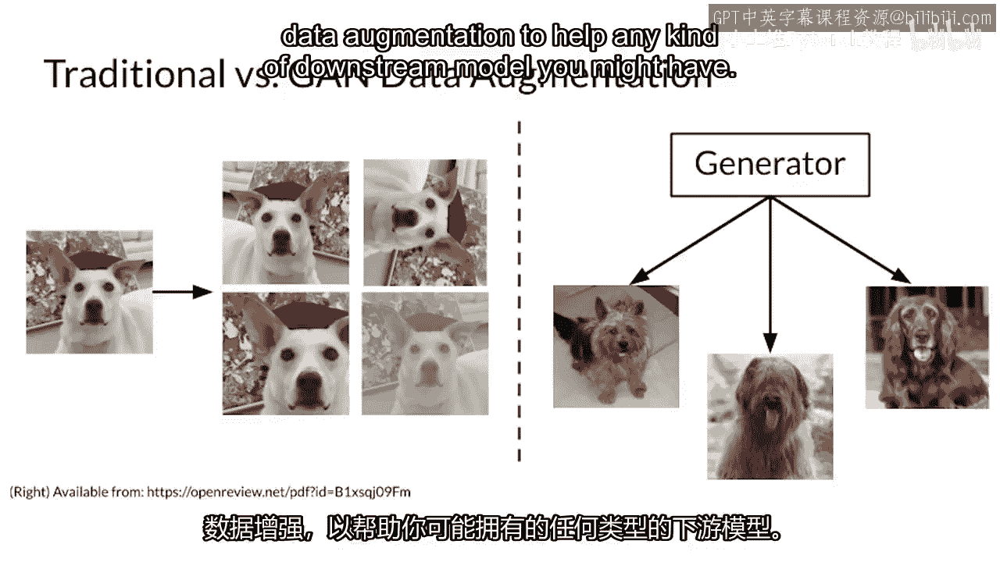

下游模型可以是分类不同的人类面孔，而你的生成对抗网络可以生成大量的这些数据，你还将看到如何使用生成对抗网络生成的数据可能对隐私保护有帮助。

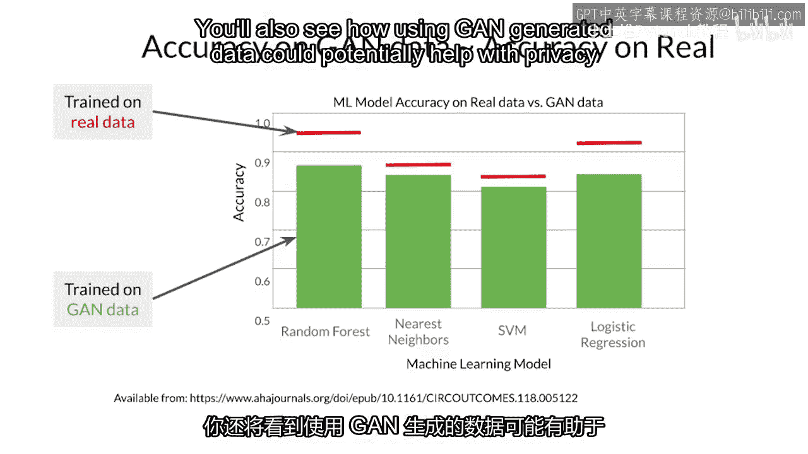

同时保持你任务中的一定准确性，例如，如果你有敏感的医疗记录。

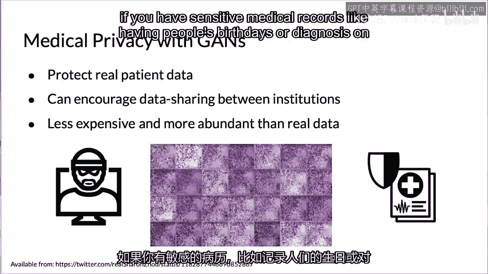

如人们的生日或诊断信息。

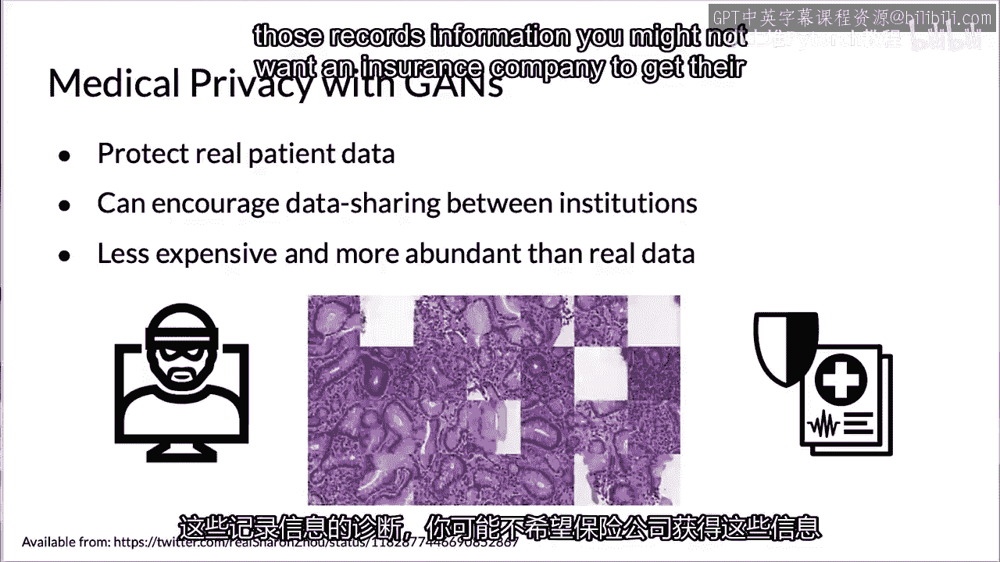

你可能不想让保险公司得到这些信息，你可以生成假数据，这些数据可能更便于分享或训练你的模型。

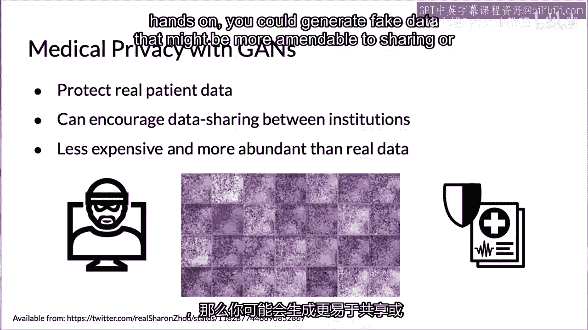

这样没有人可以反向工程那些模型并利用那些敏感的医疗记录。

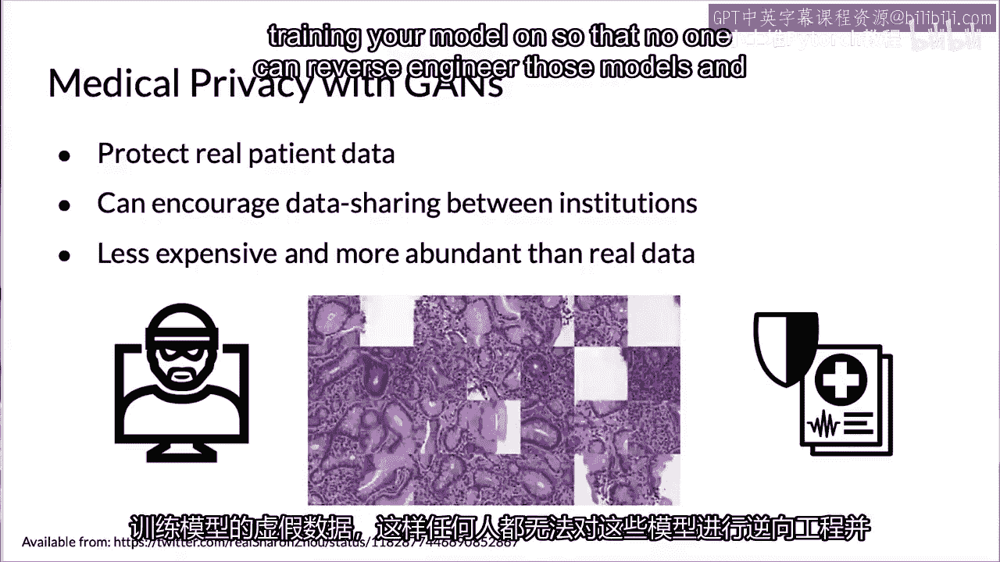

最后，你将有机会深入了解生成对抗网络如何用于风格迁移。

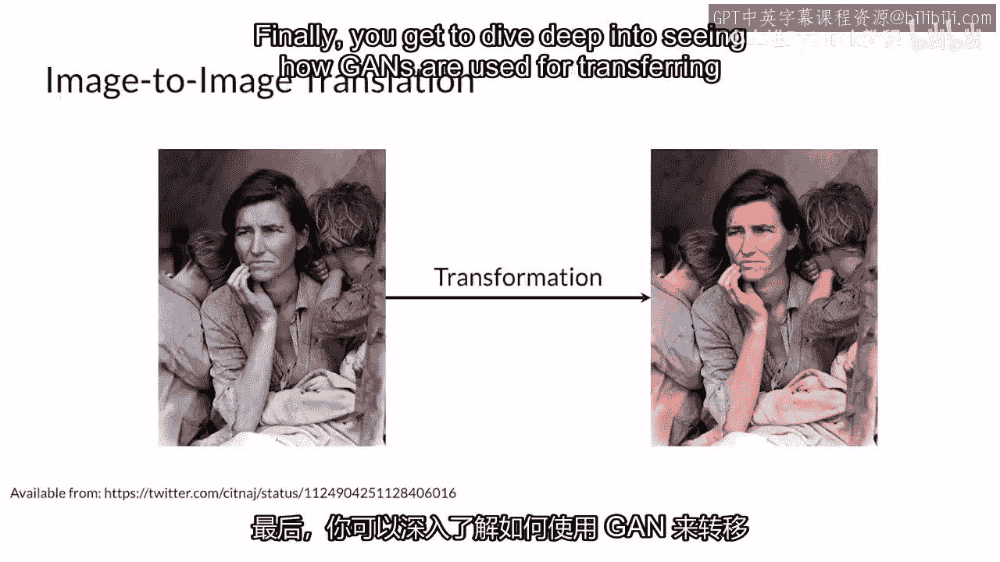

这建立在你对有条件生成的先前知识上。

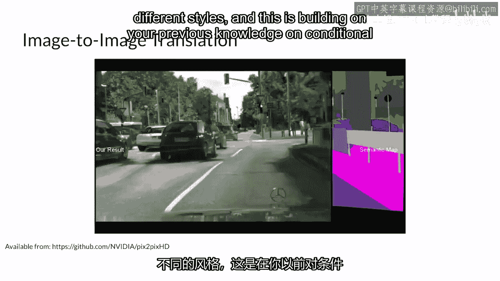

但你不再条件于一个类别向量，你将条件于一整个图像的内容来生成。

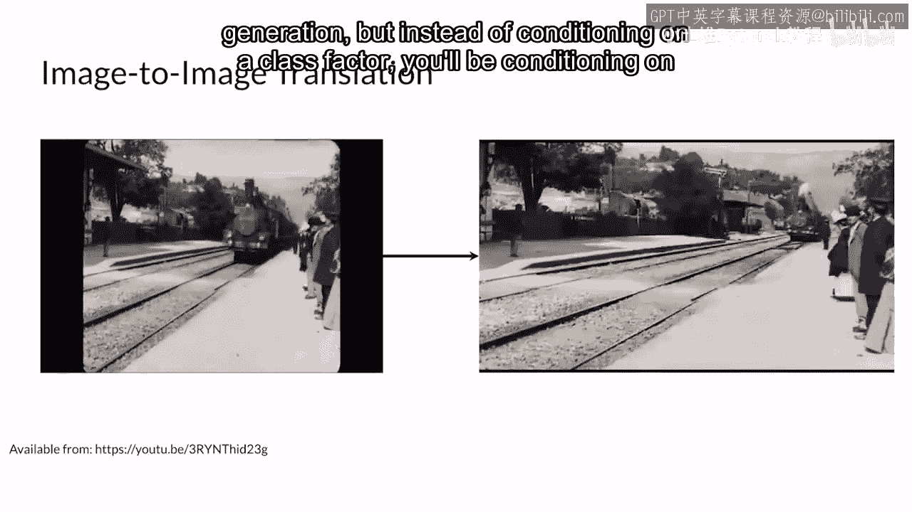

例如，一只斑马从一匹马或一个苹果从一个橙子或一个马从卫星图像。

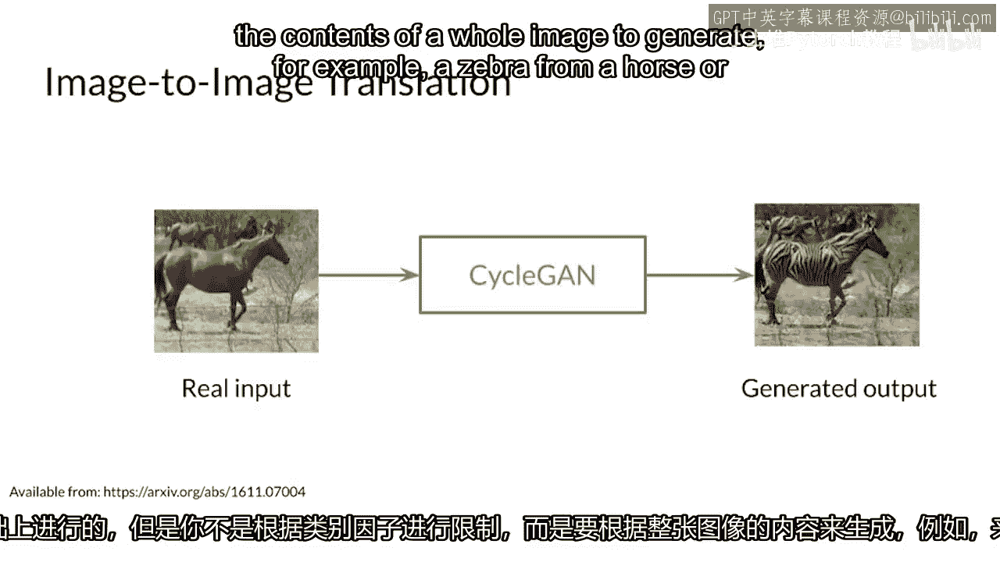

在所有这些令人兴奋的应用程序中学习，让我们直接跳进去。