# P63：【2025版】63. 数据增强方法及其用途.zh_en - 小土堆Pytorch教程 - BV1YeknYbENz

在这个视频中，你将学习数据增强，它的方法和用途，以及GAN如何发挥作用。

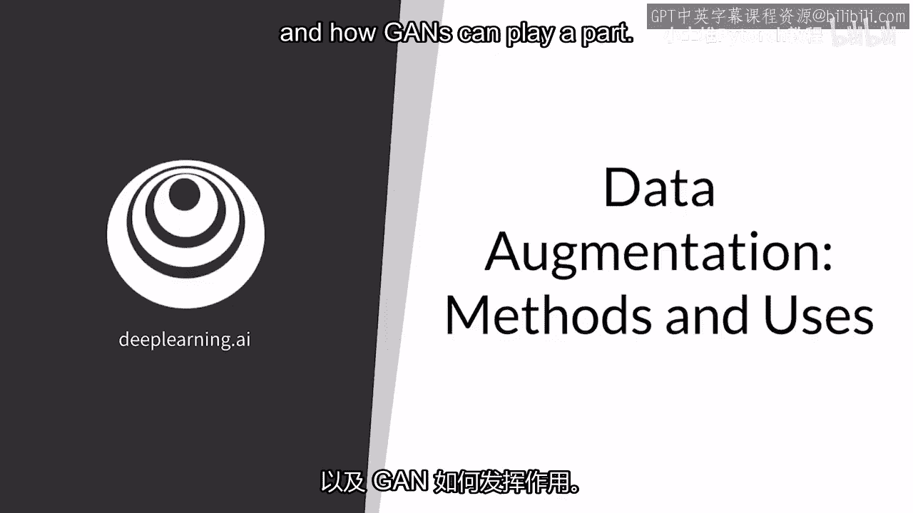

首先你将了解什么是数据增强，它用于什么，然后如何在GAN的背景下实现它。

数据增强通常用于补充数据，当真实数据要么太昂贵以获得更多，要么太稀有时，当你没有足够的数据时，所以数据增强，假设你只有一些少数的数据样本，这些绿色的，然后也许你可以用这些七个橙色的额外数据点来补充。

这只是一个图标，让我们继续，GANs非常适合这项任务。

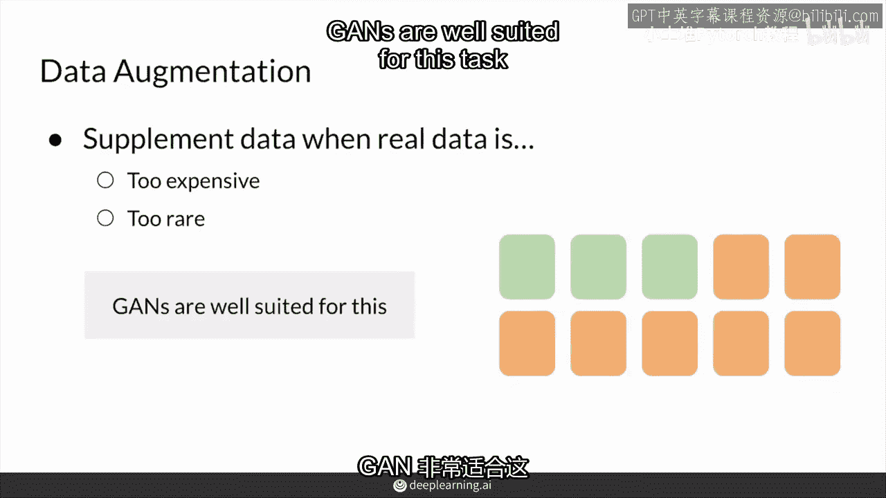

因为你实际上可以生成假数据来补充真实数据，然后使用它，假设，下游任务。

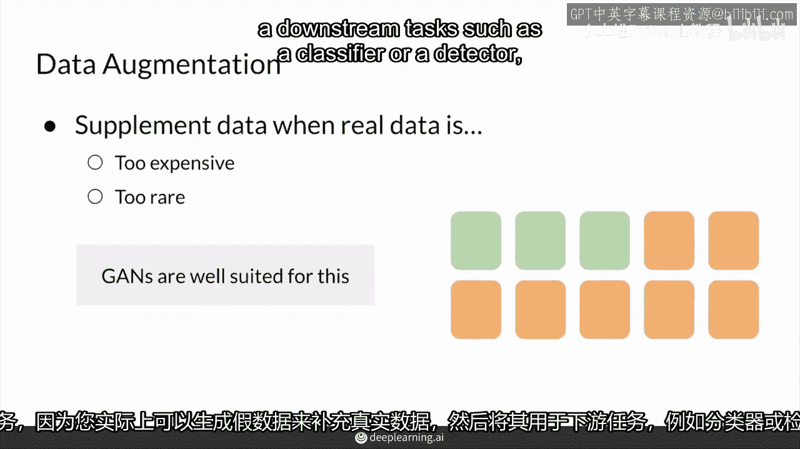

例如分类器或检测器，或者分割模型，或者任何类型的判别模型。

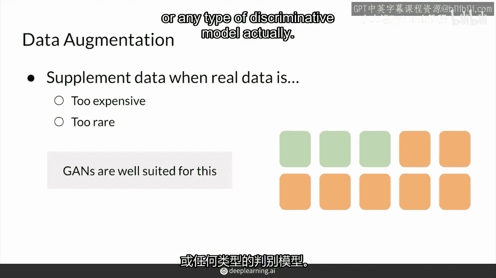

实际上实际上进行数据增强的一种常见方法是不使用GAN。

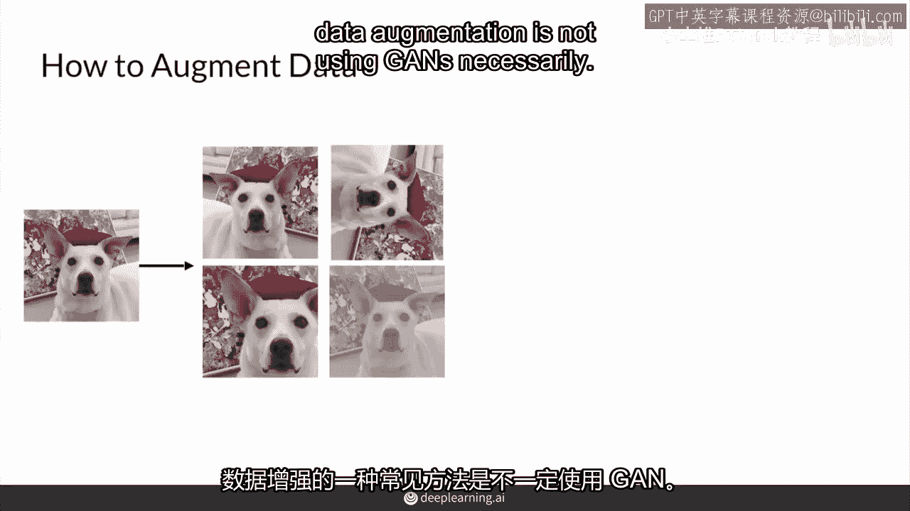

不一定，它实际上是只取一个输入图像，假设你在真实数据集中拥有这个图像，而你的任务现在是检测图像中是否有狗，使用分类器，所以你用这张图片训练你的分类器，但如果你的分类器数据不足，那么你可以做的就是。

你可以对这张图片进行各种增强处理，然后将所有这些图片作为真实数据输入到分类器中，这里展示的是一种水平翻转，也可以是某种旋转，可以是缩放和裁剪，也可以是应用一种滤镜，游戏如何帮助数据增强。

就是它可以生成大量不同图片。

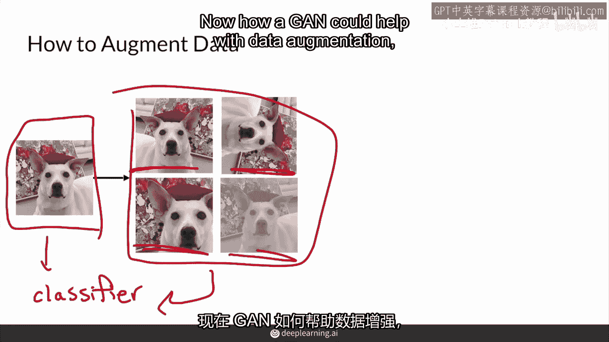

你可以看到它生成了各种不同的狗。

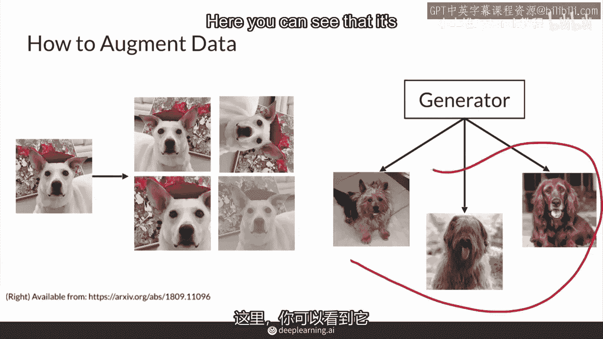

它的多样性远远超过了这里所见。

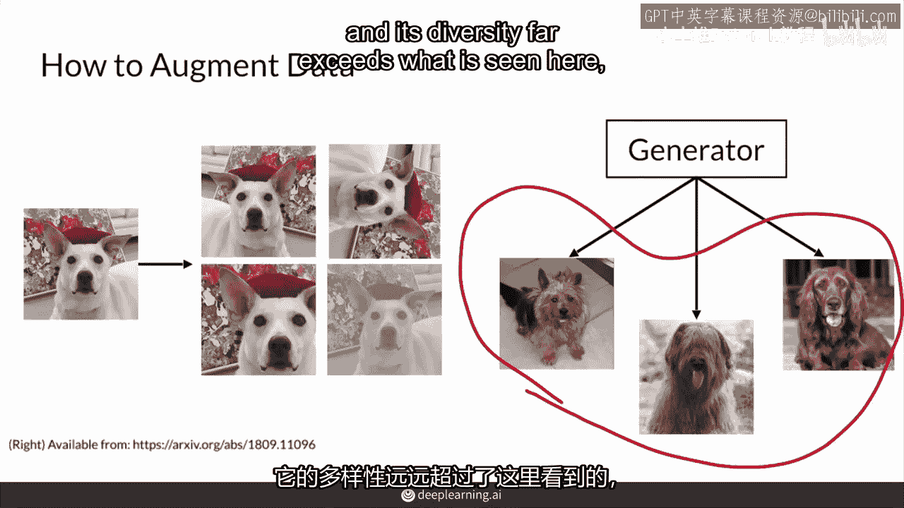

至少在狗的品种上，甚至包括光照方案和背景。

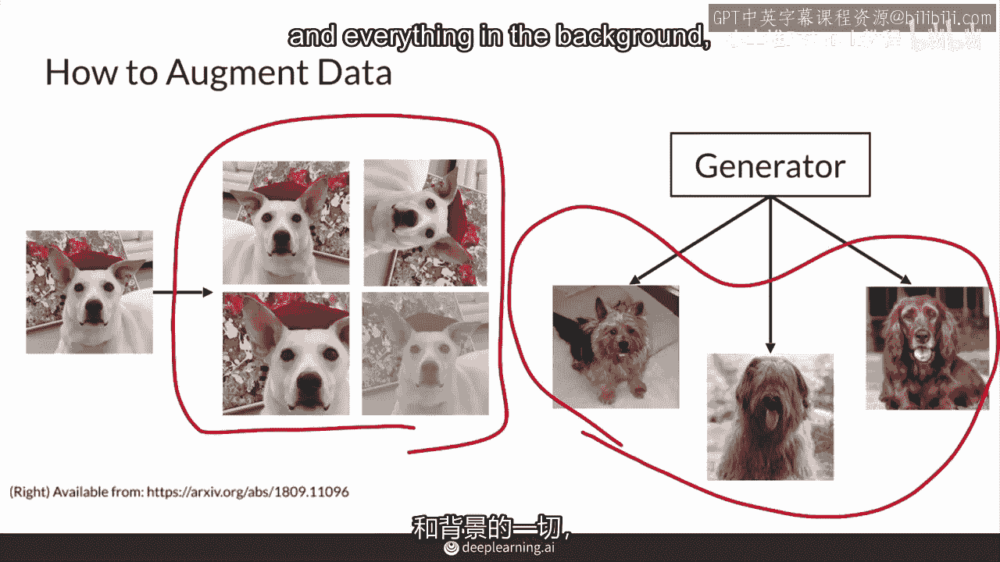

即使在某些方面，即使是在定位方面，当然，它不像那只狗那样旋转，因此，这些方法可能可以相互叠加，因此，你可以，实际上，可以使用所有这些方法，传统的数据增强技术，如prop，翻转，旋转。

以及使用a再次增强你的数据，所以可以肯定的是，你可以将这些数据增强技术混合在一起，并且，一个有趣的事实是，有一个有趣的文献库探讨了如何最好地组合图像，来自所有不同种类的数据增强技术。

这个文献库试图找到一种政策，以确定何时向您的分类器提供何种图像，因此，如果您对此感兴趣。

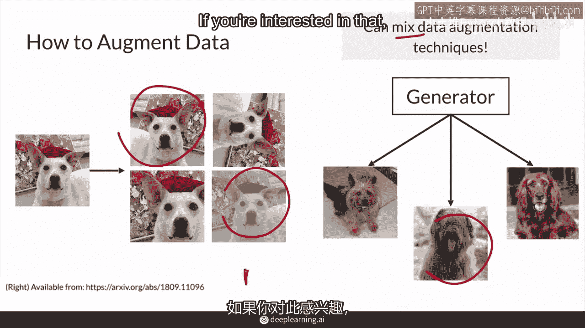

我建议您开始探索称为rand augment的东西，好的，那么这可以具体用于什么，GAN生成的数据，那么这可以如何有用于数据增强呢，一个有趣的应用场景是在社会科学中。

人们通常使注视点检测来确定某人在研究中关注的方向，并且很难收集额外的样本来确定眼睛可能看向的方向。

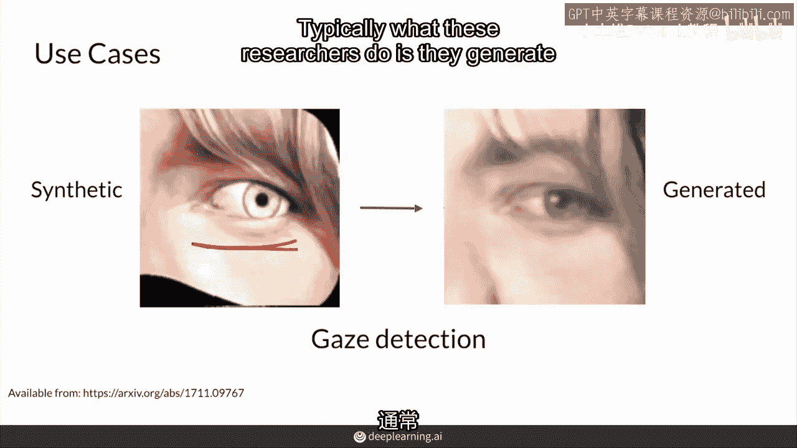

因此，这些研究人员通常做的是。

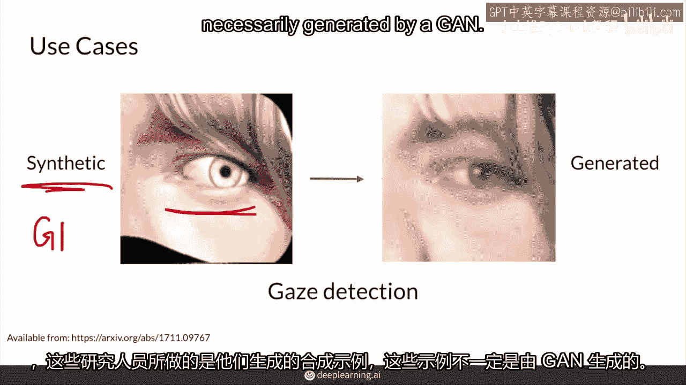

他们生成合成示例，这些示例并不总是由GAN生成的，这些是合成的，但这是假的，我是用图形计算机程序生成的，不幸的是，这实际上并没有帮助下游分类器，这些合成示例中有些奇怪的东西，这不太有用，因此。

GAN生成的数据提供的现实性要好得多，大大提高了下游分类器的性能，这实际上是一个非常有趣的任务，现在我们可以使用GAN生成的数据，与真实数据结合，来帮助分类眼睛看向的方向，并且这是用于社会科学应用。

并且我想强调的是，这些数据很难收集，这就是为什么我们需要，也许生成或增强这个数据集，并且这是很难收集的，因为很难召集新的参与者并询问他们，是否可以，拍摄他们的眼睛视频，并且得到数千名参与者。

这将非常昂贵，另一个有趣的用例是在语音情感识别中，这意味着当你说话的时候，检测你可能在说话中表达的情感是一个很有趣的任务。

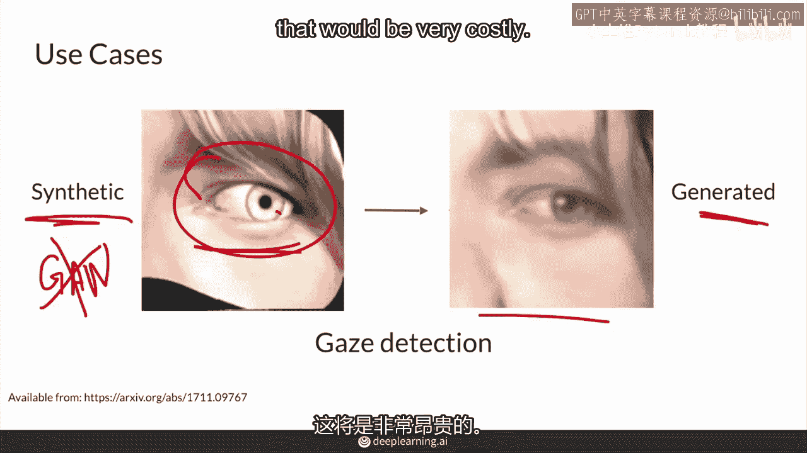

那里并没有太多关于某人听起来是愤怒还是快乐，并且这可能对于，例如你的alexa或google home很重要，或者任何试图检测你的情感以帮助你，希望以一种非常积极的方式。

并且可能有一些真实的愤怒声音和快乐的声音样本，并且这些看起来非常有趣，它们在视觉上看起来，这些是频谱图，这是人们说话时可能发出的频率谱的视觉表示，看起来非常有趣，它们看起来视觉上，这些是频谱图。

这是人们说话时可能发出的频率谱的视觉表示，当他们说话的时候，根据一些文献，这些频谱图有显著的特征与愤怒或快乐相关，或其他情绪，尽管收集更多数据可能很困难，你可以使用GAN生成一些假频谱图。

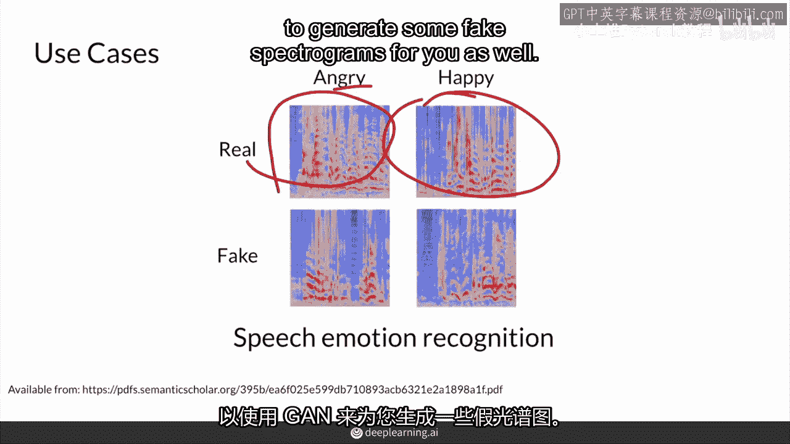

此外，你正在处理的数据可能很难获得。

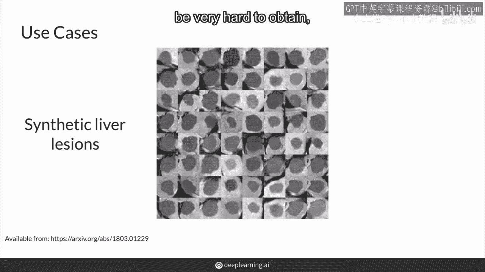

例如脑扫描或肿瘤乳腺X光片，由于患者隐私问题。

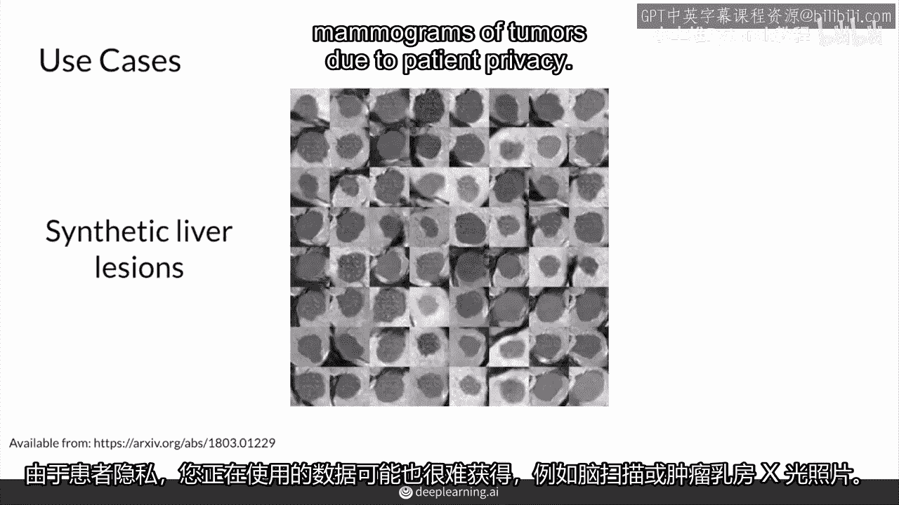

你可以使用GAN生成合成肝脏病变，这些是DCGAN生成的肝脏病变，你在第一课第二周见过，在其他情况下，获取更多数据样本可能是不道德的，例如，如果你试图获取癌症样本，你不想导致癌症。

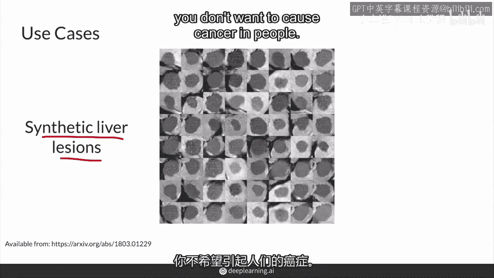

在人类中，你不想获取你不应该从其他机构获取的数据，例如，所以生成假数据可能是一个选项，好的。

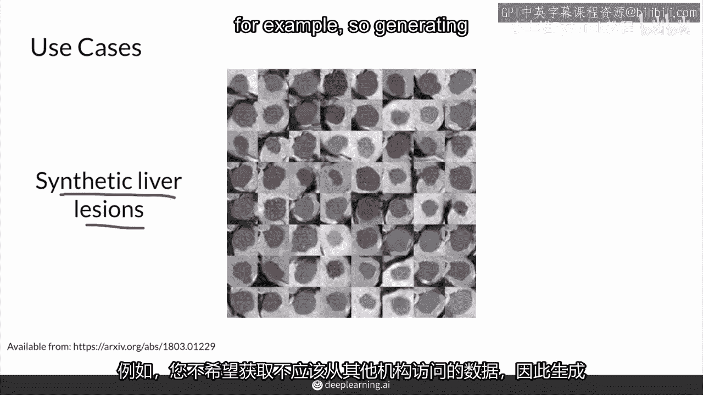

总之，GAN可以用于生成假数据。

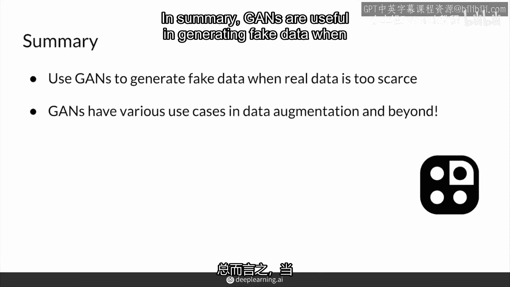

当真实数据难以获得或昂贵时，GAN生成的数据有非常酷的即时应用。

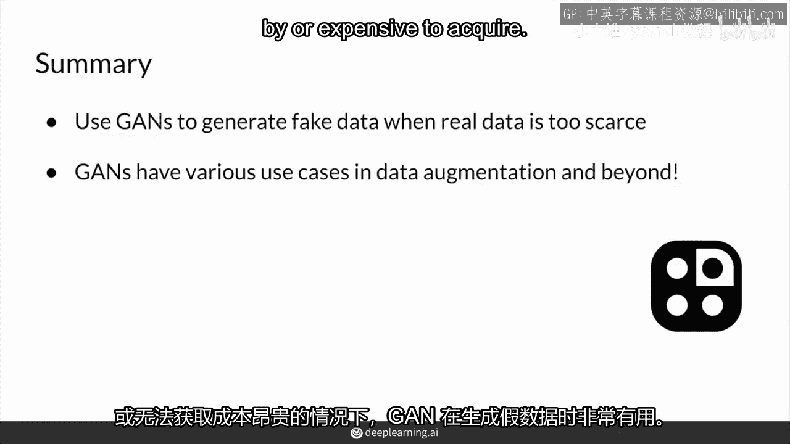

包括这里你看到的数据增强用例。

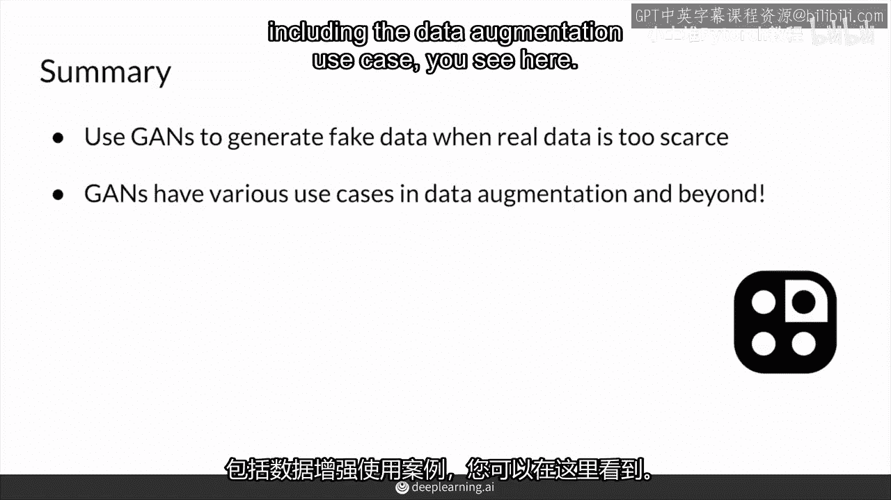