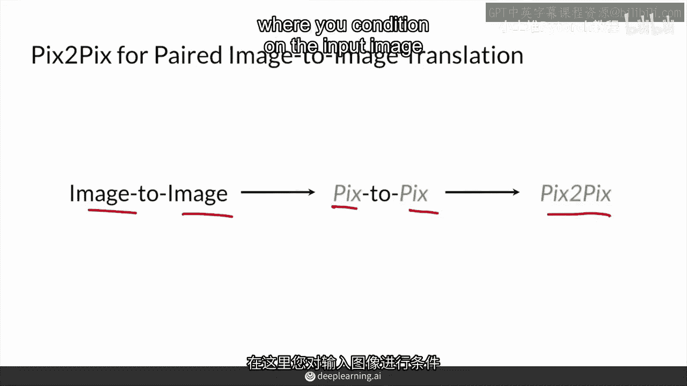

# P69：【2025版】69. pix2pix概述.zh_en - 小土堆Pytorch教程 - BV1YeknYbENz

在这个视频中你将了解pixapex，这是一种条件性生成对抗网络，用于配对图像转换。

首先你将通过获取pixapex概述开始，以及它独特的生成器和判别器设计。

首先它是如何命名的，图像到图像转换从图像到图像，然后你看到pix到pix，pix作为一个图像，然后是pix到pix带数字2，这是由加州大学伯克利分校发表的论文。

这是一种条件性生成对抗网络的非常成功的应用，用于进行图像到图像转换，在你对输入图像进行条件设置并生成一个直接的输出对。

首先记得条件生成对抗网络（CGAN），来自第一课，一个生成器接收一个关于某个类别的向量并生成一个该类别的图像，在这里，柯利犬是一个热编码的类别向量，传递给生成器，然后生成器知道生成一个柯利犬作为输出。

当然，这个类别向量也传递给判别器，以便鼓励输出实际上是一个柯利犬。

好的，所以pixapix是类似的，但是，而不是一个类别向量，你实际上输入整个图像作为输入，这张图像可能是一栋建筑的分割图，请注意，这是一个真实的输入，它分割了某种类型的建筑，中等蓝色的方块是窗户。

与窗户上面的东西不同，阳台是绿色的，外墙是深蓝色的，不同的颜色对应图像中的不同类别，你可能会看到这里的噪声向量被划掉，实际上这是因为，作者发现噪声向量对生成器的输出影响不大，通常。

噪声向量的作用是让生成器能够生成所有这些不同的输出，但他们发现噪声向量实际上并没有造成多大的影响，在生成的输出看起来像什么方面，这可能是因为有一个配对的输出图像，这个生成器试图达到的，你很快就会看到。

所以不是噪声，他们实际上发现，可以通过丢弃（dropout）的方式在一定程度上引入网络的随机性，这在后面会看到，丢弃（dropout）就是在神经网络的某些层中随机屏蔽节点，在训练过程中。

这样不同的节点可以学习不同的东西，因此，这为训练过程中的输出引入了一定的随机性，尽管这不像之前你见到的那样，输入不同的狗图像时，变化那么剧烈，当你输入不同的噪声向量作为输入时。

所以具体来说，在这个例子中，输入是一个建筑的分割掩码，输出是一个逼真的建筑，现在给定生成器的设置，让我们看看判别器可能看起来什么样。

因此判别器也接收这个真实输入，这是输入到生成器中的受条件分割图，然后它与其进行连接，要么接收真实的目标输出，所以这是真实建筑形成的分割掩码，或者生成的输出，这是生成器产生的，这是生成器受条件分割掩码。

它与其一起连接，判别器必须决定它是真是假，所以它可以看到条件，这与你之前看到的条件GAN非常相似，所以它看到了，你知道，阿里，这是一种柯利犬，在这里它看到这整个分割掩码。

这个图像是否看起来像那个分割掩码的真实映射，这是判别器试图弄清楚的，除了柯利犬的类向量可以连接，与许多真实或假的柯利犬图像一起，但在这种情况下，在这个场景中，实际上只有一个对应的真实输出。

所以只有一个对应的真实值，你对这个图像有，再次，在这种范式下，带有配对输出图像的作者发现添加随机噪声实际上不会改变模型学习，这里发生了一些令人兴奋的事情。

所以无论是生成器还是判别器都会得到升级，生成器首先会变成一种单元，在单元中通常用于分割，它是一种编码器，你看到它编码一个图像，然后解码器，之后跟着一些跳过连接在中间，我会在下个视频中详细介绍这一点。

然后判别器会变成一个补丁can。

这意味着它对图像的不同部分给出更多的反馈，而不是说整个图像是真是假，它说真实或假对于图像的不同补丁，所以输出矩阵中许多是真实的假决定，这意味着判别器会给生成器提供更多的反馈，当然。

目标仍然是从这个扫描训练方案中生产逼真的输出，总之，输入和输出pixox与条件GAN相似，但现在你输入整个图像而不是类向量，当然，目标是生产逼真的输出，总结一下。

输入和输出pixox与条件GAN相似，但现在你输入整个图像而不是类向量，并且配对的图像与目标输出一对一匹配，总结一下，输入和输出pixox与条件GAN相似，但现在你输入整个图像而不是类向量。

并且配对的图像与目标输出一对一匹配，而且你没有明确的噪音作为输入，最后，你的生成器和判别器模型得到了极大的改进。

