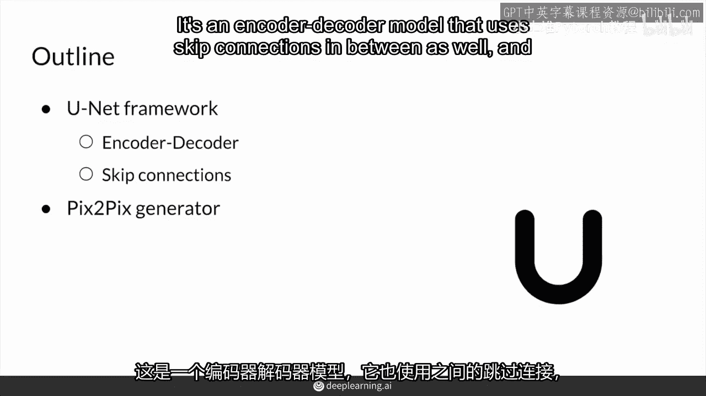
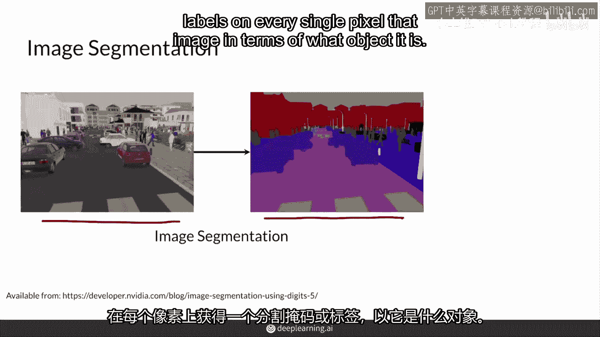
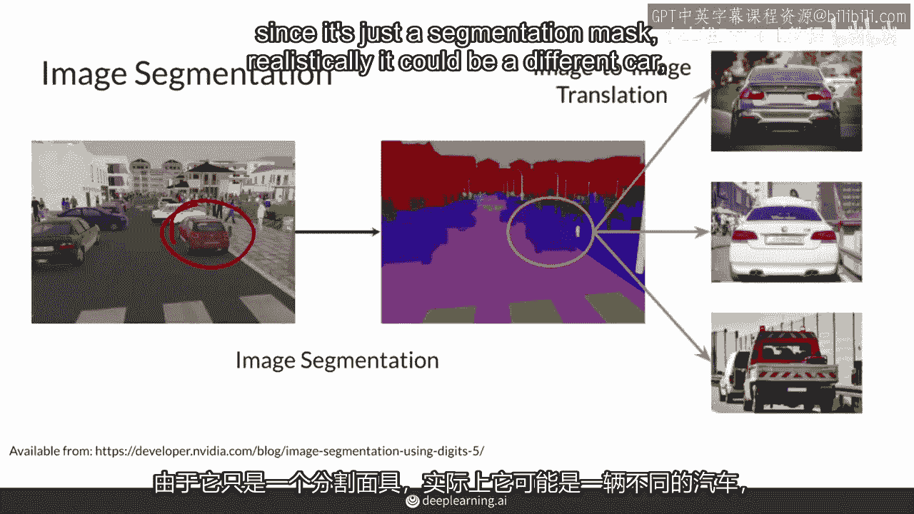
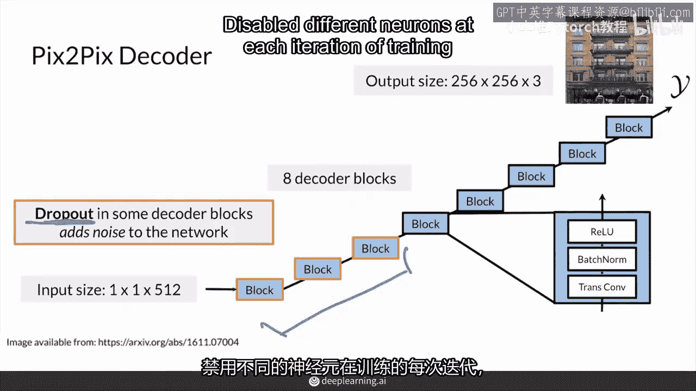

# P71：【2025版】71. pix2pix U-Net.zh_en - 小土堆Pytorch教程 - BV1YeknYbENz

接下来是pixox的组件之一，升级后的生成器，基于单元。

首先，我们来看看单元架构框架是什么样的，这是一个使用跳过连接的编码器解码器模型。

然后你会看到像素像素生成器中这是如何发挥作用的。

总的来说，单元是一个在图像分割方面非常成功的计算机视觉模型。

分割是什么？就是将真实图像。

并获取分割掩码或每个图像像素的标签，关于它是什么对象。

你标记汽车，你标记人行道，你在标记树木。

你在标记道路，你在标记行人，如果这是为了自动驾驶汽车的应用，希望如此。

分割任务很大程度上是一个图像到图像的翻译任务，但在每个像素属于哪个类别方面，有一个正确的答案。

每个像素属于，一个汽车上的像素肯定属于汽车，你不能以任何其他方式分割它。

但当涉及到生成时，或者pixto选择的东西真的很擅长，它没有正确答案。

所以这张车的图片，这张车可能没有正确答案。

我的意思是，它可以是后面这张图片中的车，但是既然这只是一个分割掩码。

现实上它可能是一辆不同的车，这些其他任何一辆车都是技术上正确的。

如果你作为一个人类来看，所以这也是一个图像到图像的翻译任务。

现在值得注意的是，PixelPix使用单元架构作为生成器架构。

因为它擅长接收输入图像并将其映射到输出图像。

它通常只用于图像分割，但PixelPix希望将其用于生成任务。

PixelPix的主要功能是能够在这两者之间来回切换。

记住传统的生成器架构接收一个小的噪声向量。

单元生成器实际上接收整个图像。

这就是这里的x，这意味着生成器必须更强大。

使用卷积来处理图像输入，所以Pixel X生成器的架构是这种编码器-解码器结构。

首先你编码东西。

你可以想象编码器接近一个分类模型，因为你输入一张图片，然后你输出一个值，比如它是猫还是狗。

然后你也可以认为这个中间层是一个瓶颈。

它能够将图像中的信息嵌入其中。

所以图像中的所有重要信息都压缩到这个小的空间中。

只是为了获取这些高层次的特征，那些重要的特性，然后解码并输出一个新图像。

这可能让你想起自编码器。

但在自编码器中，你希望y尽可能接近x，但这里你不希望那样。

你希望y是一个条件于x的不同风格，然而，由于这些网络容易过拟合训练集，图像对单元还引入了编码器到解码器的跳跃连接。

这在恢复编码阶段可能丢失的信息时也非常有用。

在编码阶段。

每个与解码阶段对应分辨率相同的块。

都会得到这样一个额外的连接，去与该值进行拼接，这样在编码阶段可能压缩过多的信息。

仍然可以传递并到达一些后期层。

这些跳跃连接是从编码器concatenated的，在解码器中的每个卷积块之前。

跳跃连接在卷积神经网络中是标准的。

CNNs，它们主要让信息从早期层流向晚期层。

这些信息可以添加或拼接，但它们以某种方式被包含在后期层中。

这里是拼接的，这样使得，这使得容易获取编码器可能丢失的详细信息。

在向下采样过程中传递给解码器。

这意味着更精细的细节，所以这主要是关于信息流。

这是在前向传播中，当然，在反向传播中，跳跃连接也可以改善梯度流。

当你向后传播时。

跳跃连接主要是为了帮助解决梯度消失问题，当你堆叠太多层时，梯度变得非常小。

限制我们的网络不能更深，有更多的层。

在unit中，这在很大程度上在反向传播中，确实改善了编码器的梯度流。

这样那些层可以从解码器这里学到信息。

首先你有你的编码器，它接受一个图像x，大小。

让我们说，256x256，高宽，三通道的彩色rgb，在这个例子中。

它作为条件图像输入，实际上是分割图像。

然后通过所有这些块，它通过八个编码器块来压缩输入。

然后每个块将空间大小向下取样因子二。

所以编码器的输出大小是2，5，6除以2的8次方，或者1比1的空间大小，在最后，有512个通道来编码这些信息。

所以在最后它只是一个1x1的，高度，宽度，每个编码器块。

卷积层，批量归一层，和带偏激活函数。

所以这可能不会令你感到惊讶，因为你已经多次见过。

这是一层这些块的结构，类似于风格生成器。

所以卷积层会使你的输入通过2的步长，实际上这些有。

所以注意你看过的很多卷积层，步长是1。

这些步长是2，同时，在解码器一侧，你有一个1x1的输入大小。

一个非常小的输入。

你有八个块，但这些是解码器块，因为你想要生成一个与编码器输入相同大小的输出图像。

解码器实际上包含与编码器相同数量的块。

然后你得到y作为输出，这是你的生成图像，它与输入相同大小。

2，5，6乘以2，5，6次，3个通道用于颜色，每个解码器块。

这也许不会令你感到惊讶，由转置卷积层组成。

它将你的输入转换为输出，然后是批量归一，然后是一个激活函数relu。

在网络中添加了dropout。

但它实际上只添加到这个解码器的前三个块。

dropout随机禁用训练过程中的不同神经元，以便不同的神经元可以学习。

这样总是学习同一件事的神经元不会被选中。

请注意，这在训练期间仅起作用，与所有使用dropout的情况一样。

在推理或测试期间通常会关闭它，在推理时，神经元实际上会按这个逆dropout概率进行缩放。

保持他们期望的分布很重要，但这并不是很重要知道。

但只需知道dropout确实会给模型添加一些噪声。

记住我们现在正在去除输入中的噪声。

这就是随机性渗透到这个模型架构的地方。

但在训练期间，在推理期间，你不会看到这种随机性，当然。

也不会能像那样注入这种噪音，因此将两部分结合起来。

你可以得到这个完整的编码器解码器结构，编码器输入两个五六乘二五六。

输出相同大小的输出，这是一个生成的图像。

输入的信息通过这种小的瓶颈大小一乘一传递，一。

并且这种小的空间尺寸可以被理解为对输入图像编码的总结。

然后你可以把解码器看作是执行与编码器相反的操作，这就是为什么它们包含相同数量的块或8个块。

所以记住，单元框架是编码器解码器框架的一种变体。

每个编码器的编码，每个块或级别都被传递。

或向前传递到解码器中相应级别的块，在同一分辨率下。

单元将编码器中的信息集成到解码器中。

通过使用连接，所以，在每个块级别将编码器输出连接到每个解码器输入。

在分辨率相同的情况下，这样它们可以很容易地连接在一起。

综上所述，Pixapex 为其生成器使用一个单元，而单元是一个编码器。

解码器框架使用跳跃连接，将编码器到解码器的相同分辨率或相同块，或相同级别的特征图连接到彼此，这样可以帮助解码器直接从编码器学习更多细节，以防在编码阶段丢失更精细的细节，并且跳跃连接也有助于反向层的处理。

当然。

