# P73：【2025版】73. pix2pix把各部分结合起来.zh_en - 小土堆Pytorch教程 - BV1YeknYbENz

好的，是时候把所有pixa fix组件放在一起了，这包括单元生成器。

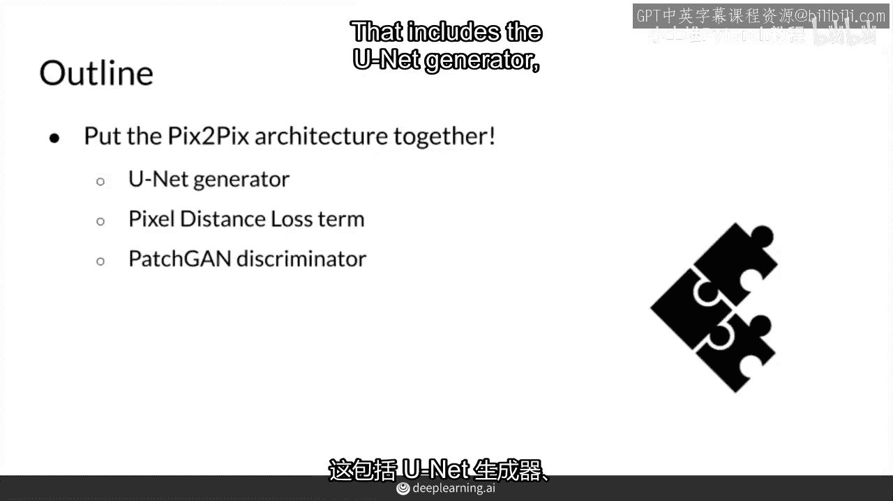

补丁可以鉴别器，以及你的像素距离损失项，作为示例，你有一个数据集，包含真实建筑，然后你对它进行了分割，因此你有所有这些伟大的分割掩码，包含与配对真实图像输出相匹配的建筑，你想要一个游戏。

可以从分割掩码中生成，一个看起来真实的建筑，匹配分割掩码的所有特征，在你训练之后，当然你可以适应分割掩码并绘制你自己的，然后你的生成器将生成一个与你匹配的真实建筑，这相当酷。

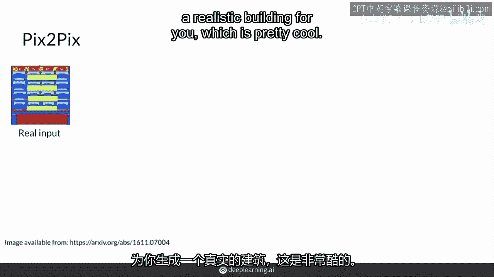

好的，这是你的输入，你把它放入单元生成器，它生成一些输出。

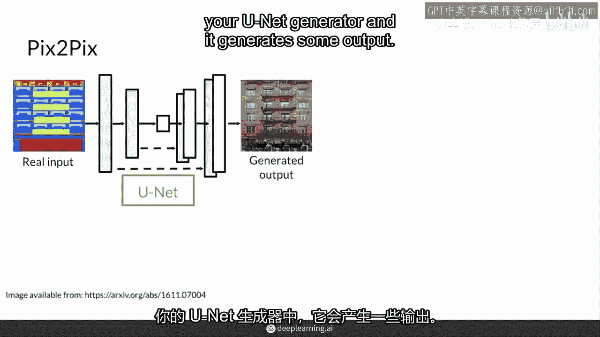

然后该图像沿着通道维度与原始真实图像连接，那就是用于条件的真实输入图像，它进入鉴别器。

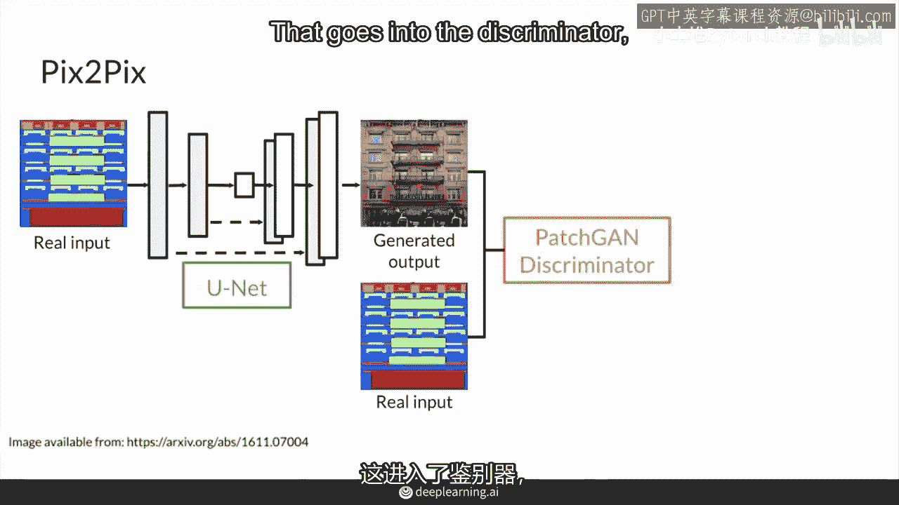

这是一个补丁鉴别器，它输出一个包含不同值的矩阵，一个分类矩阵，从零到一，表示图像不同部分的真实或虚假。

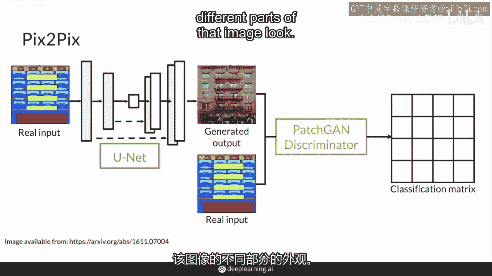

然后对于鉴别器的损失，生成的输出与真实输入的连接，将与假标签矩阵进行比较，这是一个全零矩阵，因为鉴别器将成功，如果它分类每个图像片段看起来都是假的是零，然后对于真实输出。

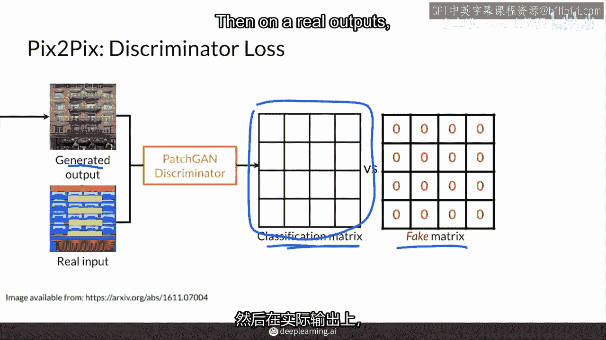

让我们说这是一个真实输出，然后鉴别器将希望其分类矩阵与真实标签进行比较，因为它们希望尽可能接近这个分类矩阵的所有一，在它的预测中，再次作为输入。

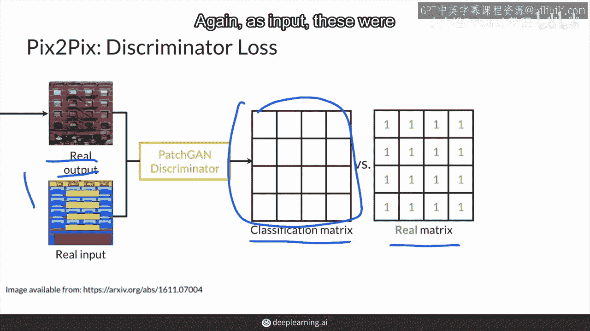

这些现在沿着通道维度连接，而对于生成器的损失，它仍然是鉴别器看生成的输出，与那个真实输入连接。

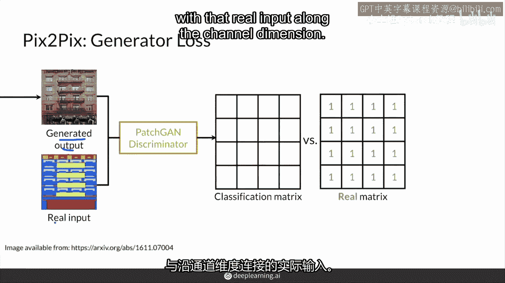

但而不是一个全零矩阵作为标签。

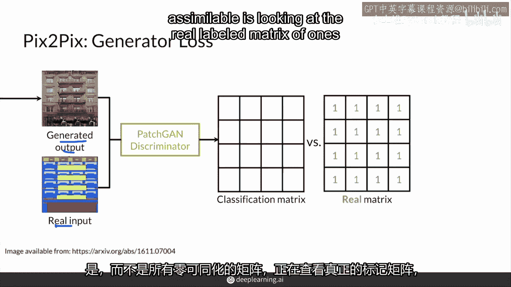

它看那个真实标签矩阵的所有一，因为生成器希望鉴别器，认为它的生成图像的每个片段看起来都是真实的，但这还不是生成器的全部损失，那只是这两个矩阵之间的bce损失。

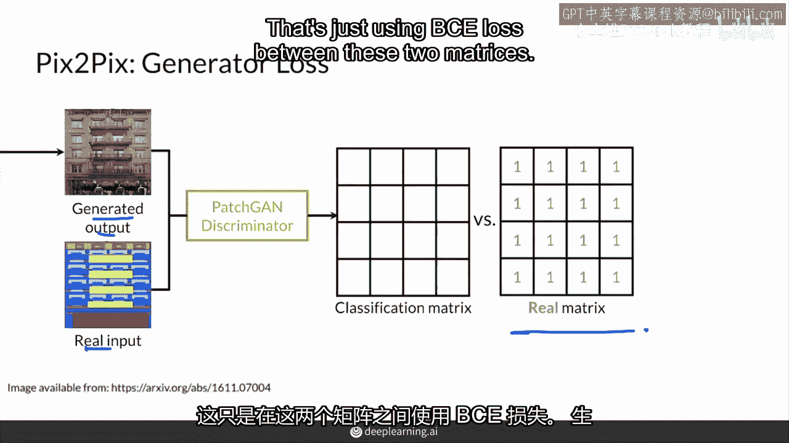

生成器还有它的像素距离损失项，那是看它的生成输出与真实目标输出之间的差异，乘以某种权重lambda那里，这就是完整的生成器损失，总之。

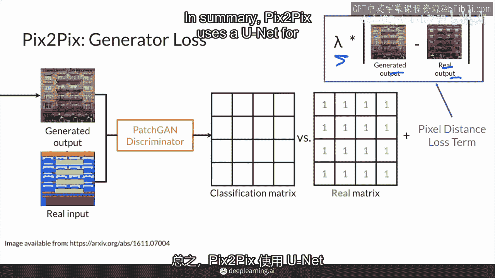

Pixx使用一个单元来生成图像，它将一个图像转换为另一个图像。

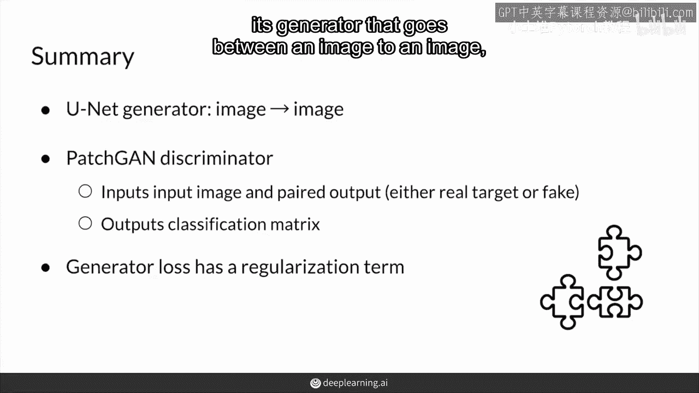

它使用一个补丁判别器。这个判别器输出一个值矩阵，而不是单一的值。

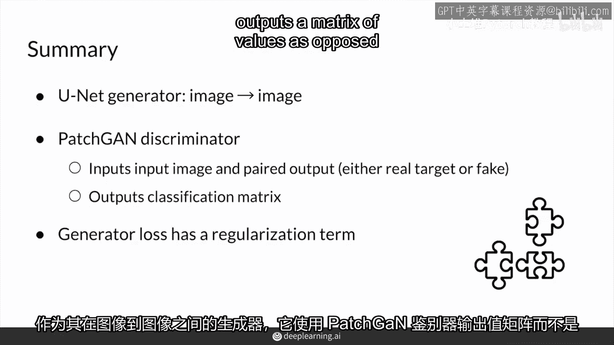

而它的生成器损失也包含了额外的像素距离损失项。这有助于它生成更真实的图像。

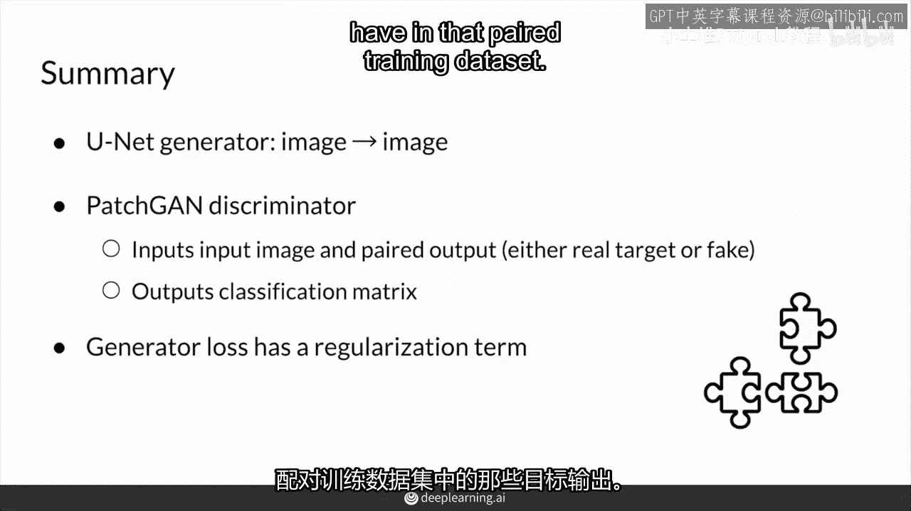