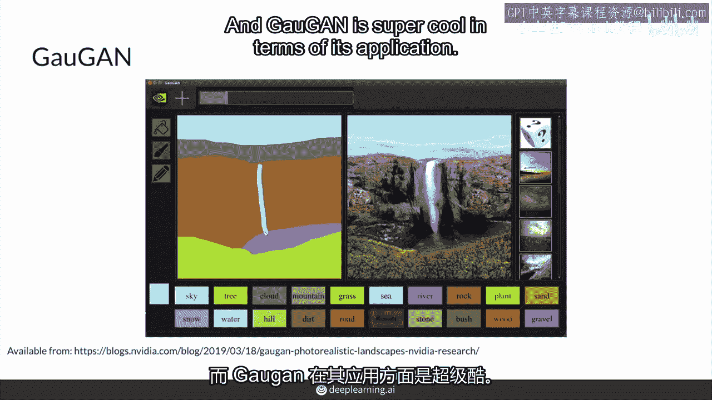
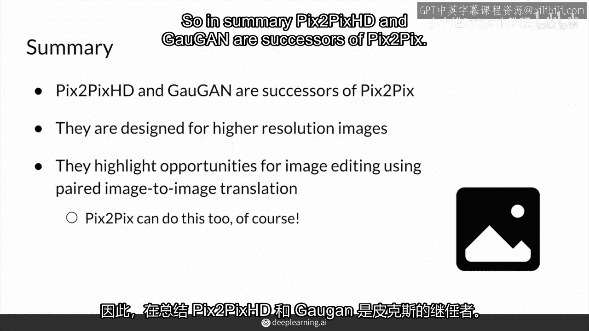

# P74：【2025版】74. pix2pix的进一步发展.zh_en - 小土堆Pytorch教程 - BV1YeknYbENz

好的，你可能好奇，自pixx以来发生了什么，许多变化。

你将看到pixapex的一些改进和扩展，用于配对图像到图像转换，包括高分辨率图像，以及作为图像编辑应用的明确应用。

首先，来自伯克利的同一团队的另一个模型出现。

以及nvidia，它处理高分辨率图像，所以这叫pixdepicks，高清高解。

真的，pixx的酷之处，高清是高分辨率图像。

包括很多修改使其显著更好。

所以我推荐查看pixappicks，高清纸和可选笔记本。

如果你想做图像翻译，这里展示的是超级酷的东西。

你也可以在常规像素选择中使用它，基本上你可以做的，是有人面部的分割掩码。

你可以根据需要调整那个掩码，并生成不同类型的面部。

实际上我认为这里正在发生的事情，甚至没有改变掩码。

你实际上可以从这个掩码生成许多不同可能的面部。

这也是相当酷的，你可以肯定做版本，使用像素选择来适应掩码。

所以另一个非常酷的模型出现了，叫做gaughan，由nvidia开发。

这就是对艺术家保罗·加尔格雷的一个双关语。

加尔格雷恩在应用方面非常酷。

我仍然记得他们在会议上展示的演示，基本上你做的就是。

你可以在这里左边画草图，并指示它们属于哪种类别。

你可以说，嘿，我想要这里有天空，我想要这里有一条水线，然后它就能生成一个真实的照片给你。

所以我认为我的艺术水平肯定在左边。

对我来说，生成右边的那个东西非常酷。

关于gaughan酷的地方是，它使用了你在风格gan中看到的一些先进技术，它实际上使用了自适应实例归一化，以便将分割图输入并使用。

使用自适应实例归一化来为风格添加信息。

总之。

pixahd和gaughan是pix2pix的继承者，它们建立在pixapex的基础上。

并在高分辨率图像上对它们进行了惊人的改进，我真的推荐你去检查它们。

