# P77：【2025版】77. CycleGAN概述.zh_en - 小土堆Pytorch教程 - BV1YeknYbENz

在这个视频中，你将了解Cyan，它解决了无配对图像到图像转换的问题。

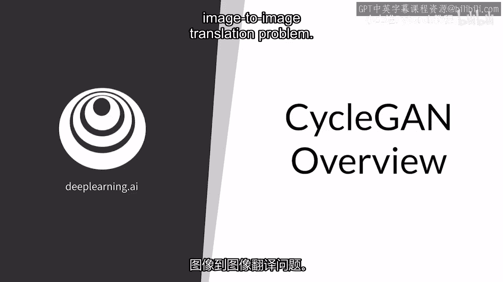

你将看到循环在循环GAN中的含义，以及这如何影响无配对图像到图像转换。

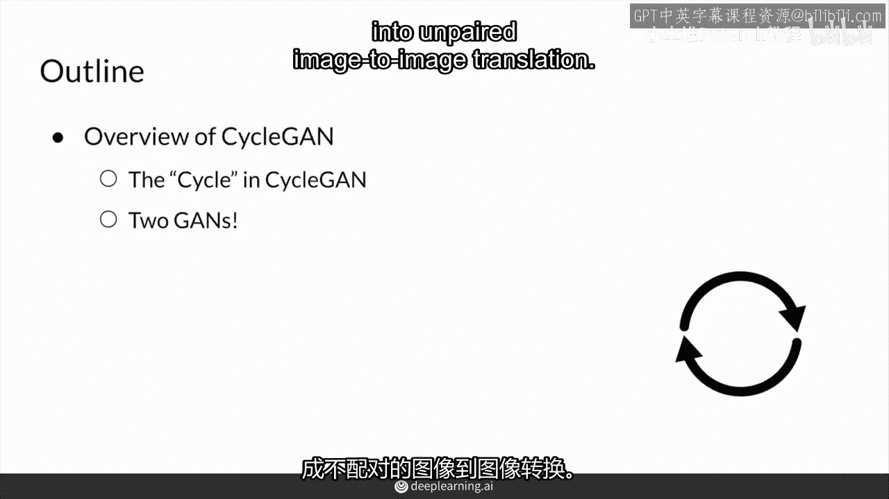

你也将看到两个GAN，它们组成了循环GAN，这在实际上非常酷，应该拓宽你对GAN的一般看法。

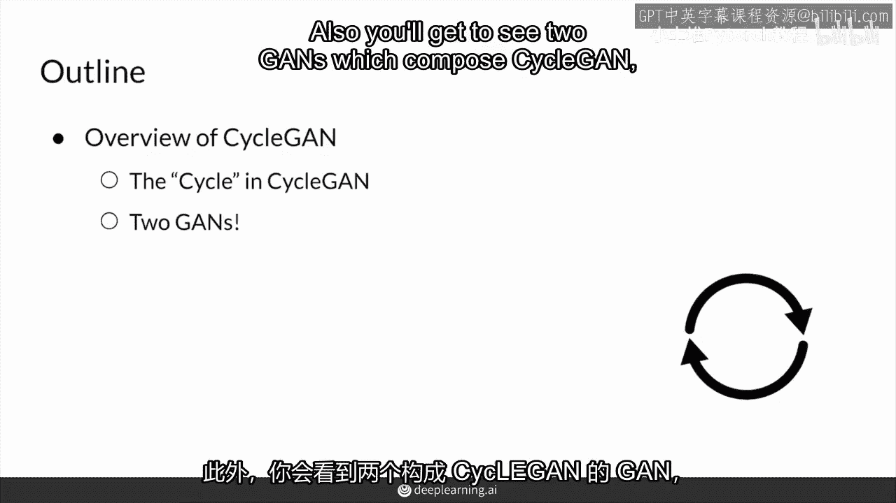

它们可以以许多不同的方式组合，所以，到这个时候。

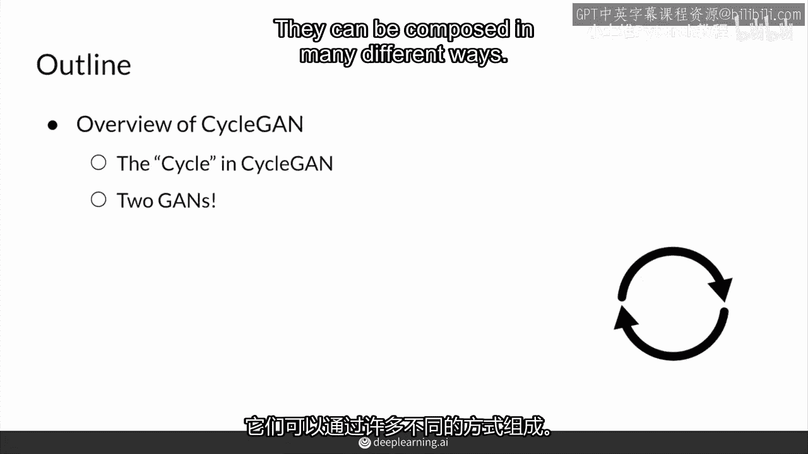

无配对图像转换听起来可能几乎不可能，你没有图像配对，图像对，那么你的模型真的了解如何生成内容吗。

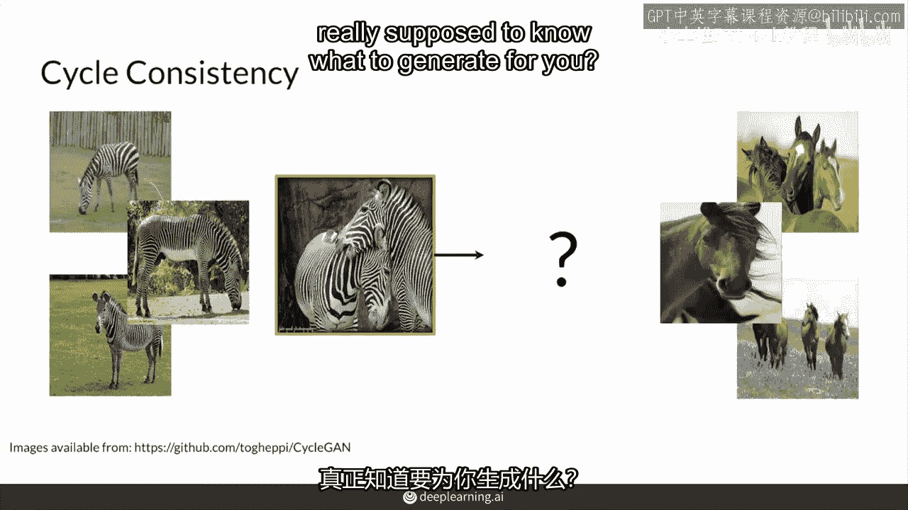

它如何将斑马转化为看起来像马的东西呢。

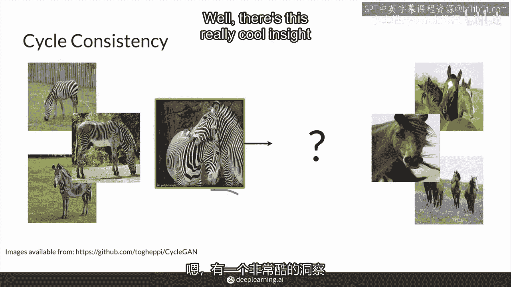

有一个非常酷的见解使得循环可以工作，如果你从一个图像从一个堆开始，比如说这个真实的斑马，并将其转化为另一个堆的风格，那个堆有马风格，然后将其转化为斑马。

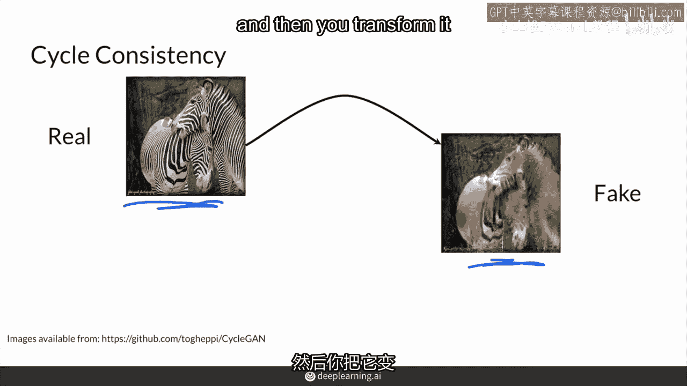

它还是假的对吧，因为它接收了一个假的马来生成另一个假的斑马，酷的洞察是，技术上因为你只是改变样式，不是图片的内容，这两张图片应该相同。

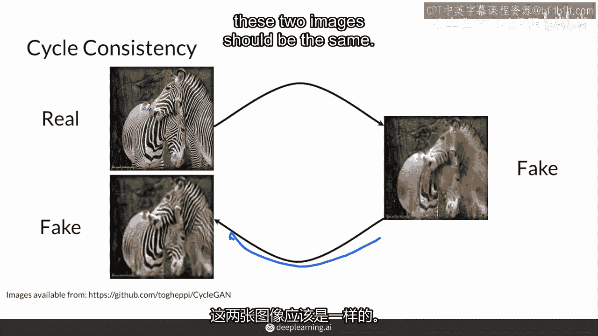

这可能会让你再次思考像素距离损失，这正是你应该思考的地方，在从一个堆栈映射到另一个堆栈并在之间来回的过程中，内容得到保留。

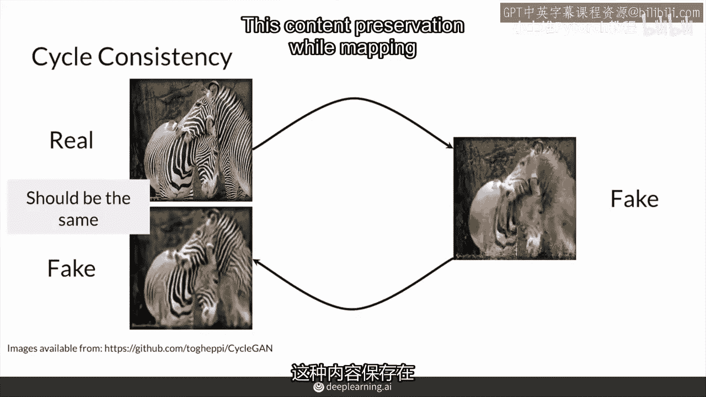

被称为循环一致性，因为翻译在这两堆之间形成了一个循环，创造这个循环的一个简单方法实际上是使用两种不同的生成器。

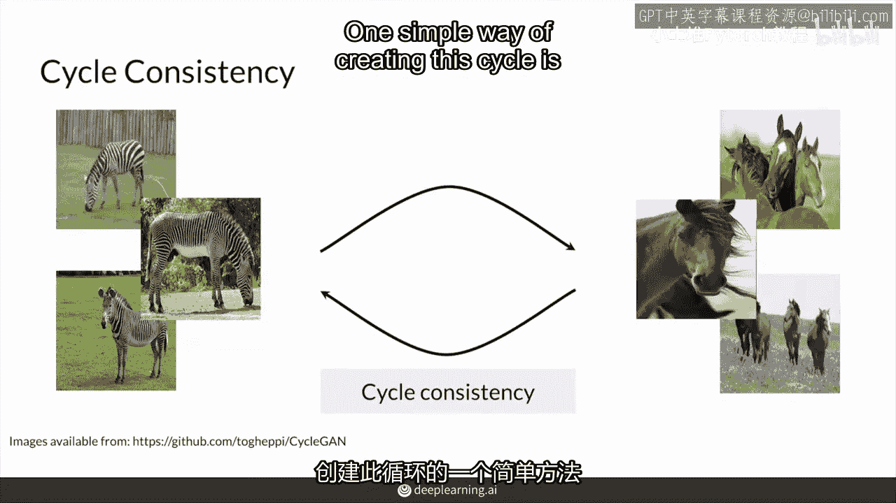

一个是从斑马到马的转变，另一个则是朝相反的方向去，从马到斑马，两者结合，这两对GAN具有循环一致性，可以实现无配对翻译，在GAN的逆向部分，两者的鉴别器将确保图像的真实性。

而循环一致性部分则负责保持内容的一致性，同时只改变风格。

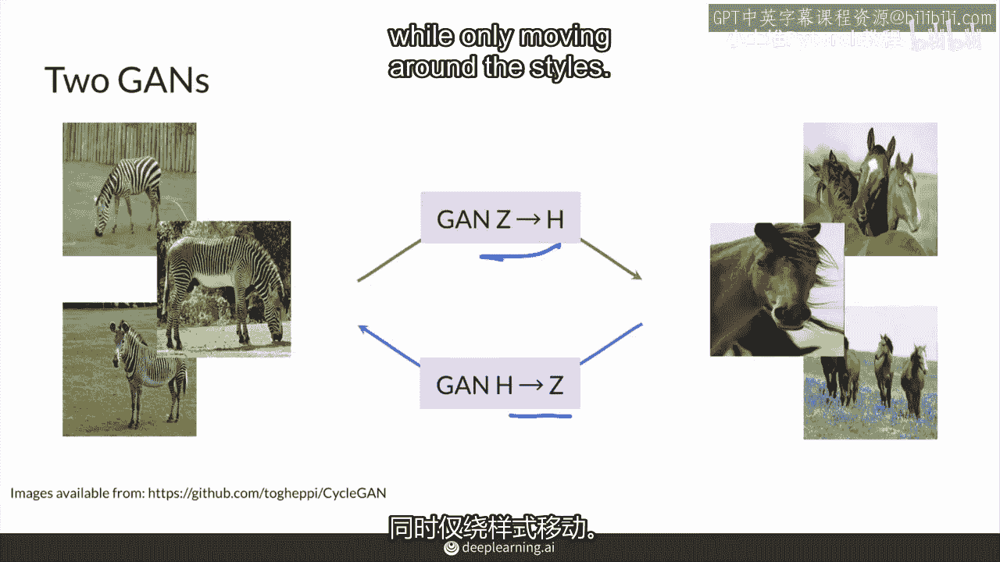

以之前的例子为例，你将使用GAN，Z到H或斑马到马来生成那个假马，然后你将使用你的第二个GAN马到斑马，从那匹假马变成一匹假斑马。

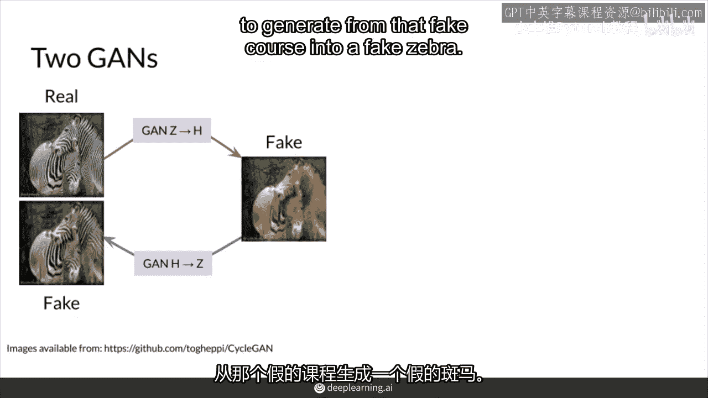

然后你也会做相反的事情，所以你也会朝相反的方向走，首先从马变成斑马，然后回来，你知道它们两者都使用了这两种方法。

使用了这两种生成器，这些生成器的架构是你已经见过并学过的东西，就像在pixx中，鉴别器是一个补丁罐，但这里，当然有两个生成器，所以有两个判别器，所以两个有两个补丁生成器。

它们会检查图片的补丁并输出一个值矩阵而不是单个值。

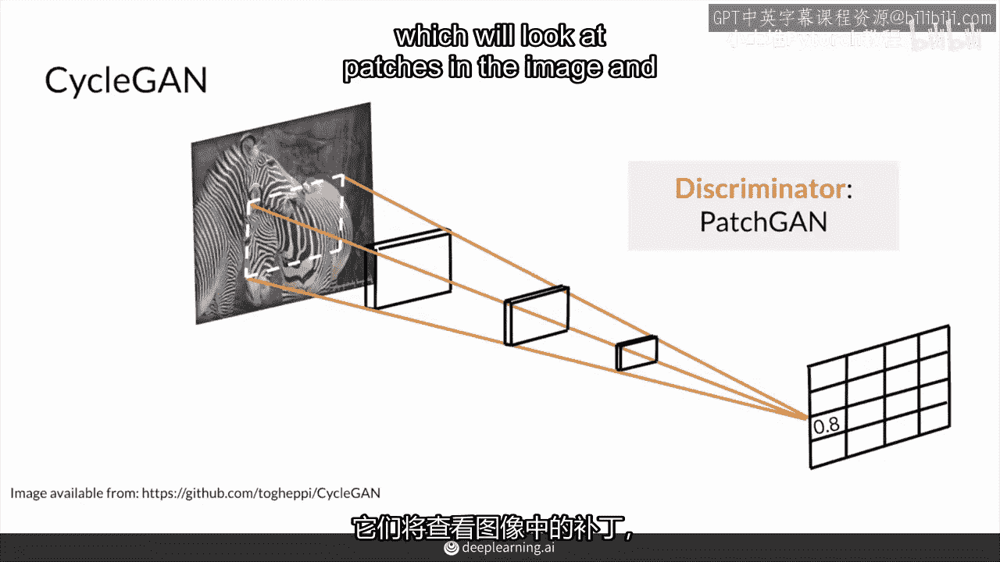

你的生成器从图像的前期工作中提取，超分辨率和风格迁移，所以基本上从两个单元，这来自pixto picks，以及dc gan，这来自一节课一周二，并且青色基本上从单元中借用概念，在那编码部分有下采样。

然后有一些解码部分，其中有上采样，并且这些各种编码和解码块由批量卷积层组成，Norm和relu，你现在已经很熟悉了，除了这种单元框架之外。

塞根还通过增加更多的卷积层来扩大那个瓶颈部分。

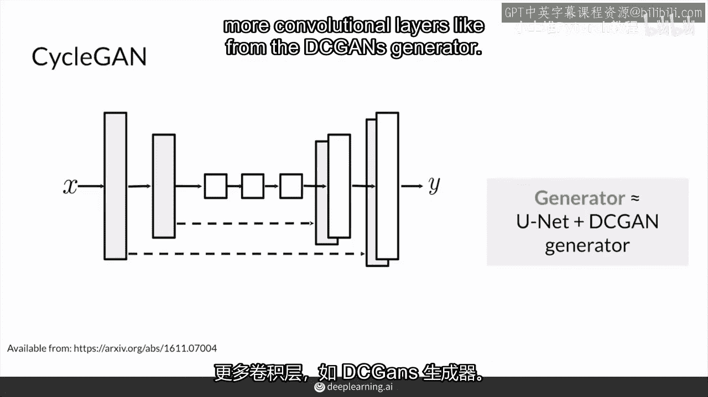

就像来自dc gans生成器，并且，由于青色生成器接受图像作为输入。

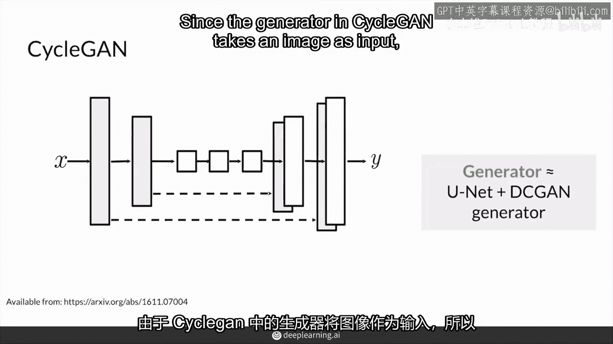

这就是那个输入，实际上完全有可能，一个普通的单元在这里也会做得很好，所以肯定试试这个新架构，但请注意，它可能并不是使整个东西工作的限制因素，这只是作者在中发现的有用改进，因此。

这里瓶颈部分的也使用了额外的跳跃连接，称为重块或残差连接，你可以把这些简单地称为跳跃连接，你将会了解更多这些，后来他们通过让模型学习身份函数，帮助添加额外的层和图像变换。

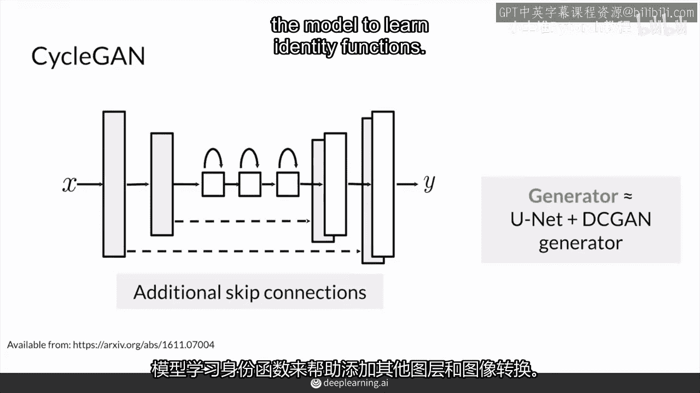

总之，循环可以由两个不同的生成对抗网络组成，这些网络将两个堆栈的图像相互转换。

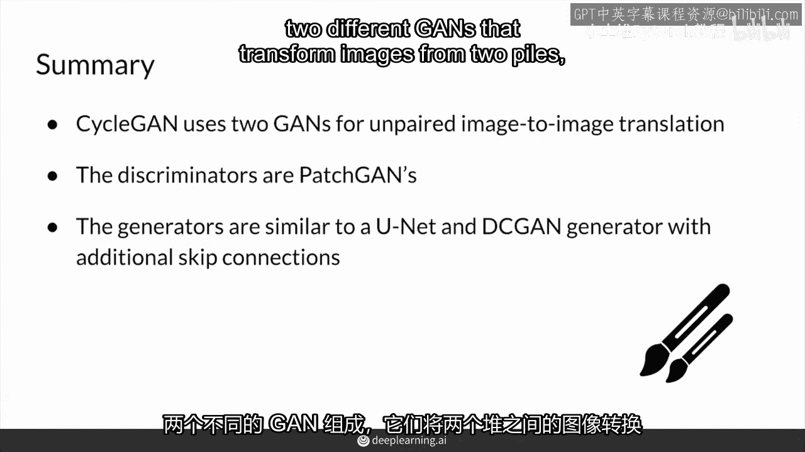

这是用于无配对图像翻译，判别器来自 patch can。

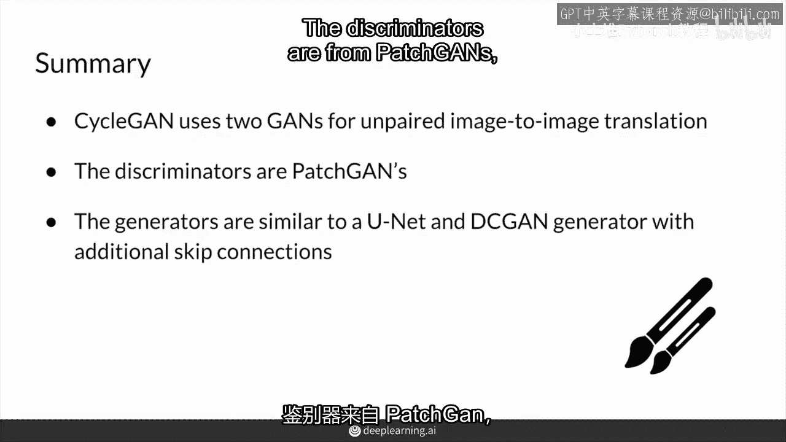

而生成器是 dc 学习结果的组合，加上来自 unit 的学习，并且添加了跳跃连接。

